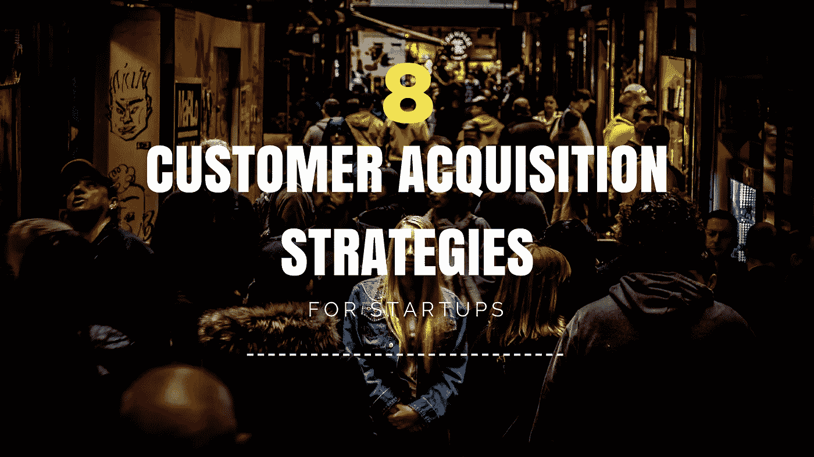

# 8 个成熟的创业客户获取策略

> 原文：<https://medium.com/swlh/8-proven-customer-acquisition-strategies-for-startups-ec14f99fdef1>

8 Proven Customer Acquisition Strategies For Startups

如果你目前正在领导一家初创公司，或者打算在不久的将来创建一家，尽可能多地了解客户获取策略是至关重要的。一开始，绝大多数创业公司都很难找到客户。这是因为很少有人熟悉你的产品、服务和品牌。因此，企业主不得不采用最好的[最佳客户获取策略](https://www.datadab.com)，让初创公司获得哪怕一丁点的成功。为了促进你的创业公司获得客户，这里有 8 个行之有效的策略。

# 1.找到你的用户

第一步是为你的初创公司找到合适的用户或潜在客户。很有可能，由于你所提供的产品和服务的性质，有一定的人群是你的目标。如果你心中没有目标市场，你很可能会限制你有效营销品牌的能力。除非你的产品或服务能满足普遍的需求，否则你最好把你的关注点缩小到一两个市场。最初尤其如此。

一旦你弄清楚谁是你的目标客户，你就应该采取行动去寻找这些人，并请他们尝试你的产品和服务。如果你的产品和服务还没有提供给他们试用，简单地告诉他们你到目前为止的想法。一旦你收到一些反馈，你将能够调整你的产品和服务，以最好地满足客户的需求。

# 2.弄清楚你的目标客户在哪里

你清单上的下一项应该是找出你的目标客户在哪里。为了增加你获得[客户](https://www.datadab.com)的机会，你需要一直在你的目标客户所在的地方。这指的是你的客户的在线和离线存在。一旦你弄清楚了你的顾客经常去的地方和地点，你就能够根据这些信息制定营销策略。例如，如果你的目标客户经常访问社交媒体网站，你需要为你的品牌创建一个社交媒体平台，这样你就可以与你的目标客户建立并保持持续的联系。

如果你很难找到你的目标客户，你应该尝试创业社区，甚至会面小组。目标用户，尤其是那些寻找问题解决方案的用户，往往会经常光顾这些群组。一旦你找到了你的目标客户，不要只是推销你提供的产品和服务。努力真诚地与这些用户互动，创造价值。这将带来很好的口碑推荐，这将肯定会增加客户的获得。

# 3.整合视频内容

你清单上的下一项应该是开发多媒体来推广你的品牌，并促进顾客的获得。说到多媒体营销，先从制作视频内容开始。视频内容不仅应该有趣，还应该以显著的方式为您的客户提供价值。如果你很难在[有趣和有价值的视频](https://www.datadab.com)之间找到平衡，你可以在两者之间交替。例如，您可以创建仅供用户娱乐的视频。然后，您可以创建视频内容，为用户提供有价值的信息。显然，你不想两者兼得，这样你才能保持你的客户获取率最佳。

在你的网站上发布视频。不要忘记在你的社交媒体平台上发布视频链接。你想让社交媒体网站上关注你的用户找到你的视频，并最终出于兴趣浏览你的整个网站。你越努力把你所有的在线平台连接起来，你就会变得越好。

# 4.把话传出去

一旦你在自己的网站和社交媒体平台上发布了一些视频，你真的想努力宣传你的品牌。许多企业主和营销人员都犯的一个常见错误是完全低估了口碑推荐的力量。Instagram 和 Snapchat 是两个因[口碑推荐](https://www.datadab.com)而在用户数量方面快速增长的品牌。

如果可能的话，使用工具来跟踪你的品牌正在接受的口碑推荐。这些工具不仅能让你衡量你收到的推荐数量，还能让你判断口碑在本质上是积极的还是消极的。这些信息将让你有机会做出改变，使你的口碑推荐是积极的，而不是消极的。

# 5.赠送免费物品

不幸的是，许多消费者需要的不仅仅是言语和承诺来说服他们购买产品或服务。更难缠的消费者甚至不会被口碑所左右。这是显而易见的，当谈到各种趋势时，一些人是如何贬低那些“随大流”的人。即使是最正面的口碑推荐，这些人也不会信服。

为了获得这些人作为你的忠实客户，你需要让他们以某种方式或形式体验你的产品或服务。由于这些人绝对拒绝购买你的产品或服务，你需要向他们提供免费的东西。不管一个人有多固执，拒绝免费的东西都是非常困难的。理想情况下，一旦这些人尝试过你的产品和服务，他们就会意识到你的品牌为他们自己提供的价值。因此，确保你提供的免费东西是最高质量的。如果你只是因为免费提供而放弃低质量的产品，这将不会对你的品牌产生好的影响，因为潜在的消费者会认为你提供的所有产品和服务都是同样质量的免费产品。

# 6.定期制作优质内容

一个伟大的[客户获取战略](https://www.datadab.com)是将你自己树立为你所在领域或行业值得信赖的专家。不幸的是，这对那些几乎没有名气的初创公司来说非常困难。让你成为专家的一个方法是定期制作高质量的内容。如今，有许多方法可以让你定期发布内容。一些渠道包括博客、社交媒体网站，甚至是屡试不爽的电子邮件通讯。白皮书是建立你的品牌值得信赖的另一个好方法，尤其是如果你碰巧在一个更技术性的领域或行业。理想情况下，您应该选择多个平台来发布您的内容，即使您在每个平台上都发布了相同的内容。

# 7.搜索引擎优化

O 一旦你基于有价值的内容建立了自己的网络形象，你就需要努力[提高你在搜索引擎中的排名](https://www.datadab.com)。不幸的是，这说起来容易做起来难，尤其是对于那些一开始就没有发布太多内容的初创公司。提高你的网站或博客在搜索引擎上的排名的最好方法是“搜索引擎优化”。还是“SEO”。一些 SEO 策略包括关键词优化和反向链接。说到关键词优化，作为一个初创企业，你希望专注于本地关键词和长尾关键词。

# 8.制定推荐策略

S 因为推荐可能会成为你获取客户策略的基础，尤其是在一开始，你要制定一个推荐策略，鼓励你的用户推荐其他潜在用户。例如，如果你的当前用户成功地向其他用户推荐你的产品或服务，你可以向他们提供折扣或额外功能等激励。

只要你遵循上面讨论的 8 个技巧，你的初创公司在获得客户方面应该会取得巨大的成功。

## 这篇文章发表在 [The Startup](https://medium.com/swlh) 上，这是 Medium 最大的创业刊物，有 291，182+人关注。

## 订阅接收[我们的头条新闻](http://growthsupply.com/the-startup-newsletter/)。

