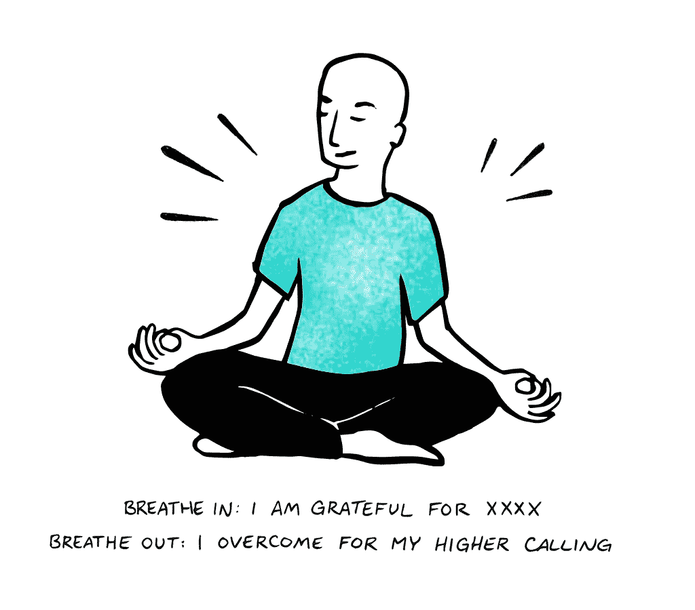
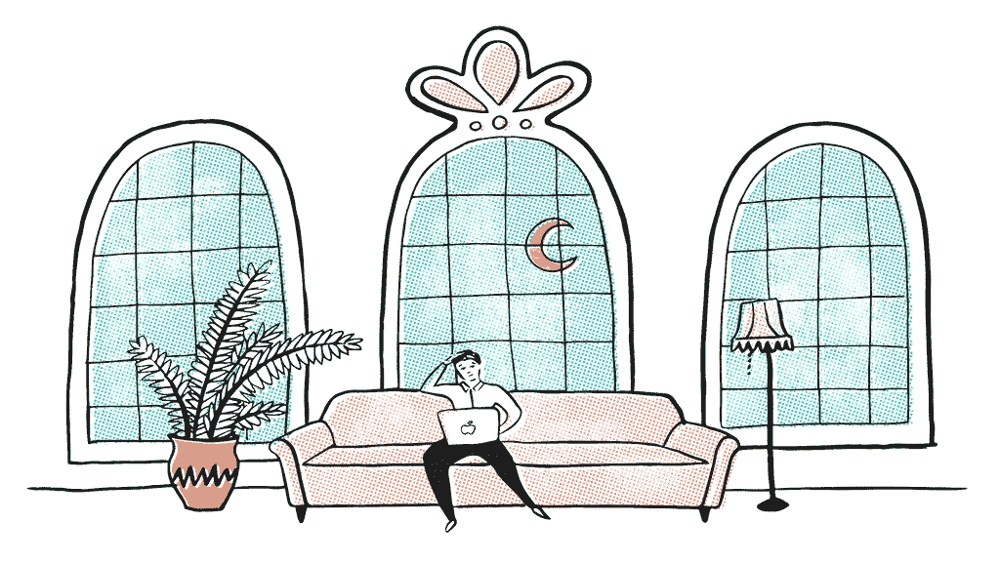
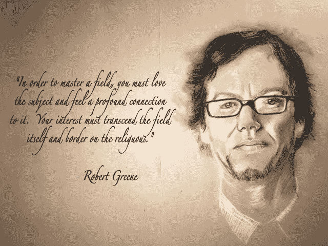

# 以下是大多数人不成功的原因，以及如何确保你会成功

> 原文：<https://medium.com/swlh/8-reasons-most-people-arent-successful-and-8-ways-to-ensure-you-ll-succeed-7e8be17e5187>

Photo by [John Mark Arnold](https://unsplash.com/photos/mvNRuUKs6NA?utm_source=unsplash&utm_medium=referral&utm_content=creditCopyText) on [Unsplash](https://unsplash.com/?utm_source=unsplash&utm_medium=referral&utm_content=creditCopyText)

昨天早上，我猛然惊醒，意识到我们当中有多少人在倒退。

> 扪心自问:你退步了吗？

你需要知道每一件事并对每一个通知做出反应吗？

*   你是否以失去控制和自我导向的行动为代价，对每一个冲动都采取行动？
*   你控制你的环境还是它控制你？这对你来说是一个非常重要的问题。
*   你是否意识到这个世界只是你如何看待它的一个投影，正因为如此，你有能力为你自己和我们其他人创造这个世界？

对于那些已经最大限度地发挥了自己的潜力并过着充实生活的人来说，你的意志是否旨在将获得权力作为你的终极目标？

大多数掌握了自己、自己的工作和自己的“宇宙”的人，最终会相信这就是一切。

我们时代的一些主要思想家认为这是人类的最终目标。

> “造成痛苦的力量是唯一重要的力量，是杀戮和毁灭的力量，因为如果你不能杀戮，那么你将永远受制于那些能杀戮的人，没有任何东西或任何人能拯救你。”—《安德的游戏》中的奥森·斯科特·卡德

如果你认为这是胡说八道，是最强大的“回馈”或选择利他行为(一个人是否参与慈善事业并不一定使他们如此)，一旦实现最高水平的权力或自我实现，只要看看每天新闻上的结果就知道了。

*   国家可以得到一个长，他们选择斗嘴。
*   战争可以避免，但却不能。领导选择在现实生活中玩《权力的游戏》。

如果你在想，你会怎么对待像金正恩或其他人这样的疯子，这正是问题的关键。一个世界领导人那样行事，而世界其他国家[认为武力是阻止他的方式。](/traena/forceless-power-makes-your-competition-an-afterthought-5-ways-to-hire-for-it-f96ff5b54aeb)

不是的。

我建议把马斯洛的等级制度颠倒过来，把注意力集中在有意识的意识上，培养技能、教育、适应力和毅力，让自己生活在一个高境界。

一种让你变得强大和有意识的状态。在这种状态下，你热爱学习，在你的好奇心背后有着正确的意图。

我们如此担心人身安全和“我们人民的安全”,我们非法制造“敌人”来对付我们。

在有大量土地的土地上互相争斗和杀戮的愚蠢行为。谁在乎过去的故事，谁得到了什么，为什么。

这只是一个故事，并不存在。

> 你所拥有的和将要拥有的就是现在。-埃卡特·托勒

到处都有大量的水，如果你只是简单地邀请你的邻居加入你，他们不会被认为是“占领者”，如果他们知道你在邀请，他们首先就不会想“占领”或拿走你的土地。

但是谁在乎土地呢？为什么我们不能摆脱“国家”的神话？

因为我们已经退步了。

所有这些问题都是我们头脑中构造的结果，我们还没有破解意识的心理“代码”。

或者至少，世界上的大多数个人，就这篇文章而言，在过去的 34 年里构成了“人类”。

我在这里要说的是，在过去的 34 年里，我们每个人都在经历成长的痛苦，并因为我们在世界上取得的进步而退化。

称之为‘世俗进化的痛苦’，或者‘进化的痛苦’。

虽然技术已经改善了“世界”(这仍然是一个预测)，但事实是，我们有足够的机会获得信息和科学，向大众教授和提供知识，回答一些最大的问题，如:

> 人们比以前体验到更多的快乐吗？

与 30 年前相比，人们总体上感觉不到或“并不快乐”。

随着预期寿命的提高，*认为生活质量下降了。*

整天都开着脸书？[每次检查，你都变得越来越不开心，事实](https://hbr.org/2017/04/a-new-more-rigorous-study-confirms-the-more-you-use-facebook-the-worse-you-feel)。

问问自己在脸书、Instagram 或 Snapchat 上花了多少时间？

对现有生活的期望如此之高，而现实却跟不上。

今天，每个 20 岁的人都需要改变世界来变得快乐，这是部分的好迹象。

然而，如果他们因为压力而自杀就不好了，如果他们没有像他们 3000 人的朋友群中的一个朋友一样周游世界，他们就不会快乐，因为那个人在 Instagram 上发布的内容最多，占他们 80%的订阅，而其他人都保持沉默。

这不是要发表一些政治声明，也不是要悲观，我实际上是你所知道的最乐观的人，但我也喜欢完全真实。

这是为了指出人类的副作用，并以技术进步为基准——这样你就可以重新进化。

虽然这并不是说我们不应该有技术，但它有一些短期的副作用，导致了我们的退化。

对我们大多数人来说，完成一项任务比以往任何时候都更难，更不用说拥有一个清晰而平静的头脑，或者有意识地观察和了解自己，真正思考，而不是让我们的环境和媒体决定我们的行动。

大多数阅读这篇文章的人可能很有头脑和技能去创造他们希望看到的世界。

虽然我们一直有像佛陀、耶稣和[托尼·罗宾斯](https://medium.com/u/95c55dec121a?source=post_page-----7e8be17e5187--------------------------------)和韦恩·戴尔和[本杰明·p·哈迪](https://medium.com/u/5153880ce2ee?source=post_page-----7e8be17e5187--------------------------------)这样的开明圣人——他们长期以来一直在传播相同的觉醒信息——但人类仍然无法学习，选择不学习，或者不想接受明智的教导来走上更高的道路，因为这需要激进的承诺和纪律，而这些都没有得到培养，事实上，相反的情况已经发生了。

过去几代的年轻人有过这样的权利吗？我不确定，但我最好不要。

也就是说，以下是你倒退的 8 种方式

# 1.如果你的目的是获得权力

> “一个生物首先寻求释放它的力量——生命本身是权力的意志；自我保存只是间接和最常见的结果之一。”弗里德里希·内茨舍

一旦你得到了你想要的一切，然后呢？

这个问题我想了很多。

当人们自我实现，问自己“现在怎么办？”—他们可以回馈，也可以索取更多。

尽管我的创业刚刚起步，但总体来说，我非常开心和满足。

我明白快乐化学物质是如何工作的，什么让我满足，以及金钱的好处和局限性。我喝了很多，也喝了很少。

简而言之，我可以预测并知道成为亿万富翁的感觉，即使我离它还很远。

我对成为我想成为的人和扮演这个角色的想象已经引起了我的梦想。

一张是我在一次炉边谈话中，我是一个正在接受采访的亿万富翁，采访者在一群人面前问我:

"银行账户上有超过 10 亿美元是什么感觉？"

我的回答是:

*“你知道，没多少零钱，钱都是银行对账单上的数字。*

我还有我的家人，我的父亲仍在衰老，我也多了几个朋友。

虽然听起来有悖常理，但这不再有趣了。

我记得我第一次和三个朋友搬进我的 Soho 阁楼的时候。

这个地方很棒，但是有点贵，尽管我们是合租的。我们都有点过度了。

所以我们在 Airbnb 上租下我们的房间，然后出租出去举办活动，每月多挣 400 美元的兴奋感真是太棒了。

*或者当你在创业时，花一年时间去追逐第一笔企业销售。当你有十亿美元时，问题总是被解决或者被收购，或者如果公司需要，我可以拿起电话筹集更多的钱。等等。*

*约束创造了一种力量，这种力量挖掘出你从来不知道自己能拥有的创造力。*

当不利因素变得更大且非常真实时，这是一场赌注更高的游戏。当然，成为亿万富翁伴随着责任和改变世界的能力，所以这也很神奇。

但是你知道这是不同的。”

我强烈建议每个人都做这个练习，想象成为他们想成为的人，并回答这些问题。

这是授权。

# 2.你有意识的自我意识很低，即使有关于意识如何工作的所有数据

> "寻找答案的过程赋予了我们存在的意义."—我对生命意义的信念

如果我是一个 34 岁的人，智商平平，致力于进化，每天都努力理解和意识到这个世界、我自己和这份叫做生命的礼物，那么其他人也可以。

好奇心是王道。

然而大多数人选择不去做。随着所有信息唾手可得

各国领导人知道如何开导他们的人民，但他们选择不这样做。

公司的领导者知道如何设计产品，所以他们不会吸引每个人，他们选择不这样做。

马克·扎克伯格可以选择不要让脸书成为一台令人上瘾的媒体机器，一台为了吸干你的注意力而优化的机器，但他选择不这样做。

他做他必须做的事情来为他的股东赚钱，这是通过你的关注无情地与其他人竞争增长。

我不是说我是一个社会主义者，远远不是，热爱资本主义，但扎克伯格应该(自私地)为自己选择一条不同的道路，为世界其他地方服务。

终极自我之旅。

我不是扎克伯格，但如果我用我的产品对数十亿人负责，我会努力做出更负责任的决定，从长远来看造福人类，而不是卖卖卖和钩钩钩。

# 3.有了所有可用的数据，你仍然选择不保持无意识和保持失明

> 世界上没有什么比真诚的无知和认真的愚蠢更危险的了。马丁·路德·金。

独立思考需要渴望获得知识，同时不断放弃贪婪的自私和进化的大脑，进化的大脑让我们恐惧和偏执。

我受了这么多苦，很难

# 4.如果你在一个巨大的媒体机构工作，并选择以人类意识为代价来获得眼球

> "我所知道的只是我在报纸上看到的，那是我无知的托辞。"—威尔·罗杰斯

媒体公司知道他们应该报道什么，最重要的是，知道如何通过有效的方式进行报道，让人们了解并帮助人们理解，但他们选择紧急报道，炒作和耸人听闻，以进一步利用人类的低意识来吸引眼球。

他们会为他们的广告商和控制他们的所有者做任何事情，而牺牲他们应该服务的人的利益。

是的，如果巴黎发生了恐怖袭击，它应该被报道，这样美国人民就可以知道。

然而，有一种方法可以让你带着尊严和尊重进行深思熟虑的报道，而不是愚蠢的报道。这也是我被迫以列表形式给这篇文章命名的原因。

但我是个小人物，媒体公司都是大人物的。

假设你的观众不是一个被吸进去的信息迷。

他们将人类视为一个需要控制的群体，并且确切地知道如何设计这种控制，同时让人们相信他们有选择的自由。

> “社会监狱设计得如此巧妙，以至于大多数人甚至没有意识到他们没有真正的自由。”

这就是我为什么说‘人类已经倒退’的原因。

不是普通民众，而是当权者知道这些，他们有充分的权力和效用去做他们想做的任何事情，然而他们选择的不仅仅是不同的行为，而是走向极端相反的方向去玩他们的权力游戏。

# 5.你选择用像酒精这样的药物来减少你的意识

> 酒精让你对愚蠢有无限的耐心——小萨米·戴维斯

你可能觉得喝酒很正常，其实不然。

是上个世纪那些不关心人性的毒贩子推出的新药。他们想通过让你迷上一种当时人们还不太了解的物质来赚钱，现在已经太晚了，因为它已经被文化所接受，而我们已经迷上了。

与此同时，每天都有人死于饮酒、酒后驾车，这对你的身体很可怕。有[更多启发性的方式来享受生活](https://www.quora.com/What-am-I-missing-out-on-in-life-if-I-dont-drink-smoke-or-do-drugs-1)，享受乐趣，释放压抑。

# 6.你采取任何行动的最大动机是害怕错过

> “我们与不安全感作斗争的原因是，我们在幕后与其他人的精彩镜头进行比较。”

FOMO。

我们总是需要为了知道而知道，同时意识到我们不需要阅读 FB 上的那篇文章。

如果你认为这是正常的，而你没有意识到这一点，你就在退步。

# 7.你不知道你的生活是如何被预先决定的

> 有选择能力的头脑是不自由的，因为在选择中总是有冲突，不管是有意识的还是无意识的，而一个处于冲突中的头脑永远不会自由。—克里希那穆提

不是因为某些神圣决定的原因或创造者，而是因为缺乏对你潜意识编程的意识，以及它来自哪里。

我们 95%的行为来自我们的潜意识，这意味着我们在学会给我们的潜意识编程之前不会决定它，而大多数人并没有意识到这一点。

如果这是在学校里教授的，而不是在早上 7 点把我们拖起来学习历史和几何，结果可能是人们对自己的行为有更多的控制，或者至少理解采取行动是如何工作的。

# 8.你不知道什么是爱

> 一个真正有爱的人可以和任何人共度一生，而且绝对不会介意。从一个家庭中去除占有和自我利益——看看这个家庭变得多么富有成果！—我

爱情与我们大多数人今天所认为的相去甚远。

大多数人认为爱是

*   激情的感觉。
*   依恋。
*   占有(如果这个人为我做了或实现了这些事情，我会爱他或她，为那个人做任何事情)

爱是一种存在状态，是内在的，没有歧视。

它无处不在，无时无刻不伴随着每个人——或者不是。

与某人一起“建立家庭”的生活与这种爱的状态无关。

是的，随着时间的推移，你培养了一段关系，是的，这种“纽带”变得更深——但是你的爱的状态再次与这种纽带本身无关，它与你有关。

你们大多数人自欺欺人地认为自己是因为“爱”而结婚，而实际上是出于安全和扩张等进化原因无意识地决定结婚。

还是那句话，是‘正常’，不是爱。

*   那个为了女孩的“大家庭”而和她结婚的家伙。
*   娶了这个女孩的男人，因为她看起来很有魅力。
*   “她是个好对象”或者“他会是个好父亲”

都与爱情无关。

# 8 种方法可以扭转局面，实现个人卓越

# 1.学会用“上帝的眼光”来评价你的生活

> “知识总是向上流向主教和国王，而不是向下流向农奴和奴隶。这一原则在当今时代依然不变。。。政府敢于通过其情报机构，渴望对我们每一个人都有上帝般的了解。—朱利安·阿桑奇

我不是说你应该欺骗自己“相信你是上帝”或“神”或其他任何东西。

我的意思是运用‘宇宙之主’的范围，相信你有能力影响宇宙。

从那个角度形成观点。

这是授权和提升你到一个高的状态和对世界和世界上发生的事情的观点。

这给了你理解，并开始形成为自己思考的基础。

“宇宙的主人”或负责大型组织的领导者是这样想的。

他们知道人类的状况，他们了解人际网络如何形成产业。他们知道市场周期，他们把握趋势。

他们知道快速增长和指数变化的价值可能性。他们知道如何快速创业，并使其估值达到 10 亿美元(创业机制)。

这些人已经“扮演好了角色”,并且经常如此相信自己，以至于他们不相信自己会错，并且拥有任何超级大国都可能拥有的信任和信念(是的，结果是很多疯狂的人)。

人们真的相信我们很快就能长生不老，我也真的相信。

对此我说，抬高。

# 2.理解力量和武力的区别

> “权力是为他人服务的，而武力是为自己服务的。真正的政治家为人民服务；政客们利用人们来实现他们自己的野心。政治家牺牲自己为他人服务；政客牺牲他人来为自己服务。”大卫·霍金斯爵士

力产生反作用力。100%的时间。

当你考虑人类思维的复杂性和创造性时，如果你创造了 10 种力量，你可以期待 20 种力量的回报，如果那个人有能力带来它的话。

另一方面，权力创造了协同效应。

根除“敌人”的战争是武力。

对待“敌人”不仅仅是一个人，而是一个战友，问他们想要什么是“消灭敌人”，承认没有敌人这种东西。

只有政治和金钱，它们让我们表现出最糟糕的一面，让有权势的人玩上帝游戏取乐，仅仅是因为他们感到无聊。我打心底里相信那句话。

当你真的很无聊并且拥有一切的时候，你和别人“玩游戏”的程度是无止境的。

> "原谅他们吧，父亲，因为他们不知道自己在做什么。"——路加福音 23:34

# 3.失去潜力是你应该有的唯一恐惧

> “不要让过去的记忆限制了你未来的潜力。在你的人生旅途中，你所能达到的成就是无限的，除了你的思想。”

最大化你的潜力是一系列的选择，为什么不去做呢？

对面的[是一个选择](/the-mission/ive-figured-out-the-meaning-of-life-and-it-boils-down-to-one-word-d43361748e44)。

这是一种思考和塑造你的环境的方式，也是一种[瘾，你只需要让自己对](/traena/its-time-to-acknowledge-a-hard-truth-there-s-a-war-going-on-and-the-only-way-to-win-is-to-fight-7e96423e3fa7)上瘾。

我不认为上瘾这个词是一件坏事，因为我们都对电视、食物、咖啡、阅读等上瘾。等等。

上瘾可以是好事也可以是坏事，知道习惯和上瘾之间的区别是有好处的。

但是对心流(你擅长的工作)、内啡肽(锻炼)和享受生活上瘾。

# 4.理解掌握不在于你做什么，而在于你如何做

> “你如何做任何事情就是你如何做所有事情。”

掌握你自己和/或你的工作将把你推回到成长和积极的进化。

罗伯特·格林(Robert Greene)关于精通的巨著(没有双关语的意思)是我见过的关于这个主题的最好的书。他说:

Art by Juan Jiminez

他所说的“爱”是一种状态，无论你在做什么，它都来自有意的练习。

有些人是他们生活中每时每刻的主人，但他们没有令人兴奋的工作，而有些人则像推土机一样奋力向前，傲慢地强行通过并不算是主人的道路。

前者是一个比那些一直压力重重的推土机更有人情味的大师。

知道一个人能做什么，知道什么是满足的平衡和正念。

这个人给自己时间和空间来最终完成精湛的工作。

在这种状态下完成的任何任务，都是可以爱的。

无论你是出纳员还是首席执行官，你所投入的任何事情都会得到喜爱。

是关于国家的。

我最好的朋友在过去的五年里一直从事初级会计工作，他是我认识的最快乐、最满足的人。

我羡慕他，因为我用我的生命来控制我对成就的恐惧和偏执。

他是主人，不是我。

但是我正在掌握这一点，所以我很乐观。

# 5.理解信念是如何运作的

> 如果你不相信自己，没有人会相信你。为了取得成功，你需要对自己的能力充满信心，并且知道你会到达你想去的地方。

信念是创造行为的程序，就像算法一样。

所以如果你能创造一个新的程序(信念)，你会得到新的行为。

理解这一点至关重要，因为人们没有最大限度地发挥潜力的首要原因是因为他们认为自己有能力做到。

这阻碍了他们。这阻碍了他们成功的任何机会。我为此而痛苦。

如果你因为不相信一切皆有可能而注定失败，你将一事无成。

从字面上看，这是从一无所有到像奥巴马这样的总统到。

如果你相信，你会坚持下去。如果你相信，你会找到成功所需的教育、人脉和其他一切。

# 6.理解成就的机制

> 幸福在于成就的喜悦和创造的激情——富兰克林·d·罗斯福

你应该[相信一个人所设想和相信的](/traena/how-to-reach-the-state-of-mind-required-to-achieve-absolutely-anything-bd562e9dc4be)，他能够实现。几乎任何东西。

我想在纽约的世界级公寓里举办世界级的活动，我做到了。

作为一家企业，它失败了，但我做到了

我这样做并不是因为我很富有或者从我父母那里得到了钱，我这样做是因为我从我工作了六年的第一个家庭那里学到了如何把事情做好。

所以我第一次搬到了纽约，第一次筹集了资金，搬进了位于第 17 大街和第 5 大街的 6000 英尺高的阁楼。我做到了。失败了。

我开了第二家公司。我找到了合作伙伴，筹集了资金，我们正在向财富 500 强和价值数十亿美元的制药公司出售我们的软件。

我在学校表现很差，智商不高，大学辍学了。

我所拥有的只是勇气和信念，以及我对高标准的编程。

感谢上帝，至少我被高标准地“编程”了。

妈妈，爸爸和 Bisnow 一家给我的。

# 7.理解放手的力量，并每天都这样做

> “如果我们放下罪恶感，我们就会看到纯真；然而，一个充满罪恶感的人只会看到邪恶。基本规则是，我们专注于我们压抑的东西。”

我们在生活中背负了太多压抑和压抑的包袱，这是作为人类的天赋和诅咒，伴随着我们数百万年的大脑。

放手是一种不抵抗、承认，最重要的是释放的机制。

放下恐惧。

*   放下痛苦。
*   放下焦虑。
*   放下羡慕。

实践这一点并这样做是你可以应用于你的存在的最伟大的仪式。

# 8.醒醒！极度自力更生

> “当你满足于做简单的自己，不去比较或竞争时，所有人都会尊重你。”
> ―[―**老子**](https://www.goodreads.com/author/show/2622245.Lao_Tzu) ， [**道德经**](https://www.goodreads.com/work/quotes/100074)

不要让你的网络和环境控制你，控制它。

不要让别人替你想，自己想。什么都知道。要有信心。

你拥有一切你需要的和永远需要的。一个‘连接’或古鲁不会拯救你，你只能拯救你自己。

不要偶像化任何人，偶像化自己。想象你在那里并且相信它。一切都在你自己的内心。

进行一次内心的革命，拥抱这个旅程，为了所有的一切，也为了它不适合的一切。

我们都会死，这不是一件坏事。

这是进化，伴随着它的礼物和诅咒。

## [每周一次点击接收我保证是你在互联网其他地方找不到的改变游戏规则的文章。你还会收到我的指导，告诉你如何在你所做的事情上成为世界上最好的。你不会后悔的。](https://betreatedhowyouwanttobetreated.com/optin-main)

## 这个故事发表在 [The Startup](https://medium.com/swlh) 上，这是 Medium 最大的创业刊物，有 273，103+人关注。

## 订阅接收[我们的头条新闻](http://growthsupply.com/the-startup-newsletter/)。

