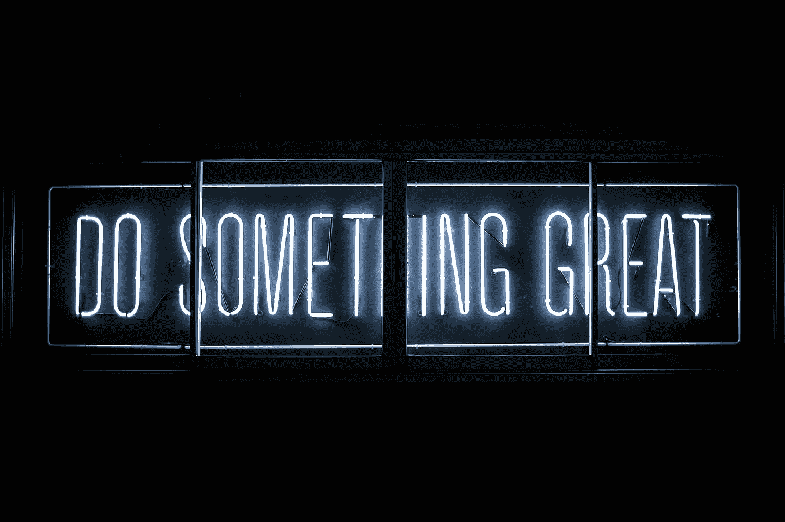
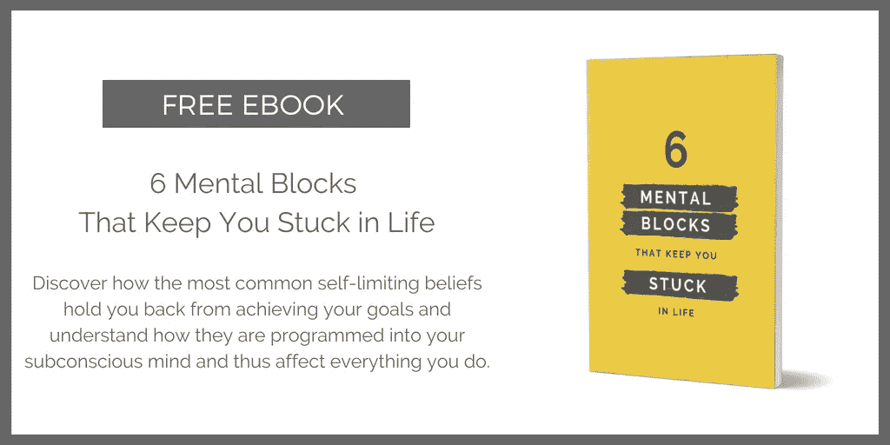

# 你缺乏动力的 8 个原因——以及如何解决

> 原文：<https://medium.com/swlh/8-reasons-you-lack-motivation-and-how-to-fix-it-578664a544f8>

## 不要让他们扼杀你的梦想。

Photo by [Clark Tibbs](https://unsplash.com/photos/oqStl2L5oxI?utm_source=unsplash&utm_medium=referral&utm_content=creditCopyText) on [Unsplash](https://unsplash.com/search/photos/motivation?utm_source=unsplash&utm_medium=referral&utm_content=creditCopyText)

> 动力就像篝火。你需要三个要素来获得它的全部回报:点燃火的火柴、让火继续燃烧的木头和烘烤棉花糖的热量。

如果你最近一直在动力上挣扎，你必须全面审视你的营火。你的火柴、木头或营火环境可能有问题。或者更糟:你可能一直在往篝火上泼水！

使用这份清单来确定是什么扼杀了你的营火，并了解如何修复它。

# 1.你缺乏强有力的理由。

## 症状:

你可能没有向自己承认，但你实际上对做这件事并不感兴趣。不管是你给自己定的目标像跑马拉松，还是在工作中完成一个项目，你都有点 CBA(不能被要求)。在内心深处，你要么是看不到这一点，要么是奖励对你来说不够有吸引力。

## 治疗方法:

对付这个残酷的动机杀手有两个选择:

*   **不要这样做:**不要再对自己撒谎了，辞职吧。这会帮你自己——也可能帮其他人——一个大忙。反正你一点也不在乎。
*   **在表象下找到一个强有力的为什么:**如果你不能辞职——因为这是你工作的一部分或者你不想违背诺言或者 _______________ *(用你的自定义借口填空)*，**你需要找到一种不同的方式来思考这个问题**。如果你思考的时间足够长，你几乎可以在任何事情中找到某种价值。它可能与此没有直接联系，但可能有更深层的目的。下面举几个例子:*我看不出这样做有什么意义，但是会让我的另一半开心(而且我很在乎我的另一半！).健康饮食会提高我工作的注意力和效率(我对工作的关心超过了对汉堡的关心)。这个项目很无聊，但做得好会让我的老板知道我可以弄脏自己的手(这将建立我在工作中的声誉，我很在乎这一点！).*

# 2.你的目标压倒了你。

## 症状:

当你思考或谈论你的事情时，你的头脑会发出“啊啊啊”的声音。你太害怕这件事了。感觉就像一个大怪物，你连先攻击哪里都不知道。你看不到自己有朝一日会把它推倒——它实在太大了！结果，你拖延开始，因为你太害怕了。

## 治疗方法:

有些人可能会说“从某个地方开始”。但这可能是我听过的处理压倒性压力的最糟糕的建议。

下面是实际有效的方法:分解它！看着怪物的眼睛，把它分解成几部分。辨认它的腿、头、胳膊和肚子。然后，围绕它建立一个结构——按照时间顺序排列各个部分，或者根据主题进行分类。在你的组块中，也起草一个粗略的概述。然后，制定一个粗略的项目时间表，并确定要开始的第一个项目，在第一个项目中，第一个行动。通过看着怪物的眼睛并分析它，你不再把它看作抽象的可怕的愤怒。相反，你认为它是一个仍然具有挑战性的对手，但如果你有战略眼光，你可以征服它。

# 3.你不相信自己。

## 症状:

你有点想做这件事，但内心深处你真的不相信自己能做到。这严重破坏了你的动力，因为你头脑中的声音一直在告诉你“你为什么要尝试？反正你是到不了的……”。

## 治疗方法:

**快速解决方法:**看看你过去的成就，提醒自己，你曾经成功实现过非常具有挑战性的目标，而那时你对自己也不太有信心。因此，你现在也可以解决这个问题了！

**永久解决这个问题:**找出你的限制性信念，用授权性信念取而代之。限制信念是指导你行动和决定的潜意识思维模式。这些自我限制的信念大多产生于你的童年或青少年时期，并且仍然在很大程度上决定着你对自己的看法。但是由于这些信念已经被编入你的潜意识，它们会在你不知不觉中指导你的决定和行动。为了实现大而大胆的目标，你需要用一套新的授权信念来提升你的心态，这会让你获得实现目标的必要信心。

*如果限制信念对你来说是一个全新的概念，看看我的免费电子书《让你困在生活中的 6 个心理障碍》* *,了解最常见的限制信念是如何阻碍你实现目标的，以及如何重新规划你的思维以获得成功。*

Get it here: [http://bit.ly/mental-blocks](http://bit.ly/mental-blocks)

# 4.你只是累坏了。

## 症状:

你的生活中发生了太多的事情。这么多事情要做。这么多事情要处理。往好里说，你压力很大，往坏里说，你筋疲力尽。因此，你完全失去了做这件事的意愿——即使你真的想做。当其他事情都在消耗你的身体和精神能量时，就没有什么可以点燃你的激情和努力实现你的目标了。

## 治疗方法:

释放身体和精神能量，重新安排优先次序！休息、减压、充足睡眠，给自己充电。对那些没有你的目标重要的事情说“不”。通过冥想和写日记来清理你的大脑。也许你甚至需要做一次全生命排毒，来释放生活中必要的空间。我在这里写到:

 [## 如何在短短一周内彻底清洁你的整个生活

### 摆脱有害的习惯、人、思维模式和杂乱

medium.com](/@refinedliz/how-to-spring-clean-your-entire-life-in-just-one-week-6ecc0b3db6f2) 

# 5.恐惧让你退缩。

## 症状:

你的恐惧在潜意识里阻碍你收集开始的动力。在内心深处，你害怕失败或让自己难堪，你害怕未知甚至害怕成功！因此，你正遭受一种或多种恐惧症状的折磨:拖延、焦虑、抗拒和过度担忧。

## 治疗方法:

弄清楚*你害怕什么*，*它如何*阻碍你，以及这种恐惧如何在你的生活中表现出来(也就是症状)。理解这一点是想出应对恐惧的具体策略的基础。

我在这里写了更多关于如何克服恐惧的内容:

 [## 追求梦想时如何减少恐惧

### 如何建立坚实的基础和有效的应急系统

psiloveyou.xyz](https://psiloveyou.xyz/how-to-fear-less-when-going-after-your-dreams-4dae4acd0e2d) 

# 6.你不健康的生活方式正在造成损害

## 症状:

你感觉行动迟缓，经常感到疲劳。您患有慢性身体疼痛(很可能是消化问题、背痛或头痛)。你会出现脑雾，注意力难以集中。

## 治疗方法:

纠正你不健康的生活方式，你的动力问题(以及更多)就会迎刃而解。这里有一些好的指导方针可以帮助你开始:

*   **每晚睡 8 小时**
*   **每天流汗:**哪怕只是 15 分钟。
*   以健康的早餐开始你的一天:这也会让你在一天的晚些时候更容易做出健康的选择。
*   **用心吃:**吃就吃吧。不要看电视或回复邮件。专注于你口中食物的味道，享受每一小口。中途休息一下，问问自己是不是还饿。如果没有，停止进食。这个习惯甚至可以让你轻松减肥。
*   **吃好:**选择新鲜、健康、未经加工、有营养的食物。如果你有消化问题，不要吃麸质、奶制品和加工食品。
*   限制咖啡因、酒精和尼古丁等兴奋剂的摄入

# 7.你设定的目标太小或太大

## 症状:

你正在做这些事情中的一件或两件。你设定的目标太小了，以至于无法激励你走出我们的舒适区。你把它们定得如此之高，以至于你甚至不知道如何解决它们，也缺乏这样做的信心(见 2 和 3)。

## 治疗方法:

光谱的两端对你的动力和士气同样不利。是的，大胆梦想——梦想大到让你害怕。是的，10 倍于你的目标，强迫自己想出开箱即用的方法。但是，请以一种可行的、具有挑战性的方式设定你实际的每周目标。你的动力会感谢你的！

# 8.你不耐烦了

## 症状:

你有点泄气，因为你以为你现在已经到那里了。你不会想到实现你的目标需要这么长时间。这严重挫伤了你的积极性。你甚至可能会有放弃的想法，因为你太不耐烦了。

## 治疗方法:

明白美好的事物需要时间。这听起来很老套，但说真的:你需要改变你对这个问题的看法！关注进展，享受过程，因为这和实现目标一样是一种奖励。此外，庆祝一路上的小里程碑，奖励自己的努力。这将保持你的士气和你的不耐烦。

# 你准备好升级心态了吗？

获取我的免费电子书[“让你困在生活中的 6 个心理障碍”](http://bit.ly/mental-blocks)

Get it here: [http://bit.ly/mental-blocks](http://bit.ly/mental-blocks)

## 更多来自 Liz Huber 的报道:

 [## 今年让你的生活提升 10 倍的 8 种方法

### 这不是毫无意义的随机习惯的集合。

medium.com](/mind-cafe/8-meta-habits-to-make-2020-your-breakthrough-year-3dd00429cf3)  [## 在两个月内将我的教练业务从 0 美元增长到 6k+美元的 8 个残酷而诚实的教训

### 只要你相信，你想收多少就收多少

entrepreneurshandbook.co](https://entrepreneurshandbook.co/8-brutally-honest-lessons-from-growing-my-coaching-business-from-0-to-6k-in-2-months-8469abe98acd) 

## 这个故事发表在[的创业](https://medium.com/swlh)上，这是 Medium 最大的创业刊物，有 328，729+人关注。

## 订阅接收[我们的头条新闻](http://growthsupply.com/the-startup-newsletter/)。

