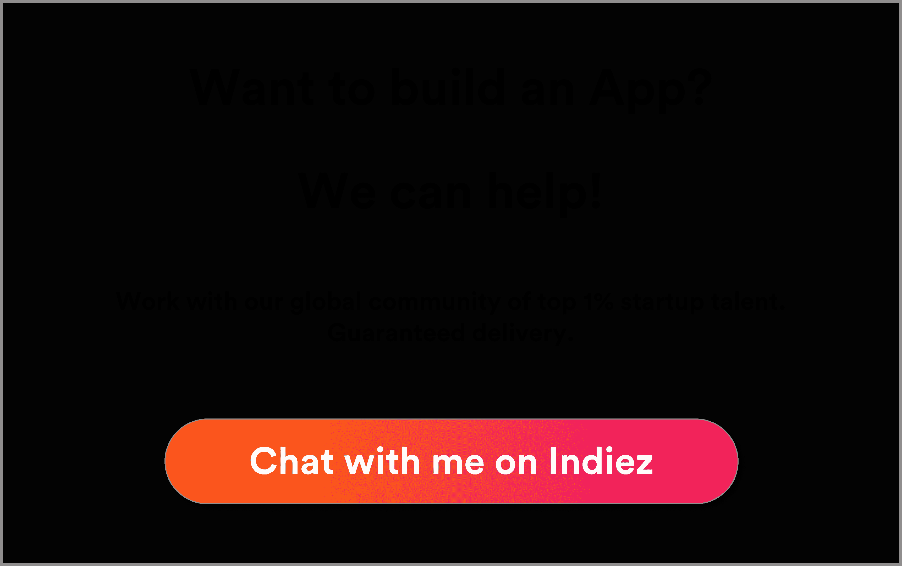
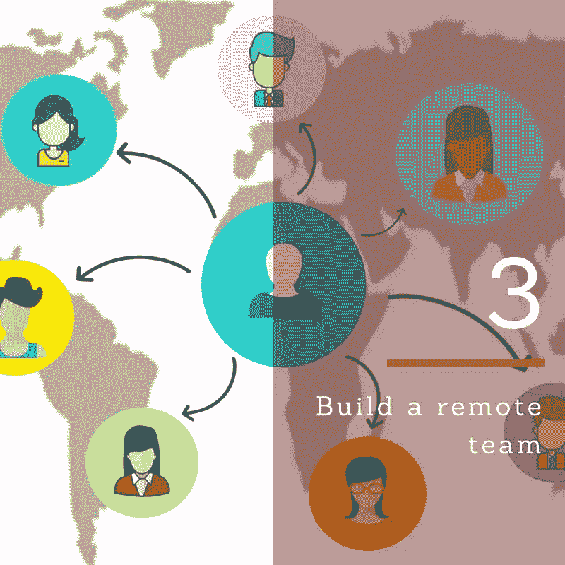

# 2018 年成为创业英雄的 8 个步骤

> 原文：<https://medium.com/swlh/8-steps-to-becoming-a-startup-hero-in-2018-169584923280>

提供我们的专业知识来帮助您从头开始创业，以及为什么 2018 年是这么做的最佳年份。

在 [Indiez](http://indiez.io/) ，在与 150 多位最优秀的企业家密切合作，在 250 多个项目中完美地交付产品，并与 600 多位创始人建立联系后，我们知道导致 90%的初创公司在前 5 年内失败的困难。

创业不是一门科学，也不是你与生俱来的东西。这是一门任何人都可以通过勤奋、坚持和信念掌握的学科**。**

2018 年，我们发现自己处于一个饱和的世界，客户的期望很难超越！他们会将你的产品与谷歌、脸书、Salesforce 和 Airbnb 等价值数十亿美元的公司进行比较。

你如何与他们竞争？

嗯，这可能是你自己创业的最佳时机。如今，世界上市值最高的公司是一家科技公司。追随者也是科技公司。如果你学会了正确的方法，这是一个创业的好时机。

我们对创业公司略知一二。如果你想得到一些很棒的创业建议，你应该追随像保罗·格拉厄姆、陈楚翔、加里·韦纳查克和规模大师这样的人。

以下是我们的一些经验-

# **#1 想出一个令人难以置信的创业点子**

提出一个想法并不是一件容易的事情，你的想法可以有许多不同的形式。你不需要一个独特的或利基产品或服务，但你需要能够做得更好。

2018 年，我们发现自己处于这样一个位置

*   你可以把一个想法从另一个国家带到你自己的国家或全球
*   你看到一个有缺点的主要品牌，你觉得你可以做得更好
*   你看到世界上的一个主要趋势，你觉得一个产品或服务可以娱乐。

这一年创意不断，机会无穷，潜力无限，从今天的创意开始创业会带来巨大的回报和成功。如果你在纠结，可以看看我之前的文章——[‘如何获得一个应用的想法’](https://hackernoon.com/how-get-an-app-idea-38841a756c1b)。

如今，创业的创意成本很低，关键是学会如何执行。测试你的想法从未如此简单，像“[如何在你的应用上节省 100，000 美元的想法](https://hackernoon.com/7-minute-read-to-save-100-000-on-your-app-idea-2d17db675a1)这样的资源将帮助你以最有效的方式执行你的想法，从而节省时间、金钱和精力。

# **#2 为什么市场比以往任何时候都重要**

> **“产品适合市场是唯一重要的事情”——马克·安德森**
> 
> “获得正确的产品意味着找到适合的产品/市场。这并不意味着推出产品。这意味着要让市场接受你的产品，并想要更多。”弗雷德·威尔森(联合创始人 USV)

把你所有的钱都花在增长上，却不知道你在市场中的位置，这将会把你放在 90%死去的创业公司的名单上。

团队可以改变，但你的市场不能。

确定你的市场对你的想法至关重要，并把它交给正确的人——著名的初创公司 Segment 在找到适合的产品市场之前，不得不与多种产品进行斗争。这里有一个[惊人的视频](https://www.youtube.com/watch?v=_6pl5GG8RQ4)是 PMF 细分市场的创始人彼得。

[Hashcut](https://hashcut.com/) ，一个剪辑任何 YouTube 视频的平台，在发布他们的产品之前联系了[有影响力的人和视频博客作者](https://hashcut.com/)，看看他们是否觉得这是一个好主意。自推出以来，他们的服务每天都有超过 1000 个独立用户使用。通过接触正确的市场领导者来了解正确的市场，帮助他们甚至在推出之前就取得成功。

了解产品市场适合度的概念，并将其应用到你的具体想法中，会让你在一开始就处于有利的位置。我建议看看特伦·格里芬的博客。

# **#3 建立远程团队或者死亡**

2018 年只是数字游牧/远程工作一代的开始。这是#futureofwork，我们应该知道在 [Indiez](http://indiez.io/) 我们是一个 100%的远程工作社区。

要启动你的创业，你需要有一个才华出众的团队，他们可以全程协助你。允许自己远程工作可以让你找到全世界最优秀的人才！

如果你没有合适的团队成员，你的初创企业将会在成长之前夭折。

[Earlypad.com](http://www.earlypad.com/7-reasons-startups-require-market-research/)最近发现，这是创业公司失败的最常见原因。世界上最好的想法仍然需要正确的团队来执行。

你的团队成员需要对你的产品有相同程度的热情，对你的创业目标有相同程度的信念，距离远一点会让你更深入地寻找这些人。

***Y* ou 也需要向他们输入**

“为什么我什么都要自己做，”玛格丽特·撒切尔在下台前要求她的内阁。事实是，她没有，她不会让自己接受其他建议。

你的团队成员将来自不同的背景、不同的文化、不同的经历，开放和倾听会给你带来成功。Indiez 有一个令人难以置信的团队，尽管身处不同的时区，他们也能每天见面。拥有一个远程团队可以让你找到世界上最好的团队，产生最棒的想法。

**为未来做好准备，了解来自 day dot 的远程员工。**

# **#4 全球构建，本地思考**

由于技术将我们与全球的信息、资源、合作者和客户联系起来，你可以在任何地方生活，在任何地方工作。尽管业务遍及全球，但在数字时代，小城镇的商业意识才是最有效的。

建立一个志趣相投、充满激情的自耕农社区，就像你在建立自己的社区一样。

2018 年是一个允许平台在真正的全球范围内使用你的产品和服务的一年，但如果你对待客户、社区和你遇到的每个人，就像你是他们的“本地咖啡店”，那么你就可以提供真正非凡的服务。

将世界视为你的本地社区，通过社交媒体、电子邮件活动和博客帖子让他们了解最新信息。使用诸如 [MailChimp](https://mailchimp.com/) 之类的工具，您可以创建给社区成员的个人电子邮件，通过访问您自己的联系信息来提供个人接触，这使您可以建立关系，就像您在他们的街道上的独立商店一样。

如果你能像本地企业一样思考，你就会在网上脱颖而出。除了做生意，大多数人不愿意花额外的时间和精力去建立一个社区。

# **#5 成长黑客>营销**

我们最近发表了一篇关于非科技创始人最佳成长秘诀的文章。在 [Indiez](http://indiez.io/) ，我们看到了一些最好的、独特的、令人难以置信的产品，但它们由于糟糕的营销而失败，并因此未能快速增长。

**如果你的营销方式不正确，你的初创公司就会死掉。**

你需要根据我们建议的技术快速行动，并且正确地做。你可以通过[陈楚翔的博客](https://andrewchen.co/)、[布莱恩的博客](https://brianbalfour.com/)和[乔希·费彻的电子书了解一些关于成长的基本知识。](https://www.producthunt.com/posts/bamf-bible-2018)

在 2018 年这个数字时代，营销和发展是成功的保证。像汉堡王这样的老牌企业发现，像 Foursquare 这样的应用程序为他们提供了一个平台，增加了他们在人群(年轻人)中的受欢迎程度。

如果你发现你的创业公司可以接触到一些人群，那么你可以利用数字营销来创造个性化。伟大的葡萄酒公司根据不同的目标受众创造了不同的信息。他们强调千禧一代的“负担能力”，同时强调“婴儿潮一代”的葡萄酒类型

尺度大师还制作了一个名为《快速成长——决定，决定，决定》的播客。我认为这很值得一听，了解这些关于你的营销的快速决策如何帮助你加快成功之路。

# **#6 2018 年是联网年**

你将在 2018 年开始创业。现在，我们比以往任何时候都有更多的工具和机会来建立关系网。

使用像 LinkedIn 这样的免费商务社交网络可以让你与全球最伟大的人联系。LinkedIn 上的影响者总是乐于接受新的请求，并指导下一代创业英雄。

Meetup 是另一个很酷的媒介，它允许你根据自己的兴趣创建或参加你所在地区的活动。这些活动可以为你提供一个平台，结识志同道合的人，潜在的投资者和市场专家。

[拉多尔蒂亚](https://www.ladorita.net/)认为他们成功的[因素](https://www.meetup.com/it-IT/Pittsburgh-OMA-Mind-Body-Spirit-Wellness-Meetup/events/225302621/)是从其他参与者的错误中吸取教训，这些参与者分享了他们的故事和经历。

# **#7 新技术—打造经得起未来考验的 It**

2018 年最值得了解的事情之一是，在科技世界中，你可以获得无尽的可能性和无痛苦的选择。

未来会带来很多新的业务和技术，有些会带来破坏，而有些则值得关注，看看你是否能在这个领域实现你的服务/产品。

可以帮助您在 2018 年构建面向未来的产品的应用包括 [React Native](https://facebook.github.io/react-native/) 。脸书、Instagram、Skype 都是我们日常使用的应用程序，它们成功地使用 react native 通过 Javascript 构建了一个移动应用程序。这项技术让你有机会轻松地为 Android 和 iOS 构建极其简单的应用程序。除非万不得已，否则你不需要自己构建原生应用。

[React.js](https://reactjs.org/) 和 [Golang](https://golang.org/) 是其他一些工具，它们可以让你在不使用 PHP 的情况下构建简单、可靠的软件。

你需要注意的颠覆性技术是[区块链](https://www.blockchain.com/)。你一定在 Linkedin 或媒体上看到过，每天都有几个 ICO 和创意冒出来，利用区块链技术作为平台，颠覆全球许多行业。尽管世界上对他们是否会成功存在不确定性和怀疑，但这绝对是一个你必须关注的行业。

# **#8 决定适合你的融资技巧**

此前，创业公司的财务模式只有两种——融资和自举。

这些模式各有优缺点，正确的前进方向取决于不同的因素。

如果你已经有资金来构建和测试一个产品，那么 bootstrapping 就是一个不错的选择！

如果你的资金有限，需要特别的帮助，那么筹款是一个更可行的选择，因为你可以获得投资和可靠的建议来换取股权。你必须妥协，并意识到你对创业的愿景可能会随着他们的投入而改变方向。

未来股权的简单协议，是一种以最简单的方式筹集资金的奇妙方式。Dropbox，Reddit，AirBNB 都把它作为一个可行的选择，因为它可以让你通过一张纸筹集资金。这是创始人喜欢的。它非常简单，你不需要聘请律师来起草任何协议，它也是一种“可转换票据”——没有商定当前的估值，随着数字在稍后日期固定，这意味着本质上，投资者必须等待特定的时间才能获得他们所投资的股权。这种估值通常会在首轮融资期间确定，那时会有更多的数据点作为估值的基础。

你应该筹集你**需要的资金，**筹集太多或不够都会在你的业务启动前给你造成财务困难。如果你筹集的太多，当你的初创公司开始盈利时，你可能会受到影响；如果你筹集的不够，你最终将无法支付你需要的一切。

**如果您有任何问题或需要关于这些提示的任何建议，请联系 Indiez 团队，我们将亲自回复以进一步帮助您。**

这些提示将帮助你在起跑线上开始比赛。如果你接受他们并采取行动，你应该在比赛中领先并防止失败。想要更多的建议，我建议你看看保罗·格拉厄姆的文章《如何创业》。

**需要帮助构建您的产品吗？当你需要建造什么的时候，Indiez 会在这里为你服务。我们的远程社区将在您的道路上为您提供帮助，并快速为您构建产品。我们拥有世界上顶尖的 1%的创业人才，我们将保证在最后期限前完成任务。**

## 让我们建造令人敬畏的。🙌

## 启动？好好做！加入 100 多位与 Indiez 一起打造成功产品的了不起的创始人。

## [在这里了解我们更多— Indiez.io](http://www.indiez.io/?utm_source=Blog&utm_medium=medium_bottom_inline_link&utm_term=serial_entrepeneurs)

## 这篇文章发表在《创业公司》杂志上，这是 Medium 最大的创业刊物，有 360，974 人关注。

## 订阅接收[我们的头条](http://growthsupply.com/the-startup-newsletter/)。

