# 拥抱内容营销未来的 8 个策略

> 原文：<https://medium.com/swlh/8-strategies-to-embrace-the-future-of-content-marketing-75cdf5f0459c>

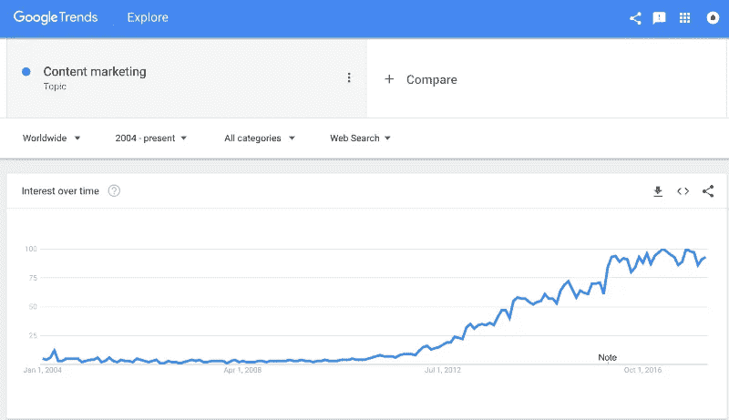

> [93%](https://www.iab.com) 的 B2B 商家使用内容营销。
> 
> 只有 [5%](http://contentmarketinginstitute.com/wp-content/uploads/2017/12/2018_B2C_Research_Final.pdf) 觉得自己的努力很有成效。
> 
> 据估计[所有内容的 50%](https://www.forrester.com/report/Build+The+Case+For+Content+Marketing+On+Efficiency+Differentiation+And+Granular+Metrics/-/E-RES113417) 完全没有被使用。

哪里出了问题？

就在几年前，你可以在自己的网站上发布 1、2、3、300 篇博文；通过你所有的社交平台疯狂地引导流量给他们；积累大量的入站链接；瞄准一堆关键词；在谷歌上轻松排名。

控制你的信息和赢得顾客几乎是小菜一碟。

不再是了。

平静的岁月已经过去；正如 Gartner 的[炒作周期所预测的，我们已经深陷幻灭的低谷。](https://www.gartner.com/smarterwithgartner/5-insights-from-the-2017-gartner-hype-cycle-for-digital-marketing-and-advertising/)

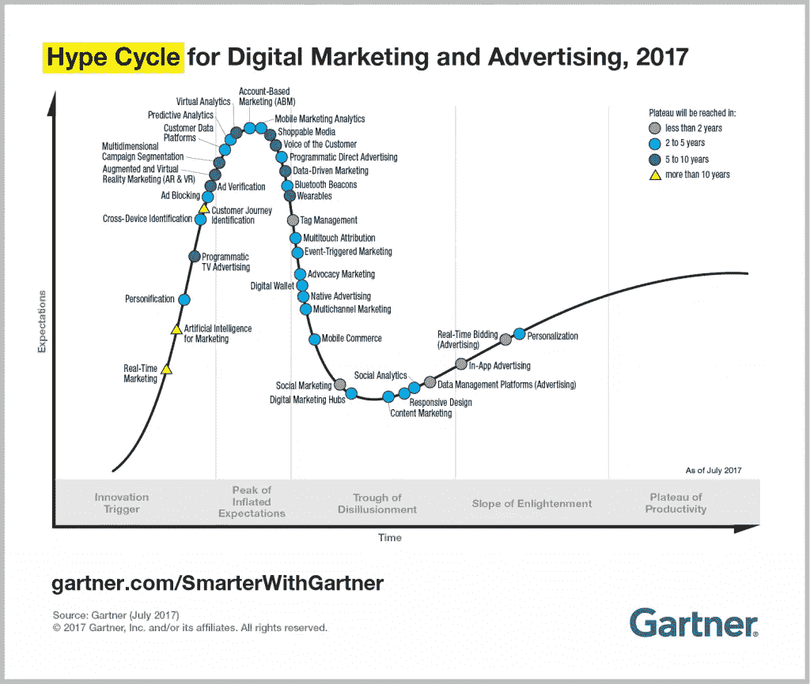

就像在之前[出现的过度宣传的营销渠道(电视广告、广告牌、横幅广告)一样，内容营销达到顶峰——随后暴跌。](http://andrewchen.co/the-law-of-shitty-clickthroughs/)

在少数早期采用者获得巨大成功后，越来越多的人加入了该党，直到新鲜感解体。

阻力已经形成，但至少对营销人员来说，期望还没有消退。他们抓得越紧，内容营销的效果就越差。

那么，我们该何去何从呢？

放弃不是一个选择。内容营销不能像那些其他明确定义的策略一样成为过去，因为围绕它的边界是如此的易变。

如果内容营销仅仅是有价值内容的战略性分发，那么它几乎涵盖了今天所有的营销。

它可以像以前一样强大。

但首先，我们需要了解它最近经历的变化，阻碍我们前进的障碍，以及如何克服它们。

我们不必把剧本扔掉，我们可以重写。

以下是方法。

# 少即是多

这是一个显而易见的问题:[我们淹没在内容中](https://blog.growthbot.org/how-we-are-getting-105k-people-to-use-our-chatbot)。

品牌创造了前所未有的利润，一项研究显示今年的利润比去年增长了 300%。

问题？消费者对信息技术的需求保持不变[。](https://www.forrester.com/playbook/The+Content+Marketing+Playbook+For+2018/-/E-PLA731)

*我们能消费、加工和分享的东西有限。*

我们仍然在同样的程度上欣赏伟大的内容，但是随着饱和度的增加，伟大的结果将会出现在数量相对较少的作品中。

但这还不是全部。

进一步的[分析](https://pages.beckon.com/rs/976-IET-418/images/Marketing-Truth-or-Marketing-Hype-Beckon-Report.pdf)显示，5%的品牌内容获得了 90%的消费者参与度。

快速搜索一下“**内容营销法**”就可以或多或少地确认这是一个普遍的情况:平均来说，20 篇文章中有 19 篇很少或根本没有受到关注。

或者，如果一个团队少生产了 **90%的内容**，他们仍然会取得**同样的结果**。

解决办法很简单。少发表。好好发表。只有当你有有价值的事情要说的时候才发表[。](/swlh/how-to-start-a-blog-in-the-most-cluttered-marketplace-in-history-ef50db328a09)

然后，将腾出的资源用于优化您已经拥有的常青树内容。

## 常青内容

*   **‘常青’**内容简单来说就是不会随着时间而失去价值的内容；它没有保质期。
*   **【时态】**内容只具有短期关联性。

两者都有自己的位置。时态内容通过短暂的兴趣峰值保持事物的新鲜感和活力。但正是常青的内容产生了那些可爱的 [**复合回报**](http://tomtunguz.com/content-marketing-compounding-returns/) ，使得内容营销首先变得有价值。

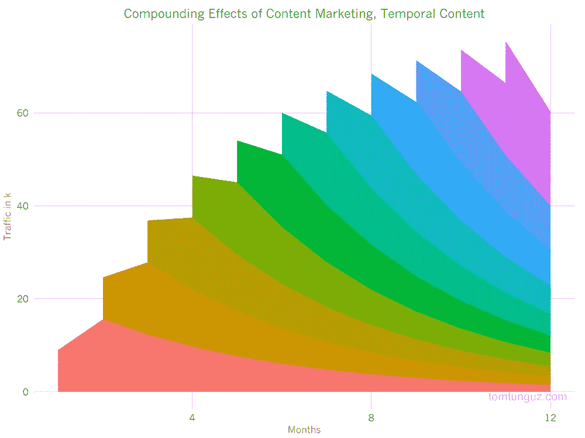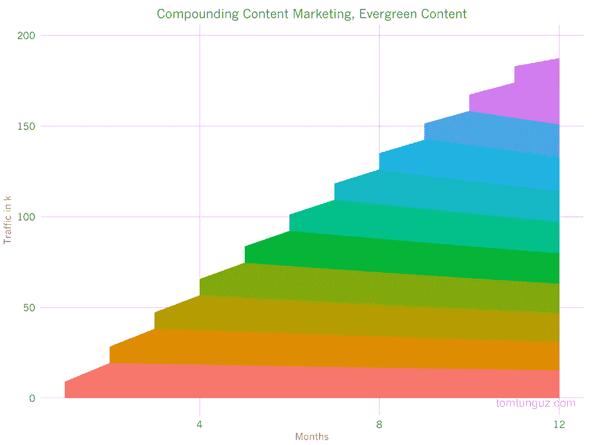

试图通过不断制造大量的时间内容来跟上我们快节奏的网络生活是很有诱惑力的。但是，依靠这些小小的兴趣爆发是 a)昂贵的，b)耗时的，c)不可持续的，以至于收益递减。

即使一个帖子最初得到了很多关注，研究表明 T2 的分享并不等同于链接。

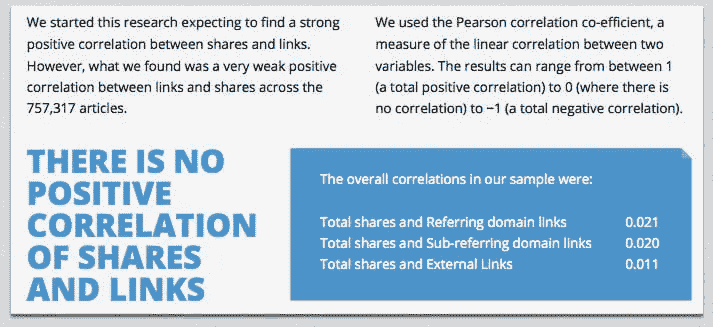

另一方面，Evergreen 内容一直被[证明](https://ahrefs.com/blog/evergreen-content/)可以用最少的努力带来最大的有机流量。

这不是一个非此即彼的问题；但是天平应该高度倾向于常青树而不是世俗树。

然而，常青的内容需要定期浇水，以保持健康。进入历史优化。

# 历史优化

[历史优化](https://blog.hubspot.com/customers/overcome-traffic-plateau-historical-optimization)是刷新“旧的”(即今天未发布的)内容以增加潜在客户和流量的做法。

它有助于:

*   高转化但低流量的内容；
*   高流量但低转化的内容；
*   和资源方面表现不佳的内容。

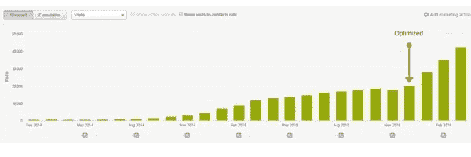

通过使用历史优化，你可以利用一个帖子已经拥有的权威和流量。

应更新内容以提高**准确性**、**新鲜度**和**全面性**。

有用的地方？**片头**、质量**文案**、**内部**和**外部链接**、**图片**、**元描述**和 **CTA** 。

您还可以向 [GrowthBot](https://growthbot.org) 询问您排名的**关键词**，并将其与类似组织排名的关键词进行比较。

然后，内容可以以全新的形式重新出现(与**发布日期**相匹配——谷歌[偏爱](https://neilpatel.com/blog/updating-old-content-to-boost-ranking/)新鲜内容)。

# 分配和重铺路面

内容的分发几乎和内容本身一样重要。

通过努力更新现有内容，你可以用更少的努力接触到相同(或更多)的观众，同时也减轻了员工不断推出新内容的压力。

这是一种帮助在线出版物的策略，比如《大西洋月刊》(T1)(其中超过 50%的月流量来自当月未出版的内容)显著提高了它们的读者群。

重新露面可以包括一切从**常青树点击**、**新翻新的故事**、**时间内容**已经发现新的相关性；或者仅仅是继续有用的信息或研究。

这一切都可以归结为经常被引用的内容营销成功的定义:

> 帮助合适的受众在合适的时间找到合适的内容。

通过与当前的内容氛围保持同步，你可以首先评估一个故事是否值得重新浮出水面(或写作)；如果有，如何最好地分配它。

但这不仅仅依赖于一个有根据的猜测。像 [GrowthBot](http://growthbot.org) 这样的智能自动化工具可以帮助你明确你的目标受众对什么感兴趣。试着问它某个话题有哪些热门故事，或者相关网站上哪些帖子被浏览次数最多。

另一个找到任何主题热门内容的好方法是使用 Ahrefs 的[内容浏览器](https://ahrefs.com/content-explorer)。

# 更智能的搜索引擎优化

如今，顶级分销渠道被少数大公司所控制:具体来说，就是 Alphabet 和脸书(以及它们拥有的所有人，包括谷歌和 Youtube)。

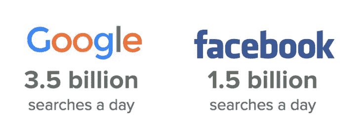

因此，我们基本上处于他们算法的支配之下，这些算法会不断变化，包括:

*   谷歌的算法正在更新，以支持某个主题上的“真正的专家”(而不是内容机器或支付学费的大学生文案)。
*   总的来说，搜索引擎(包括像亚马逊 Alexa 这样的技术)变得越来越复杂和精密——它们现在能够理解语义相关的概念。
*   [个性化搜索](https://www.link-assistant.com/news/personalized-search.html)让关键词排名变得不可预测，更难计算。
*   谷歌在搜索引擎结果页面显示[特色片段](https://support.google.com/webmasters/answer/6229325?hl=en)。
*   脸书更新了他们的有机 reach 新闻内容，目的也是一样的:防止用户浏览不同的网站。

这些变化代表了 SEO 传统功能的转变。

显然，第一步是确保你的内容足够吸引人和教育，不仅在搜索结果中排名靠前，而且吸引读者远离 SERP。

然而，这还不够。

# 主题集群

为了证明自己是“真正的专家”，你需要围绕某个主题准确、一致地创作内容，而不是针对某个关键词的一次性内容。

[主题集群](https://research.hubspot.com/topic-clusters-seo)被[誉为](https://coschedule.com/blog/topic-clusters/)搜索引擎优化和内容策略的未来，但却被广泛报道不足(所以现在是时候罢工了！)

主题群就是围绕一个“支柱”页面构建的一组相互链接的网页。

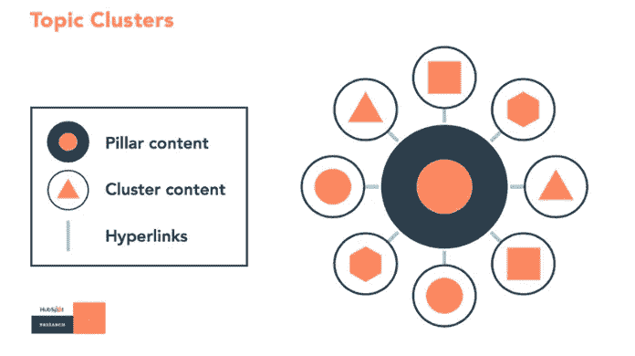

支柱页面和集群页面通过使用**相同的超链接关键字相互链接。**

当其中一个页面表现良好时，整个主题的排名就会提高，从而带来更多的访问者和积极的反馈循环流量和转化率。

这也将提高你的网站上类似内容的搜索排名，这甚至会导致你拥有某个关键词的多个 SERP 位置。

实现主题集群将阐明网站的组织和架构。它还鼓励更谨慎的发帖方式。

在过去，一个团队通常会因为兴趣或话题性而发帖。

通过主题集群，他们可以利用现有集群中的有机间隙作为战略起点。

# 特色片段

[精选片段](https://support.google.com/webmasters/answer/6229325?hl=en)是排名靠前的搜索结果，位于谷歌广告下方的方框中。简而言之，他们直接回答用户的问题。

不出所料，成为特色会带来更多的曝光率:[RKG·默克](http://www.rimmkaufman.com/)的本·古德塞尔[注意到](https://searchengineland.com/seo-featured-snippets-leads-big-gains-236212)来自有机游客的收入增加了 677%,点击率增加了 400%。

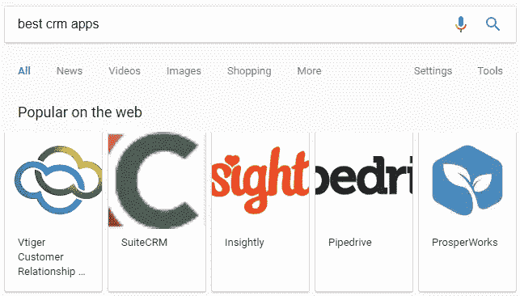

Ahrefs [报告称](https://ahrefs.com/blog/featured-snippets-study/)99.58%的特色页面已经排在谷歌的前 10 名，所以如果你的排名已经很高，你的机会就很大。

但是，正如这本令人敬畏的 Moz [指南](https://moz.com/blog/optimize-featured-snippets)中所概述的，有很多方法可以优化你的内容以增加其被精选的机会，包括:**关键词研究**、**页面 SEO** 、 **Twitter 监控**、**结构**、**格式化**和**图像**。

尝试回答许多类似的问题也很重要。

你也可以[寻找](https://www.saleshacker.com/sales-trends-predictions-2018/#Trend2)已经被另一家公司拥有的**相关的现有片段**并尝试获得提及。

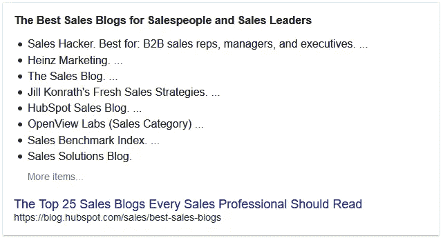

另一个方便的功能是**“人们也问**”小工具，它可以让你深入了解谷歌链接在一起的内容。通过探索这一点，您可以发现尚未开发的内容机会，并为未来制定战略。

# 脸谱网

通过结合 PPC 和推荐算法，脸书已经把数字广告价值链颠倒过来。

正如 Buffer 的[报告](https://blog.bufferapp.com/facebook-algorithm)中所概述的，脸书的新算法依赖于三种主动交互:**评论**、**分享**和**反应**。

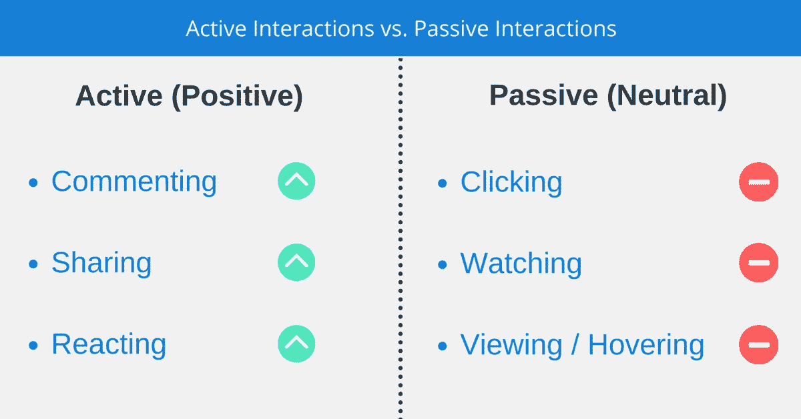

[新闻供稿负责人亚当·莫塞里解释](https://www.facebook.com/business/news/news-feed-fyi-bringing-people-closer-together):

> "引起人们之间对话的页面帖子在新闻提要中会显示得更高."

但品牌不能发布“引诱”顾客评论、分享或反应的内容；这将导致您在新闻源上的内容降级。

交往需要基于真正的兴趣，而不仅仅是消费。

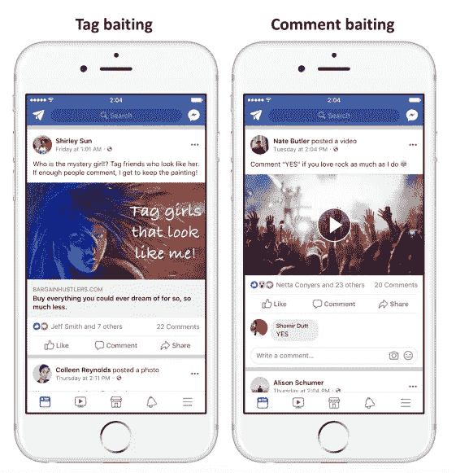

该算法还同等重视私下和公开分享的帖子。

对于大多数品牌来说，来自脸书的接触和推荐流量将继续减少；因此，或许有必要重新评估对脸书的投资和资源。

没有灵丹妙药——内容需要真实、有意义(并且通常受情感驱动)才能成功。

Buffer 的 Brian Peters [总结了](https://blog.bufferapp.com/facebook-algorithm):

> “我们需要开始为人们创造内容，而不是为你的品牌创造人们互动的内容，这将激发足够的情感，产生评论或分享。”

# 打破我们的常规

最后一个障碍是我们对同样的、陈旧的方法的依赖；过去奏效的策略不一定会继续奏效。

这就是为什么用不同的渠道和收购策略不断试验、测试和迭代是很重要的。

这将帮助你建立一个经验组合，如果你的核心战略开始失去牵引力或不起作用，你可以依靠它。

这也有助于挖掘新的受众或深入挖掘目标受众的兴趣。

这里有一些方法可以试试。

## 对话营销

对话式营销意味着与客户或潜在客户进行实时的一对一对话。

根据最近的一项[研究](https://techcrunch.com/2016/09/12/twilio-study-most-consumers-now-want-to-use-messaging-to-interact-with-businesses/)，90%的消费者希望使用信息与企业沟通。像[漂移](http://drift.com/)和[对讲机](https://www.intercom.com/)这样的平台使得这些对话的扩展成为可能。

这标志着内容营销分发方式的改变，使客户在正确的时间收到正确的内容的前景成为现实，也就是说，当他们刚刚向你提出要求时。

Avochato 的首席执行官亚历克斯·德·西蒙尼解释道:

> “让营销人员能够定制谁会看到信息的机器学习技术开始决定对话的内容。
> 
> 从传统内容营销到机器媒介对话营销的转变将改变营销人员的运营方式，使他们能够大规模提供更好的内容。"

## 视频营销

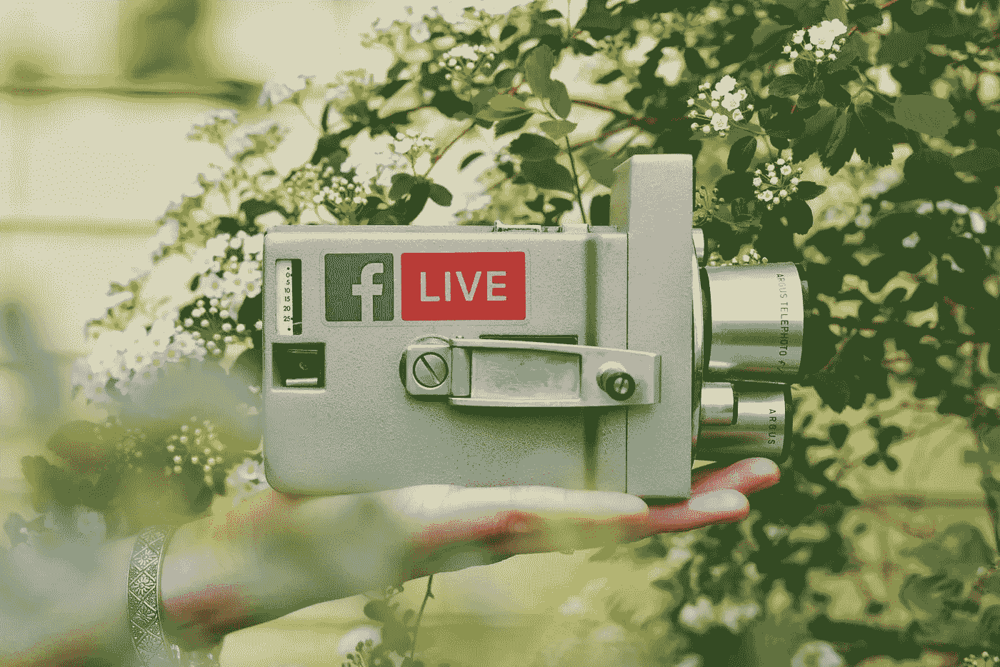

专家们[相信](https://www.forbes.com/forbes/welcome/?toURL=https://www.forbes.com/sites/forbesagencycouncil/2017/02/03/video-marketing-the-future-of-content-marketing/&refURL=https://www.google.co.uk/&referrer=https://www.google.co.uk/)视频，增长最快、需求最大的渠道之一，是未来的内容营销平台。

在一个越来越自动化的世界里，视频成为最后一个不可伪造的交流渠道。

不同意？以下是数字:

*   预计到 2019 年，视频将占据全部网络流量的 80%以上。
*   [90%](http://www.insightmrktg.com/2017/02/27/why-video-is-important/) 的顾客表示，产品视频有助于他们做出购买决定。
*   数字营销专家[詹姆斯·麦克奎维](http://blogs.forrester.com/james_mcquivey)估计，一分钟的视频内容相当于[180 万字](http://www.marketwired.com/press-release/a-minute-of-video-is-worth-18-million-words-according-to-forrester-research-1900666.htm)。

像 [Simpleshow](http://simpleshow.com/uk-en/about-us/) 和 [GoAnimate](https://goanimate.com) 这样的网站是一个很好的起点。

视频营销很强大，因为它是视觉和听觉的，比基于文本的内容更容易让用户记住。当客户记住你的视频时，他们也会记住你的品牌。

## 新兴技术

[新兴技术](https://blog.growthbot.org/can-technology-save-us-from-technology)预计将在未来两年成为主流，其广泛的可用性将为营销人员创造机会[优化他们的内容](https://blog.growthbot.org/why-chatbots-will-change-marketing-as-we-know-it)。

到 2021 年，重新设计网站以支持视觉和语音搜索的早期采用者品牌将使数字商务收入增加 30%。

专家预测，到 2020 年，AR/VR 将积累[1500 亿美元的收入](http://fortune.com/2015/04/25/augmented-reality-virtual-reality/)，这表明视觉内容的制作将从“不错的东西”变成“必须的东西”。

虽然对大多数人来说，虚拟现实仍然代表着未开发的领域，但它的兴起可以提醒人们继续尝试视觉内容，如互动图形、【图像】和【视频】和【应用】。

正如 Ginny Mineo 完美总结的那样，你应该:

> "重新调整您在复合、循环和实验内容频道之间的策略."

未来成功的内容营销者将从过去学习，并迅速适应现在。

内容营销可以依靠更聪明的研究和[新兴技术](https://blog.growthbot.org/the-samantha-effect-a-closer-look-into-the-future-of-bots)驱动的选择性、更高质量的内容来实现自我转变。

感谢阅读。

> 如果你喜欢这篇文章，请随意点击那个按钮👏帮助其他人找到它。

【blog.growthbot.org】最初发表于**。**