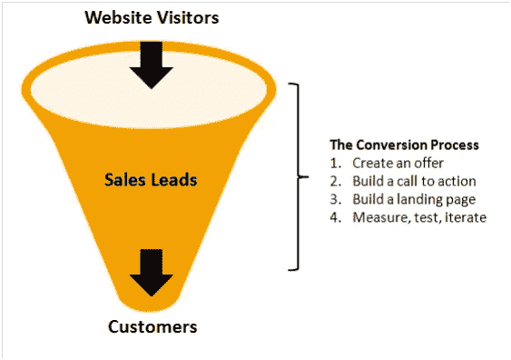

# 8.了解在线销售漏斗——30 天的媒介

> 原文：<https://medium.com/swlh/8-understanding-the-online-sales-funnel-30-days-of-medium-a8a6e96ddde4>

欢迎回到 30 天中等

在这篇文章中，我将**谈论在线销售漏斗，以及**了解它对**如何至关重要**到**在线成功**。

如果你错过了我的中等挑战的前 7 天，你可以补上:

## [0。30 天的培养基](/swlh/30-days-of-medium-c7ab34953c6c)

## [1。建立自己的网站需要什么？— 30 天中值](/swlh/1-what-do-you-need-to-build-your-own-website-30-days-of-medium-1ed1ad4e505c)

## [2。如何找到你热爱的事业——30 天的媒介](/swlh/2-how-to-find-a-business-you-love-30-days-of-medium-cb7a4a702d1b)

## [3。如何建立自己的网站—媒体 30 天](/swlh/3-how-to-build-your-own-website-30-days-of-medium-587f994672ec)

## [4。如何衡量你网站的表现——30 天媒体](/swlh/4-how-to-measure-your-websites-performance-30-days-of-medium-75e650969695)

## [5。如何通过回答他们的问题获得更多的客户-30 天的媒介](/swlh/5-how-to-get-more-customers-by-answering-their-questions-30-days-of-medium-b462d237533e)

## 6。成功的商业网站备忘单——30 天的媒介

## 7。如何衡量成功——30 天介质

## 8。了解在线销售漏斗——30 天媒介

## 9。什么是流量，为什么流量很重要？— 30 天的培养基

## 10。什么是 Google URL Builder，为什么要使用它？— 30 天的培养基

## [11。通过自动化您的社交媒体日程，让您的流量翻倍——30 天中等](/swlh/11-double-your-traffic-by-automating-your-social-media-schedule-30-days-of-medium-ac9aa74f7927)

## [12。如何辨别什么好卖— 30 天介质](/swlh/12-how-to-tell-what-sells-30-days-of-medium-ba3291d029d2)

## [13。我如何在 6，500% — 30 天的培养基中培养我的培养基](/swlh/13-how-i-grew-my-medium-following-6500-30-days-of-medium-c9d2d6f80b51)

## [14。你如何看待事情很重要——30 天中期](/swlh/14-how-you-look-at-things-matters-30-days-of-medium-f641b9733b90)

## [15。如何向小型企业销售服务— 30 天中等](/swlh/15-how-to-sell-services-to-small-businesses-30-days-of-medium-d6604c63b3b7)

## [16。如何通过有效的提案赢得更多交易— 30 天的媒介](/swlh/16-how-to-win-more-deals-with-effective-proposals-30-days-of-medium-481f16bbc86f)

## 17。如何在 10 分钟内建立一个网上商店——30 天的媒介

## [18。如何在任何地方工作— 30 天介质](/swlh/18-how-to-work-from-anywhere-30-days-of-medium-1c9cfa2d662f)

## [19。为什么你的网站会破坏你的销售——30 天媒体](/swlh/19-is-your-website-sabotaging-your-sales-30-days-of-medium-f63bdbdb350)

## [二十。你的流量从哪里来？— 30 天中值](/swlh/20-where-does-your-traffic-come-from-30-days-of-medium-a9b2d2c088bb)

## [21。如何真正识别倦怠——30 天中等水平](/swlh/21-how-to-actually-recognise-burnout-30-days-of-medium-7972a7a7a89e)

## [22。如何修改你的时间表并完成两倍的工作——30 天中等时间](/swlh/how-to-hack-your-schedule-and-get-twice-as-much-done-30-days-of-medium-441a509dc9be)

## [23。不要模仿你的竞争对手——30 天的媒介](/swlh/23-dont-copy-your-competitors-30-days-of-medium-56382b7ba8ed)

## 24。如何 SEO 优化一篇博文——30 天的媒介

## 25。独特或被遗忘——30 天的媒介

## 26。跟着感觉走——30 天中等水平

## 27。人们不支付平均 30 天的中等费用

## 28。如何做关键词研究— 30 天介质

## [29。为什么帕累托原则是世界上最大的诀窍——30 天中期](/swlh/29-why-the-pareto-principle-is-the-worlds-biggest-hack-30-days-of-medium-1c225f5c8aa1)

## 三十岁。你的内容比你的电话更有利可图——30 天的媒介

# 线上销售漏斗是什么？

**在线销售漏斗**是对**在线营销如何运作的简单**表现**。**

# 为什么了解在线销售漏斗的工作原理很重要？

如此多的人对在线营销失去兴趣，并放弃尝试在线发展的原因是他们采取了分散的方式。

# 分散枪方法

**散弹枪方法**有点像这样。

“嘿，吉姆，我们需要一个网站！”

“哦，真的，为什么？”

“因为我们做得很好！连**福布斯**都这么说！我们不能错过这个大好机会。我们也需要在社交媒体上。我们应该雇人替我们发微博，更新我们的脸书！

“嗯，我想是的。我是说我们确定吗？”

“没有，但是我们需要做点什么！”

你觉得这会有什么结果？

# 在线销售漏斗方法

这涉及到运用**常识**和一点**独立思考**。

看起来有点像这样。

1.  我们的目标是什么？
2.  我们将如何实现这一目标？
3.  哪些渠道最能帮助我们做到这一点？
4.  我们将如何衡量这一点，并连接到我们的底线？
5.  我们的研究让我们相信我们应该做 X，Y 和 Z

# 剖析在线销售漏斗

这是我能找到的最简单的图像。

Image credit Business 2 Community

它是这样工作的:

1.  **驱动交通**
2.  **生成销售线索**
3.  **生成客户**

**简单吧？**

“这是一个数字游戏”这个说法和时间一样古老，永远不会改变。

你需要**关注你的业务**来产生**潜在买家**，然后他们成为**实际买家**。

**在线销售漏斗**简单展示了在线营销是如何运作的。

# 填补知识空白

小企业付钱给我帮助他们在网上发展的原因是我帮助他们填补知识空白。

很多小企业**已经知道这个东西**，他们只是不知道该拿它怎么办。

就像你付钱给你的会计师去报税一样，你已经知道这是游戏的名字，你只是不知道如何去做。如果你这样做了，他们就不会过这么好的生活，也不会花这么多年来学习他们的行业。

要在网上成长，你能做的最好的事情就是填补你的知识空白。

## [通过 **Hubspot 免费获得**入境认证**。**](https://academy.hubspot.com/certification)

说真的，Hubspot 提供的免费课程绝对令人难以置信，可以在几周内带你从零到英雄。不管他们的软件是否是小企业的翻版(有许多更便宜的选择)。

不管你给它贴上什么标签，也不管现在什么行业最热门，不管是 ClickFunnels、Hubspot、LeadPages、Shopify 还是 Drip。

**基本面保持不变。这些工具只是帮助你做你需要做的事情。**

你没有**在线成长**的原因是因为你有**知识缺口，不知道你的衡量标准，没有坚持把重点放在增量增长上，改善需要改善的领域。**

如果你没有时间学习网上营销和在线发展，那就把它外包给愿意为你做这件事的人。但是要确保你对它有足够的了解，以正确衡量你的投资回报。

希望你在这篇文章中发现了一些有价值的东西，请关注我的《30 天中等挑战》中的下一篇！

## 关于这个话题有什么问题吗？请在评论中告诉我。

## 你可能也喜欢这个:

## [为什么 WordPress 是在](/swlh/why-wordpress-is-the-best-platform-to-build-your-business-or-startup-website-on-df3fe932fad7)上建立业务或创业网站的最佳平台

## 如果你喜欢这个故事，请点击👏按钮并分享，帮助其他人找到它！欢迎在下方留言评论。

## 这个故事发表在 [The Startup](https://medium.com/swlh) 上，这是 Medium 最大的创业刊物，拥有 319，583+人关注。

## 在这里订阅接收[我们的头条新闻](http://growthsupply.com/the-startup-newsletter/)。

