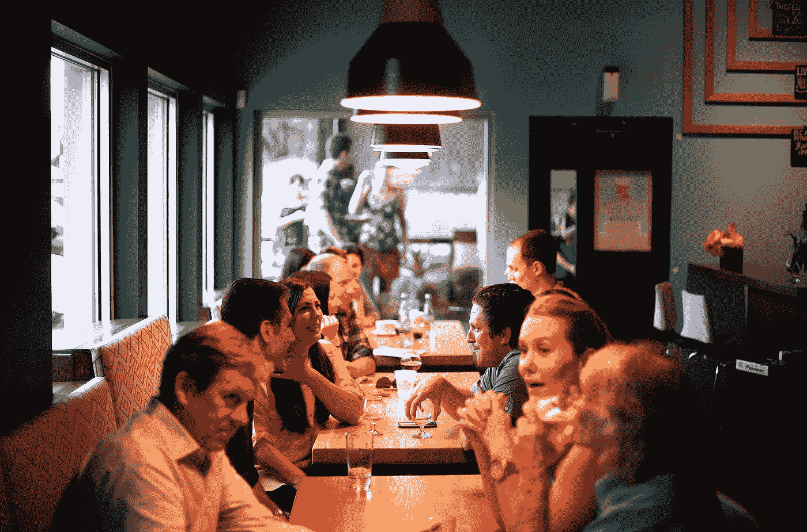
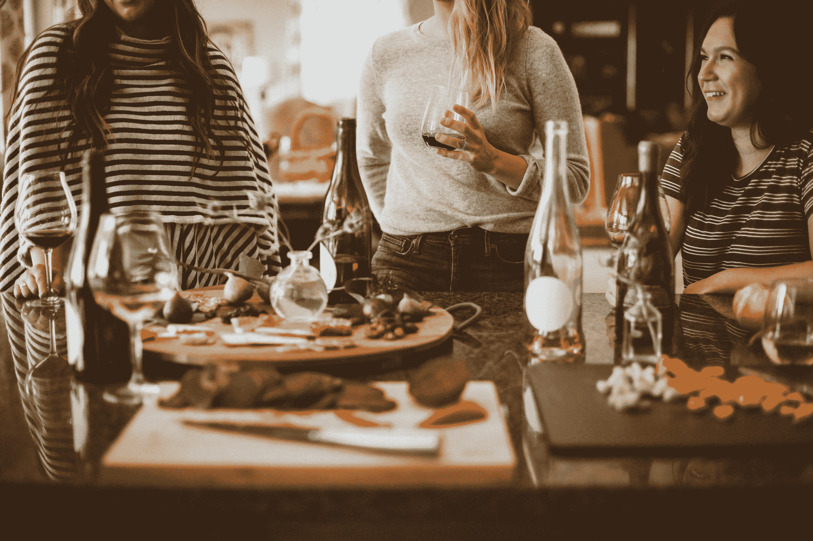
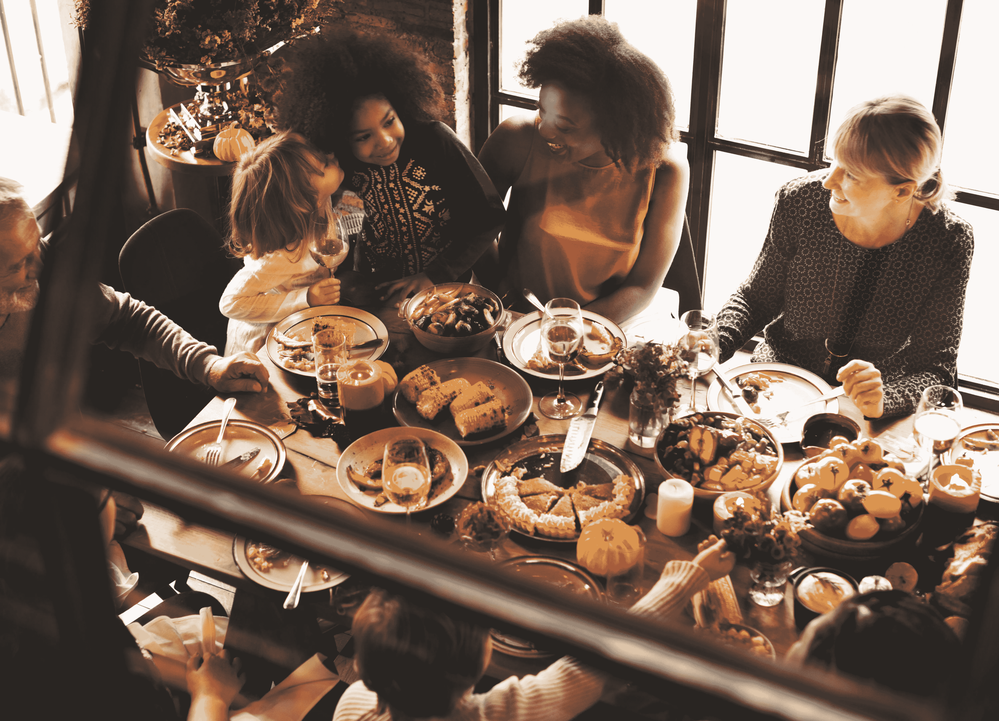

# 更好地应对假日事件的 8 种方法(治疗师)

> 原文：<https://medium.com/swlh/8-ways-to-cope-better-with-holiday-events-by-a-therapist-ff040556b0c3>

Photo: [Kevin Curtis](https://unsplash.com/@kcurtis113?utm_source=medium&utm_medium=referral)

## 如何照顾好自己，让事情变得更愉快

世界上的一些主要节日就要到了(其他的已经开始了)，让我们面对现实吧:

> 假期中有些部分是你害怕的

也许庆祝只是义务。

也许他们持续的时间太长了，你不喜欢和一些人在一起。

也许你不喜欢社交聚会，或者你太累了，不想去。

或者也许你只是没有感受到你应该感受到的。 (谁没有过那种经历？)

这是我写的两篇关于这个主题的文章，它们仍然和我写的时候一样有用。(毕竟，人性不会变——节日事件也不会变。)为什么不看一看呢？

Click to read “[7 Coping Strategies for the Holidays (and Other Days)](https://findyourbetterlife.com/7-coping-strategies-for-the-holidays-and-other-days-8ce68bb1f8e?source=friends_link&sk=b3a30c603d2d74b34e78c21820685aec)”

你比你想象的更自由；你只需要知道该做什么。你可以给自己留点时间——用正确的方式。你可以暂时离开这个活动。你甚至可以决定不去。阅读这篇文章，了解这些想法和更多。

Click to read “[The ‘It’s a Wonderful Life’ technique for feeling that you belong](https://findyourbetterlife.com/the-its-a-wonderful-life-technique-for-lifting-your-spirits-by-a-therapist-69805492d6ca?source=friends_link&sk=025d4adcacbde39babbad509b56f1ac2)”

你在参加一个节日活动，除了你，每个人都充满了节日气氛。你就是不觉得快乐，*诚*快乐。通过使用一种叫做*关系心理减法*的技术，你可以在你所在的地方感受到真正的温暖。

你应该好好照顾自己。在这个节日里，你值得快乐。读完这些文章，你就上路了。

*亲爱的读者，媒介的决定允许 1 比 50👏🏽s 疯了。所以我认为鼓掌是 1 到 5 颗星的评级，10 次鼓掌= 1 颗星。*

我会为我读到的文章鼓掌 10 次或 20 次。完全不鼓掌感觉很糟糕。

请帮我一把。它帮助我接触到更多像你一样的人。谢谢！

## 这篇文章发表在 [The Startup](https://medium.com/swlh) 上，这是 Medium 最大的创业刊物，拥有+401，714 名读者。

## 在这里订阅接收[我们的头条新闻](http://growthsupply.com/the-startup-newsletter/)。

