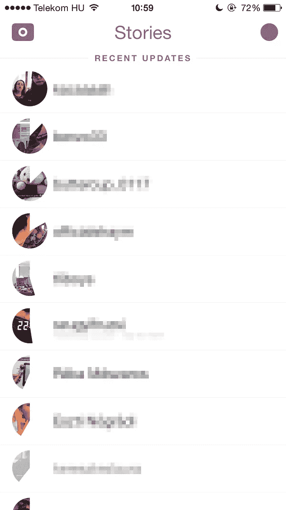
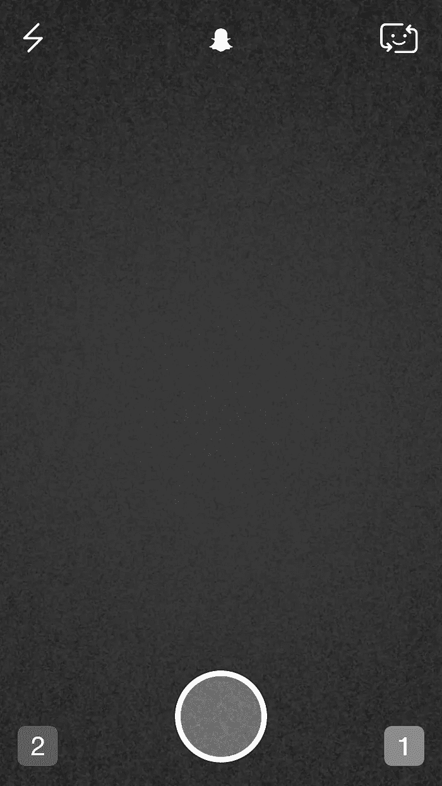
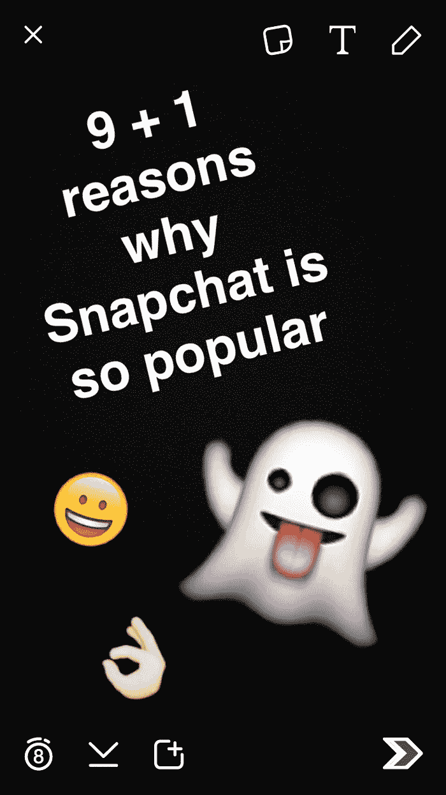
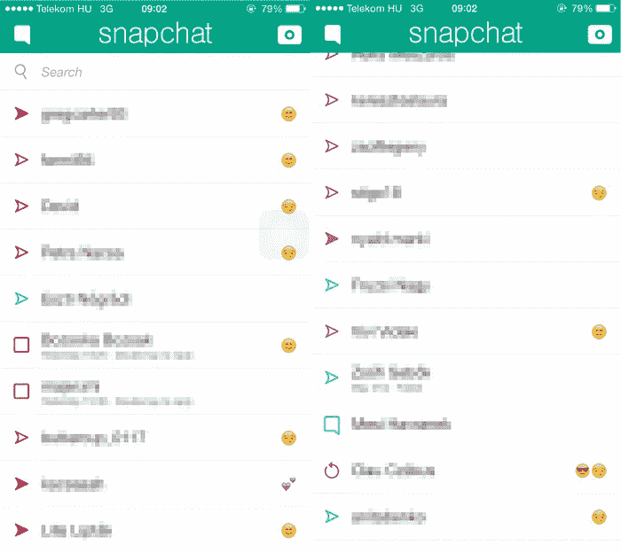
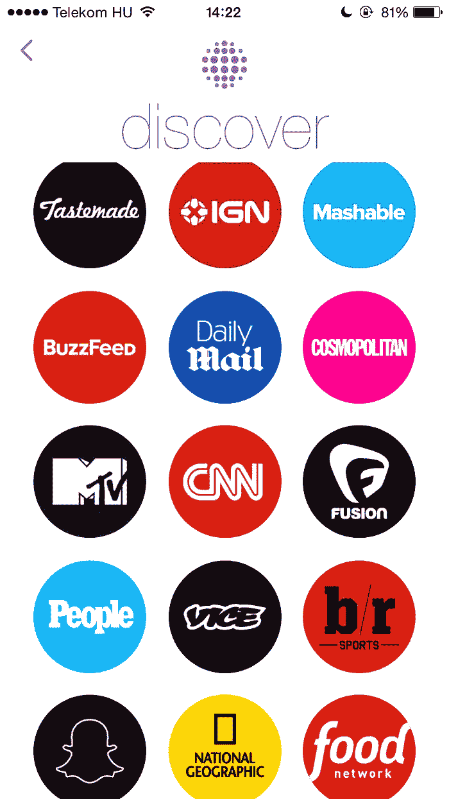
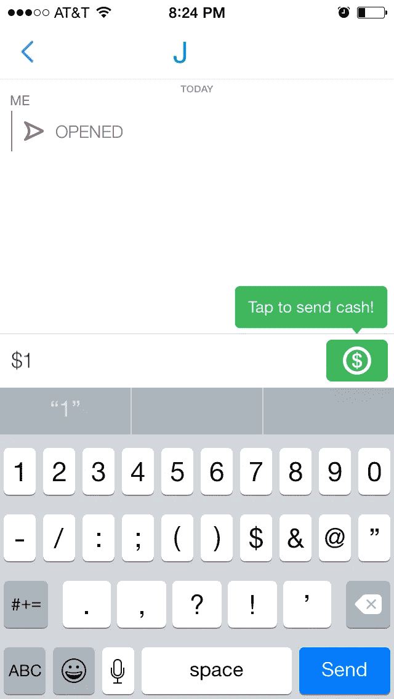

# Snapchat 如此受欢迎的 9 + 1 个原因

> 原文：<https://medium.com/swlh/9-1-reasons-why-snapchat-is-so-popular-6d489f514b17>

Snapchat 拥有超过 1 亿的日活跃用户和每天发送 4 亿张照片的 T2，是青少年中使用频率第三高的社交媒体应用(仅次于脸书和 Instagram)。

## **为什么这么受欢迎？**

我们生活在自拍的时代:每天都有数百万人给自己拍照。因为我们是人类，我们喜欢社交和分享彼此的生活。

问题是社会只看重美图，但人也喜欢鬼混(很多)。如果你可以发送照片给你的好友，但他们只能看到几秒钟，会怎么样？它不会永远存在他们的手机里(我们都知道，真正的朋友手机里有他们朋友最丑的照片)。

> “Snapchat 不是为了捕捉传统的柯达瞬间。这是通过 Snapchat 的第一篇博客文章[与人类情感的全方位交流——而不仅仅是那些看起来漂亮或完美的东西。](http://blog.snapchat.com/post/22756675666/lets-chat)

## **1。基本特征**

一旦你拍了照片，你就会看到这个屏幕。它被设计成完全**透明**，所以按钮不会分散用户的注意力:照片的每个部分都可以看到(应用程序完全*全屏*，你看不到状态栏)。

如果一个新用户刚刚加入，她没有必要看教程，因为按钮是如此不言而喻(删除，新层为 [*表情符号*](http://emojipedia.org/) 、文本、抽奖、时限、下载、我的故事和发送)。

Snapchat 最崇拜的特性显然是时间的限制。对一个 5 岁的孩子来说，设定时间限制也很容易。这些设置只有在你点击它们的时候才会出现，它还会记住你最近的设置，所以如果你喜欢 4 秒的限制，你的每个快照都会默认有这个长度。这是一个非常酷的元素，因为人们总是很匆忙，当一些事情(主要与技术有关)花费的时间超过一秒钟时，他们会变得非常恼火。

> **事实:**只有 12%的快照与不止一个接收者共享。

## **2。我的故事**

安吉是一个十几岁的女孩，她喜欢和朋友出去玩。当然，她也想和其他人分享她的经历，但她不想一个一个地检查每一个收件人，这很烦人。

我的故事就是为了这个！

这项功能从一开始就没有，Snapchat 在 2013 年的 6.0 更新中添加了这项功能。

在主屏幕上向左滑动可以让我们进入故事页面。你有两个部分:你还没看过的故事(**最近更新**)和你已经看过的故事(**所有故事**)，都是按时间顺序排列的。这个页面有一个干净的结构，带有朋友用户名的小预览图标。您只需点击它们，快照就会从最早到最新显示出来。

> **事实:**每天有 10 亿篇报道被浏览。

## **3。过滤器**

过滤器在社交媒体用户中非常受欢迎。Instagram 有自己的过滤器阵列，脸书也实现了过滤选项，Snapchat 也做了同样的事情。

关键是 Snapchat 提供了最简单的方法来给你的照片添加滤镜。你所要做的就是开始滑动，并为你的图片选择最合适的滤镜。

除了基本的，还有几个基于位置服务的过滤器(如温度，速度，地理过滤器等。).这些可以组合，通过额外的滑动，你也可以混合它们。

地理过滤器使用起来很有趣，有很多可供用户选择。你试过了吗？

附加过滤器(如速度和时间)的唯一问题是你不能改变它的位置。很难确定显示的内容是否符合过滤器。

> 事实:你可以向 Snapchat 团队提交你自己的地理过滤器。

## **4。前置闪光灯**

好的，那么… *Angie* 睡不着，她晚上很无聊，所以她想给她的朋友发一些有趣的照片。糟糕的是什么也看不见，因为她的房间完全是黑暗的。

解决办法？Snapchat 的前置闪光灯！

如果你打开这个功能，你唯一要做的就是像平时一样拍照。

Snapchat 会在拍照前将屏幕变成白色，就像一个质量不太好的闪光灯。

它通常会完成它的工作。当然不会像专业手电筒那样，但对于一个免费的社交媒体应用程序来说，这是非常迷人的。

> **事实:** Snapchat 价值 160 亿美元。

## **5。带图层的表情符号**

表情符号在智能手机用户中变得越来越重要，因为它们可以非常准确地表达情感。

但是发个图还不够怎么办？如果你想评论什么或者解释图片怎么办？
创建文本层从未如此简单。你可以编辑它，添加你自己的表情符号等等。

但是如果要分开安排呢？这是一个相当大的问题，但 9.14.0 版本解决了它:现在你可以通过新的图层按钮添加无限数量的表情符号。

> **事实:**18-29 岁的用户每天花 20 分钟在 Snapchat 上。

## **6。回放和截图**

还有什么比你的朋友不能保存你的照片更好的呢？答案是:你的朋友能够保存你的快照。

显然，这一切都是在你知道的情况下完成的(除非你的朋友是个技术人员)。

每个动作在朋友旁边都有自己的图标，所以你会知道他们是否截图、重播你的视频、给你写了什么或只是看了快照。

其中一些图标非常容易理解，所以每个人都知道它们的意思。然而，Snapchat 缺少一个在名字旁边解释表情符号含义的部分。(对于感兴趣的人，这里的解释是[这里是](http://emojipedia.org/snapchat/)。)

> **事实** : 45%的用户年龄在 18 到 24 岁之间

## **7。快照代码**

自从二维码出现在智能手机世界，越来越多的应用程序以不同的方式实现它们。

Snapchat 通过创建 snapcodes 以自己的方式利用了这一点。每个 Snapchat 用户都有一个带有个人模式的 snapcode。

如果你想添加一个朋友，而他就在你旁边，你所要做的就是把你的 Snapchat 相机放在朋友的 snapcode 上，瞧！

Snapchat 甚至可以在 ghost 中插入你自己的图像或视频。那你可以和那个一起分享。

这很简单，也很有创意。他们没有发明任何新的东西，他们只是修改了现有的解决方案。

> 事实:65%的日常用户每天都会上传内容。(剩下的用户只是查看别人的快照。)

## **8。发现**

Snapchat 不久前推出了 discover、live 和广告功能。

他们有他们自己的广告哲学，事实上，这是非常迷人的。他们认为，重要的不是数量，而是质量。用“无用”的广告淹没用户是没有意义的。对给定内容感兴趣的人会观看广告。

通过在故事部分引入发现功能，Snapchat 使人们可以查看他们感兴趣的新闻。这些内容每天都会更新(24 小时规则，也适用于我的故事)。根据 [Snapchat](http://blog.snapchat.com/post/109302961090/introducing-discover) :

> *“今天的新闻就是明天的历史”*

> **事实** : 1%的营销人员使用 Snapchat。

## **9。隐藏功能**

不幸的是，Snapchat 没有*嘿，你知道我们有很多你应该知道的功能*部分。

你可以用独特的颜色画画，有更长的文字等等。很遗憾，他们没有适当地推广这些功能。(嘿 Snapchat 团队，如果你正在读这篇文章，请考虑一下。)

更重要的是，他们推出了 Snapcash。只需轻敲几下，您就可以轻松地将钱汇给朋友。
该功能无缝内置于 Snapchat 设计中，易于理解和利用。
牛逼吧？

> **事实**:大约 70%的 Snapchat 用户是女性。

## **+1。附加应用程序**

创建一个病毒式的应用程序总是会引起其他开发者的注意。

*Angie* 想截图，但不想让朋友知道是她拍的。幸运的是，这也有一个应用程序。

她有一张几天前拍的照片，但她想通过 Snapchat 发给她的朋友。这也有一个应用程序。

这些应用程序不是由 Snapchat 开发和认可的，而是由第三方开发者开发和认可的。在下载这些应用程序之前，请考虑这样一个事实:你把有趣的部分从 *Snapchatting 中去掉了。*

> **事实**:自从你开始阅读这篇文章以来，大约有 2221920 张照片被分享。

*您有什么想法或反馈吗？和我们讨论一下。
如果你喜欢这篇文章，如果你在*[*Twitter*](https://twitter.com/meli_berki)*上推荐或分享它，那对我来说就是全世界。*

(ps。感谢 [DMR](http://expandedramblings.com/index.php/snapchat-statistics/) 的可怕事实。)

*发表于* **创业、旅游癖和生活黑客**

-