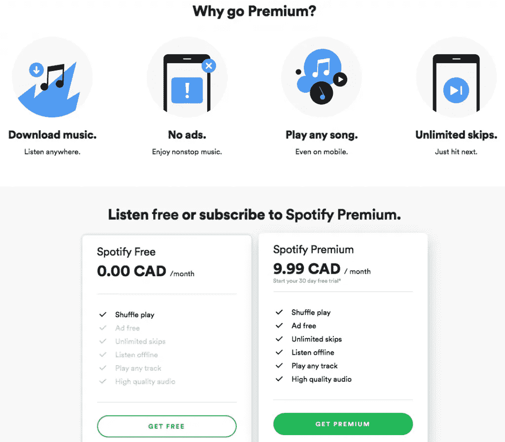
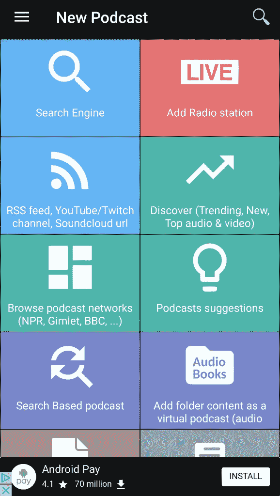
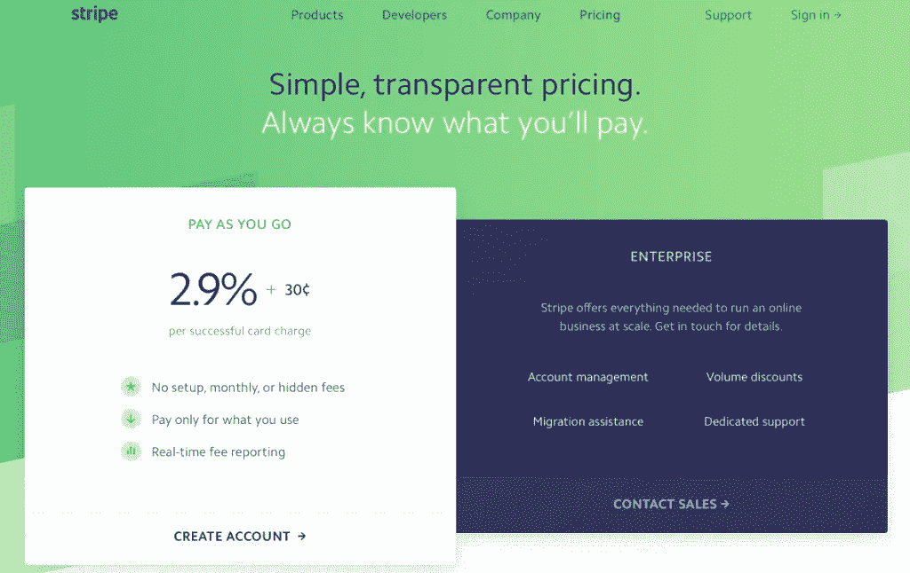
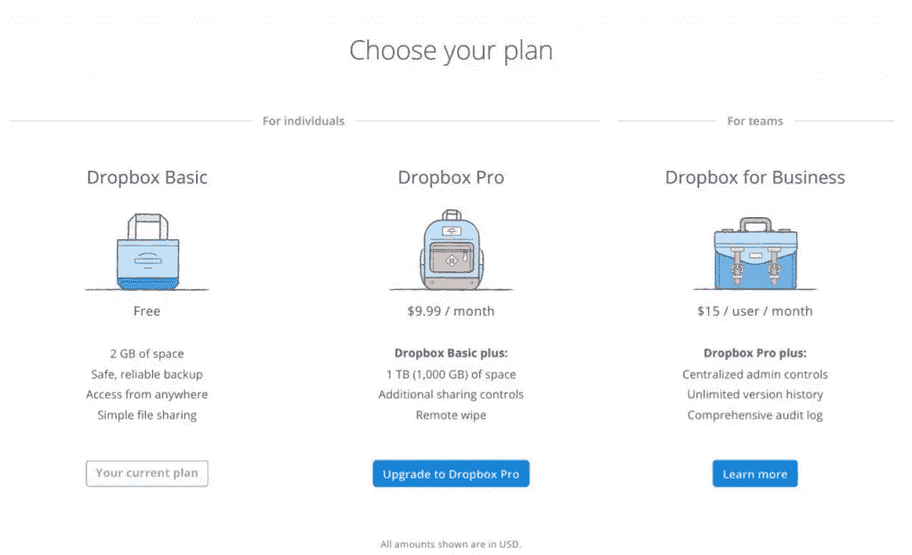
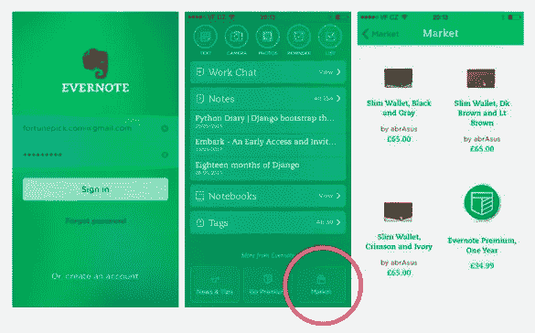
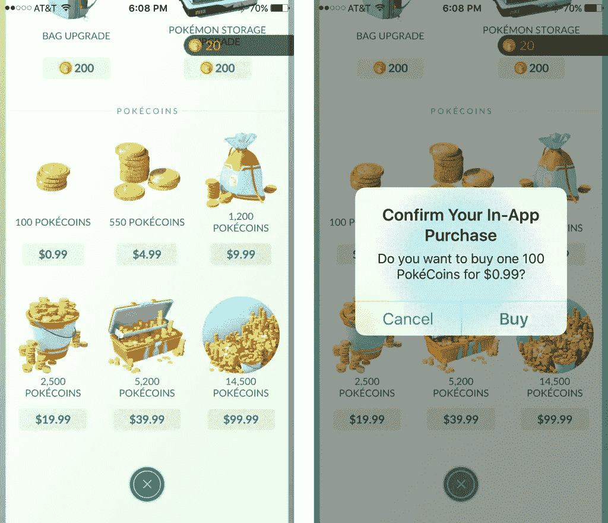
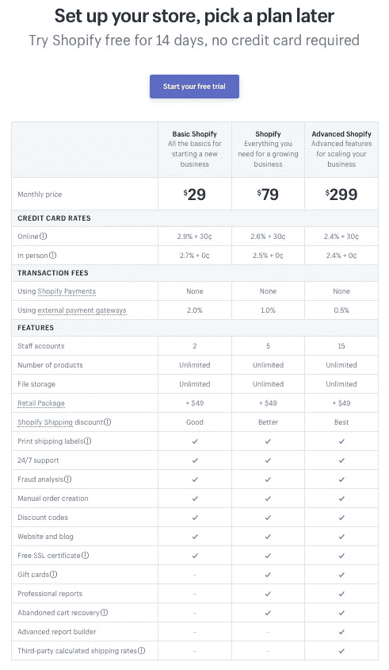
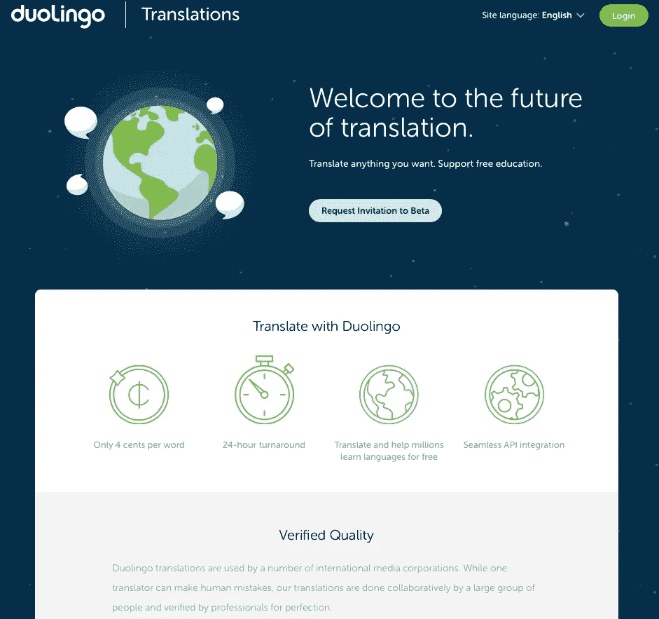

# 9 个应用程序盈利策略:如何选择正确的商业模式

> 原文：<https://medium.com/swlh/9-app-monetization-strategies-how-to-pick-the-right-business-model-fbd954aca7a>

Originally published on [http://www.appsterhq.com](http://www.appsterhq.com/?utm_source=CP&utm_medium=Medium)

货币化是企业运营的核心。

如果流入企业的资金量最终没有超过流出企业的资金量(这种状态被称为“[正现金流](http://www.investopedia.com/terms/c/cashflow.asp)”)，那么企业[将最终破产](http://www.appsterhq.com/blog/costly-mistakes-avoid-first-time-entrepreneur)。

S 同样，如果获得一个新客户所花费的金额(即“[客户获得成本](https://blog.kissmetrics.com/customer-acquisition-cost/)”)经常低于这个新客户给你的企业带来的价值(即“[客户终身价值](https://blog.kissmetrics.com/how-to-calculate-lifetime-value/)”)，那么你的初创企业将无法在未来很长时间内继续运营。

一个收入模型可以被描述为一个“企业如何赚取收入，产生利润并产生高于平均水平的投资回报”的框架。

换句话说，应用收入模型概括了两个基本问题的答案:

1.  会提供什么样的价值？对谁？价格是多少
2.  将寻求什么样的收入来源？

而收入模式是(更大更全面)[商业模式](http://www.appsterhq.com/blog/start-ups-business-plans-lean-canvases-pivots)的一个组成部分。

现在，让我们来考虑 9 种不同的收入模式，通过这些模式，你可以将你的应用货币化，最终发展你的业务。

# 1.广告

当广告拦截应用[顶级应用商店](http://uk.businessinsider.com/ad-blocking-apps-top-the-app-store-2015-9/?IR=T)和全世界都在讨论广告作为可持续收入模式的未来时，**在线广告**规模*巨大*并且稳步增长:

*   2016 年，美国互联网广告收入同比增长 22%，达到创纪录的 725 亿美元(首次超过电视广告支出 690 亿美元)([来源](http://www.businessinsider.com/online-ads-revenues-going-to-google-and-facebook-the-most-2017-4))
*   美国数字广告预计将在 2017 年达到 830 亿美元
*   预计 2017 年全球互联网广告支出将超过 2000 亿美元([来源](https://www.zenithmedia.com/internet-advertising-expenditure-to-exceed-us200bn-this-year/)

在线广告可以作为你的应用程序的核心收入模式之一。

实施在线广告有多种方式:

*   您可以在您的 iOS/Android 应用程序本身或您公司的网站上显示第三方广告；
*   你可以在脸书、谷歌、LinkedIn 或 Twitter 上建立自己的广告网络；
*   如果你像易贝或 Craigslist 一样经营市场，你可以收取刊登费；和/或
*   你可以列出分类广告，比如工作列表(类似于像 [Stack Overflow](https://stackoverflow.com/) 和 [Angel List](http://www.appsterhq.com/Applications/Microsoft%20Office%202011/Microsoft%20Word.app/Contents/angellist%20canada) 这样的网站)

使用基于广告的收入模式的关键缺点是，大多数用户 ***真的*不喜欢广告**——无论他们是 iOS、Android 还是任何其他设备运营商(证据: [1](https://research.hubspot.com/reports/why-people-block-ads-and-what-it-means-for-marketers-and-advertisers) 、 [2](http://www.businessinsider.com/smartphone-users-have-spoken-and-theyre-annoyed-by-these-mobile-ads-2016-6) 、 [3](https://www.vieodesign.com/blog/new-data-why-people-hate-ads) )。

当用户遇到广告时，他们通常会感到沮丧或烦恼，尤其是当一家公司在早期就开始使用广告时。这适用于弹出广告、间隙广告和原生广告。

因此，如果你过于频繁和/或过早地用过多的广告轰炸你的用户，你可能会损害你的采用率和/或客户保持率。

此外，如果你的收入模式完全建立在广告收入的基础上，那么你自然会为了获得更多的广告收入而牺牲越来越多的用户体验。

结合了 T21 广告和其他收入模式的创业公司——比如 Spotify 的优质服务，如下图所示——往往比那些完全依赖广告收入的公司发展得更好。

(image [source](https://www.spotify.com/ca-en/premium/))

# 2.联盟营销和线索生成

你应该考虑采用的第二种盈利策略是联盟营销和销售线索挖掘。

Smart Passive Income 的帕特·弗林(Pat Flynn)对“[联盟营销](https://www.smartpassiveincome.com/affiliate-marketing-strategies/)”做了如下有益的描述:

*“联盟营销是通过推广他人(或公司)的产品来赚取佣金的过程。你找到一个你喜欢的产品，把它推销给其他人，并从每笔销售中获得一份利润。*

*   *你很高兴，因为你获得了佣金。*
*   该公司很高兴，因为他们从一个客户那里获得了一笔新的销售，而这个客户可能是他们平时无法接触到的。
*   *顾客很高兴，因为他们从你那里了解到一种有望满足需求或愿望的产品。”*

P 实际上，当用户通过点击你网站或应用程序中的链接下载和/或购买产品或服务时，联盟营销通常会赚取佣金。

[Podcast Addict](https://play.google.com/store/apps/details?id=com.bambuna.podcastaddict&hl=en) 通过在其屏幕底部放置广告来使用联盟营销(在这种情况下，是 Android Pay 的广告):

你可以尝试将代销商营销与销售线索相结合，或者更具体地说，与向感兴趣的团体销售线索相结合。

“[销售线索生成](https://www.marketo.com/lead-generation/)”同样可以定义为:

*“以开发销售渠道为目的，激发和获取对产品或服务的兴趣的营销过程。”*

因此，ead 生成包括吸引潜在客户的兴趣，以便最终向他们销售。

除了销售你自己的产品或服务，你还能如何从销售线索中赚钱？

你可以把线索卖给其他感兴趣的人。

这正是受欢迎的应用程序和网站[mint.com](http://www.appsterhq.com/Applications/Microsoft%20Office%202011/Microsoft%20Word.app/Contents/mint.com)所做的:

*   Mint 向其用户提供免费的个人财务管理服务，允许他们跟踪他们的银行、投资、信用卡和贷款余额和交易，以及生成预算和创建财务目标
*   它将收集的所有财务数据进行汇总和去个性化，然后将这些数据出售给银行、信用卡公司和其他感兴趣的团体，收取一定的费用(这些团体可以利用自己的服务和产品挖掘和锁定这些线索)
*   Mint 还通过附属程序赚钱，例如，它向用户提供在 Mint.com 或通过应用程序注册信用卡的能力，导致 Mint 在每次处理信用卡申请时收到一小笔付款。

一个警告:销售线索(无论是在线还是离线)有时会涉及**道德和/或法律分歧**，所以一定要确认你没有违反任何可能损害你的企业声誉或运营的道德或法律原则。

这种谨慎也适用于以下收入模式，即出售数据。

# 3.销售数据

第三种移动应用货币化模式包括向第三方出售大数据。

如果你的应用程序收集客户习惯或偏好的大数据，那么这些数据很可能对其他公司有价值，这些公司的产品依赖于了解人们想要什么和做什么。

例如，超受欢迎的免费签到应用 [Foursquare](https://foursquare.com/) 允许用户公开分享他们的位置(即“签到”)。

这些数据被编译成海量数据库，然后 Foursquare 卖给感兴趣的第三方(见这里: [1](https://www.wired.com/2016/01/foursquares-plan-to-use-your-data-to-make-money-even-if-you-arent-a-user/) 、 [2](http://www.investopedia.com/articles/markets/021516/inside-look-foursquares-business-model.asp) )。

到目前为止，Foursquare 已经收集了超过 100 亿次签到的数据——这是一个巨大的(非常有价值的)数据量。

这里有一个来自日本东京的热图示例，包括 2012 年一周内的入住数据:

(image [source](https://morphocode.com/wp-content/uploads/2014/03/urban-visualization-four-square-check-ins-tokyo.jpg))

这些数据对谁有价值？

或许星巴克正打算在东京最繁忙的十字路口开三家新咖啡店。

这些数据将有助于星巴克通过视觉评估大多数人聚集的地方、聚集的目的等等来决定在哪里建立新店。

另一个例子:[微软在 2014 年向 Foursquare 投资了 1500 万美元](https://www.forbes.com/sites/kellyclay/2014/02/05/microsoft-invests-15-million-into-foursquare-licenses-location-data/#1fa9fc729467)以便获得该应用的位置数据许可。

# 4.交易费用

如果你的初创公司是一个数字市场或金融交易经常发生的平台(如面向创意人员的全球众筹平台 [Kickstarter](https://www.kickstarter.com/) )，那么交易费是最明显的应用收入模式。

[Stripe](https://stripe.com/) ，在线支付处理初创公司[目前估值 92 亿美元](http://www.businessinsider.com/stripe-cfo-ipo-plans-2016-12)，完全通过向用户收取每笔交易的小额费用来产生收入:

(image [source](https://stripe.com/us/pricing))

# 5.免费增值

“[免费增值](https://www.entrepreneur.com/article/218107)”的创收方式在今天的网络服务中非常普遍，包括数字应用。

T 基本方法[很容易理解:你为你的用户提供一个基本的、功能性的、完全免费的产品或服务版本，同时通过向他们提供一个更高级、功能更丰富、价格更优惠的版本来吸引用户成为付费用户。](http://www.appsterhq.com/Applications/Microsoft%20Office%202011/Microsoft%20Word.app/Contents/definition%20freemium%20business%20model)

许多 [SaaS](http://www.investopedia.com/terms/s/software-as-a-service-saas.asp) -(软件即服务)产品利用免费增值商业模式。

例如，基于云的文件托管服务 [Dropbox](https://www.dropbox.com/) 为新用户提供 2 GB 的免费存储空间，以及允许用户购买额外空间的高级选项:

(image [source](https://i1.wp.com/www.gottabemobile.com/wp-content/uploads/2014/09/dropbox-storage-pricing.jpg))

使用免费增值收入模式，Dropbox 已经发展到超过 5 亿用户。

实际上，初创公司可以通过几种不同的方式实现应用程序收入的免费增值结构。

最常见的三种包括:

1.  基于容量的免费增值:你的产品或服务的免费版本是在一定容量内提供的——比如使用量或用户数量——超过这个容量，用户需要付费才能继续使用服务。例子: [Dropbox](https://www.dropbox.com/) ， [Evernote](https://evernote.com/)
2.  **基于功能的免费增值:**你的产品或服务提供免费版本，但其功能有限，除非用户付费解锁全部功能。例子:[缓冲](https://buffer.com/)， [Skype](https://www.skype.com/en/)
3.  **基于时间的免费增值:**提供产品或服务的免费版本，但仅限于有限的时间，即标准的“免费试用”。示例:[可听](http://www.audible.com/)、[购物](https://www.shopify.com/)

# 6.电子商务

[电子商务](http://www.investopedia.com/terms/e/ecommerce.asp)是一个可以考虑的收入选择，即使你的初创公司并不主要以电子商店的形式运营。

许多创业公司，尤其是那些有专门用户社区的创业公司，在他们的网站上销售促销商品(如品牌 t 恤)。

除此之外，还可以通过销售与你所售商品直接相关的产品或服务，将基于免费增值的收入模式与电子商务结合起来。

这方面的一个例子是笔记记录、整理和归档应用 [Evernote](https://evernote.com/) ，直到 2016 年，该应用将其免费增值模式与通过 Evernote 市场销售实物产品形式的额外电子商务收入相结合。

不幸的是，Evernote 最终无法通过其市场产生足够的利润，因此它于 2016 年[停止了其电子商务业务](https://techcrunch.com/2016/02/01/evernote-will-shut-down-market-its-e-commerce-effort-on-wednesday/)。

Evernote 现已停产的电子商务市场截图:

# 7.虚拟商品

虚拟商品的全球市场——从贴纸、头像、硬币到药剂、武器和特殊关卡——目前价值约为 150 亿美元。

原则上，任何电子产品都可以作为潜在的可货币化的虚拟产品，包括视频游戏(愤怒的小鸟，Farmville 等)。)可能是最常见的类型。

超受欢迎的 Pokémon Go 为用户提供了购买许多不同类型虚拟商品的能力，包括“ [PokéCoins](http://www.pokemongo.com/en-us/iap/) ”:

(image [source](https://birchblogassets.s3.amazonaws.com/2016/07/Image2.png))

# 8.软件即服务(SaaS) /订阅

[SaaS](http://www.investopedia.com/terms/s/software-as-a-service-saas.asp) ，即基于订阅的收入模式对于初创公司来说可能是一个非常有吸引力的选择，前提是他们的服务非常适合订阅方式。

订阅可以让你的公司锁定用户的长期付款承诺(通常是每月或每年)，从而增加客户的终身价值。

此外，提供基于订阅的计划带来的经常性收入代表了一个相对可预测和安全的收入流，您可以依赖它。

在创业公司可以选择的不同 SaaS 营收方式中，最受欢迎的有两种:

1.  **现收现付(PAYG):** 你根据用户的个人使用率向他们收费。过去，这在移动电话计划中非常流行。今天，像[亚马逊网络服务](https://aws.amazon.com/pricing/)和 [Twilio](https://www.twilio.com/) 这样的公司使用这种模式试图为他们的用户提供灵活的定价方案。PAYG 模式的主要缺点是，因为它本质上是基于客户使用特定服务的多少，所以通常很难维持高度可预测的收入(因此可能会给你的业务带来相当大的不确定性)。
2.  **分级定价:**您根据功能和使用量将您的服务划分为不同的等级(或级别),以便客户随着其需求的发展和扩大支付更多费用。分层定价是 SaaS 企业中最常用的模型。

这种方法的一个主要好处是，它清楚地向您的用户表明，他们的特定需求可以得到满足，无论是现在还是将来，即使这些需求会随着时间的推移而变化。

[Shopify 的收入模式](https://www.shopify.com/pricing)，包括基于时间的免费增值(14 天试用)和 SaaS 方式(分层订阅):

# 9.其他的

根据他们的目标，他们的产品或服务的性质，以及他们(希望)做的业务种类，创业公司可以实施各种其他的收入模式。

关键是学会如何有效地将创造力应用于创收。

例如，免费的语言学习应用程序 [Duolingo](https://www.duolingo.com/) 就其[翻译服务的机制而言，利用了大量人群的力量。](https://www.duolingo.com/comment/954969/Duolingo-now-translating-BuzzFeed-and-CNN)

Duolingo 使用软件来分析和选择完成翻译的最佳版本。

其结果是一个翻译服务，产生的翻译优于谷歌翻译。

需要制作多语言内容的新闻机构(和其他网站)可以从 Duolingo 购买这些翻译。

Duolingo 也从事赞助文章，内容翻译收费。

(image [source](https://translations.duolingo.com/))

其他企业通过应用内购买和其他参与策略成功赚取了数百万美元。

## 感谢阅读！

# 如果你喜欢这篇文章，请随意点击❤下面的心形按钮，这样其他人也可以发现这篇文章。

> 最初发表于[http://www.appsterhq.com/](http://www.appsterhq.com/?utm_source=CP&utm_medium=Medium)

