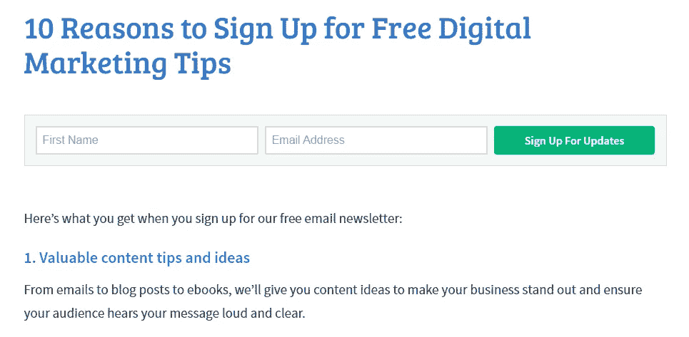
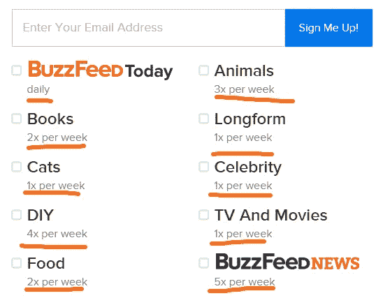

# 获得 3 倍订户的 9 个电子邮件营销“秘密”

> 原文：<https://medium.com/swlh/9-email-marketing-secrets-for-getting-3x-more-subscribers-78a20d236b>

[1，300 名客户之后，](http://www.mikeshreeve.com/hiremiketowritecopy)以下是我所知道的有效方法:

电子邮件。

每当我(*或我的客户*)需要更多一点的钱时，电子邮件总是能满足我。

经济咨询公司在 T4 进行的一项调查显示，大多数合法的营销人员仍然认为电子邮件是他们推动销售的最强有力的渠道。

Monetate 的电子商务季刊中的另一份报告显示，电子邮件比搜索、社交或有机邮件更容易转化。

简单、诚实的事实是:如果你想把真正的钱放进你的口袋，那么开始更好地使用电子邮件。

你将要发现的这 9 个策略已经被证明是有效的。勤奋地应用它们，你将会使你的订户数增加几倍*至少*。

让我们从第一点开始:

# #1.创建上下文内容报价

如果你是一个传统的营销人员，你可能会在所有帖子的底部有一个小小的选择框。

像大多数营销人员一样，你的读者可能会完全忽略这个选择。

## 为了互联网，请停止这样做

What Most Opt-ins Look Like (Blah…)

Oh no! Anything but the “Share the Love” 80’s Reference…

Why God, wwhhhhyyyy? A “buyers guide” opt-in in 2015? Do you have no mercy for us underlings oh Lord?

不是你的读者不喜欢免费的东西。只是他们没有任何真正的动机或背景去下载你的免费报告。

假设你发布了一个关于从社交媒体获得更多流量的帖子。你的读者喜欢它。他们甚至与朋友分享。

然后，他们滚动到页面底部，找到了一份关于掌握 SEO 的免费报告。

你能看出这里出了什么问题吗？

您的内容报价缺少*上下文*。你对所有的文章使用相同的下载，不管它们的内容如何。

像这样。

当原始帖子是关于社交媒体时，下载是关于 SEO 的。帖子和选择加入贿赂之间没有上下文相关性。

但是有一个解决方案。

# 叫做*内容升级(又名:提升营销)*。

它是这样工作的:

**第一步。像平常一样创建博客帖子。**

**第二步。制作一个与文章相关的可下载的小文档，帮助你的访问者将你刚刚在博客中教给他们的东西付诸行动。帮助他们*将*从阅读提升到行动。**

第三步。将此内容锁定在选择加入的防火墙后，或者使用其中一种方法。

这样，你就可以为每篇文章提供专门的内容，而不是为所有文章提供一个通用的下载。

你用你博客的内容吸引读者，然后你通过自然的上下文联系让他们通过你的漏斗上升。就像爬梯子的横档一样。

只会因为你赚钱而变得更棒。

许多博客已经成功做到了这一点。这里有一个来自 Backlinko 的例子:

这里有一个来自奥克多克的例子:

内容升级有两个原因:

*   **上下文相关性:**内容升级与博客文章直接相关，因此上下文相关。
*   **读者买入:**由于读者已经投入精力阅读帖子，他更有可能下载与帖子相关的内容。

我知道这需要额外的努力，但结果是值得的。你会看到每个帖子的选择加入数量急剧上升。通过高质量的相关升级，您可以看到高达 30%以上的转化率。

以下内容类型最适合内容升级:

*   **清单:**清单将内容浓缩成一个简短的、可操作的列表。在长博客文章中使用它们(3k 字以上)。
*   **工具列表:**对于案例研究和操作方法，可以考虑使用内容升级工具列表。这也是一个很好的方法，使一些附属委员会。
*   **补充内容:**对于列表文章，可以考虑在基本文章中补充额外内容。例如，您可以提供一个包含 10 件事情的列表，但是在内容升级中保留列表中的一项。
*   **视觉内容:**视频演示、信息图、幻灯片演示等。总结和补充文章内容的方法对所有类型的文章都很有效。

你甚至不必从头开始创建新的帖子来测试这种策略。你可以为你最受欢迎的帖子添加内容升级(通过谷歌分析将你的网址插入 Buzzsumo 来查找)并查看结果。

使用以下插件提供您的内容升级:

*   内容升级([免费](https://wordpress.org/plugins/content-upgrades/)，付费版本[可用](http://contentupgradespro.com/)
*   [SumoMe 领先](http://sumome.com/)(免费增值)

# #2.将您的选择加入表单放在正确的位置

您应该将电子邮件选择加入表格放在哪里？

如果你到处都回答了*，那你就*有点*对了。*

*即使冒着患上“选择性加入盲症”(类似于横幅盲症，但适用于电子邮件表单)的风险，也要确保将选择性加入表单放在以下位置:*

## ***#1。页面顶部***

*保存表单的第一个地方是页面的最顶端，通常是“功能框”的形式:*

**

*备选方案包括“欢迎垫”…*

**

*这将是您表现最强的选择加入表单之一，因此请确保它具有以下内容:*

*   *放置在折叠上方。*
*   *以利益为中心的文本告诉读者为什么他们应该注册。*
*   *引人注目的设计(粗体颜色、大字体、强 CTA 按钮等。)*

## ***#2。帖子底部***

*任何一个坚持到底的人都是*喜欢* *完全喜欢你*。这些是你的铁杆读者。你的超级粉丝。*

*这就是为什么底部后选择加入是可怕的。他们抓住真正的信徒，把他们放进一个整洁的小数据库，这样你就可以卖给他们东西。一定会喜欢这些尖牙女孩。*

**

*以下是一个好的后期选择加入的要素:*

*   *强调当读者看到他们刚刚阅读完的文章时，他们可以获得更多他们正在寻找的好处(记住*提升*)。*
*   *关注他们注册后将获得的好处(而“不”从你的时事通讯中接收更新不是一个好处…不是真的)。*
*   *向读者保证注册是免费的，他们可以随时退订，你永远不会给他们发垃圾邮件。*

*为了获得最佳效果，请尝试将表单*放在社交分享按钮*之后。如果你获得了大量的分享，这可以作为你的内容受欢迎的微妙的社会证据。*

## *#3.**侧栏***

*[评审团仍未对侧栏在我们这个](http://www.quicksprout.com/2015/04/22/does-your-blog-need-a-sidebar/)[移动优先的时代](http://searchenginewatch.com/sew/opinion/2353616/mobile-now-exceeds-pc-the-biggest-shift-since-the-internet-began)的有效性做出评判。然而，如果你的博客上有侧边栏，在上面加入一个选择加入的表格是个不错的选择。为什么不呢，对吗？*

**

*这个表单应该使用一个能让它从其他侧边栏内容中脱颖而出的设计。添加免费赠品和社交证明(如“加入 x，xxx 其他订户！”).*

## *#4.**感谢页面***

*老实说，我很惊讶更多的营销人员没有这样做。*

*感谢页面是将即将离开的读者转化为订阅者的好方法。一个更好的方式是给刚从你这里购买的顾客一份大大的“感谢订购”惊喜礼物。*

*由于他们将在注册/下载/购买某样东西后点击这个选择加入，这些读者是“热情的”,会有更好的反应。好多了。*

*Leadpages 很好地利用了这一点，他们是天才。我爱他们和他们疯狂的科学家方式。注册试用后，您会看到这个页面，要求您注册他们的网上研讨会:*

**

*这在很多层面上都行得通。*

*你已经抓住了一个想注册某些东西的人。你已经让他们爬上了提升的阶梯。哪个头脑正常的人不会去报名参加一个留着胡子的家伙推销的东西呢？*

*没人是谁。*

## ***#5。滑动框***

*另一个放置选择加入表单的流行位置是页面底部的滑动框。*

**

*当你滚动到页面底部时，这个框就会出现。*

*由于同样的原因，转换率是体面的。它们只是有点花哨，让你看起来很酷。*

# *#3.说服读者订阅*

*从前，人们对电子邮件漫不经心。甚至不负责任。 [80%的选择加入](http://geoffishere.com/blog/how-to-increase-opt-in-rates-to-80/)就像，“*嗯，太简单了。**

*如今……不那么多了。*

*人们对电子邮件地址的保护比他们自己的孩子还要严密(*问我怎么知道的*)。*

*为了进入你的读者的收件箱，你必须首先让他们相信你的邮件是值得他们花时间的。他们得到了比“避免垃圾邮件”更好的东西。*

*这里有几种方法可以做到这一点:*

## ***#1。创建一个“为什么你应该订阅”的帖子***

*告诉读者为什么他们应该订阅你的内容，最简单的方法是什么？*

*简单:*告诉他们。**

*我在这里做了[。](http://www.mikeshreeve.com/swipeable-email-list-history/)*

*Aweber 的“[注册免费数字营销技巧的 10 个理由”页面](https://blog.aweber.com/subscribe-to-blog)做得更好:*

**

*这一页有几件事很突出:*

*   *页面在标题中有一个关键词=好 SEO。*
*   *列表条目非常短，很容易浏览。*
*   *所有 10 个理由都集中在好处上——获得合适的工具、设计建议、营销技巧等。*
*   *页面顶部有一个电子邮件表单。*

## ***#2。使用读者的评价或评论***

*使用真实读者的评价和评论是展示内容价值的好方法。*

*TheSkimm 通过一条推文表示支持，这条推文正是来自奥普拉:*

**

*So Clever.*

*《黑客通讯》使用了顶级博客作者和初创公司创始人的评论:*

**

*这样的评论表明注册你的邮箱是值得读者花时间的。把它们想象成一本书背面的广告词。*

*您可以使用以下任何一种方法:*

*   *脸书评论*
*   *小鸟叫声*
*   *其他网站上的评论/评论*
*   *博客评论*
*   *电子邮件评论*

## ***#3。展示一封电子邮件样本***

*读者有理由在你的电子邮件简讯到达他们的收件箱之前对它感到担忧。太长了怎么办？太不相干？太丑了？*

*通过向他们展示收到的电子邮件的确切样子来消除他们的恐惧。一条简单的“这是你将得到的”信息，并带有一封来自你的时事通讯的实际样本邮件的链接，效果很好。*

*奥斯汀·克里昂在他的时事通讯中展示了时事通讯档案:*

**

## ***#4。使用社会证明***

*正如罗伯特·恰尔迪尼在*影响力:说服的科学*、[中指出的，社会证明是影响力的六大支柱之一](http://www.mindtools.com/pages/article/six-principles-influence.htm)。人们天生就喜欢追随已经流行的东西(*)有没有真正看过一集《鸭子叫伙计》？*)。这对于高中小团体和电子邮件营销一样重要。*

*通过记录已经订阅的人数，你可以让更多的人注册你的邮件。*

**

*Le sigh. I want 475,000 subscribers…*

*这告诉潜在的订阅者，还有像他们一样的人在阅读你的时事通讯。这是让他们注册的强大动力。*

## ***#5。告诉他们你的发布时间表***

*读者不希望他们的收件箱每周被相同的促销信息轰炸 8 次。他们想知道你多久给他们发送一次更新。*

*Buzzfeed 通过告诉读者他们每周将收到的电子邮件的确切数量来做到这一点。*

**

*电子邮件读者很容易被吓跑。*

*用好吃的东西给他们惊喜，而不是你多久发一次邮件。*

# *#4.更好地利用客座博文*

*忘记马特·卡茨所说的话。客座博文是你内容营销策略的基石。*

*是的，做客座博文有正确和错误的方式。*

***走错了路***

*   *撰写和发布客座博文。*
*   *包括古怪的署名。*
*   *包括回到你主页的链接，最好有关键词。*

***正确的方式***

*   *撰写和发布客座博文。*
*   *包括古怪的署名。*
*   *包括返回到专门为博客读者制作的*登陆页面的链接。**

*例如，如果你在 Copyblogger 上发布了一篇客座博文，你可以拼凑一个欢迎 Copyblogger 读者的专用登录页面:*

**

*在这里，你可以向他们提供相关内容，以换取他们的电子邮件(*即我之前讨论的内容升级策略*)。*

**

*对大博客这样做，你会看到中间两位数的转换率。*

*这种策略奏效有两个原因:*

*   ***合格访客:**任何不仅读过你的客座博文，而且*也*点击过你的署名链接的人，都已经表明他对你的提议感兴趣。*
*   ***价值:**想想看——你写了一篇很棒的帖子，然后你在登陆页面上给出了更多的价值。你的读者显然会因此爱上你。*

*你不必对所有的客座博文都这样做，但要确保你对你所在领域的所有主要出版物都这样做。*

*使用这些工具创建您的登录页面:*

*   *[首页](http://leadpages.net/)*
*   *[Instapage](http://instapage.com/)*
*   *[拆封](http://unbounce.com/)*
*   *[点击漏斗](http://clickfunnels.com/) ( *我用什么*)*

# *#5.使用更好的选择加入表格*

*每当我看到这样的选择框，我内心的营销者就会哭泣:*

**

*我甚至无法告诉你它的所有问题:*

*   *标题文字描述的是一项行动，而不是一项好处。*
*   *该设计没有给出内容的指示。另外，它很丑。*
*   *CTA 属于 2005 年，而不是 2015 年。*
*   *它看起来像 90 年代早期的脏沙发。*

*以下是如何通过调整你的选择加入表格来提高注册率:*

## ***#1。使用双击表单***

*最近，你可能在互联网上到处都能看到这样的选择加入表格:*

**

*这种设计违背了传统智慧— *为什么你会让注册你的名单变得更难呢？**

*然而，开创了这种形式的 LeadPages，[通过两步注册流程将选择加入率提高了 60%](http://blog.leadpages.net/two-step-opt-in-process-list-building/) 。*

*这种形式之所以有效，有一个简单的原因:通过增加注册电子邮件通讯所需的点击次数，你可以自动过滤掉不合格的订户——那些太懒或没有动力点击两次来获得你的报价的订户。*

*你可以这样想——你在读者面前设置的每一个障碍，都会提高潜在客户的质量。*

*结果呢？更好的转化率。*

## ***#2。使用以价值为导向、以利益为中心的文案***

*站在读者的角度想想。如果你登陆一个博客，看到两个选择加入的弹出窗口，你会选择哪一个:*

***选项 A:***

**

***选项 B:***

**

*毫无疑问，大多数人会倾向于选项 b*

*三个原因:*

*   *标题承诺赠送*独家**
*   *正文重申了这一价值，指出你将获得只与私人简讯订阅者分享的提示和见解。*
*   *尼尔·帕特尔(Neil Patel)是数字营销领域最知名的人物之一，他写了一篇感言。*

*(*如果你想知道，这是来自 Backlinko* 的侧边栏选择加入表单)。*

*使用更好的副本是一个全新的话题，但对于初学者来说，请遵循以下规则:*

*   *关注利益而不是特性(*【获得更多股份】*而不是*【200 页脸书小贴士】*)。*
*   *强调结果——最好是你自己的结果(*“我如何在 30 天内从 0 到 10，000 访客”*)。*
*   *直接称呼读者(*【你】*而不是*【他们】*)。*
*   *给而不是问(*“下载我用来增长到 10，000 访问者的工具”* *“加入我的简讯”*)*
*   *承诺排他性(*“获得我只与我的订户分享的提示”*)。*
*   *使用社交证明(*“加入 20，000 名其他订户”*)*

## ***#3。使用更好的 CTA***

*行动号召(CTA)是选择加入表单中一个重要但被忽视的部分。一个好的 CTA 做两件事:*

*   *它会在页面上突出出来，并引发行动。*
*   *它承诺提供价值。*

*大多数营销人员使用的 CTA 不具备以上两种功能。要么 CTA 与背景和设计的其余部分融为一体…*

**

*…或者它使用通用的描述性文本，如“订阅”、“提交”或“注册”:*

**

*将此与实际表现良好的 CTA 进行比较:*

**

*最大的区别在于，这种 CTA 提供了价值。上面没有写“报名”；上面写着“送我交通建设的课程”。*

*[有大量](http://unbounce.com/conversion-rate-optimization/how-to-write-a-call-to-action-that-converts-with-case-sudies/)[案例研究](http://contentverve.com/10-call-to-action-case-studies-examples-from-button-tests/)证明您可以通过在 CTA 上使用注重价值的副本来提高转化率。*

*对于您自己的 CTA，请执行以下操作:*

*   *使用明亮、醒目的颜色来吸引读者的注意力。*
*   *使用[价值导向型文案](http://www.mikeshreeve.com/hiremiketowritecopy)。*
*   *使用*免费*、*我的*等转换型的词。*
*   *避免使用关注交易的词语，如*订单*、*购买*、*签约*。相反，使用关注利益的词语，如*获取、保存、学习*等。*

# *#6.创建资源中心*

*试试这个:进入 Moz.com，点击页面顶部的“学习与联系”链接。然后选择“搜索引擎优化和搜索营销”。*

**

*这个页面收集了 Moz 能够提供的最好的内容。*

*向下滚动一点，您会看到 Moz 电子邮件简讯订阅框:*

**

*Copyblogger 在内容营销、电子邮件营销等方面的登陆页面也做了类似的事情。*

**

*这种网站最佳内容的中心页面为读者提供了巨大的价值。他们确切地告诉他们先读什么。在这个过程中，他们可以帮助你获得成千上万的新电子邮件订户。*

*创建资源中心相当简单。遵循以下简单步骤:*

*   *列出你所在行业的首要问题。是获得新客户，利用社交媒体，还是通过 LinkedIn 获得潜在客户？*
*   *列出你最好的和最受欢迎的解决上述问题的内容。请记住，你最好的内容可能不是最受欢迎的，反之亦然。确保每期至少有 5 篇内容。*
*   *设置一个单独的页面来介绍这些问题，然后列出您亲自挑选的内容。*
*   *在页面底部添加一个选择加入表单。告诉读者，如果他们想了解当前问题的最新进展，他们可以注册获取更多内容。*
*   *随着订户蜂拥而至，用白日梦的方式花钱(*可选，但我最喜欢的*)。*

# *7.使用竞赛和赠品*

*竞赛、赠品、抽奖:你可能认为它们是廉价的营销噱头，但如果做得对，它们会非常有效。*

*以这两个人为例:*

*   *Travis Ketchum 在一场比赛中为 T2 赢得了 19 万新用户。*
*   *乔希·厄尔给[增加了 20 万封新邮件](http://www.smartpassiveincome.com/what-i-learned-from-growing-my-email-list-3418-nearly-200k-in-just-11-days/)作为赠品。*

*传统的赠品大概是这样的:*

*   *悬赏。*
*   *让人们注册该奖励。*
*   *随机挑选一个获胜者。*

*虽然有用，这种方法完全否定了一个好赠品的病毒潜力。*

*如果您没有执行上述操作，而是执行了以下操作，会怎么样？*

*   *提供奖励。*
*   *让人们注册该奖励。*
*   *请他们分享赠品。每分享一份，他们获胜的机会就增加一分。*
*   *随机挑选一个获胜者。*

**

*这种方法让参与者分享赠品。它将获胜的机会与推荐/分享的数量联系在一起。最终结果是一个混合竞赛/赠品模式，参与者有真正的理由加入。*

*以下是如何在 2015 年开展有效的赠品活动:*

*1.挑选一个你所在行业的人真正想要的奖项(不，不是 iPads)。对于营销人员来说，这可能是一系列营销工具的年度订阅。对于游戏玩家来说，是一系列新游戏/主机。发挥创意，不要像其他人一样使用旧的奖品。*

*2.准备赠品。您可以使用 [io](https://gleam.io/) 或 [KingSumo 赠品](https://kingsumo.com/apps/giveaways/)。*

*3.通过增加参与者获得每份奖励的机会来激励他们分享。*

*4.在任何地方推广赠品，包括论坛、sub-reddits、Quora 和其他博客。*

*5.看订户蜂拥而至。*

# *#8.创建电子邮件课程*

*这一条非常简单，以至于我想知道为什么更多的人不这么做:把你现有的内容变成一门电子邮件课程。*

**

*这类课程的转换率超过了任何一本普通的旧电子书。*

*做以下四件事来创建你的电子邮件课程:*

*   *拿起你 100 页厚的电子书。除了最具可操作性的内容之外，删除所有内容。*
*   *将每一章变成一个电子邮件长度的课程。*
*   *创建至少 6-10 个这样的课程。*
*   *将所有课程作为纯电子邮件课程提供。*

*突然间，那本听起来像市场上其他任何东西一样冗长吓人的电子书变成了轻松的一万字电子邮件课程。*

*创建电子邮件课程正是像大卫·卡达维、诺亚·卡根和布伦南·邓恩这样的人将他们的电子邮件列表扩大到数十万订户的方式。*

*电子邮件课程比电子书/指南效果更好，原因有四:*

*   ***减少摩擦:**对于你的读者来说，给出他们的电子邮件地址成了一种自动选择。毕竟是个*邮件课程*；他们能收到邮件的唯一方法是放弃他们的电子邮件地址。*
*   ***定期提醒:**读者不会下载电子书并在一周后忘记它，而是每周收到一次提醒，提醒你和你的课程存在，就在首选的数字不动产——收件箱里。*
*   *更高的参与度:读者更有可能经历一个在几周内展开的简短易懂的课程，而不是一个只有冗长电子书的课程。*
*   ***更有利于营销:**读者(和垃圾邮件过滤器)习惯于在他们的收件箱里看到你的名字。这会让你未来发送给他们的营销信息不那么唐突或令人担忧。*

*你可以使用任何自动回复器来创建电子邮件课程，但是对于简单的自动化来说，像 [Drip](http://getdrip.com/) 这样的工具非常好用。*

# *#9.使用双按钮弹出菜单*

*你可能最近在你最喜欢的博客上看到过这样的弹出窗口:*

**

*这些基于选择的双按钮弹出窗口非常好用。*

*两个原因:*

*   ***框架转移:**通过给读者选择，他们改变了观众的参考框架。不要问自己“我应该订阅这份时事通讯吗？”，你的观众问*“我该选是还是不是？*”。*
*   ***选择错觉:**通过给出说*不*的选项，你让*是*的选择更有意义。这也有助于给读者一种控制的错觉——他们可以选择对你的提议说不。这使得选择*是*的选项成为一种肯定的声明——一种微妙的心理技巧。*

*结果相当惊人。据 Copyhackers 的 Joanna Wiebe 称，使用基于选择的弹出窗口使她的电子邮件注册率提高了近 5 倍。*

**

*使用这些工具创建基于选择的弹出窗口:*

*   *[反弹兑换](http://bounceexchange.com/)*
*   *[PicReel](http://www.picreel.com/)*

*弹出窗口的创建过程本身是不言自明的，但是您应该遵循以下两条准则:*

*   *使用醒目的视觉效果来突出*是**
*   *将*是*的选择框定为积极的(“我想要更多流量！”)，而*否*选择为否定(“我拒绝免费流量”)。*
*   *在两个选择上都使用以利益为中心的文案(“是的，教我如何增加我的流量！”)*

# *最后…*

*我不想撒谎:电子邮件营销很难。*

*随便看看我的博客。这些事情我大多不做。*

*但是这里有一个问题…*

*随着时间的推移，只要坚持实施其中的一两个，我就能够建立一个支持中等规模 [6 位数文案业务](http://www.mikeshreeve.com/hiremiketowritecopy)的电子邮件列表，没问题。把电子邮件变成现金并不需要太多。从现在开始，只需更少的时间就能收到更多的电子邮件。*

*上面列出的 9 个策略将会对增加你的用户数大有帮助。*

***选择两个并马上开始实施。***

# *每天将这样的文章发送到您的收件箱*

*想要更多这样的文章吗？报名参加 [*我的私人每日简讯*](https://mikeshreeve.clickfunnels.com/mediumnewslettersignup) *我在这里写关于创业、成功心理、写作以及这之间的一切。**

**

**发表于* **创业、旅游癖和生活黑客***

******

*-*