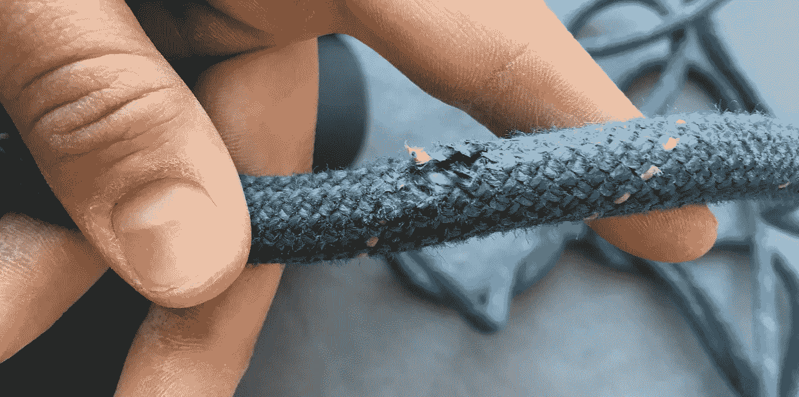

# 9 位年轻的企业家解释为什么要和你的企业说再见，以及需要做些什么

> 原文：<https://medium.com/swlh/9-entrepreneurs-explain-why-and-what-it-takes-to-say-good-bye-to-your-business-b9d6a375d68b>

## 放手决定背后的现实表现

*本文由* [*奥布里·林*](https://medium.com/u/5ad8b23849e?source=post_page-----b9d6a375d68b--------------------------------) *原创。奥布里住在加利福尼亚的弗雷斯诺，那里有最好的攀岩和新鲜农产品。她目前在一家名为* [*五微米*](https://fivemicrons.com/) *的公司工作，这是一家为帕金森氏症患者制造震颤控制设备的初创公司。*

在我大学生涯的最后一个月，我采访了 9 名 20 多岁的企业家，话题是我头脑中燃烧的东西:

*关闭一家企业是什么感觉？*

本文简要分享了这些企业家对其经历的集体反思。

它并不意味着是充分利用或避免关闭业务的“如何做”。比起为应用而阅读，我更推荐为反思而阅读。

想想你自己的结束经历，无论是一个企业、一个项目还是一段关系，想想企业家的叙述中让你印象深刻的是什么。也许有些事情描述了你曾经有过但没有表达出来的感觉，或者你会想起过去的经历。

事实上，我给 9 个不同的人打电话的动机是为了自己回答一些问题。

# 我的创业之旅

在大学一年级后的夏天，我开始了一个肉干生意。

"*我在做什么？*

在动荡的日子里，这个问题不断在我脑海中闪过。我不知道经营一家企业意味着什么，但我联系了那些知道的人。

一年后，我的牛肉干在加州中部一些明星食品公司旁边的地区食品博览会上赢得了“最佳新产品”。人们相信我。他们开始指出我是一个有激情和创造力去做大事的年轻人。

我记得我接到的第一个大订单是运往纽约的 1200 个包:我试图回复客户的电子邮件，就像一切都在掌控之中一样，然后匆忙生产产品，考虑运输事宜。

> 这是一个令人兴奋的时刻，然而成功是可怕的，因为我知道我的努力是多么业余。

两年过去了，关于包装和食谱，参加什么活动，针对谁，需要做出越来越多的决定。我觉得自己像个骗子，推销一种我自己都怀疑的产品。夏天过去了，没什么进展，然后秋天来了，有课有作业。

一种疲惫感让我做出了一个我经常思考的选择:

> 我决定辞职。

这是我深思熟虑并与顾问讨论过的决定，但仍然:

你是如何向自己和他人解释为什么你过去几年一直在做的生意会结束的？

当我把父母家多余的卧室里的一盒盒牛肉干标签清理出来时，我听着知名企业家的播客，寻找我的问题的答案。他们或他们的客人总是谈到坚持和激情，这是成功企业家的两个基本特征。辞职可能意味着我不具备成为企业家的条件，这种可能性让我很恼火。

*我是不是应该在这个行业坚持更长时间，休学一个学期来做这件事？*

*我对牛肉干缺乏兴趣真的是退出的充分理由吗？*

播客主持人分享了在破产和个人危机中坚持下来的故事，以及在对成功的强烈渴望的推动下日以继夜的故事。但是他们没有提到我所经历的逐渐耗尽精力。

当我带着这个问题采访这九位企业家时，我注意到他们在结束一家企业的叙述中有一些共同的主题，我将在下面介绍。

情节包括对创始人失去激情，业务失去动力，最后，在关闭后倾向于坚持。

# **失去激情**

我采访过的九个企业家中有七个提到失去激情是他们选择结束生意的决定性因素。

尼克是一名 25 岁的企业家，他回忆起自己在大学四年级即将毕业时的经历，为了让公司的资助尽可能多，他跑到朋友的公寓里。

社交照片分享应用的活跃用户群带来了客户，创始团队加入了一个著名的加速器项目。但是进入这个行业两年了，资金很少。创始人对产品外观的看法开始出现分歧。研究生毕业后，顶级公司向他们发出了工作邀请，团队决定结束这项业务。

回想起来，尼克解释道:

> “这不是我们最终真正感兴趣的事情之一。我们只是想找到一种方法，让一些事情发生，成为企业家，跳到硅谷——我们有这条跑道，那里的人们支持我们，我们尽可能地乘风破浪。”

尼克是前一级运动员，也是学校创业中心的创始人。他很容易成为一名励志演说家，而且工作非常努力。听他谈论对企业失去激情，挑战了我的假设，即失去激情是软弱的失败者的产物。

一个新的想法开始在我的脑海中形成:也许对你最初热衷的事情变得不那么有激情是弄清楚什么有效以及什么值得为之努力的一部分。

“A woman sitting with her chin on her hands” by [Ben White](https://unsplash.com/@benwhitephotography?utm_source=medium&utm_medium=referral) on [Unsplash](https://unsplash.com?utm_source=medium&utm_medium=referral)

# **失去动力**

回想他们的倒闭经历，许多企业家发现了一个“停顿”或“停滞”，在决定到来之前，他们会说“这是一个令人困惑的时期”，“我只是不喜欢它”:是时候退出了。

> “这有点像一段早该结束的糟糕关系，”

24 岁的产品设计师兼企业家桑尼解释道，他在爬上旧金山的小山去朋友的公寓时接受了采访，有点上气不接下气。

> “你知道，每个人都在说，‘我们在这上面花了这么多时间，我们不能就这么放弃！’即使我们知道…我们只是没有像刚开始时那样工作。"

对于许多年轻企业家来说，对创业热情的消退与吸引他们注意力的新的、令人兴奋的机会同时发生，企业逐渐失去了动力，不管他们是否愿意承认这一点。

# **坚持住**

随着他们的业务失去势头，许多企业家试图证明继续下去是合理的，并描述了不愿做出什么是一个明显的决定退出。

> “有太多的否认！天啊…你不会想放弃吧！”

桑尼承认了这一点，并描述了在他们分别去了不同的城市，知道两人都不想继续下去后，他是如何请求这位联合创始人允许他继续创业的。

> “也许三个月后它会变得很大，但最终我有了六个其他选择……谁知道呢”

这是来自中西部的 23 岁企业家布兰登的评论。

随着企业正式关闭，企业家必须向自己证明退出的决定，并向他人解释。起初，对这个决定感到平静是困难的。

> **“**我们不想让别人看着我们说，‘你们不够努力，’

桑尼继续说道。他继续解释说，另一个人提出了一个与他正在研究的想法非常相似的想法:

> “也许一两个月，或者一年后，她会带着我们最初的理念，成为一名成功的首席执行官，我们会说，‘那可能是我们。’"

# **利大于弊**

对于我采访的许多年轻创始人来说，失去激情、失去动力和坚持是结束经历的一部分。但除此之外，他们有更多的共同点:他们都走向了新的机会，并从他们如何从经验中学习和受益的角度谈到了他们的业务关闭。

来自德克萨斯州的 21 岁的 McCalley 描述了她使用 GoFresh 的经历，这是一种延长水果和蔬菜保质期的产品。回顾她花在客户访谈和实地试验上的时间，然后把没有希望的结果作为重新思考或退出的信号，McCalley 说:

> “即使 GoFresh 没有成功赚钱……我也不会交易我拥有的任何经验，因为我会再次使用它们。”

尼克在第一次创业后获得了一个更聪明的创业方法:

> “现在，当我看着初创公司时，我有一种很好的直觉……我认为哪些会成功，哪些不会。”

他沉思着。

> “(公司)的失败给了我更多的洞察力，并让我谦卑地真正、真正专注于某件事，我再次对这件事充满热情，我认为这是一个真正的问题。”

对桑尼来说，这次冒险建立了亲密的友谊和导师关系。他分享了最近与他的联合创始人和另一名团队成员共进晚餐的经历:

> “我们对彼此了解很多，看到人们最好的一面，也看到他们最坏的一面。现在想来，[生意]确实巩固了我们的关系。是啊，他们就像我的两个最好的朋友。”

他继续说道:

> “这是一次有趣的旅程……尽管它最终没有真正去任何地方。我与导师们建立的联系……他们打开了通往其他事物的大门。”

至于成为今天的企业家，桑尼归功于他不成功的创业:

> “还有其他事情让我对成为一名企业家感兴趣，但 Supervize 真正将我推向了它的核心。”

# 如果我再做一次

我采访的几位企业家做了一些事情，让他们的去/不去决定更加理性，减少情感负担。分解后，他们:

1.创建了一个时间表

2.孤注一掷

3.退一步来评估

Brendon 描述了他和他的团队如何决定用一个夏天来建立他们的产品想法。如果到最后他们有付费客户，他们会继续；如果没有，他们就会辞职。顾客没有来。没有达到他们的基准，时间也不多了，他们觉得有理由说，“好吧，我们试了一下”，然后继续前进。

麦卡里遵循了类似的过程。在一百次客户访谈清楚地表明她的产品不适合市场后，她解释说:

> “我不得不决定放手，这就是我的解脱所在，意识到这件事之后，就不值得了。”

当我开始做牛肉干生意时，我的时间线是“让我们看看它能走多远”，而我的基准是不存在的。下一次，我会问自己不同的问题:

*成功是什么样子的？*

*我需要多长时间来判断这个项目是否值得一试？*

失去激情，看着企业失去动力，在关闭的另一边坚持得有点太久的故事在年轻创业者中并不少见。

我觉得这令人鼓舞。

这九次谈话帮助我回顾了结束不稳定业务的经历，并欣赏了从中获得的成长和学习。感谢那些对话，我期待下一次会更好。

# 继续对话

请随意为这篇惊人的文章“鼓掌”多达 50 次，以帮助分享年轻企业家的真实和情感经历，并帮助其他人更好地应对与他们的企业说再见。

想了解更多关于令人惊叹的奥布里·林(Aubrey Lim)的信息，请在[的 LinkedIn](https://www.linkedin.com/in/limaubrey/) 上找到她。

## 这篇文章发表在《T4》杂志《创业》(The Startup)上，这是 Medium 最大的创业刊物，拥有 356，974+读者。

## 在这里订阅接收[我们的头条新闻](http://growthsupply.com/the-startup-newsletter/)。

