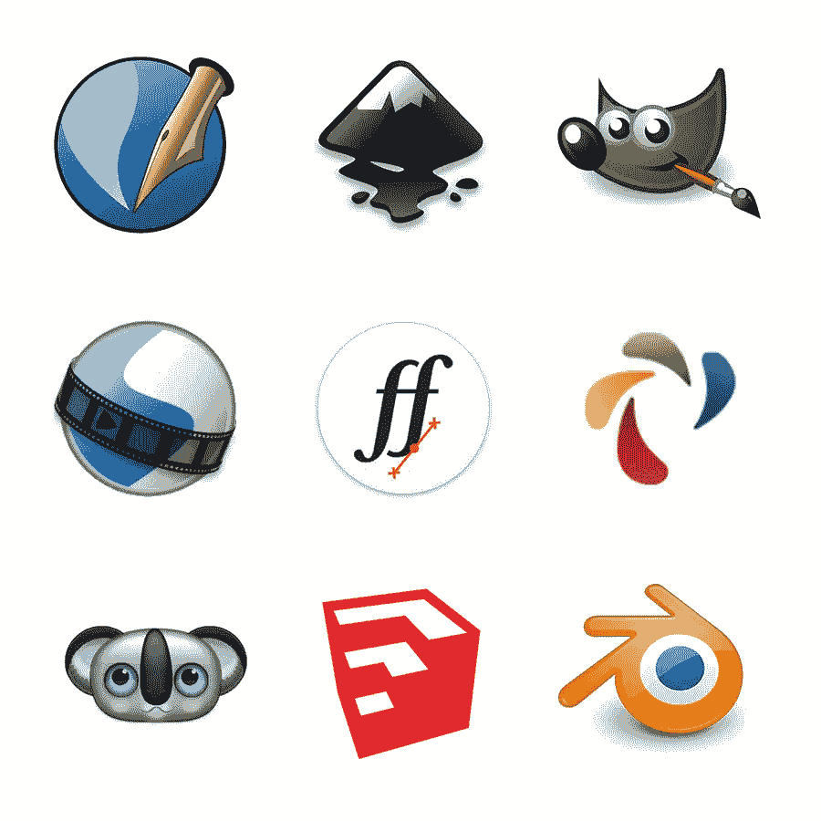

# 预算有限的设计师的 9 个免费软件选择

> 原文：<https://medium.com/swlh/9-free-software-alternatives-for-designers-on-a-budget-d952c5e91082>

## 成本友好的设计工具

设计软件很贵。

当研究行业标准项目时，希望涉足设计的有抱负的创意人员经常会被标签震惊。对于该领域的新手来说，这些工具的成本可能难以承受。

Adobe 的每月订阅模式减轻了一些前期成本，并为学生提供了慷慨的折扣，但对于那些不在学校的学生来说，所有应用程序的订阅费用加起来约为每年 600 美元。

对于那些寻求完全避免价格标签的人来说，开源软件是解决方案。根据 Opensource.com 的说法，

> "开源软件是任何人都可以修改或增强其源代码的软件."

换句话说，开源软件是非专有的，可以自由开发、修改和分发。大多数开源项目不具备付费项目所具备的技巧水平，但它们可以完成工作。

下面列出了九个行业标准程序的开源版本，包括用于图形设计、摄影、网页开发和 3D 建模的软件。如果你认为还有其他应用程序应该出现在这个列表中，一定要在评论中提到它们！

本自由软件列表中不包括特定平台的替代软件。我更喜欢在 Mac 上进行设计，但我不想忽视大约 75%的人使用 Windows [w3schools.com]。

[Scribus](https://www.scribus.net) 是一个页面布局程序，包含许多有价值的功能，可以在多种操作系统上运行。与 InDesign 的功能集类似，它有矢量绘图工具、导入/导出选项、网格和详细的文字调整等等。Scribus 还支持 CMYK 和专色，并提供简单的 PDF 创建。与 Indesign 不同，Scribus 文件是基于 XML 的，这使得损坏的文件更容易恢复。

[Inkscape](https://inkscape.org/en) 是 Illustrator 更著名的替代品之一。该软件适用于 Windows、Mac 和 Linux，拥有您需要的所有矢量工具。包括路径上的填充/描边和文本等常见控件，以及形状上的变换选项和布尔运算。可以通过克隆工具创建图案，制作对象的链接副本，并且可以导出多种文件类型，包括光栅和矢量。

免费的 Photoshop 替代品 Gimp ，目前正在庆祝它的 20 周年纪念日。随着时间的推移，它积累了支持照片编辑、数字绘画甚至 UI 组件设计的功能。GIMP 通过第三方插件提供图层蒙版、自定义笔刷、算法脚本和自定义。GIMP 网站甚至将 Scribus 和 Inkscape 作为合适的桌面出版工作流程的配套程序。

[OpenShot](http://www.openshot.org) 是一个功能强大的视频编辑器，其功能类似于 Premiere 或 Final Cut Pro。很容易导入视频、图像和声音文件，使电影可以以多种格式输出。除了其他音频和视频效果之外，OpenShot 甚至还为字幕序列提供了 3D 动画选项。

[FontForge](https://fontforge.github.io/en-US) 和其他字体设计程序一样，有一个陡峭的学习曲线，但是非常适合创建你的第一个字体。矢量绘图工具使在应用程序中开始设计字母变得容易，并且有定义字距和连字对以及其他细节的选项。设计一种字体涉及很多内容，但是在线 FontForge 文档是一个有用的指南。

AMPPS 是一个由 Apache、MySQL、PHP、Perl、Python 和 Softaculous 组成的软件栈，可以简化本地服务器的设置。任何曾经通过 FTP 直接编辑过网站的人都知道，在部署到一个实时站点之前，在本地安装一个软件来测试更改的价值。AMPPS 使得管理网站数据库和在本地安装像 WordPress 这样的网络应用变得很容易。

考拉是 Codekit 的一个很好的替代品，虽然功能较少，但它确实可以在 Windows 上运行。当你编写 Less，Sass 或 CoffeeScript 时，这个小应用程序在后台运行，并在每次文件保存时编译它。编译选项包括普通代码、嵌套代码、压缩代码和精简代码。对于 CSS 预处理程序的新手来说，这是可以使用的应用程序。

[Sketchup](http://www.sketchup.com/products/sketchup-make) 是一款直观的 3D 建模工具，很容易快速上手。强大的构建工具集通过绘制、拉伸和变换曲面以及无限的定制选项来简化对象的创建。还有 3D Warehouse，这是一个模型和对象库，可用于导入到您自己的创作中。

最后，但肯定不是最不重要的…

Blender 是目前最强大的开源程序之一。不仅仅是一个 3D 建模工具，它还提供了一个精致的动画工具集，包括角色操纵、UV 展开以方便网格绘制、全功能合成器、视频编辑、相机跟踪甚至视频游戏创建。Blender 能够进行真实感渲染，这要归功于它的 Cycles 渲染引擎，并附带了一流的建模和雕刻工具。所有这些功能都是免费的，但是学习曲线更像是垂直的攀登。Blender 有很好的文档记录，并且有许多循序渐进的教程，但是它需要投入大量的时间和精力才能达到效果。

无论你是想进入设计领域，还是在预算紧张的情况下寻找好的工具，我希望这个列表能帮助你找到正确的方向。我过去使用过这些工具中的大部分(其中一些我现在还在使用！)并感谢开源开发人员提供的专业软件的价值。

花一大笔钱购买昂贵的软件可能会令人望而生畏，但许多付费程序会提供演示或试用期来测试产品。在尝试了只有高级软件才有的高级功能后，人们可能会决心在预算中找到更多的回旋余地。