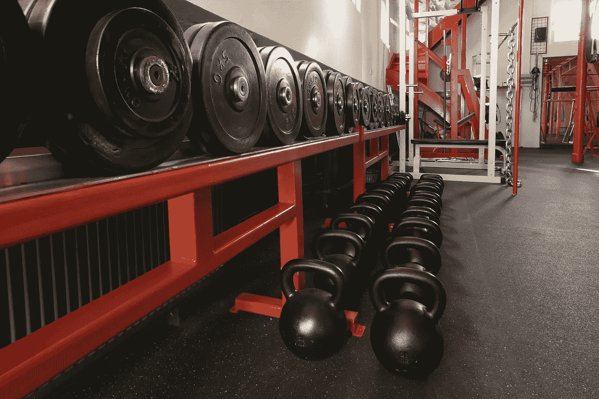

# 我在健身房学到的 9 堂生活课

> 原文：<https://medium.com/swlh/9-life-lessons-that-i-learned-at-the-gym-51ac99b00f54>

从我年轻的时候起，我就一直喜欢举重。去健身房并鞭策自己是我生活的一大部分，我真的相信它教会了我多种生活课程，这些课程将伴随我在这个地球上的余生。我坚信，坚持去健身房并学会如何鞭策自己的人比那些不去的人有更高的成功几率。但是我为什么会相信这个呢？在健身房能学到哪些可以应用到生活中的东西？

**1。做你不想做的事情的影响**——你是否有过这样的一天，除了呆在家里放松之外，你什么也不想做，即使你计划去健身房锻炼？你身体的每一盎司都想停滞不前的一天？如果你有，那么希望你也知道去健身房是什么感觉。是的，你可能在刚开始的时候动作很慢，甚至整个过程都是如此，但是我几乎可以保证，当锻炼结束的时候，你永远不会希望你没有这样做。这就是纪律发挥作用的地方。当我们克服了“不想”做有益于我们生活的事情的时候，那就是我们感觉更好的时候，也是我们真正成长的时候。

**2。关键是一致性——在我去健身房的前五年左右，我发现我的生活几乎没有任何结果。也许我增加了一两磅肌肉，但我仍然很瘦，离我想要的地方还很远。当我上大学的时候，我开始变得更加认真，我决定把健身房作为我生活中的一个优先事项。在事情发生的日子里，我几乎总是确保我仍然去健身房锻炼，因为这种新的一致性，那些年我看到了我的力量和体格的最大进步。当试图在生活中的任何事情上做得更好时，一致性是关键。随着时间的推移，你的进步复合，你会开始看到惊人的结果。**

**3。生活就是不断的努力—** 当你环顾四周，看到有着惊人体格的人或身材极好的人时，你不是在看上周开始去健身房的人，也不是在上个月开始去健身房的人，甚至可能是去年开始去健身房的人。不仅如此，你可能不会看到一个一周中只有两三天正确锻炼和饮食的人。你看到的这个人是一个不断致力于自己的职业的人。一个每天都吃得很好，在健身房内外都非常自律和忠诚的人。这是真正的成长和成功发生的地方。用阿诺德·施瓦辛格的话说:

> “强健的体魄是身份的象征。它反映了你为之付出的努力，不是金钱可以买到的。你不能借它，你不能继承它，你不能偷它。没有持续不断的努力，你无法坚持下去。它显示了纪律，它显示了自尊，它显示了耐心，职业道德和激情。这就是我做我所做的事情的原因。”

这很容易应用到你的生活方式中。如果你想有所成就，你需要日复一日地工作。

**4。我们比我们想象的更有能力—** 今天是腿日。你下了深蹲架，热身做了几组后，你决定是时候推自己了。你增加杠铃的重量，目标是蹲十次。重复一至五次似乎很容易。你能做到的。第六和第七组来了，你的腿开始发抖。在第八步，你喘着气，你的腿在燃烧，你在向上的路上挣扎，你不确定你是否能到达第十步——但不管怎样，你还是努力了。不知何故，你数到十，有那么一瞬间，你考虑放下重量。但出于某种原因，你的内心告诉你再来两次。所以你知道。在你意识到之前，你已经做了 12 次，做了一些你认为不可能的事情。当你在健身房里克服了心理障碍，看到你的身体实际上可以达到什么程度时，你内心的某些东西就会打开，让你意识到你拥有比以前想象的更多的潜力。这种认识实际上可以转移到你生活的其他部分。

**5。你必须从某个地方开始**——没有人在第一天走进健身房时是专家。你还记得你第一次尝试锻炼的时候吗？还是你第一次举重？很有可能，你没有那么强，也很有可能你并不真正知道自己在做什么。我们都必须从某个地方开始，可悲的是人们害怕那个开始。他们不喜欢失败或在某件事上做得不好，尤其是在公众面前，所以他们从不花时间去做得更好。请记住，曾经有一段时间，穆罕默德·阿里从未出拳，迈克尔·乔丹甚至从未碰过篮球。作为一个初学者没关系——事实上，为了变得更好，这是完全必要的。

**6。你需要变得不舒服—** 想象一下每天去健身房，做同样的运动，同样的重量，同样的次数。无论你保持得多么一致，无论你的饮食多么完美，你都不会变得更强壮。为了变得更强壮，你的身体需要那种密封的压力。正如你在健身房需要身体上的不适一样，为了成长，你在生活中也需要精神上的不适。要变得舒服，你需要变得不舒服。

7 .**。事先计划可以防止糟糕的表现—** 走进健身房却没有一个行动计划是一个灾难。你会在每次锻炼之间花时间想清楚接下来要做什么，如果你选择的器械或重量正在使用中，你会完全迷失，总的来说，你的锻炼将会非常低效。带着一个行动计划走进健身房，对于更高水平的表现是非常必要的——同样的事情也适用于生活。如果你在任何情况下都没有一个合适的计划，你就是在计划失败。

**8 号和 9 号？？？**——[点击这里](https://earlyrisersmovement.com/articles1/gym-life-lessons)查看第八和第九个数字。

## 这篇文章发表在 [The Startup](https://medium.com/swlh) 上，这是 Medium 最大的创业刊物，有 296，127+人关注。

## 订阅接收[我们的头条新闻](http://growthsupply.com/the-startup-newsletter/)。

