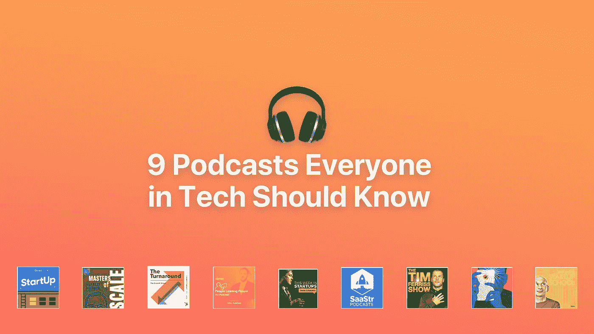

# 第一次创业者的 9 个播客🎧

> 原文：<https://medium.com/swlh/9-podcasts-for-first-time-founders-ed0fd2a90027>

## 或者九个播客，我希望在我创立肥皂箱的时候听

创业很难。作为第一次创业者，我觉得我可以告诉你。(事实上，这是我的[规则告诉你](https://hackernoon.com/so-youre-thinking-of-starting-a-company-60b296c4c031)……)对我来说，我喜欢过程和磨砺。是学习和成长激励着我。所以，我总是希望向冷静、聪明的领导者学习——而播客让这变得无比简单。我得到了他们所有的人情世故，我甚至不需要给他们买啤酒！🍻

说到这里，我希望在我创办[肥皂箱](https://soapboxhq.com/?utm_source=medium&utm_medium=referral&utm_campaign=9-podcasts)的时候有九个很棒的播客。

# [**1。启动**](https://itunes.apple.com/ca/podcast/startup-podcast/id913805339?mt=2)

[这个播客](http://www.gimletmedia.com/startup)已经经历了多次演变。它以纪录片的形式讲述了创业的挑战，整个第一季都致力于创办播客的母公司 Gimlet Media(第一集包括创始人对克里斯·萨卡(Chris Sacca)极其尴尬的推销)。现在，七年过去了，话题范围更广了——例如，第七季追踪风险投资家阿尔兰·汉密尔顿。

## **第一集尝试:**

《担忧的多样化》(第四季第一集)——令人惊讶地坦率地审视了 Gimlet Media 在继续快速扩张过程中的成长烦恼。

# [②**。音阶大师**](https://itunes.apple.com/ca/podcast/masters-of-scale-with-reid-hoffman/id1227971746?mt=2)

由雷德·霍夫曼(因 LinkedIn 而出名)主持，[本期播客](https://mastersofscale.com/)聚焦贝宝公司的彼得·泰尔、网飞的雷德·哈斯汀斯和脸书的雪莉·桑德伯格等创始人和领导者，挖掘一些世界上最大的公司是如何走到今天的真实故事。

## **第一集尝试:**

《大支点》(第 13 集)——Slack 的斯图尔特·巴特菲尔德描述了他在纽约一家酒店遭受食物中毒时如何得到 Flickr 的想法，值得一听。🤭

# [**3。**成长秀](https://itunes.apple.com/us/podcast/the-growth-show/id963131164?mt=2)

HubSpot 的[长期播客](https://www.hubspot.com/the-growth-show)涵盖了从网飞到 NBA 的所有事情，都在维持公司增长的大旗下。但是他们的最新一季特别酷。这部电影名为《转机》，讲述的是一些公司(如任天堂和苦艾酒)几乎不得不取消它，但却在最后一刻卷土重来。

## **第一集尝试:**

“转变:任天堂”——看看任天堂如何有史以来第一次开始亏损经营，以及他们如何取得了史诗般的回报。

# [**4。人民领导人民**](https://itunes.apple.com/us/podcast/people-leading-people/id1405854146) **🎉😅**

这是我自己公司的播客吗？是的。

我是主持人之一吗？是的。

这是不是不要脸的塞？是的。

但我们涉足播客游戏的全部目的是因为我已经在下班后喝着啤酒与企业家和领导者进行了这些精彩的对话，我想，为什么不把它们录下来呢？我们唯一的目标是让你从每集中获得一些有价值的可操作的管理建议——我认为我们做到了。😏

## **第一集尝试:**

“Wealthsimple 的 Mike Katchen 谈建立令人惊叹的团队”(第一季，第五集)——听听 Mike 是如何建立 Wealthsimple up 的，尽管每个银行都告诉他不要这样做，这是一次迷人的旅程。

# [**5。本周创业**](https://itunes.apple.com/ca/podcast/this-week-in-startups-audio/id315114957?mt=2)

如果你徒劳地试图了解硅谷到底发生了什么，这个播客会让你轻松一些。贾森·卡拉卡尼斯让投资者、风险资本家、企业家和其他嘉宾谈论“网络公司世界中最好的、最坏的、最离谱的和有趣的故事。”看看创业热身集，听听创业公司向 Jason 推销他们的想法。

## **第一集尝试:**

《小写资本的克里斯·萨卡》(第 291 集)——这位脸书、推特和优步的投资者坦率地讲述了他的第一笔投资、诉讼、开发者社区等等。

# [**6。官方 SaaStr 播客**](https://itunes.apple.com/us/podcast/official-saastr-podcast-saas/id1089973241?mt=2#)

SaaStr 是一个由 SaaS 公司创始人和高管组成的大型社区，在这个播客中，他们谈论如何在这个行业中取得成功:增加收入，扩大规模，雇佣明星员工等等。他们还挖掘投资者的大脑，了解他们在 SaaS 企业中寻找什么——以及这些企业背后的创始人。

## **第一集尝试:**

“Marketo 首席执行官，Steve Lucas 谈到当今真正伟大的 SaaS 首席执行官是由什么组成的，你在进入企业之前必须考虑的首要问题&为什么我们的销售方式必须从根本上改变”(第 182 集)——好吧，一切都在标题中。🤷‍

# [7**。蒂姆·费里斯秀**](https://itunes.apple.com/us/podcast/the-tim-ferriss-show/id863897795?mt=2)

如果你从没听说过蒂姆·菲利斯广受欢迎的播客，你可能听说过他的书《4 小时工作制》。在他的节目中，他采访了像马尔科姆·格拉德威尔、托尼·罗宾斯和凯文·科斯特纳这样的嘉宾，试图从他们的大脑中挖掘有用的小金块:最喜欢的书、早晨的例行公事、时间管理技巧……不胜枚举。

## **第一集尝试:**

“互联网的仁慈独裁者，马特·莫楞威格”(第 61 集)WordPress 的创造者提供了他用来把自己变成一个高产野兽的技巧和工具。是的，请。👇

# [**8。我是如何建造这个**](https://itunes.apple.com/ca/podcast/how-i-built-this-with-guy-raz/id1150510297?mt=2)

这个 NPR 项目的独特之处在于盖伊·拉兹关注的公司的多样性。是的，你有你的 LinkedIn 和 Airbnb 以及其他科技巨头——但你也有鲍勃的红色磨坊如何领先于健康食品繁荣的故事，以及查克·e·奶酪如何诞生的故事。

## **第一集尝试:**

“Instagram:凯文·斯特罗姆和迈克·克里格”——对有史以来最受欢迎的社交媒体平台之一的混乱(几乎是灾难性的)开端进行了毫无保留的审视。

# [**9。塞思·戈丁的创业学校**](https://itunes.apple.com/ca/podcast/seth-godins-startup-school/id566985370?mt=2)

2012 年，作家兼前高管塞思·戈丁(Seth Godin)召集了 30 名初创公司创始人，举行了为期三天的研讨会。他录制了整个过程，分成 15 个片段，并以播客的形式发布——这意味着听众可以免费获得完整的赛斯·戈丁研讨会。他涵盖了从什么是工资表到首席财务官和首席运营官之间的区别的所有内容——对新手来说是具体而有用的提示。

## **第一集尝试:**

《策略》(第 10 集)——赛斯对单口相声演员的生活与初创公司创始人的生活是如何相似的解释相当令人震惊。🤯

# 你坚持到了最后！

我希望通过整理这个列表，我可以帮助一些年轻的自己开始踏上创业之旅。还有其他需要补充的吗？下面回复。

快乐聆听！🎧
布伦南

另外，如果你的初创公司雇佣了一些员工(或者你是一名经理)，你现在应该看看我们的产品[肥皂箱](https://soapboxhq.com/?utm_source=medium&utm_medium=referral&utm_campaign=9-podcasts)。

## 布伦南是加拿大最佳工作场所[肥皂盒](https://soapboxhq.com/?utm_source=medium&utm_medium=referral&utm_campaign=9-podcasts)的首席执行官兼联合创始人。 [SoapBox](https://soapboxhq.com/?utm_source=medium&utm_medium=referral&utm_campaign=9-podcasts) ，是一款应用程序和助手，帮助经理与团队进行更好的一对一、团队会议、ama、市政厅等活动。

如果你喜欢这篇文章，你应该给它👏s(每个播客一个)来帮助其他人找到它！👇

## 这篇文章发表在 [The Startup](https://medium.com/swlh) 上，这是 Medium 最大的创业刊物，有 343，876 人关注。

## 在此订阅接收[我们的头条新闻](http://growthsupply.com/the-startup-newsletter/)。

