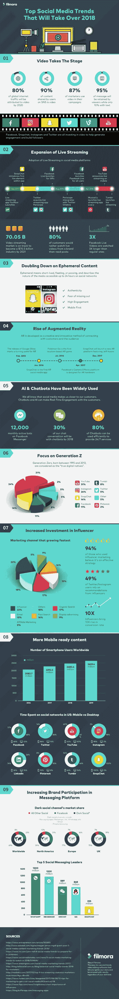

# 2018 年需要关注的 9 大社交媒体趋势

> 原文：<https://medium.com/swlh/9-social-media-trends-to-pay-attention-to-in-2018-61f2a4146d2c>

从新功能、消费者偏好到不同的品牌机会，今年有很多东西可以期待，这将帮助每个营销人员制定一个独角兽(可靠)战略，以完善他们的[营销](https://www.inc.com/larry-kim/the-ultimate-40-point-checklist-for-smarter-content-marketing-strategy-infograph.html)计划。

根据 Filmora 的说法，让我们深入了解 2018 年的这些社交媒体趋势，看看你如何才能获得优势，并将其用于你的业务。

# 1.录像

根据最新统计，2020 年，全球互联网总流量的 80%将很快来自视频，90%的社交网络用户分享视频，87%的营销人员将视频用于他们的活动，观众认为视频中 95%的信息会留在他们的脑海中。 [73%的 B2B 组织](https://mobilemonkey.com/blog/2018/01/31-surprising-video-marketing-facts-you-need-to-know)在营销活动中使用视频，并报告了积极的投资回报结果。

**温馨提示:**

*   制作一个独特的视频——有“哇”元素的东西总能赢得比赛
*   制作更短、更精确的视频
*   确保在最初的 7 秒钟内吸引观众
*   让它适合移动
*   用不同的内容平台制作不同的视频

# 2.直播

不同的社交媒体平台，如 Snapchat、脸书、YouTube、Twitter、Periscope、Musical.ly 和 Tumblr，都在推广直播的使用。预计到 2021 年，视频流媒体市场将达到 705 亿美元。此外，与纯文本帖子相比，更多的客户会希望观看有吸引力的直播视频。

**温馨提示:**

*   实时流事件
*   做一个现场问答或“如何”流
*   实时流产品的制作
*   产品发布的现场直播
*   直播公司新闻

# 3.短暂的内容

短暂内容是仅在特定时间段内可用的任何可视内容。这些昙花一现的视频和帖子在 Instagram 和 Snapchat 上很出名。品牌可以利用这一趋势，在场景瞬间和里程碑背后发布他们每天的快照。

**温馨提示:**

*   实验。让您的视频独一无二、引人入胜
*   尽可能保持真实和个性化
*   讲述一个故事:娱乐，解决一个问题，或者教你的观众一些新的东西。

# 4.增强现实

增强现实正在彻底改变人们在线社交的方式。营销人员已经尝试 AR 有一段时间了。欧莱雅创建了 AR 应用程序，让用户在购买任何东西之前测试化妆品和发型，事实证明这实际上促进了销售。

**温馨提示:**

*   使用增强现实来吸引你的用户关注你的新产品
*   通过冲动购买增加销售额。
*   鼓励通过你的 VR 应用进行社交分享。

# 5.人工智能和聊天机器人

为了拉近与客户的距离，营销人员使用社交媒体平台为客户创建实时互动，如聊天机器人和人工智能。

**温馨提示:**

*   识别业务问题
*   汇编重要数据
*   生产合适的聊天机器人。
*   挑选最新型号

我希望这是一种趋势，因为我自己的公司 MobileMonkey，Inc .提供工具来帮助营销人员创建聊天机器人。

# 6.Z 世代

被称为“Z 世代”的人是指 1995 年至 2012 年出生的人。他们通常被称为“真正的数字原住民”。他们最常用的社交媒体平台包括 YouTube、Instagram、Snapchat、脸书、Tumblr、Twitter、Other、Pinterest，按确切顺序排列。

**温馨提示:**

*   与影响 Z 世代的人联系。
*   了解他们需要什么。
*   突出真人。

# 7.影响者是增长最快的营销渠道

影响者是增长最快的营销渠道，其他依次是有机搜索、电子邮件、付费搜索、展示广告和联盟营销。使用 influencer marketer 的用户对其结果感到满意，转化率提高了 10 倍。

**温馨提示:**

*   找到合适的影响者
*   个性化你的方法
*   要透明。让有影响力的人容易参与。
*   跟踪你的投资回报率

# 8.移动内容

随着手机用户数量的每年增长，营销人员优化你的内容以更好地适应那些手机用户是非常重要的。移动用户喜爱的前三大社交媒体平台是脸书、推特和 YouTube。

**温馨提示:**

*   移动应用的杠杆作用
*   利用内容管理系统
*   选择滚动而不是分页
*   适合较小屏幕的裁剪图像
*   保持你的标题简洁明了
*   制作高质量的内容
*   为您的移动内容制定战略

# 9.品牌参与

如今，品牌越来越多地参与到信息平台中。前 5 大社交消息领导者是 WhatsApp、Messenger、微信、QQ 和 SnapChat。今年，预计各品牌将投入更多时间和资金，在聊天机器人上使用人工智能、语音助手等信息平台与消费者建立联系，以提供个性化的购物体验。

**温馨提示:**

*   整合个性化体验
*   预测顾客的需求

2018 年为你的创业提供了一个令人兴奋的机会。这 9 个独角兽社交媒体趋势将塑造 2018 年社交媒体的神奇景观。随着时间的推移，关注这些发展，让你的品牌保持领先。

# 做驴海里的独角兽

获取我的最佳独角兽营销和创业成长秘诀:

1.  [**报名直接发到你邮箱**](https://mobilemonkey.com/blog-subscription)

**2。** [**通过 Facebook Messenger 注册偶尔的 Facebook Messenger 营销新闻&提示。**](http://m.me/447438332063924?ref=e58448cdd16367419b279793544e132f5388067506f92c92e6)

# 关于作者

拉里·金是世界上最好的 Facebook Messenger 营销平台提供商 MobileMonkey 的首席执行官。他也是 WordStream 的创始人。

你可以在 [Facebook Messenger](http://m.me/447438332063924?ref=e58448cdd16367419b279793544e132f5388067506f92c92e6) 、 [Twitter](https://twitter.com/larrykim) 、 [LinkedIn](https://www.linkedin.com/in/larrykim) 、 [Instagram](https://www.instagram.com/kim_larry/) 上和他联系。

最初发布于[Inc.com](https://www.inc.com/larry-kim/9-social-media-trends-to-pay-attention-to-in-2018.html)

## 这篇文章发表在 [The Startup](https://medium.com/swlh) 上，这是 Medium 最大的创业刊物，拥有+368，675 读者。

## 在这里订阅接收[我们的头条新闻](http://growthsupply.com/the-startup-newsletter/)。

