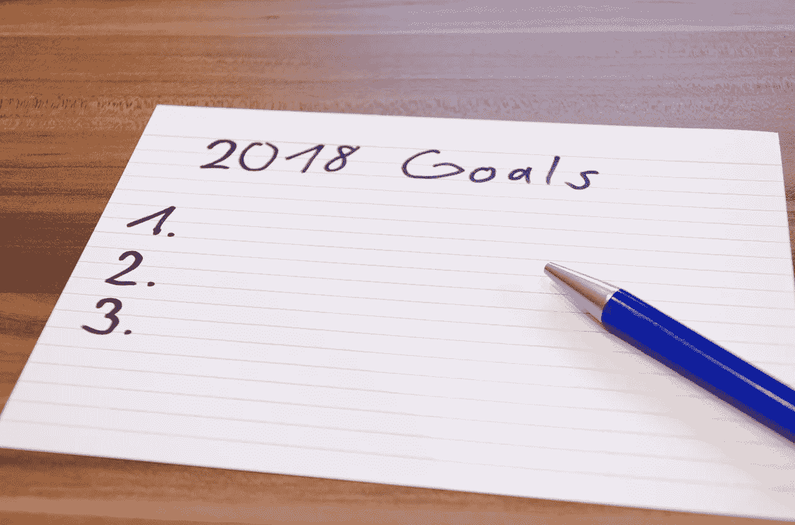
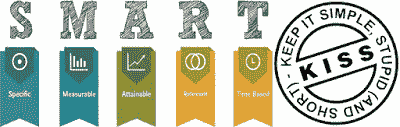
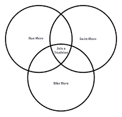
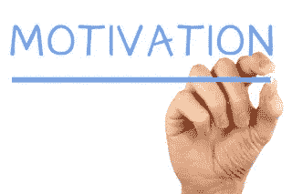
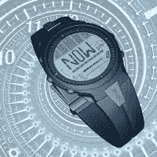
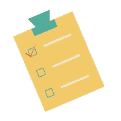
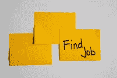
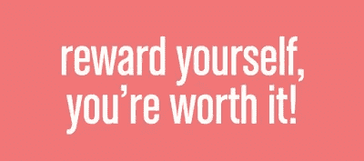
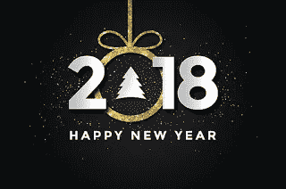

# 9 步踢屁股指南:如何制定你的 2018 年新年决心，如何让它们像胶水一样粘在一起

> 原文：<https://medium.com/swlh/9-step-kick-butt-guide-how-to-make-your-2018-new-years-resolution-and-how-to-make-them-stick-like-6e974d824d1e>

# 2018 年最重要的新年决心

2018 年到了，我敢打赌，你们很多人已经列出了今年的新年计划。YouGov 在网上调查了人们的新年决心。在接受测试的样本中，只有 32%的人下降了，这意味着大多数人仍在为下一年制定目标。

排在调查结果(请击鼓)前面的是:吃得更好、多锻炼、少花钱，这三项在 37%的受访者中并列第一。

显然，更好的健康再次成为今年的首要任务，其次是令人惊讶的以关系为中心的目标。

以下是调查中发现的其他决心:

自我保健(如获得更多睡眠)——24%

多读书——18%

学习一项新技能——15%

找到一份新工作——14%

结交新朋友——13%

新爱好——13%

更注重外表——12%

关注关系——12%

减少吸烟/饮酒——9%

多约会——7%

较少关注外表——3%

# 注定要失败

这些都是很棒的决心，但是令人悲伤的事实是 80%的新年决心早在二月就失败了。所以问题是，是什么阻止我们实现我们的决心？为什么我们每次都失败？许多人说这很复杂，但最简单的答案是缺乏自律。

自律不是与生俱来的本能。我们通过让自己经受改变本性的不适来建立自律。我们一次一个挑战来建立自律。一个挑战就够难的了，更不用说一大堆挑战了。难怪我们每次都输。我们列出了这么多我们知道自己做不到的决心，这让我们注定失败。

时机。为什么我们要等到 1 月 1 日才下定决心？我们的思想和身体是否为一年的第一天做了更充分的准备？年初是开始的好时机。但是，如果你想变得更好，你不需要等到 1 月 1 日。你现在可以开始了。

燃尽。菲律宾人有一个表达“Ningas Cogon”。Cogon ( [白茅](https://en.wikipedia.org/wiki/Imperata_cylindrica))是一种高叶片草，干燥时极易燃烧，ningas 的意思是火焰。Cogon grass 非常易燃，它可以快速而猛烈地蔓延，但像燃烧一样很快就会熄灭。开始的时候，我们太努力了，可能会受伤。经过几周的相同循环后，它会开始变得不那么重要，直到动力消失。你的 cogon 草烧掉了。

# 那么，我们能做些什么来帮助自己实现新年决心呢？

1.聪明的吻。让你的目标简单、具体、可衡量、可实现、现实且有时限，你不需要成为火箭科学家。把你的决心当作你可以长期跟踪和衡量的计划或目标。对于每一个目标，你都可以列出实现它们所需的小步骤。朝着你的目标迈出一小步远比在墙上贴一张简单的清单更有效。

添加标题

2.专注于一个单一的但却是多重关联的目标。现实一点。新年决心不是你妈竞赛。你不需要和别人竞争谁的清单最长，或者谁的决议最糟糕。你的新年决心是你为自己设定的一年内要实现的目标。投入越多，到年中失去兴趣的概率就越高。取而代之的是，专注于单一但多重关联的目标。多重关联目标是一个包括实现子目标的计划。多重目标的一个很好的例子是参加三项全能运动。你可以将此与跑步、游泳、多骑自行车和减肥联系起来。

3.动机。你为什么要制定这些决心？对你有什么好处？动机是你的燃料，你的驱动力。如果你不清楚自己的动机，你就会失去兴趣。没有清晰，在艰难时刻很容易放弃。一个有效的动机是预防心脏病和肥胖相关疾病。锻炼和减肥的好处远远超过医疗和住院费用。拥有健康的身体也能提高整体的幸福感。获得更多锻炼的好动机，对吗？

4.腾出时间。这里是大多数人失败的地方。我们犯了不合理的优先顺序。大多数时候，我们不做决定的借口是没有时间。然而，我们有时间做一些有趣的事情，比如购物、疯狂观看和玩电子游戏。对于健康锻炼相关的目标，最佳时间取决于你的生产周期。选择一个你能坚持的时间，让它成为一个固定的习惯。

5.衡量成就。如果可能的话，创建一个带有目标日期的时间表或里程碑。这些是你实现目标的小步骤。记录每一项成就。当我们取得少量成功时，我们的大脑会释放多巴胺。多巴胺是一种影响情绪、快乐和痛苦的化学物质。当我们感受到多巴胺的影响时，我们想要重复触发其释放的行为。

6.提醒自己。有时候你会犯错误，没能完成你的计划。这很自然，没有计划是完美的。为了让你回到正轨，你需要提醒自己你的目标。把你的时间表或清单放在一个显眼的地方，让你每天都能看到。这会提醒你已经走了多远，离目标有多近。

7.找个朋友或加入一个团体。加入一个团体或者找一个有相似目标的朋友。你现在的优势是让别人激励你去实现你的目标。作为回报，你们也互相制约和激励。分担负担让每个人更容易承受挑战。

8.分享你的经历。通过社交媒体与他人分享你的经历。这也是记录你进步的一种方式，也是激励他人的一种方式。写下这些挑战以及你是如何克服它们的。在某个地方，有人正面临着和你一样的挑战。你可以成为他们克服挑战的灵感。

9.奖励自己。除了每次达到里程碑时感觉良好之外，奖励自己。不断激励自己，为每一个小小的成功提供积极的激励。

# 祝我们的新年计划好运

无论是更好的健康还是财务成功，正确的规划和执行将帮助你实现 2018 年的目标。这是我今年的模板。你也可以使用它。如果对你有用，请告诉我。

## 这个故事发表在 [The Startup](https://medium.com/swlh) 上，这是 Medium 最大的创业刊物，有 280，345+人关注。

## 订阅接收[我们的头条新闻](http://growthsupply.com/the-startup-newsletter/)。

