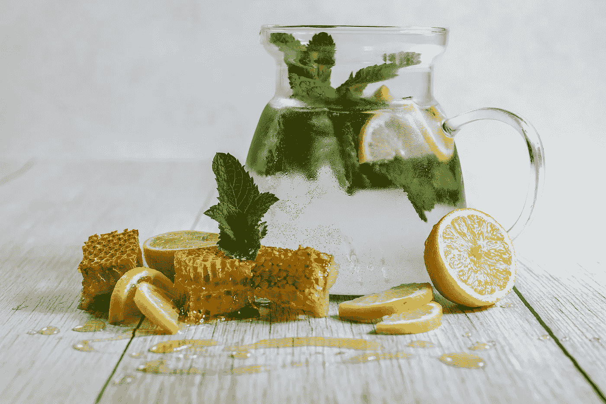
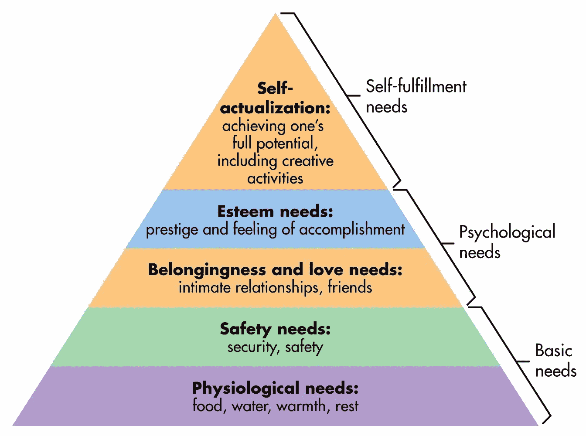

# 每个人在早上 9 点前可以做的 9 件事

> 原文：<https://medium.com/swlh/9-things-everyone-can-do-before-9am-6263983000ee>

> 满足感在于努力，而不在于获得。全力以赴就是胜利。”
> 
> ***圣雄甘地***

21 世纪的生活是忙碌的。生活充实，时间不在我们这边。全职工作、孩子和社会责任意味着我们留给自己的空间和时间往往很少。

看起来我们几乎没有成长的机会，对吗？我们怎么做呢？如果我们没有弄清楚，在我们知道之前，一天、一周、一个月都会过去，我们所做的就是…起床、去工作、完成我们的职责。

在我们意识到这一点之前，我们已经眨眼快进了 25 年，然后站在尘土中，想知道时间都去了哪里。

> **“昨天不是我们能挽回的，但明天是我们能赢或输的”**
> 
> ***林登·约翰逊***

通过在醒来后立即变得高效和积极来赢得一天，这是我们周围的一个信息，它不是一个新的意识形态。

及时行乐？为此我们要感谢霍勒斯。

这是一个信息，我们被它包围是有原因的:这是一个事实。更重要的是，只要稍加努力，产出就可以是投入的十倍。

但是有一句话很好:行动胜于语言。

因此，让我们把上午 9 点作为一个工作日的平均开始时间，并从那里倒推。如果你是一个早起的人，那么奖励会指向你，但是早起和晚上睡个好觉可能并不等同于某种生活方式，所以有必要找到平衡。

我们必须用专注和价值来塑造我们的日子。如果我们想有所成就，那么我们需要明白如何最好地利用我们所拥有的时间。

首先要做的是:

# 重新校准

就像穿上一双拖鞋，滑入一个舒适的常规很容易做到。我们大多数人都有自己的惯例，而这些惯例很可能不费吹灰之力。

但秘密是:我们必须付出一点努力。我们投入的精力越多，最初投资的回报就越大。这是一个自我实现的预言。为此，我们需要奠定新的基础。

# 21 世纪债务与使命:你

这篇文章是战斗的号召。

这就是 **Mission: You** ，它旨在帮助培养一种更充实的生活方式，这种生活方式最终将成为你的第二天性。

你的休息时间过得好吗？自觉花了？或者，像我们中的许多人一样，你已经不知何故地习惯于用分心和无关紧要的活动来填满你的时间？一个小时浏览搞笑视频？上传太多猫咪视频？过于频繁地暴饮暴食？有趣的事情，但在所有的大计划中…毫无结果。

这是 21 世纪的债务。我们把越来越多的时间花在无意义的事情上，并对其产生了利息，这只能通过一种方式来回报:在我们剩下的时间里，对我们所花的东西做出更明智的选择。

但是我们必须有意识地做出改变的决定。

事实是:我们都是自己命运的主人。

这意味着**你**是你命运的主人。掌握自己的命运始于心态。

相信你。

这是另一个事实:小的变化累积起来会有很大的不同。

随着新的一年的到来，为什么不给自己设定一个小目标，尝试对你舒适的日常生活做一点小小的改变呢？用一双新鞋替换那些你喜欢穿的舒适的旧拖鞋，很快你会发现你也喜欢穿它们。只是，那双新拖鞋会是 2.0 版本。超级你穿的超级拖鞋。

只需要每天早上花几个小时做 9 件简单的事情，用 9 个简单的词来概括:

1.  冬眠
2.  水合物
3.  沉思
4.  使活动
5.  鼓舞
6.  大口吞食
7.  刺激
8.  评价
9.  促进

# **获得 7-8 小时不间断的睡眠。冬眠]**

充足的睡眠是一个基本的需求。我们的蜡烛不是为了两头燃烧而设计的。马斯洛(1943，1954)确定了人类需求的五个层次:

Maslow’s Hierarchy of Needs

这个层次的基础是我们的生理需求:那些我们离不开的东西。食物，水，温暖，休息。这些都是**基本**需求。

在英国，皇家公共健康协会已经认识到，人们平均每晚睡眠不足近一小时。这相当于每周失去一整夜的睡眠。我们 21 世纪的债务？这是从一开始就积累的。

睡眠不足也有连锁效应:

*   较差的饮食选择
*   更高水平的压力
*   注意力不集中
*   患癌症和中风的风险更高
*   体重增加
*   免疫力下降
*   性欲降低
*   情绪波动
*   冲动
*   物质依赖性
*   记忆力下降
*   交流、创造力和社会化减少

另一方面，充足的睡眠有很多好处*:

*   压力更小
*   增加创造力、交流和社会化
*   新陈代谢更好
*   抑郁的风险更低
*   降低癌症和中风的风险
*   运动后体重减轻，肌肉增加更多
*   提高记忆力
*   免疫力增强
*   炎症更少
*   更稳定的情绪
*   更有可能有更好的饮食
*   少冲动

对于成年人，我们一般需要 7-9 个小时。充足的睡眠是这篇文章中确定的 9 个步骤成功的基础，所以关键是倒着做。7 小时、8 小时还是 9 小时能让你更好地工作？也许你需要更少，或者更多？关键是:如果你想在早上 5 点醒来，充分利用清晨的时间，那么在凌晨 1 点睡觉是没有用的。

记住:**重新校准**。如果你需要 8 个小时，并且想在早上 5 点开始工作，那么应该在晚上 9 点熄灯。

这里需要注意的另一件事是**裸睡**的价值。睡觉被证明是非常健康的。

裸睡有助于降低体温，由于皮质醇水平较低，较低的体温会带来更好的睡眠。皮质醇水平较高会导致焦虑和不安。皮质醇是压力荷尔蒙。

褪黑激素和生长激素的产生和释放也受到较高温度的影响，所以脱掉衣服只会有助于神奇的生长激素发挥其魔力，帮助你更长时间地保持年轻。事实上，HGH 也是减肥和增肌的内在因素。

其他优势包括:

*   增强信心
*   更高的性欲和更好的性生活
*   改善新陈代谢
*   血液循环增加
*   更健康的皮肤

最起码，由于更好、更深的睡眠，你的压力也会更小。

# 一杯水是你新的最好的朋友。水合物]

根据欧洲食品安全局(EFSA)的数据，成年男性和女性平均每天分别需要摄入 2.5 升和 2.0 升水。自然水合委员会在这里提供了进一步的简明指南。

所以，一旦你醒来，马上起床，喝一小瓶水。早上第一件事就是喝一瓶 500 毫升的水，它可以做很多事情:

***火起新陈代谢***

发表在《临床内分泌学杂志》上的一项研究发现“饮用 500 毫升水可以提高 30%的新陈代谢率”

***排出体内毒素***

肾脏从血液和尿液中清除毒素和废物，并处理来自肝脏的水溶性毒素。没有适当的水合作用，肾脏将没有足够的液体来完成它们的工作，因此，身体不会通过尿液排出废物，而是将废物保留下来。

***给你补水***

自从你 7-9 个小时前睡觉以来，你没有摄入**任何**液体。如果你需要更多脱水的证据，检查一下你尿液的颜色。

***让你不吃太多***

这里的逻辑很简单:如果你的胃里充满了零卡路里的物质，你就不太可能感到饥饿，并且由于缺乏卡路里，也不太可能增加体重。

***刷新和提高大脑功能***

大脑 75%是水，是身体中脂肪最多的器官。没有水，你会感到无精打采，注意力不集中，更容易情绪波动。

**日本水理论**在醒来时饮用 800-1.2 升室温/温水同样有益，如果不是更有益的话。除了以上所述，据说:

*   帮助清理结肠
*   降低头痛的风险
*   给皮肤健康的光泽
*   清除体内的废物
*   提高免疫力
*   帮助缓解糖尿病、肾结石、哮喘和心绞痛等疾病。

我们的身体 70%以上是水；我们实际上是由这些材料组成的。

# 理清思路，集中注意力。沉思]

艾德·兹威克在 2003 年制作了他的第一部汤姆·克鲁斯电影。受西乡隆盛领导的 1877 年萨摩起义的启发，*最后的武士是一部历史史诗，讲述了美国髑髅地的船长内森·阿尔格伦(克鲁斯饰)冒险去日本帮助训练帝国士兵对抗反叛的武士的故事。在第一次冲突中，他被俘虏了，但并没有得到他期望的待遇，而是被邀请去了解武士的方式，并被当作客人对待。*

*他最早的课程之一是清理他的头脑:*

*信达:“请原谅……太多的介意。”*

***阿尔格伦**:“头脑太多？”*

***信田**:“海(*是*)。介意剑，介意人看(*看*)，介意敌人，太多介意。不介意。”*

***阿尔格伦**:“没头脑？”*

***信田**:“不介意。”*

*年轻的武士伸田和阿尔格伦之间的交流是思考冥想的一种奇妙方式。如果有太多的事情充斥着你的头脑，它们会分散你的注意力，破坏你的注意力。“太多心思”会让人分心——以“没有心思”为目标。*

*清晨/醒来后立即冥想是培养积极性的好方法。冥想的一个方法是专注于那些带给你快乐和你感激的事情。*

> *感恩是对善良的肯定。我们肯定世界上有美好的事物，我们收到的礼物和好处。”*
> 
> ****罗伯特·埃蒙斯****

*带着感激和感恩的心情开始新的一天，会让你更有可能吸引积极和宇宙所能提供的最好的东西。感激产生感激:它有吸引力和感染力。*

# *锻炼。激活]*

*根据英国心脏基金会的'[身体不活动报告 2017](///Users/taylorboxall/Downloads/physical-inactivity-report---mymarathon-final.pdf) '，英国约 39%的成年人未能达到政府对身体活动的建议。在 6500 万人口中，有 2000 多万人不够活跃。*

*换句话说，世界卫生组织将久坐行为列为全球十大死亡原因之一。*

*如果你想增加你的健康、快乐和生产力，那么没有时间可以浪费了:立即熟悉一个有规律的锻炼程序。这并不意味着带上莱卡、头灯和反光臂带，在寒冷的仲冬凌晨 5 点出发去跑步。带你去健身房或游泳池，或者去上一堂瑜伽课。或者呆在家里，看你的《疯狂》,放弃穿任何健身装备。*

*关键是要行动起来。*

*体育活动的好处是无穷无尽的，无需介绍。但是如果你需要更多一点的灵感，早上锻炼 60 分钟可以带来:*

*   *压力更小*
*   *更大、更敏锐的关注*
*   *失重*
*   *肌肉生长*

*听起来不错吧？善待你的身体，作为回报，它也会善待你。*

*使用它或失去它，我的朋友。*

# *洗掉。振作起来]*

*一旦你穿上汗衫，就该脱下来了。但是，如果你认为锻炼是一包很难打开的饼干，这一个将事情提升了一个档次。*

*有没有在桑拿浴中度过一段时间，然后在一个舒适的冰冷的湿死桶中冷却下来？或者在洗头发的中途热水用完了？一瞬间，世界末日了吧？*

*但是[冷水淋浴](https://www.ncbi.nlm.nih.gov/pmc/articles/PMC5025014/)已经被证明有很多积极的效果，每天早上选择拥抱寒冷一会儿实际上会对你的健康有很大的积极影响。他们可以:*

*   *培养意志力*
*   *加速肌肉恢复*
*   *缓解[抑郁症](https://www.ncbi.nlm.nih.gov/pubmed/17993252)*
*   *提高你的警觉性*
*   *提高免疫力和循环*
*   *增加睾丸激素，提高生育能力*
*   *改善皮肤和头发*

*可能需要钢铁般的意志才能将刻度盘从红色转到蓝色，但是几股交替喷射的冷水将会持续不到一分钟。洗完澡，你会感到兴奋，精力充沛，为新的一天做好准备。*

# *吃一顿富含蛋白质、缓释碳水化合物和有益脂肪的健康早餐。in gurtitate]*

*好吧，所以我很难找到一个以-ate 结尾的单词来形容这个单词。我说的是加油。我说的是…*

***早餐。***

*早餐可能是一天中最脆弱的一餐。它是我们给予身体的第一种燃料，所以要正确使用它可能会很困难，或者很无聊。或者两者都有。我们都是大忙人，跳过**一天中最重要的一餐**很容易做到，当然也很容易被忽视。*

*众所周知:*

*   *含糖谷物。*
*   *黄油白面包吐司。*
*   *办公室甜甜圈和一杯拿铁。*

*…是不好的。并且:*

*   *燕麦片*
*   *蛋*
*   *希腊酸奶*

*…很好。但是我们如何取得平衡呢？*

*有大量的研究告诉我们什么是好的，什么是坏的，但正如任何膳食计划和宏观计数一样，我们越深入研究，确定似乎变得越来越复杂。*

*佛罗里达州坦帕应用科学和性能研究所骨骼肌和运动营养实验室主任雅各布·威尔逊教授建议，早餐摄入 30-40 克蛋白质、30 克以上的缓释碳水化合物(燕麦片是一种简单的食物)和 20 克脂肪(坚果、种子),以获得清洁、持久的能量和优质营养。*

*对我来说，那是一个 5 个鸡蛋的煎蛋卷和一小碗杏仁牛奶煮燕麦，上面放一勺坚果黄油。换句话说，每天都是圣诞节。*

# *听一些能让你前进的东西。激励]*

*你偏爱有声读物吗？某个播客？一点点 ABBA 金？*

*试着在上班的路上听一些既振奋人心又有教育意义的音乐，你将会增加额外的认知刺激。*

*如果一本有声读物的平均长度是[大约 11 个小时](https://www.voices.com/resources/articles/audiobooks/budgeting-for-an-audiobook)，而每天通勤的平均长度是[90-120 分钟](http://tbox.blog/2017/11/20/how-to-learn-a-foreign-language-in-30-minutes-a-day/)，那么一周看完一本书，或者刚刚超过，是非常可行的。在一年的时间里，你可以再挤出 50 多本书。*

*从很少的投入和很少的不便中获得了有价值的收获:花在等待上的时间是浪费时间。*

*更重要的是，你会感觉很好:你会带着娱乐*和*的心情去上班。*

# *考虑你的目标。评估]*

*记录下你想要实现的事情，包括长期和短期的。理想情况下，每天晚上写 5-15 分钟的日志可以让你吸收想法。这也能让你突出更紧迫的目标。*

*每天早上，回顾它们。花几分钟时间通读它们将有助于为一天提供目标，并给它一个视角。*

*更重要的是，定期或每天考虑长期目标会鼓励你经常思考它们。与他们接触将有助于实现他们的心态，并推动你这样做。*

# ***及时行乐。便利]***

*抓住。的。日。*

*你走过 8 个步骤来到这里，现在还不到上午 9 点。你已经醒来，补充水分，冥想，锻炼，洗漱，吃了一顿健康的早餐，回顾了你的目标*并且*学到了一些东西。你已经完成了重要的事情，你还有一整天的时间。*

*祝贺你，你今天赢了。现在，用你那双有力的冠军之手去碾碎它吧，你会安全地知道，今天早上你播下的种子将会开出美丽的果实。*

*完成以上所有工作后，你会发现你的注意力更加集中，工作效率更高，并且有充足的动力让你不断前进。向上。*

# *结论*

*到了早上 9 点的时候，想想在你的大多数同事还没有想到抓住这一天之前，你已经取得的所有成就。你将为成功的一天打下基础。*

*你会感觉更有动力，工作得更好，散发出更多的积极性，通常会成为我们之前提到的赢家。*

*更重要的是，你很快就会看到生活中真正的变化。你会吸引更多你想要的东西，你会做更能刺激你的工作，你的人际关系会变得更牢固、更深刻、更充实。*

*[吸引力定律](http://www.thelawofattraction.com/what-is-the-law-of-attraction/)指出，宇宙展现了我们付出精力和关注的事物，它将奖励你更大的成功和幸福，而这一切只不过是你如何开始一天的微小变化的种子。*

*   *为了进一步了解睡眠的好处，RSPH 出版了一本有趣的指南[。](https://www.rsph.org.uk/uploads/assets/uploaded/50220c8f-febb-416e-8f3f7a4d2f973897.pdf)*

**

## *这篇文章发表在[《创业](https://medium.com/swlh)》上，这是 Medium 最大的创业刊物，拥有 277，994+读者。*

## *在这里订阅接收[我们的头条新闻](http://growthsupply.com/the-startup-newsletter/)。*

**