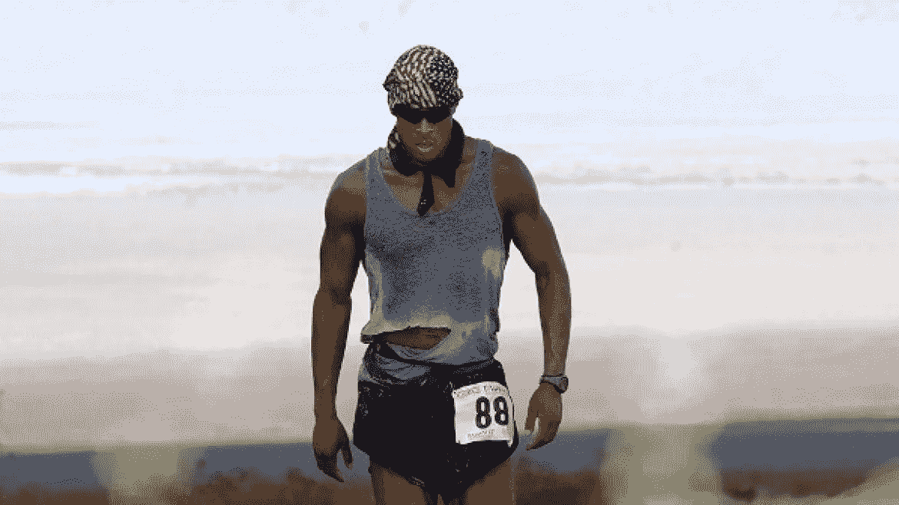
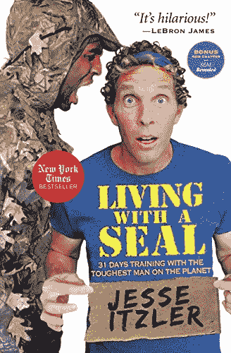

# 和海军海豹突击队一起生活你可以学到的 8 件事

> 原文：<https://medium.com/swlh/9-things-you-can-learn-from-living-with-a-navy-seal-342d994cad13>

我们大多数人都陷入了常规。我们每天早上都做同样的事情——无论是和家人一起起床，锻炼身体还是直接去上班——通常变化不大。

杰西·伊茨勒陷入了这个陷阱。伊茨勒共同创立了马奎斯喷气机公司(卖给了沃伦巴菲特)，帮助开创了济科椰子水公司(卖给了可口可乐)，目前拥有亚特兰大老鹰队。在业余时间，他跑超级马拉松。他不是那种你认为需要“改变现状”或变得更健康的人。

但他不是这么看的。他知道他需要改变。

所以，像任何正常人一样，Itzler 去了当地的健身房，并聘请了一名教练，对不对？不对。

相反，他冷不防地给前海军海豹突击队——可能也是当今最强硬的人——大卫·高金斯打了电话。他让 Goggins 和他及他的家人一起住 30 天。等等，什么？

伊茨勒在他的书《与海豹一起生活》中写下了这段经历

我看了，所以你不用看了。

我非常喜欢这本书，不到两天就看完了。我爱不释手。

尽管我并不建议你也这样做，这里有 9 种方法可以帮助你突破到下一个层次。

*“我人生中的大部分成功都来自于学会如何在不舒服的时候感到舒服。就像我说的，我只想变得更好。”——杰西·伊茨勒*

# 承诺你的决定

伊茨勒第一次遇见戈金斯是在一次超级耐力赛上。该赛事是一场 24 小时接力赛，每支队伍在 24 小时内围绕一条跑道尽可能跑多英里——目标是 100 英里。

高金斯在那里，但他没有团队。他已经一年多没穿跑鞋了。事实上，他在这场比赛中的所有装备就是一把椅子、一个水瓶和一些饼干。他体重 260 磅，训练时间都花在举重上，而不是跑步上。他需要在 24 小时内完成 100 英里，以便有资格参加进一步的比赛，帮助他为特种作战战士基金会筹集资金。

他在 13 小时内跑完了前 70 英里。他领先了，但身体垮了。他摔断了脚上的每一根骨头，并出现了胫骨夹板和肌肉撕裂。他把血尿到了腿上，因为他的身体不能去厕所。

不知何故，他完成了 100 英里的任务。

伊茨勒看到了这种纯粹意志的展示，并决定他需要一些高金斯有的东西。

# 走出你的舒适区

Itzler 有这样一个习惯，他会给印象深刻的人打电话，并请求成为他们的朋友。这就是我在播客上做的事情。我找到我印象深刻的人，用 30 分钟的采访来掩饰我对他们生活的好奇。

他不仅会打电话给高金斯，还会飞到全国各地与他会面，并提出他的想法:他会付钱给高金斯，让他和家人一起住一个月，并对他进行精神和身体上的训练。

戈金斯同意遵守一条规则:伊茨勒必须照他说的做，没有例外。

游戏开始。

# 控制思想

第一天，高金斯和伊茨勒去外面跑步。不错吧？

这发生在 2010 年 12 月的纽约。这是该市有记录以来降雪最多的一个冬天，仅仅呆在户外就被认为是危险的。如果你认为那会改变计划，你不了解高金斯。

外面的温度是 14 度，Itzler 试图逃脱，向 Goggins 展示了这一温度。

高金斯回答说:“温度是你认为的温度。”

高金斯能做出不可思议的事情的主要原因是他控制自己思想的不可思议的能力。

> “享受这狗屎。如果你想要七十岁阳光明媚，那就七十岁阳光明媚。快跑吧。元素在你的头脑中。我跑步时从不检查温度。谁在乎电脑上的温度是多少？电脑不会在外面运行吧？”

# 最低纲领

Goggins 也在第一天出现在 Itzler 家，没有行李，没有手提箱，在寒冷的冬天也没有穿外套。事实上，他整个月几乎每次锻炼都穿着同样的 t 恤和短裤。

伊茨勒(和我)开始羡慕戈金斯在日常生活中完全不依赖于实物。

我需要去一趟慈善机构。

# 没有借口

正如你所想象的，没有什么能打断 Goggins 每天的锻炼计划(是的，他们整个月每天锻炼 2-3 次)。而不是天气、旅行或任何其他变量。

一个很棒(也很搞笑)的例子是 Goggins 的 burpee 测试。很简单:尽可能快地打 100 个嗝。难题:Goggins 告诉 Itzler 在他工作的一个大型会议的短暂休息时间做这个练习。我想他低估了 Goggins 所说的无所不能是什么意思。

伊茨勒在他的办公室脱到他的拳击短裤，以最快的速度打了 100 个嗝。

没有借口。

# 锻炼

有时候，我觉得人们把健身过度复杂化了。我们脑子里太多关于我们需要举起多少重量，我们需要以一定的速度跑多少英里，锻炼应该多长/多短，等等。

正如德怀恩“岩石”强森的教练比利·贝克三世所说——健身不是为了看起来漂亮。是为了提醒你你是谁。

Goggins 保持简单。

每天早上他们跑 6 英里多(显然是在雪地里)。

每天晚上他们跑 3 英里多(也是在雪地里)。

在此期间，他们做了大量的俯卧撑、引体向上、打嗝和仰卧起坐。

足以摧毁伊茨勒的身体。

没有花哨的机器或时髦的运动。

你不需要花里胡哨才能健康。

# 迈出你的第一步(以后再想办法)

在整本书中，伊茨勒讲述了几个他如何发展自己企业的故事。

伊茨勒年轻时经营一家媒体公司。该公司与 Foot Locker 公司签订了一份电台广告合同，条件是 Itzler 公司提供格兰特·希尔作为赞助商。希尔刚刚赢得了 NBA 年度最佳新秀，引起了全国的轰动。唯一的问题是:伊茨勒以前从未见过希尔。

Foot Locker 首席执行官告诉 Itzler，他有 48 小时的时间让 Hill 签字，否则交易取消。

伊茨勒用他有限的钱飞到奥兰多的体育场，那天晚上希尔将在那里比赛。伊茨勒一整天都在等希尔出现。当他见到他时，他声称他已经和他的经纪人谈了一整天了(不是真的)，并且为 Foot Locker 做一个快速剪辑是他合同的一部分(也不是真的)。

希尔勉强同意了，音频剪辑第二天就上线了，伊茨勒挽救了这笔交易。

20 多年后，希尔和伊茨勒一起经营亚特兰大老鹰队。

这个故事很棒，但真正让我兴奋的是，Itzler 在他的职业生涯中一次又一次地做着同样的事情。

不惜一切代价。

# 简单是关键

伊茨勒和他的妻子萨拉·布雷克里(Spanx 的创始人，本身就是亿万富翁)和朋友们一起参加一年一度的新年晚会。这恰好是高金斯和他们住在一起的月份，他们热情地邀请他。

按照老套的方式，每个人都绕着圈子兜售他们的新年决心。

这些决定包括从创业到搬到葡萄酒之乡。

当轮到高金斯时，每个人都坐立不安。

他的回答很简单:

“我不是在找别的东西。我要做我一直在做的事情——只是做得更好。”

他的简朴中有一种真正的美。不想要物质，只想成为更好的自己。

# 结论

这本书很棒。它很有趣，鼓舞人心，讲述了一个伟大的故事。

它教会了我精神控制的力量，简单和不断努力变得更好。

当有疑问时，过度承诺，然后再解决剩下的问题。

抱歉，我要去打电话给 Itzler 做我最好的朋友…

# 想让你的游戏更上一层楼吗？

# [在这里注册我的时事通讯](http://eepurl.com/c-46aj)

# 关于作者

[汤姆·阿莱莫](https://www.linkedin.com/in/tom-alaimo-573a1878/) *是一位充满激情的 B2B 销售专家。他目前是* [*TR Talk 播客*](https://soundcloud.com/ryan-warner-799706255) *的主持人，在这里他帮助千禧一代快速跟踪他们的个人发展。Tom 也是 TechTarget 的客户经理，住在旧金山。*

[网站](http://tomalaimo.com/) | [播客](https://soundcloud.com/ryan-warner-799706255) | [邮箱](mailto:thomasalaimo7@gmail.com) | [推特](https://twitter.com/TomAlaimo_TTGT)|[LinkedIn](https://www.linkedin.com/in/tom-alaimo-573a1878/)|*|*|[脸书](https://www.facebook.com/thomas.alaimo.12) | [Instagram](http://instagram.com/talaimo7) | [媒体](/@TomAlaimo_TTGT) |

## 这个故事发表在 [The Startup](https://medium.com/swlh) 上，这是 Medium 最大的创业刊物，拥有 324，834+人关注。

## 在这里订阅接收[我们的头条新闻](http://growthsupply.com/the-startup-newsletter/)。

