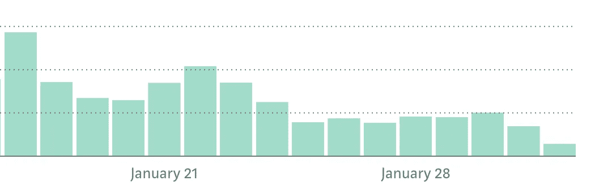
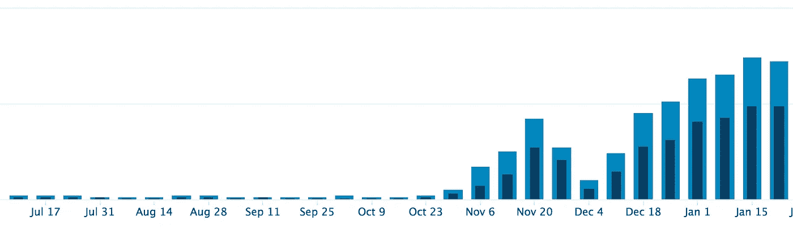

# 帮助我度过第一次倦怠期的 9 条建议

> 原文：<https://medium.com/swlh/9-tips-that-helped-me-survive-my-first-burnout-b3d5338fdab6>

现在我终于从最近的倦怠中走了出来，我想分享它对我的动力产生的影响，并提供一些帮助我摆脱它的提示和技巧。

这是一年来我第一次决定完全放下工作休息两天。我没有回复任何邮件。我没有写任何内容，也没有理会任何电话。

说我有点焦虑是一种保守的说法，但我知道我为什么这样做。我必须摆脱我的倦怠。我没有任何进展。事实上，我倒退得很快。

2017 年初，我决定不懈地追逐我的目标。由于对这种想法完全陌生，我天真地认为我可以 24/7 都这样做。我照做了。一年了。

直到大约两周前。当我撞车的时候。

我开始注意到我的日子充满了拖延和分心，以至于我花了 6 个小时写了一篇博客。相比之下，我通常需要 1.5 小时。

我一直在努力，因为我在听励志演说家讲话，并照他们说的去做。他们告诉你每天都要工作，一整天，不管你有多累。这一切都很好，除了它实际上并不像那样工作，而且大多数高层发言人都会请假。以 Gary Vaynerchuck 为例，他周末不工作。我是他和他作品的超级粉丝，但你不能总是照字面理解他说的话。他夸大其词来证明一个观点。

但是我接受了顶级演讲者的说教，每天工作，一整天，持续了一年，当我精疲力尽时，我终于屈服了，休息了一会儿。

现在我已经休息了一天，我可以看到我是多么需要一个，尽管它只是一个小东西，但它现在已经完成了任务…

在我介绍我使用的技巧之前，我想让你看看倦怠会对你的动力产生什么影响，这样你就能明白如果你曾经处于这种情况下，它是多么迫切需要解决。

# 中等—统计数据迅速减少

# insta gram——统计数据迅速减少

# 博客——统计数据略有下降

如你所见，我不只是失去了动力。*我倒退了*，我需要尽快摆脱困境，如果我不想再倒退的话。因此，我把注意力集中在帮助我实现这一目标的 9 条建议上，其中一条建议实际上造成了 99%的差异。一旦我完成了提示，就不会再有关于精疲力竭的帖子了，因为是时候向前迈进，开始重新建立动力了。

# 找回你的魔力的 9 个技巧

# 1.改变你的环境

这可能就像改变你的环境一样简单，也许这意味着改变你工作空间的外观，也许这意味着去旅行。对我来说，我计划去泰国旅行。虽然这是一个休息的机会，但我仍然会几乎每天都工作，这只是一个在不同国家工作的机会。

# 2.听励志视频

这对我来说一直都很有效。

当我开始失去动力的时候，我会一边工作一边听励志演讲。这总能重新点燃激情，给我继续努力的能力。请注意，这并不能解决长期的倦怠问题，但它确实能激励我完成当天的所有工作。

我用 Youtube 寻找好的视频，似乎总能回到[这个视频](https://www.youtube.com/watch?v=U8bvb4XD0Zc)。

# 3.排班休息

无论是每天一次还是每周一次，在某些时候你都需要休息。最好是找出你一天中工作最好的时候，并在你通常不会 100%工作的时候计划你的休息。

这么说的话，休息不应该占用太多时间。每天抽出一个小时去阅读或锻炼，甚至只是去兜风。无论什么能让你放松，安排一些时间。只要它能让你远离工作，让你充电。

# 5.阅读你的目标

最重要的一点是，如果你很难做到其他的，就做这个。作为最低要求，你需要在起床和睡觉的时候阅读你的目标。

我也把我的主要目标贴在我一天中花时间的任何地方。在我的书桌上，在我的床边，甚至在我的钱包里。你需要不断提醒自己为什么要做这些。

# 6.回归基础——计划

就像安排休息时间一样，你需要计划好你的一天。我发现当我精疲力尽的时候，我停止了计划，只是浪费时间，这导致我失去了很多动力。

回到[的 15 分钟间隔](https://jessekerema.com/multitasking-habit/)，提前一天计划并保持一致。

# 8.吓唬你自己(对我有效的那个)

这一招很快就奏效了，这也是我不再精疲力竭的原因。你要做的是把自己暴露给你努力不想成为的那种人。你曾经是什么样的人，你日复一日努力摆脱什么样的人。

这是我选择做的事情，因为我想尽快摆脱我的常规。

那我是怎么做到的呢？

在过去的一年里，我已经戒酒并发誓不再参加任何聚会。我只是不喜欢它，但我有一段时间每天晚上都会这样做。两天前的晚上，我重温了那种生活方式，希望它能被用作一种释放，我可以回到正轨。

但它最终服务于另一个目的。

它强化了我做出这些改变的原因，并向我展示了我再也不想成为的那个人。

我知道这很奇怪，但是它真的很有效，现在我已经回到正轨了。

事实证明，有时你所需要的只是一个好的摇动和一个惊吓来解决问题。

# 9.继续推

如果你想要实现你的目标，你需要继续努力。总会有起起落落，如果你认为这很容易，你会不断感到震惊。如果很容易，那就没意思了。追逐目标的起起落落是旅程的乐趣所在。

请记住，任何有所成就的人都经历过精疲力竭，他们只知道他们必须继续努力。

# 谁知道呢，也许这种倦怠意味着你的目标就在眼前。

## 如果你喜欢这篇文章或者觉得它有帮助，按下那个按钮让其他人看看！更好的是，在你的想法上留下评论。

# 喜欢这个故事？[在这里与我联系](http://www.jessekerema.com)

## 这篇文章发表在[《创业](https://medium.com/swlh)》上，这是 Medium 最大的创业刊物，有 292，582+人关注。

## 订阅接收[我们的头条新闻](http://growthsupply.com/the-startup-newsletter/)。

