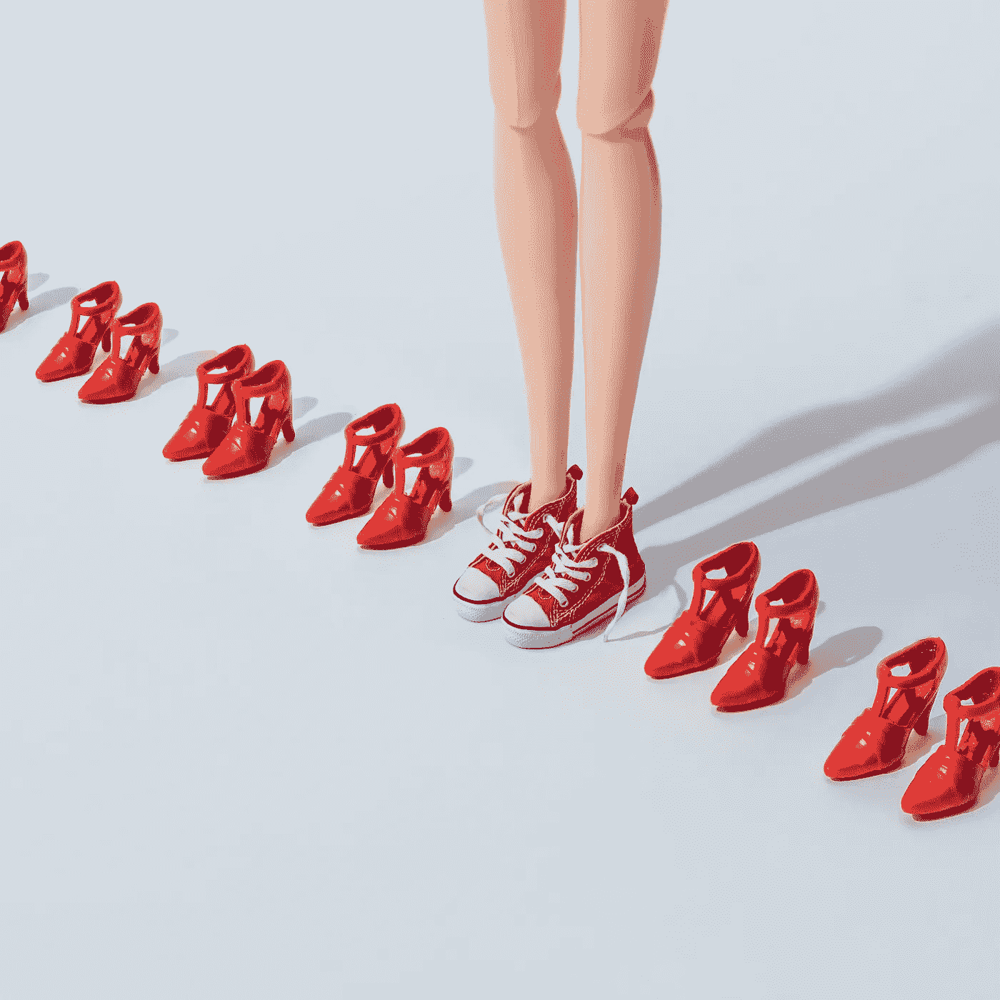
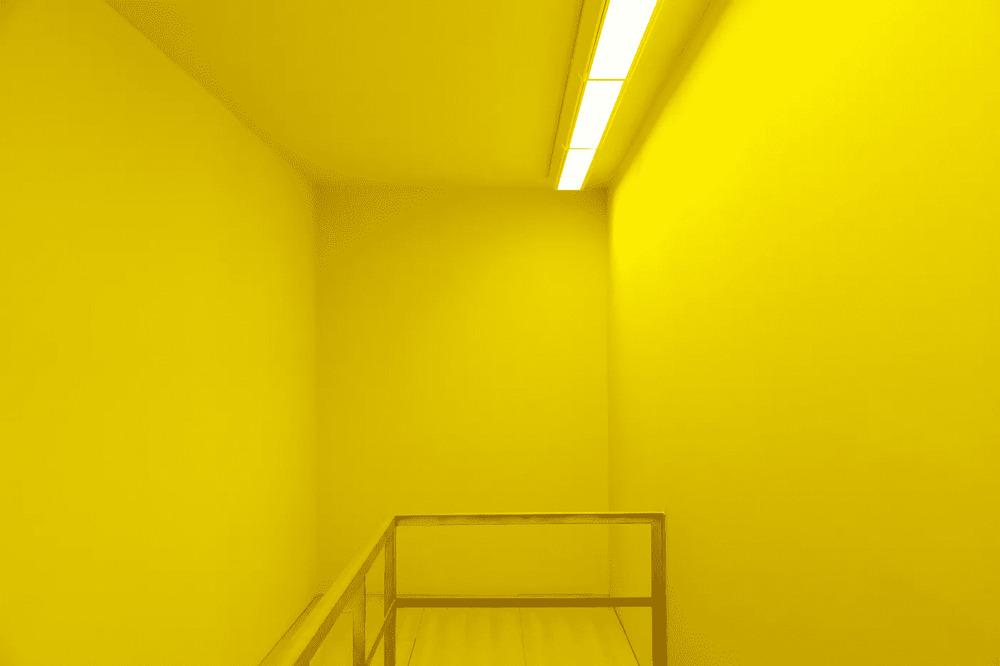

# 2019 年推动您营销工作的 9 大视觉趋势

> 原文：<https://medium.com/swlh/9-visual-trends-to-power-your-marketing-efforts-in-2019-634ae8f720c5>

查看视觉传播的最新趋势，以启发您的内容营销策略。

说到内容营销，每个人都想参与视觉传播的下一个大事件。我们在这里提供帮助，2019 年的[视觉趋势](https://depositphotos.com/trends2019)可以成为你即将到来的项目的灵感点。

新的一年是一个空白页，你可以尝试，我们带来了想法和流行趋势，以帮助您尝试视觉内容。今年在 [Depositphotos](https://depositphotos.com/home.html) ，我们发现了 9 个可能会帮助你在 2019 年改变事情的趋势。我们从一个源于市场营销的趋势开始我们的列表。

# 趋势 1:个性化时代

Photo by Oneinchpunch

直接源自营销趋势的趋势要求对视觉内容采取更加个性化的方法。你如何利用你所掌握的客户信息为他们创造独特的体验？

Photo by Nanihta

Photo by Malyuginphoto

# 趋势二:创造性挑衅

Photo by Zamurovic

一种冒险的趋势，即寻找更好的创造性解决方案，需要做一些大胆和令人难忘的事情，以激发关于你的产品、品牌或事业的对话。跳出框框思考，创造视觉效果惊人的活动。

Campaign by Y&R Prague

Photo by Skynextphoto

# 趋势 3:怀旧闪回

Photo by Faraonsas

根据你的目标受众和他们认为的怀旧时间，过去几十年的参考资料特别有用。从过去汲取灵感，吸引那些欣赏你走老派路线的特定观众。

Photo by Tekillazzz

# 趋势四:拥抱艺术史

Photo by vova130555@gmail.com

另一个流行的灵感点是过去的风格和大师。从社交媒体上可以看出，直接引用古典艺术但带有现代风格的作品在 2019 年很受欢迎，并被一些品牌用于宣传活动。

Photo by KrisCole

# 趋势五:全球审美第一

Photo by alkir_dep

咖啡馆看起来开始变得千篇一律，社交媒体在影响美学方面发挥了重要作用，这种美学正迅速接管世界，塑造我们经常光顾的空间。不仅仅是室内设计，许多创意解决方案都考虑了“不可编程”因素。

Photo by olegbreslavtsev

# 趋势 6:增加交互层

为了让人们关注并参与到内容中，互动元素，尤其是网站可以做到。2019 年的趋势是将整合融入在线推广内容。

Video by mooveen

# 趋势 7: 3D 设计转型

Design by georgejmclittle

平面设计师正在尝试 3D 设计，挑战静态视觉效果。如果您正在处理在线出版物的内容，那么包含 3D 元素会产生更多的视觉兴趣，并且通常是一种时尚。

Design by BugFish

# **趋势 8:极简主义变得哲学化**

Photo by Caiaimage

最简单的照片可以包含微妙的细节，将平淡的视觉提升到更发人深省的东西。极简主义也可以是一个讨论点，如果我们深入我们所看到的表面之下。

Photo by Westend61

# **趋势 9:环保意识的新浪潮**

Photo by EBFoto

塑料垃圾是 2018 年的话题，环境问题正在成为头条新闻，因为现在是采取行动的时候了。大多数消费者更喜欢在社会和环境问题上表明立场的品牌。你的立场是什么，2019 年你会倡导什么？

Photo by Maxoidos

# **访问视觉趋势网页了解更多:**

从数字噪音中脱颖而出不是一件容易的事情，但是我们提供了一种不同的方式来改善你的视觉内容策略。从 [2019 视觉趋势](https://depositphotos.com/trends2019)中汲取灵感，看看你如何将新的想法、运动、风格和美学融入到你的营销策略中，做一些不同的、令人难忘的事情。

## 这篇文章发表在 [The Startup](https://medium.com/swlh) 上，这是 Medium 最大的创业刊物，拥有+400，714 名读者。

## 订阅接收[我们的头条新闻](http://growthsupply.com/the-startup-newsletter/)。

