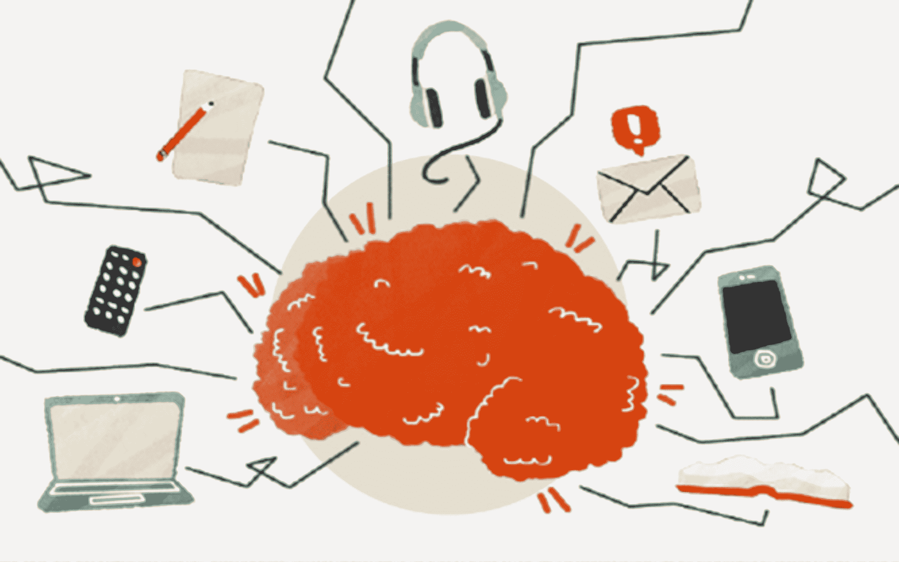
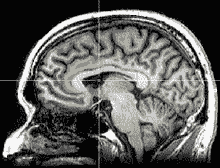

# 根据神经科学家的说法，多任务处理杀死你的大脑和生产力的 9 种方式

> 原文：<https://medium.com/swlh/9-ways-multitasking-is-killing-your-brain-and-productivity-according-to-neuroscientists-b3034d179b16>

[S](https://pixabay.com/)ource: Pixabay

我们愿意认为我们可以在处理重要任务的同时进行多任务处理——回复电子邮件、短信、在浏览器的多个标签之间切换、滚动社交媒体订阅——但是，我们的大脑会说不是这样。

根据神经科学家的说法，我们的大脑并不是一次只能做一件事。当我们试图一心多用时，我们会以负面影响我们的健康、精神表现和生产力的方式损害我们的大脑。

以下是多任务处理杀死你的大脑和生产力的 9 种方式。

# 1.一心多用会导致永久性脑损伤

英国苏塞克斯大学的一项研究比较了参与者的大脑结构和他们花在媒体设备上的时间，即发短信或看电视。[1]

对参与者的核磁共振扫描显示，高度一心多用者的大脑前扣带皮层密度较低。这是负责移情和情绪控制的大脑区域。

首席研究员兼神经科学家 Kep Kee Loh 说:“我觉得让人们意识到我们与设备交互的方式可能会改变我们的思维方式，这些变化可能发生在大脑结构的层面上，这很重要。”

他们的发现意味着，一心多用，尤其是使用媒体设备，可能会在长期使用后永久改变大脑结构。

# 2.一心多用会降低效率和精神表现

麻省理工学院的神经科学家、世界领先的人类认知、注意力和学习专家厄尔·米勒(Earl Miller)表示，“当我们在任务之间切换时，这个过程往往感觉天衣无缝，但实际上，它需要一系列微小的转变。”[2]

每一个微小的转变都会导致认知成本。例如，每次你在回复邮件和写重要论文之间切换，你都在消耗宝贵的大脑资源和精力。

米勒的建议是避免一心多用，因为“这会破坏生产力，导致错误，阻碍创造性思维……作为人类，我们同时思考的能力非常有限，在任何单一时刻，我们只能在头脑中保存一点点信息。”

为了强调米勒的观点，加州大学进行的另一项研究发现，在被打断后，重新专注于一项任务平均需要 23 分 15 秒。[3]

这只是一个中断！想象一下一天中重复的打扰会浪费多少时间。

下一次，当你要在不同的任务之间转换时，做一下数学计算，并记住这一点。

# 3.一心多用会降低注意力和集中力

根据神经科学家和纽约畅销书作家丹尼尔·莱维汀的说法，“多任务处理创造了一个多巴胺成瘾反馈回路，有效地奖励了大脑失去注意力和不断寻找外部刺激的行为。”[4]

莱维汀认为，我们需要集中精力完成任务的大脑区域也很容易分心。

每次我们进行多任务处理时——浏览互联网、滚动社交媒体、查看电子邮件等等——我们都会训练我们的大脑失去注意力和分心。

坏消息是。就像药物的效果一样，我们的大脑会因为转换任务和失去注意力而对多巴胺上瘾。一旦出现这种情况，打破循环就变得非常困难。

# 4.一心多用会让你变得更笨

伦敦大学进行的一项研究发现，多任务参与者的智商会下降，下降到 8 岁儿童的平均水平。[5]

下一次，当你在写一封重要的电子邮件或论文时，你要一心多用，想想你的工作质量和一个 8 岁孩子的工作质量可能没有太大差别。

研究还表明，一心多用也会阻碍学习。2011 年，研究人员 Reynol Junco 和 Shelia R. Cotton 发表了一项关于多任务处理对学业表现影响的研究。

他们发现，平均而言，在做作业时使用脸书和回复短信的学生，其 GPA 和成绩都比不使用的学生低。[6]

研究人员指出，“人类的信息处理能力不足以处理多个输入流，也不足以同时执行任务。”

因为学习需要高质量的集中和注意力，多任务处理阻碍了我们有效学习和解释信息的能力。

# 5.一心多用会产生压力和焦虑

各种研究表明，多任务处理会增加我们大脑中皮质醇的分泌，皮质醇是一种产生压力的激素。

一旦我们感到压力和精神疲劳，焦虑就会增加。这导致压力越来越大。这是一个持续的压力和焦虑的恶性循环。

但是，并不是所有的多任务活动压力都一样大。到目前为止，一个主要的压力源是电子邮件收件箱。当我们在阅读和回复邮件之间切换时，就会产生过量的皮质醇。

如果你在压力和焦虑中挣扎，尽快清理你的电子邮件收件箱 。

# 6.一心多用会扼杀创造力

神经科学家厄尔·米勒(Earl Miller)认为，多任务处理可能会阻碍创造力和创新，“毕竟，创新思维来自于长期的专注……当你试图进行多任务处理时，你通常不会走得足够远，不会偶然发现一些原创的东西，因为你会不断地切换和回溯。”

任务之间的切换浪费了创造力。而且，在一心多用的时候，突破性的想法可能会与你擦肩而过。

# 7.一心多用会降低情商

根据畅销书作家和情商专家特拉维斯·布拉德伯里(Travis Bradberry)的广泛研究，情商是任何领域 90%的顶尖人才的共同特征。[7]

布拉德伯里认为，多任务处理可能会损害大脑中负责情商的部分——前扣带皮层。

此外，情绪智力的两个关键组成部分，自我和社会意识，可能会因多任务处理而显著降低。

# 8.一心多用会导致不知所措和精疲力竭

根据神经科学家丹尼尔·列维京的说法，多任务处理对大脑造成了负担，消耗了宝贵的能量，“要求大脑将注意力从一项活动转移到另一项活动会导致前额叶皮层和纹状体燃烧氧化葡萄糖，这是他们保持任务所需的燃料。我们在处理多项任务时所做的这种快速、持续的转换会导致大脑燃料消耗过快，以至于我们在很短的时间内就会感到筋疲力尽和迷失方向。我们已经耗尽了大脑中的营养物质。”

如果你曾经想知道为什么你会一直感到疲劳，即使是在一个长假或一个好觉之后，现在你知道为什么了。

# 9.一心多用会导致愚蠢的决定

一心多用也会损害决策能力。通过不断地在任务之间切换，宝贵的“意志力”被耗尽了。

这导致决策疲劳的积累，这是一个心理学术语，指的是在你做了一系列决策后，决策质量的下降。[8]

根据神经科学家丹尼尔·列维京的说法，一心多用也可能导致冲动行为和**的错误决定，“我们首先失去的是对冲动的控制。这种状态会迅速恶化，在做出许多无关紧要的决定后，我们最终会在一些重要的事情上做出非常糟糕的决定。”**

**因此，延迟满足和锻炼实现目标所需的 [**水平的自我控制变得更加困难。**](https://mayooshin.com/delayed-gratification/)**

# **保护你的大脑和生产力**

**你的大脑并不是为了同时处理多项任务和管理每天面对的大量信息而构建的。**

**保护大脑最好的方法就是练习单取。一次专注于一件事，每一个半小时休息一次，以恢复精力。**

**在不受干扰的环境中工作——远离手机和媒体设备。**

**多任务处理感觉很好，但是它不值得你花费时间和精力，当然也不值得你的大脑这么做。**

**Mayo Oshin 在 MayoOshin.com**写作，在这里他分享了一些关于如何通过探索科学、艺术和哲学的交集来思考和生活得更好的实用想法。要获得这些想法，学习如何避免愚蠢，你可以在这里* *加入他的免费每周简讯* [*。*](https://mayooshin.com/newsletter/)***

*****脚注*****

1.  ***Ryota 等人(2014 年)。[较高的媒体多任务活动与前扣带皮层的灰质密度较小相关](https://www.ncbi.nlm.nih.gov/pubmed/25250778)***
2.  ***厄尔·米勒(2016)。专家洞察，[财富](http://fortune.com/2016/12/07/why-you-shouldnt-multitask/)。***
3.  ***格洛丽亚·马克等人[中断工作的代价:更多的速度和压力](https://www.ics.uci.edu/~gmark/chi08-mark.pdf)***
4.  ***丹尼尔·列维京。《卫报》和他的书，《有条理的头脑:在信息超载的时代直截了当地思考》。***
5.  ***让桑等人[从不同的角度和研究方法整合多任务和中断的知识。](http://discovery.ucl.ac.uk/1465496/)***
6.  ***Junco 等人(2012 年)。 [No A 4 U:一心多用与学习成绩的关系](https://scholars.opb.msu.edu/en/publications/no-a-4-u-the-relationship-between-multitasking-and-academic-perfo-4)***
7.  ***特拉维斯·布拉德伯里[才华横溢](http://www.talentsmart.com/articles/Multitasking-Damages-Your-Brain-and-Your-Career,-New-Studies-Suggest-2102500909-p-1.html)。***
8.  ***Danzinger 等人[司法判决中的外来因素](http://www.pnas.org/content/pnas/108/17/6889.full.pdf)***
9.  ***有趣的事实:空中交通管制员被要求每一个半小时休息 15 到 30 分钟。***

****原载于 2018 年 9 月 3 日*[*mayooshin.com*](https://mayooshin.com/multitasking-killing-your-brain-and-productivity/)*。****

******

## ***这篇文章发表在 [The Startup](https://medium.com/swlh) 上，这是 Medium 最大的创业刊物，有+411，714 人关注。***

## ***订阅接收[我们的头条新闻](http://growthsupply.com/the-startup-newsletter/)。***

******