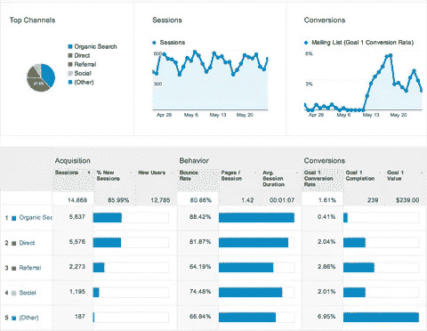

# 9.什么是流量，为什么它很重要— 30 天中等流量

> 原文：<https://medium.com/swlh/9-what-is-traffic-and-why-is-it-important-30-days-of-medium-a4e981119008>

欢迎回到 **30 天介质。**

今天，作为我的 [**理解在线销售漏斗**](/swlh/8-understanding-the-online-sales-funnel-30-days-of-medium-a8a6e96ddde4) 文章的自然后续，我将谈论“流量”以及为什么它对您的业务很重要。

如果你错过了下面的**我的中等挑战**的前 8 天，你可以补上:

## [0。30 天的培养基](/swlh/30-days-of-medium-c7ab34953c6c)

## [1。建立自己的网站需要什么？— 30 天中值](/swlh/1-what-do-you-need-to-build-your-own-website-30-days-of-medium-1ed1ad4e505c)

## [2。如何找到你热爱的事业— 30 天的媒介](/swlh/2-how-to-find-a-business-you-love-30-days-of-medium-cb7a4a702d1b)

## [3。如何建立自己的网站—媒体 30 天](/swlh/3-how-to-build-your-own-website-30-days-of-medium-587f994672ec)

## [4。如何衡量你网站的表现——30 天媒体](/swlh/4-how-to-measure-your-websites-performance-30-days-of-medium-75e650969695)

## [5。如何通过回答他们的问题获得更多的客户——30 天介质](/swlh/5-how-to-get-more-customers-by-answering-their-questions-30-days-of-medium-b462d237533e)

## 6。成功的商业网站备忘单——媒体 30 天

## 7。如何衡量成功——30 天介质

## 8。了解在线销售漏斗——30 天媒介

## 9。什么是流量，为什么流量很重要？— 30 天的培养基

## [10。什么是 Google URL Builder，为什么要使用它？— 30 天介质](/swlh/10-what-is-google-url-builder-and-why-should-you-use-it-30-days-of-medium-402eb778e394)

## [11。通过自动化您的社交媒体日程，让您的流量翻倍——30 天中等](/swlh/11-double-your-traffic-by-automating-your-social-media-schedule-30-days-of-medium-ac9aa74f7927)

## [12。如何辨别什么好卖— 30 天介质](/swlh/12-how-to-tell-what-sells-30-days-of-medium-ba3291d029d2)

## 13。我如何在 6，500% — 30 天的培养基中培养我的培养基

## [14。你如何看待事情很重要——30 天中期](/swlh/14-how-you-look-at-things-matters-30-days-of-medium-f641b9733b90)

## [15。如何向小型企业销售服务— 30 天介质](/swlh/15-how-to-sell-services-to-small-businesses-30-days-of-medium-d6604c63b3b7)

## 16。如何通过有效的提案赢得更多交易— 30 天的媒介

## [17。如何在 10 分钟内建立一个网上商店——30 天的媒介](/swlh/17-how-to-setup-an-online-store-in-10-minutes-30-days-of-medium-a4f955e9b493)

## [18。如何在任何地方工作— 30 天介质](/swlh/18-how-to-work-from-anywhere-30-days-of-medium-1c9cfa2d662f)

## [19。为什么你的网站会破坏你的销售——30 天媒体](/swlh/19-is-your-website-sabotaging-your-sales-30-days-of-medium-f63bdbdb350)

## [20。你的流量从哪里来？— 30 天中值](/swlh/20-where-does-your-traffic-come-from-30-days-of-medium-a9b2d2c088bb)

## [21。如何真正识别倦怠——30 天中等水平](/swlh/21-how-to-actually-recognise-burnout-30-days-of-medium-7972a7a7a89e)

## [22。如何修改你的时间表并完成两倍的工作——30 天中等时间](/swlh/how-to-hack-your-schedule-and-get-twice-as-much-done-30-days-of-medium-441a509dc9be)

## 23。不要复制你的竞争对手——30 天的媒介

## 24。如何 SEO 优化一篇博文——30 天的媒介

## 25。独一无二或者被遗忘——30 天媒介

## 26。跟着感觉走——30 天中等水平

## 27。人们不支付平均 30 天的中等费用

## [二十八。如何做关键词研究— 30 天介质](/swlh/28-how-to-do-keyword-research-30-days-of-medium-5fd0fc0f5523)

## [29。为什么帕累托原则是世界上最大的诀窍——30 天中期](/swlh/29-why-the-pareto-principle-is-the-worlds-biggest-hack-30-days-of-medium-1c225f5c8aa1)

## 三十岁。你的内容比你的电话更有利可图——30 天的媒介

# 什么是流量？

流量是指你的网站收到的**访客的数量。**

术语“你获得了多少流量”通常是指每月或每年登陆你网站的**独立访客的数量。**

# 所有的流量都一样吗？

好问题！

答案是**否**

网站流量有各种形状和大小，来自不同的渠道、地点和设备。甚至不同的浏览器。

# 交通频道

要了解**网站流量**你需要了解**频道。**

流量渠道是花哨的营销用语，指的是**流量来自哪种媒介**。

比如大多数人是不是只要输入你的网址就可以访问你的网站？如果是这样，这被称为**直接流量。**

这些人**直接访问了你的网站。**

或者他们通过谷歌搜索找到你的网站**？恭喜你，你获得了一些不错的有机流量(有机搜索流量的简称，来自搜索引擎的流量)**

有 5 个主要渠道:

*   社会的
*   有机搜索
*   直接的
*   (其他)
*   介绍

**社交流量**不言自明，即来自社交媒体平台的网站访客。

有机搜索指的是来自谷歌和其他搜索引擎的流量。有很多方法可以深入了解你的网站吸引流量的部分。

如果你够聪明的话，你可以查看你的**登陆页面**，看看人们登陆了哪些内容来连接这些点。例如，如果你是一家屋顶公司，并且可以看到许多访问者正在登陆你的 [upvc 覆层替换](https://www.angliaroofline.co.uk/services/upvc-cladding-replacement/)，这是一个致命的弱点，即这个页面正在吸引有针对性的有机流量。

您可以通过访问 Google Analytics dashboard 中的收购概述，按渠道细分您的**流量。**

Analytics acquisition overview

# 为什么流量很重要？

你的网站流量就像你的**汽油。**

它让你的网站**为你运行。**

你需要流量来**产生销售线索**，再**产生客户**。

驾驶**右侧交通**可以让你填满销售漏斗的**顶端。**

如果你有一个像样的网站和漏斗系统，剩下的应该会自动完成。

随着你的流量增长，你的**列表**和**业务**也应该增长。

我昨天谈到了**了解您的指标和预测的重要性。**

如果你了解你的在线营销指标，你就可以根据你产生的**流量准确地**预测你的增长**。**

因此，如果你想要**更多的潜在客户，**你可以专注于能够**为你的网站带来更多定向流量的活动，比如:**

*   创建针对特定关键字的长尾内容
*   创建视频和 YouTube 频道
*   在媒体上写作并在这里建立读者群
*   通过电子邮件发送您现有的有用内容列表
*   设置社交媒体时间表，在合适的平台上，在最佳时间自动分享您的内容
*   加入新脸书和 LinkedIn 群组

您的**收购报告**将允许**衡量**这些**活动中的哪一个最能有效地增加您网站的流量。**

**这个反馈回路**允许你关注**起作用的部分**或者改进不起作用的部分。

我希望你觉得这篇文章简单易懂。明天跟着我做下一个！

## 关于这个话题有什么问题吗？请在评论中告诉我。

## 你可能也喜欢这个:

## [为什么 WordPress 是在](/swlh/why-wordpress-is-the-best-platform-to-build-your-business-or-startup-website-on-df3fe932fad7)上建立业务或创业网站的最佳平台

## 如果你喜欢这个故事，请点击👏按钮并分享，帮助其他人找到它！欢迎在下方留言评论。

## 这篇文章发表在 [The Startup](https://medium.com/swlh) 上，这是 Medium 最大的创业刊物，有 319，931+人关注。

## 在这里订阅接收[我们的头条新闻](http://growthsupply.com/the-startup-newsletter/)。

