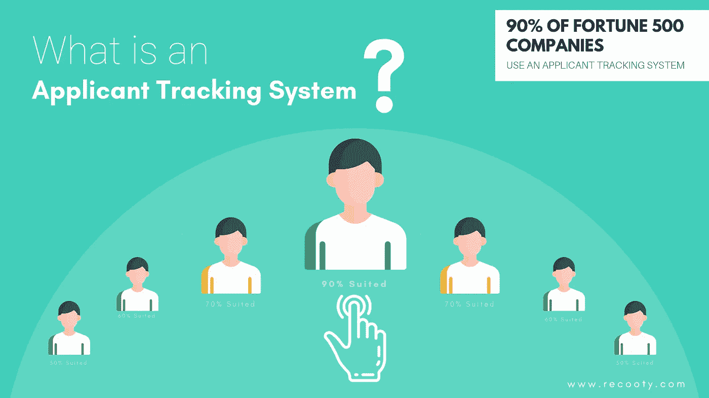
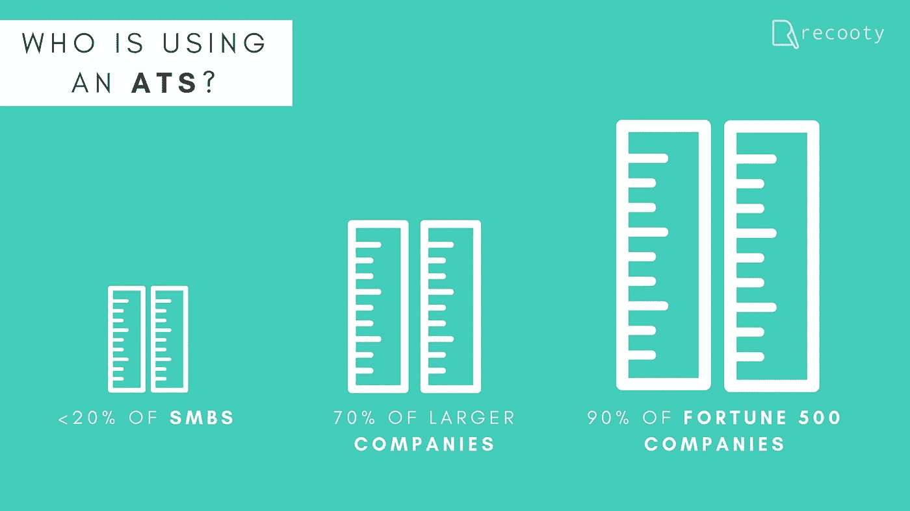

# 90%的财富 500 强公司使用申请人跟踪系统，它是什么？

> 原文：<https://medium.com/swlh/90-of-fortune-500-companies-use-an-applicant-tracking-system-whats-it-5a6b6d25e5e7>

Source: Recooty.com

> “雇用优秀人才是最重要的任务”——达尔什纳·拜斯， [**雷科蒂**](https://recooty.com/)

一个**申请人跟踪系统**基本上通过根据职位发布过滤、组织和简化工作申请来处理电子招聘过程。申请跟踪系统通过提供一个简单的集中平台来查看申请人，跟踪他们在招聘过程中的进展，并根据职位发布中指定的不同要求筛选申请和简历，从而降低了招聘过程的复杂性。

# 申请人跟踪系统的特征

以下是申请人跟踪系统的一些令人惊叹的功能，可以帮助有效地简化招聘过程-

## 1.招聘

一个申请人跟踪软件提供了一个工具，只需点击一下鼠标，就可以在各种免费和付费的工作板上发布职位空缺。通过 ATS 发布职位有助于招聘人员获得更广阔的范围，从而找到完美的候选人。

## 2.品牌职业页面

三分之二的求职者在有兴趣与你合作时会访问你的网站。对所有公司来说，建立和维护一个职业页面都是一项单调乏味的任务。申请人跟踪系统的最大优势之一是它有助于创建品牌职业页面，就像在 Instagram 上更改你的背景图片和简历一样简单。

## 3.候选人跟踪和管理

最头疼的是招聘时塞满邮箱的无关简历。在这里，ATS 扮演着至关重要的角色，它只是跟踪与招聘人员在职位空缺中提到的各种标准最相关的申请，将它们收集在一个平台上，并一起管理它们，以发挥最适合该职位的人才。

## 4.面试日程安排

申请人跟踪系统也有助于招聘人员掌握他们的面试时间表和技能。ATS 帮助您设定特定的面试日期和时间，供候选人从他们自己的在线门户网站上选择，这实际上取代了频繁的电子邮件和电话交流。

## 5.工作流程管理

招聘的生命周期微妙而复杂。没有适当的结构，很容易意外地跳过过程中的一个必要步骤。ATS 使招聘单位能够轻松管理整个招聘流程，从职位提交到**组建优秀团队**。

# 申请人跟踪系统的好处

顾名思义，一个**求职者跟踪系统**在整个**招聘过程中跟踪不同的求职者**。它有助于发布通知警报、安排和组织申请，并自动向被选中的候选人发送电子邮件，告知进一步的招聘步骤。但是申请人跟踪系统软件不仅仅是组织者。

**申请人跟踪软件的各种好处有:**

## 1.找到最适合的工作

申请人跟踪系统有效地减少了求职者和他们想要的工作之间的差距。通过 ATS 聘用符合招聘启事中提到的所有标准的候选人有助于增加候选人的经验，并有助于留住候选人。

## 2.加快招聘过程

ATS 的基本设计是为了加速人力资源审查工作申请和简历的任务。在见到真人之前，ATS 会根据职位发布的关键词和标准对不同的申请和简历进行筛选。这有效地加快了招聘过程。

## 3.具有成本效益

在最近的一项调查中，不使用招聘工具的公司平均花费 1872 美元来雇佣新人。大多数 ATS 比其他各种招聘和接触候选人的方法更便宜、更有效，如在各种大众媒体平台上做广告、在招聘网站上发布信息等。这使得 ATS 的性价比相当高。

## 4.增加工作申请的相关性

ATS 的主要目标之一是筛选候选人。ATS 根据职位空缺中提到的要求简化工作申请，减少了不相关申请的数量，有助于招聘人员从最佳候选人中进行选择。

## 5.帮助您为您的组织建立一个优秀的团队

这是使用 ATS 最重要的优势，申请人跟踪系统在建立你梦想的组织时非常有效。事实是，90%的财富 500 强公司使用求职者跟踪软件来建立优秀的团队。

## 世界上最受尊敬的招聘专家之一 Tim Sackett 在被问及谁应该使用求职者跟踪系统时说道:

> “在我们的历史上，招聘技术从未如此经济实惠，这意味着组织不再有理由不拥有它。伟大的技术现在是如此便宜，如果你没有它，你就在做一个个人选择，留在招聘的黑暗时代！对于中小企业来说，这是前所未有的现实。中小型企业现在可以拥有比他们的企业同行更好的招聘技术。当企业员工获得大型的、基于香草的招聘技术时，中小型企业可以更快地整合市场上最新、最棒的技术。这是一个激动人心的人才招聘时代，世界级技术的可用性正在改变我们日常的招聘方式。”

***了解更多关于申请人跟踪系统的信息，请访问:***[***【www.recooty.com】***](http://www.recooty.com)

*最初发布于:*[*https://recoooty . com/blog/what-is-an-applicant-tracking-system/*](https://recooty.com/blog/what-is-an-applicant-tracking-system/)

## 这篇文章发表在 [The Startup](https://medium.com/swlh) 上，这是 Medium 最大的创业刊物，拥有+400，714 名读者。

## 在这里订阅接收[我们的头条新闻](http://growthsupply.com/the-startup-newsletter/)。

