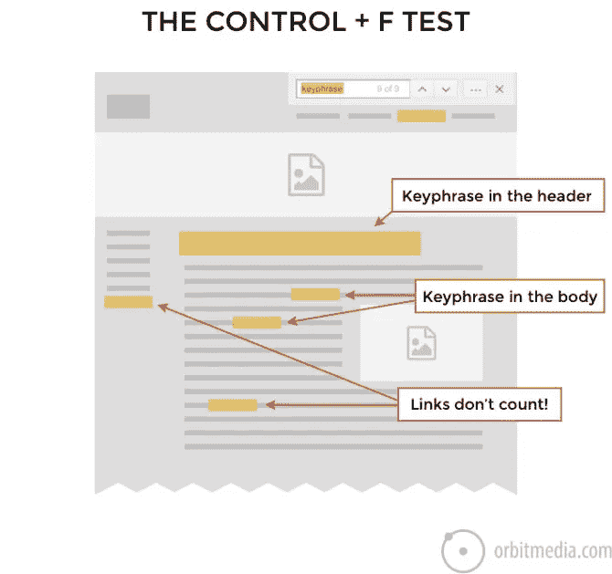

# 91 位专家分享提高网站流量的最有效 SEO 技巧[专家综述]

> 原文：<https://medium.com/swlh/91-experts-share-the-most-effective-seo-tips-to-drive-traffic-to-your-website-expert-roundup-2c378143b16f>

如果你有一个网站，想法是让人们访问它。一个网站的流量反映了一个企业在网上的表现。它也是客户行为的一个指标，将帮助你制定一个营销策略，让你在搜索引擎结果中获得更好的排名。

SEO 优化的基本思想是给网站带来更多的流量。但是全球有[12.4 亿个网站](https://hostingfacts.com/internet-facts-stats-2016/)，你如何保证你的网站获得好的流量？

以下是我的七大搜索引擎优化技巧，将有助于提高你网站的流量:

# 提高流量的 7 个 SEO 技巧

**关键词:**在大多数搜索中，至少有 [50%的人](https://www.wordstream.com/blog/ws/2015/10/06/smx-east)使用四个或更多的单词。这意味着仅仅是关键词并不重要。你需要搜索特定的长尾关键词。

当涉及到宽泛的关键词时，会有激烈的竞争，这意味着你需要提供更多的东西才能在人群中脱颖而出。长尾关键词很重要，这样人们就能得到他们想要的特定结果。

**优质内容:**在这个竞争激烈的世界里，有很多人写的是同一个话题。你应该怎样做才能在搜索列表中名列前茅？答案是写出好的、经过充分研究的内容。

你网站的内容也应该多样化，以避免网页之间为搜索引擎列表的内部竞争。你需要以这样的方式组织你的网站，当人们搜索某个特定的东西时，所有相关的信息都很容易被访问到。还要确保您的内容定期更新，因为搜索引擎会定期检查更新，以便为用户提供最佳结果。写好的内容可以提高你的流量，并最终影响你的搜索引擎优化。

**元描述和标题标签:**标题标签类似于书名。这是出现在搜索引擎结果页面上的可点击链接。如果我们以谷歌为例，一个理想的标题标签应该少于 60 个字符。

元描述是在搜索引擎结果中出现在标题下面的内容。这就是给用户留下第一印象的原因，相信我，第一印象很重要。如果你有一个好的简洁的元描述，人们访问你的网页的机会就更大，对 SEO 也有好处。

**优化图片:**图片是给网页增添色彩，让它不那么无聊的东西。我甚至想不出有图片的网页。为了更好的搜索引擎列表，请确保通过添加描述、alt 标签和标题来优化图像。它有利于你的网站搜索引擎优化的努力。

搜索引擎无法识别图像的内容。正是带有图像的文本帮助他们评价一个页面的相关性。为此，请使用原始的、最佳尺寸的、高质量的图像。

**反向链接:**对于一个搜索引擎来说，反向链接就是对一个网站的背书。另一个网站上的客座博文链接回你的博客，会增加你网站的流量。

获得一个在线目录列表也将推动你的网站的流量。电子目录中对你的业务的描述会有一个到你的网站的链接。确保您不断更新这些目录中的信息，以产生流量并提高您的 SEO 排名。

**SSL 证书:**对于一个搜索引擎来说，SSL 证书很重要。SSL 证书的基本作用是将您网站的“http://”更改为“https://”,使其更加值得信赖和受到保护。如果你想让搜索引擎信任你，SSL 证书是必须的。

**手机友好度:**根据[谷歌](https://adwords.googleblog.com/2015/05/building-for-next-moment.html)的数据，在包括日本和美国在内的 10 个国家，手机搜索量超过了桌面搜索量。为了利用这一增长趋势，你的网站需要移动友好。

当然，除了这些基本的 SEO 技巧，还有许多其他的方法可以帮助你的网站增加流量。下面，91 位 SEO 专家分享了他们创造流量的最佳 SEO 技巧。

# #1.巴里·施瓦茨— [搜索引擎圆桌会议](http://www.seroundtable.com/)

建立一些谷歌在他们的搜索引擎中排名不好的东西。

# #2.[营销利润](https://medium.com/u/81b376bf1c56#3.安·汉德利——<a class=)

我一般的 SEO 建议是:创建以用户为中心的内容，回答你的潜在客户的问题，让他们觉得你理解他们的问题，与他们一起承担他们的负担，感受他们的痛苦。

那是 SEO 建议还是内容建议？我的答案=是。

# #4.埃里克·恩格— [石庙咨询](https://www.stonetemple.com/)

这个问题不好的一面是，人们会讨厌简单的回复，那就是给你的网站添加很棒的内容。人们讨厌这个答案，因为现在每个人都这么说，但事实是这是真的。

然而，让我们再深入一点。这是谷歌(甚至脸书等其他公司)的发展方向。他们都在为赢得用户的心而战。他们对市场份额的掌控完全依赖于他们提供优质用户体验的能力。在当今世界，即使你的谷歌或脸书，如果你的使用体验价值下降一点，整体市场份额就会受损。

对谷歌来说，用户体验意味着在搜索结果中提供正确的页面，为用户需求提供最好、最直接、最完整的答案。我的信念是，这在很大程度上是谷歌的机器学习程序旨在评估的。

对于作为网站发布者的你来说，实际的影响是提高你的网站内容质量和深度，提供了以下好处:

1.增加你网站上用户的转化率。
2。增加搜索流量，因为谷歌开始认为你的网站提供了更多的价值。

让我把提示说清楚:提高网站内容的质量可能会增加你的 SEO 流量。要在这方面取得成功，你需要了解谷歌如何定义更好的内容。通常这意味着更深入、更全面的内容。

(PS:做好这一点也会增加你获得特色片段的能力)

这种提高网站内容质量(和用户体验)的技巧需要成为一种信仰，一种持续的追求。

这是你短期和长期成功的关键。

# #5.安迪·克雷斯托迪纳——[轨道媒体工作室](http://www.orbitmedia.com/)

*表示相关性。这是最重要、最有效的 SEO 策略或技巧。如果你希望对一个短语进行排名，你需要在标题、页眉和正文中使用这个短语。听起来显而易见，其实不然。回到任何一个排名没有达到你期望的页面，进行“控制+ F 测试”只需使用浏览器的查找功能，就能显示出它是否经过优化…*

来源:[轨道媒体，SEO 建议](https://www.orbitmedia.com/blog/free-seo-advice/)

请记住，虽然这个短语可能出现在链接中，但当你指出这个页面的相关性时，这些不算数。链接表明它们链接到的页面的相关性，而不是它们所在的页面。**所以在正文和链接中使用这个短语吧！**

# #6.[人们会对你的交易提议作出回应，但他们真正寻求的是联系和分享经验，所以要确保他们在你做的每件事情中都得到这些。销售优质产品、优质服务和有竞争力的价格是一个成功网站的基础。未来的大部分增长将是与那些了解、喜欢和信任他们的客户的供应商的真正联系。

对于 SEO 技巧来说，这意味着普通的内容和链接只是开始。当你成为知名的行业领导者时，你将获得更高的利润、更多的销售额和更多的客户推荐。要做到这一点，需要拓展到行业网站，增加他们所做的事情的价值，赞助博客、播客和有影响力的人，以发展有价值的联系，并参与评论、帖子和分享任何有助于客户的东西..不仅仅是你这周的销售。

这是 SEO 中最强大的杠杆。在这样的活动中，我们看到了超过 10 倍的投资回报率。现在开始。在这个帖子上留下评论，在你认为对你的读者有帮助的地方分享它，当你看到有共鸣的东西时，联系我或任何有贡献的人。

](https://medium.com/u/d63bce37562a#7.<a class=)

# [#9.](https://medium.com/u/d63bce37562a#7.<a class=)[峰值](https://medium.com/u/c12de1d6bb52#10.布伦特原油——<a class=)

如果你想通过搜索引擎优化来增加流量，你必须创造一些值得访问、链接和最终分享的东西。

多年来，营销人员、顾问，甚至像谷歌这样的搜索引擎都表示，他们不太关心你创作的内容数量，而是要求你能创作出最高质量的内容。

把你的精力集中在确定你所在行业的人们正在齐心协力寻找的话题上。看看支持论坛，回顾关键词工具，检查谷歌中建议的搜索短语，找出人们积极寻找的主题，然后在这些主题上创造真正令人惊叹的内容。

联系专家，为你的主题获得补充或引用，让你的内容真正独一无二，为你的内容争取支持，并增加其在读者中的权威性。

回顾其他类似的文章，以确保你的内容确实是最好的，并且深入地涵盖了这个主题。

最后一个搜索引擎优化技巧，看看 Reddit，让你的精彩内容更容易被看到…想想 Reddit 上你可以写内容的地方。

# #11.[日历](https://medium.com/u/f83d760472f8#12.约翰·兰普顿——<a class=)

通过理解搜索意图来了解你的目标受众的想法是至关重要的。通过了解他们为什么搜索，以及他们可能如何搜索，这有助于提高你的关键字研究和选择的结果，最终将提高你的搜索引擎优化排名。有信息搜索、导航搜索和购买搜索。每个人都可以记住自己的关键词，同时还可以共享其他关键词。这样做是正确的，你会得到转换的流量类型。

# #13.[社交排序](https://medium.com/u/d83f238edc31#14.<a class=)

你可以为你的博客 SEO wise 做的最好的事情之一是做一个网站范围的审计，尤其是如果你已经写了一段时间的博客。对我来说，这对于我的博客从被社交媒体发现到被搜索引擎发现的转变非常有价值——从长远来看，这更有利于流量的增长。这里有 6 个步骤或搜索引擎优化技巧，你可以采取(和工具来帮助你)，以开始网站审计。

1.  **为 SEO 分析和优化您的网站—** 使用 [SEM Rush](http://semrush.com/) 帮助您找到您网站上表现最好的文章、来自其他网站的反向链接、需要修复的断开链接、需要替换文本的图像、您正在排名的关键字以及竞争对手正在排名的任何关键字……等等。
2.  **更新你的图片**——给你表现最好的博客文章添加高别针，或者用引人注目的图片替换你的旧(乏味)图片。像 [Easil](https://about.easil.com/) 这样的工具可以让你创建令人惊叹的专业质量的图像，包括高大的 Pinterest 图像和信息图表。
3.  **优化您的图像** —在图像缺少的地方添加替代文本。使用 [Tasty Pins](https://www.wptasty.com/tasty-pins) WordPress 插件分离出你的 Alt-Text 和 Pinterest 描述，这样它们在 SEO 中表现得更好。
4.  **更新旧博文**——根据你从 [SEM Rush](https://www.semrush.com/) 中获得的信息，回顾那些在搜索方面表现良好的旧博文。更新内容和链接，并添加内容升级或免费下载，这样你就可以获得流量。
5.  **查看你网站上的内部链接**——我建议更新到 [Yoast SEO 高级插件](https://yoast.com/wordpress/plugins/seo/)，因为它会给你提供关于基石内容的建议、网站上其他相关文章的内部链接，并允许你为每篇文章添加多个关键词或关键词短语。
6.  **联系你在更新的博客文章中提到的有影响力的人和公司**——让他们知道有更新，尤其是如果他们被提到的话。[外联加](http://outreachplus.com/)是一个很好的工具。它有许多功能，可以让你获得更多的线索、反向链接和媒体提及，但这是一个很好的开始。

即使你没有做到所有这些步骤，仅仅一两个步骤就会对你的博客的 SEO 性能产生巨大的影响！

# #17.马莎·海德— [禅媒体](http://www.zenmedia.com/)

通过 SEO 创造更多的网站流量过去都是关于关键词的，但是现在有许多其他的 SEO 步骤或技巧可以用来增加总体受众。

也许从网站内容开始是最好也是最容易的。大量的内容增加了网站成为搜索结果最佳答案的可能性。提供的大量内容也导致更多的可链接内容，这反过来会增加网站收到的反向链接的数量。这也将有助于提高 SEO 排名。

搜索引擎还会在结果列表的顶部返回特色内容，以便在用户键入实际问题时为他们的搜索提供最佳答案。提高网站排名，使其包含在此功能内容中，可以为网站流量提供另一个巨大的推动力。从确定网站用户会问的主要问题开始这个过程，比如“我如何…？”或者“为什么……”，然后调整内容以快速回答这些问题。

虽然关键词不是当今 SEO 游戏中唯一的搜索策略，但它们仍然非常重要。使用分析和谷歌的搜索控制台来识别表现不佳的关键词。并不是所有的关键词都有同样的表现，虽然它们可以帮助你的网站在搜索中显示出来，但是你页面上的内容可能不足以支持针对该关键词的足够高的排名。识别那些获得大量印象但点击量很低的关键词，可以表明在增加网站内容时应该把注意力集中在哪里。

最终，充分利用搜索引擎的关键是专注于向用户提供高质量的内容。搜索引擎的作用是向用户提供最好的结果来回答他们的问题，如果你的网站专注于提供这些答案，你将能够为你的网站带来更多的流量。

# #18.海蒂·科恩— [海蒂·科恩](https://heidicohen.com/)

为了最大化网站流量、链接和其他可衡量的内容，为您的 5 个关键受众优化内容，包括他们的受众(潜在客户、客户、粉丝、员工和社交媒体关注者)、社交媒体(包括短期的放大平台)、搜索(核心关键词)、影响者(包括专家、友敌影响者和微影响者)和您的业务(电子邮件地址、合格线索和销售)。

# #19.安娜·列别德娃— [塞姆拉什](http://www.semrush.com/)

SEO 是一个不断变化的概念。所以要谈论搜索引擎优化，你真的得看看谷歌和它的算法是怎么回事。如果我们过去谈论关键词、alt 标签、URL 结构和链接建设——我不想误导，这些东西仍然很重要——内容现在变得越来越重要。

内容为王，我们都听说过。然而，内容曾经很重要，因为它是放置正确的关键字、获得反向链接等的方式。然而，现在当谷歌只关注搜索意图并把最相关的页面呈现在用户面前时，内容对获取流量变得越来越重要。

毕竟流量从哪里来？用户在比竞争对手更短的时间内找到你的内容。这就是你必须为 1 号或 0 号位置进行优化的时候。只有你的内容符合用户的意图，你才能达到目的。事情就是这样的。这真的是所有 SEO 技巧，战略和战术的终点。

所以，我会说，不要使用技巧和单纯的策略来优化搜索引擎，要试着真正进入用户的大脑。他输入“情人节高级餐厅”是什么意思确保你的内容满足他/她的需求。人们不需要为了内容、关键词或反向链接而需要内容，他们需要的是答案——任何搜索查询基本上都是一个问题，即使没有疑问词，所以你的实际工作就是回答这个问题。

所以，最好的 SEO 技巧是一个基本的内容优化来回答你的用户的问题，为此，你真的需要了解你的观众，并预测他们需要答案的任何问题。这就像传统营销中使用的一种古老的焦点小组技术——在创造最终产品之前，大公司投资于买家视角和他们需要满足的需求。

因此，除了单纯的关键词/反向链接研究和站点优化，集中精力寻找你的潜在用户需要答案的问题。在 SEMrush，我们试图拥抱这一趋势，为 SEO/内容市场引入了一个非常独特的功能——我们开发了一个工具，可以针对您正在撰写的内容的特定主题实际研究最受欢迎的答案。

# #20.杰森·德默斯——[观众绽放](https://www.audiencebloom.com/)

我写了一篇名为“[提高网站搜索引擎优化的 101 种方法](https://www.audiencebloom.com/101-ways-to-improve-your-websites-seo/)”的大型帖子，其中包含了我对这个话题的全部想法，但如果我必须挑选 3 个最有效的技巧，我会说如下:

1.实施链接建设运动，并坚持下去。链接是我们能够控制的排名算法中最有影响力的部分，所以要利用它们！

2.专注于为你的网站制作大量高质量的内容。如果你想要更多的有机搜索流量，你需要一个让人们访问你的网站的理由，这意味着提供免费的价值(即伟大的内容)。尝试解决问题或回答你的听众的问题。如果你想知道你的内容是否“足够好”,那么问问自己:如果你最好的朋友带着一个问题来找你，你会自豪地把它推荐给他们吗？

3.确保你的内容包含你想要排名的关键词。在你内容的标题、第一段、正文和最后一段，以及元描述中包含关键词是很重要的。除了包含您想要排名的确切关键字之外，请确保在整个内容中包含大量 LSI 关键字(相关关键字)。

# #21. [— BrightLocal](https://medium.com/u/5187e5fad31d#22.米尔斯·安德森<a class=)

这个问题我要稍微翻转一下。我们与实体企业的 SEO 和 SMB 企业主进行了大量合作。这些企业不只是对网络流量感兴趣；他们想打电话(如水管工、会计)或有人走进他们的场所(如零售店)。

因此，他们的在线可见性推动了对他们有巨大价值的离线转化。

谷歌正在转向一种模式，他们希望在谷歌中提供所有答案的搜索，而不是将它们推到第三方网站。这里有几个例子—

1.答案框——在谷歌搜索结果页面
2 中获得任何问题的快速答案。**知识面板** —在谷歌 SERP
3 中查看业务联系详情、评论&驾驶方向。**本地服务广告** —从经过验证的本地水管工那里获取报价等，这些报价已经过谷歌的审核和批准
4。谷歌帖子——企业在谷歌 MyBusiness 上发布更新，新闻交易，搜索者可以在谷歌上阅读

谷歌不会就此止步。

因此，我给那些为客户提供实体服务的企业的建议是，想想你如何利用谷歌给你的所有这些新机会，走到客户面前，给他们留下深刻印象。大多数都是免费的，为什么不呢？！

1.确保你的 GoogleMyBusiness 个人资料得到了很好的优化，并且你链接到了网站上最好的页面，该页面强调了你所提供的内容和你所在的位置。
2。写谷歌帖子(300 字以内)向用户提供更多关于你的服务的信息&你的任何交易
3。在您的 Google My Business 个人资料上生成更多评论(提升排名&转化率)。并且回复你所有的评论！
4。关注谷歌 Q & A，回答那里发布的任何问题。
5。如果你在谷歌已经推出本地服务广告的工业区，注册本地服务广告。
6。找出人们对你的服务类型的疑问。然后创建详细而独特的内容来回答这些问题。这对任何访问你网站的人来说都是有帮助的，它让你有机会开始出现谷歌答案框，并最终提高你的搜索引擎优化效果。

# #23.辛西娅·约翰逊——[CynthiaLive.com](https://www.cynthialive.com/)

有效使用多媒体。视频、图像和互动内容将改善你网站的用户体验，并带来更多的流量。

# #24.戴夫·施耐德— [忍者拓展](https://ninjaoutreach.com/)

链接仍然是谷歌排名最高的信号之一，因此，即使我们采用了不止一种 SEO 技术来帮助我们获得更多的流量，链接建设仍然是我们的第一位。

我们有很多建立链接的策略或技巧，其中一些我们已经写过了。

我们最喜欢的提示是:

**竞争对手链接建设** —我们寻找在帖子中链接过我们任何竞争对手的博主，我们向他们提供我们自己的内容，并请求将我们包括在这篇帖子中，作为替代或比较。

**死链链接建设**——我们寻找那些在帖子中包含死链链接的博主。如果他们链接的任何内容与我们的业务相关，或者如果我们已经写了类似的东西，我们会向博客发送一个关于这个死 URL 的通知，并提供我们的内容作为替代。

专家综述——我们通过参与综述(比如这一篇)来与博客作者建立关系，并邀请他们参与我们的综述作为回报。

**播客/采访链接建设** —与专家综述非常相似，参与播客或采访为我们赢得了反向链接，因此我们接受博主(当然是在相关领域)的邀请或潜在客户，寻找受访者在他们的频道上亮相。

**资源页面链接建设** —我们寻找已经创建了任何相关的大规模资源页面并要求被包含在内的博客作者。

**客座博文** —我们在与我们相关的利基或“肩膀利基”中寻找 DA 30+博客。我们伸出手，如果博客所有者回应，我们提供我们的内容(遵循他们的指导方针)，如果一切顺利，我们赚取反向链接和曝光。

# #25.Phil Rozek — [本地能见度系统有限责任公司](http://www.localvisibilitysystem.com/)

“创造伟大的内容”和“赚取伟大的链接”的建议已经足够了，包括我。因此，我最好的一条不太明显的 SEO 建议是:要么专注于一个狭窄的利基市场，要么开始提供一个真正晦涩难懂的服务(或产品或部件)。越古怪越“小众”，越好。

如果你是唯一的提供商，或者是唯一的本地提供商，或者是第一个提供商，你可以获得一些简单的排名，由具有特定和即时需求的人组成的流量，有时甚至是一些简单的链接。此外，有些人会为奇怪的小服务而来，并为你提供的更主流的服务而停留——因为你的排名和知名度可能不太好。走一点不寻常的路。

# 阅读谢恩·巴克的数字营销博客的全文。

## 这个故事发表在 [The Startup](https://medium.com/swlh) 上，这是 Medium 最大的创业刊物，有 296，127+人关注。

## 订阅接收[我们的头条](http://growthsupply.com/the-startup-newsletter/)。

