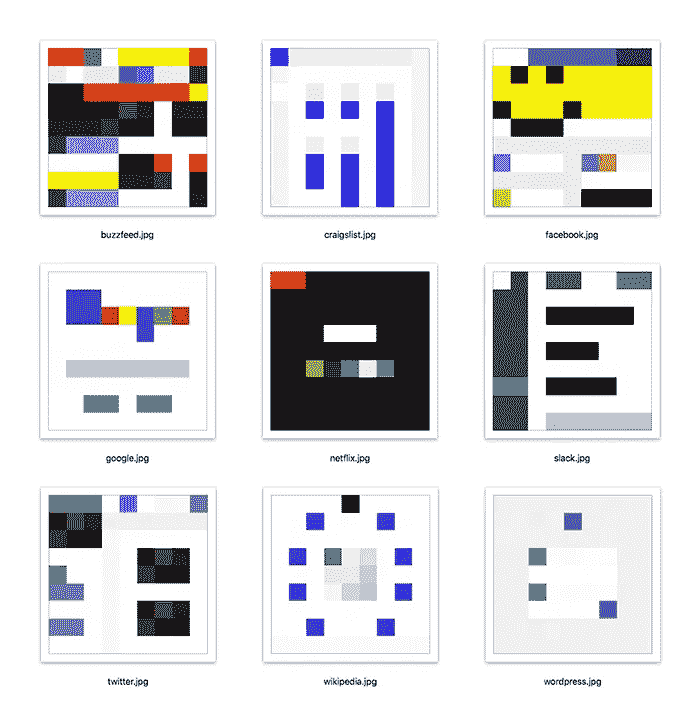
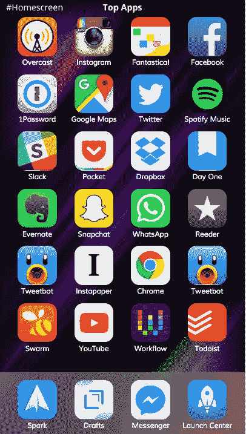
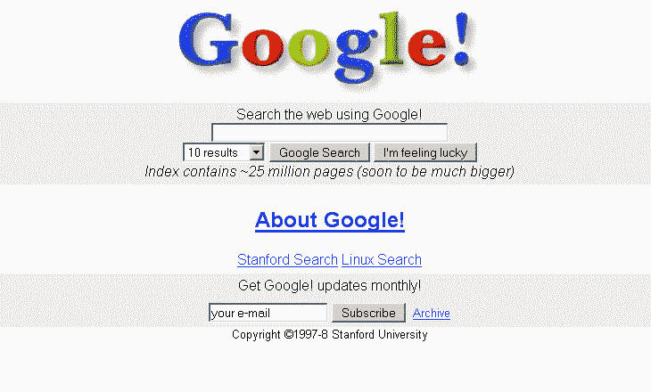
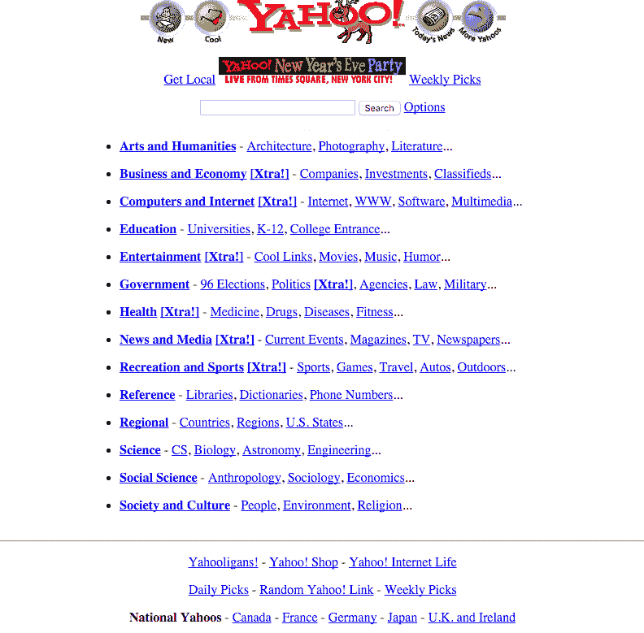
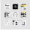
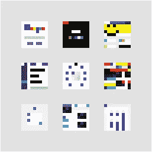

# 9x9 像素，世界上最小的网站

> 原文：<https://medium.com/swlh/9x9-pixels-the-world-s-smallest-website-s-82c9e46a9fd0>

15x magnification

当史蒂夫·乔布斯 15 年前推出 iPod 时，他有一句名言:口袋里有 1000 首歌。太不可思议了。

今天，仅 iPhone 上的 Spotify 应用程序就能让你访问超过 30，000，000 首歌曲。

应用程序是神奇的按钮。有超过 160 万个用于各种目的。苹果甚至围绕它发起了一场营销活动，标题是:“有一款应用程序可以做到这一点。”

你可能会想，现在应该有数百个应用程序在一天中的任何时候为我们表演难以想象的壮举。然而，在 App Store 推出仅仅八年后，我们大多数人只经常使用 5-10 个应用程序。

因此，如果你现在正在创建一家软件公司，很有可能你正在尝试创建一个*主屏幕应用:*

那个罕见的、令人愉快的、120 x 120 像素的按钮，把一个人从唠叨的无聊中传送到全世界出版的音乐目录中；史上最小最强大的相机之一。和你所在地区的一万个美丽的伴侣中的一个约会。

那个按钮，如果你幸运的话，会让你和你的 54 个最亲密的朋友差不多[200 亿美元](http://www.forbes.com/sites/briansolomon/2014/02/19/stunner-facebook-to-buy-whatsapp-for-16-billion-in-cash-stock/#43dab4853c1a)。

-

90 年代末，淘金热集中在门户网站上。它们是新闻、搜索、电子邮件、天气、股票报价和娱乐的混搭。门户网站尽其所能，理想地创造一个舒适的家，人们很少会离开。

从那以后发生了很多变化。

我们开始意识到，在许多情况下，专业化实际上是建立一个巨型企业的关键。以世界第二大最有价值的公司谷歌为例，它的主页 20 年来几乎没有变化(除了变得更加简单之外)。

现在考虑一下雅虎，世界上最著名的门户网站。雅虎 IPOd 价值超过 1000 亿美元，而今天它们显然价值负 40 亿美元。他们的网页设计遵循了与谷歌相反的轨迹，一年比一年复杂。

在性格、风格、产品——在所有的事情上——最卓越之处在于简单。

随着我们向更小的屏幕发展，产品开发和视觉设计的简单性是必不可少的。

你可能听说过，不管规模大小，标识都应该清晰可辨。考虑一下中号 logo。它大的时候读起来很好。它在这一页的左上方以你的指甲大小读起来很清楚。当它是 16x16 像素时，在你的浏览器标签中的图标上可以很好的阅读。成功的产品遵循同样的规则。

下一次你在制作数码产品或设计网站时，考虑一下 9x9 法则。如果你的设计过于复杂，以 9x9 像素无法识别，那很可能就是太复杂了。

考虑下面的例子:世界上最受欢迎的 9 个网站。

9x9 pixels

你能认出他们吗？让我们把它们放大到浏览器标签中的图标大小。现在呢？

9x9 pixels, 2x magnification (.ico size)

如果你是一个重度互联网用户，你可能已经发现了其中的一半。

在一个 9x9 像素的网格中，你能传达的信息量是惊人的。

9x9 pixels, 5x magnification (app icon size)

如果你在看了上面的图片后还没有确定地点，滚动到顶部看一个更大的带有图例的集合。

有没有有价值的技术公司不遵循最低限度的设计实践？当然了。我甚至在 9x9 套装中加入了 Buzzfeed，以突出极简主义和最大主义设计的对比。

YouTube、亚马逊、MSN、LinkedIn 和易贝是几个在 9x9 中很难代表的热门网站。有些产品(亚马逊是*百货店)*是不可能简单代表的。一个产品没有简单的设计也能成功，这不是什么秘密，简单的设计也不一定让一个公司有价值。

也就是说，如果你问这些公司的高管，他们是否希望自己的设计更简单，你会听到响亮的肯定回答。在某些情况下，它不是一个优先事项，而在其他情况下，它甚至可能不是一个选项(如亚马逊)。

如果你现在正从零开始开发一个产品，尤其是一个移动产品，考虑试试 9x9 规则。它可以帮助你简化你的设计思维。

查看完整的 9x9 项目[这里](http://9x9.danieleckler.com)。

> 如果你喜欢读这篇文章，请点击页脚的♥按钮，这样更多的人可以欣赏伟大的设计！

大家好，我是[丹尼尔](http://www.danieleckler.com)。我创办了一些公司，包括 Piccsy (acq。2014)和 EveryGuyed (acq。2011).我目前对新的职业和咨询机会持开放态度。通过[电子邮件](mailto:hi@danieleckler.com)联系。

# 你可能也会喜欢:人性化设计

我写的一篇互动文章，探索了拟人化设计的过去、现在和未来。也可用作会议、活动等的演讲。

 [## 人性化设计

### 1950 年，美国心理学家哈里·哈洛进行了一项实验，将幼猴从它们的…

medium.com](/swlh/the-future-of-design-is-emotional-5789ccde17aa)