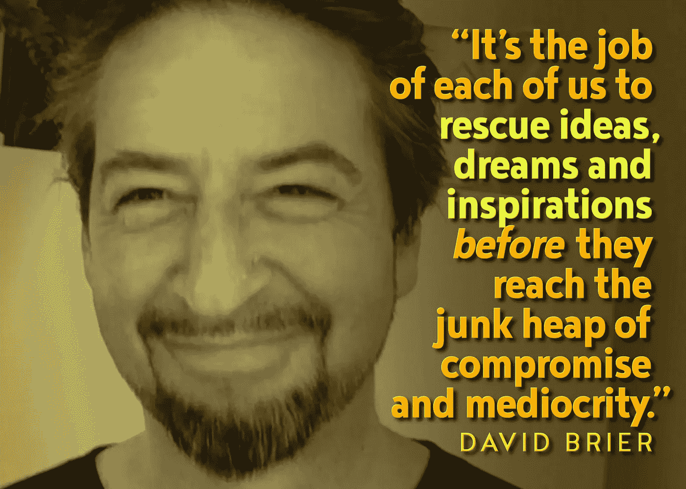

# 准备好改变的品牌的 10 点清单

> 原文：<https://medium.com/swlh/a-10-point-checklist-for-brands-ready-for-change-fec1140078a9>

由 [***欧石南***](http://www.risingabovethenoise.com)

> “世界上最伟大的公司都不卖东西。他们打出品牌。”加里·维纳查克

Salesforce 的首席数字传道者 Vala Afshar 在推特上为品牌、企业和企业家发布了一些令人敬畏的列表和事实。

Vala 最近在推特上发布的一份清单(列出了每个伟大团队的 10 大品质)引起了我的兴趣，因为它同样列出了人们在世界伟大品牌中发现的许多品质。

# 对团队有益的东西对品牌也有益

以下是根据我的经验做的一些修改:

1.  故事作者
2.  设计师
3.  建设者
4.  魔术师
5.  稳定剂
6.  反叛者
7.  探险家
8.  做梦的人
9.  导师
10.  大使

# 1.讲故事

*“总有一个故事可以把人们带到另一个地方。”J.K .罗琳*

永远不要把“讲故事”和“事实和数字”混为一谈故事是任何伟大品牌用来将他们的品牌和他们的顾客联系起来的粘合剂。

故事是人之常情。

事实和数字不是。

# 2.设计

*“设计至关重要，应该列入每个部门的所有会议议程。”汤姆·彼得斯*

设计是一种社会润滑剂，它让你的作品被那些第一次接触到你的作品的人所接受。

忽视设计，你就从它的潜力中欺骗了你的想法，把增长和(松散的)变化留在了桌子上。

# 3.建筑物

如果你不自学，你将永远无法走出起跑线，因为你会花光所有的钱去做愚蠢的决定戴蒙德·约翰

由于缺乏基础设施、缺乏纪律或缺乏文化，每个品牌要么在内部建立自己，要么在内部瓦解自己。

我看到许多品牌和企业家不断向前推进，却没有回头看看身后留下了什么。你必须构建正确的部分，这样你的品牌才能在不失去平衡的情况下展翅高飞。

关键是永远不要拖泥带水*“不断创造”*而不同时建立和加强你的品牌建立的基础。

# 4.魔法化

是的，我创造了这个词。

真的很简单。给你做的每件事增加一些魔力。它做了额外的工作，多做了一件客户没有要求的事情。

你持续地做足够多的事情，你就会被视为某种特殊的巫师或绝地。

偶尔这样做，你会被视为“幸运”或“拥有辉煌时刻”这留给你的是这些“时刻”的效果，而不是成为一个真正关心你的人的原因。

# 5.稳定化处理

*“没有努力的天赋是被浪费的天赋。虽然努力(T2)是你生活中可以控制的一件事，但明智地运用这种努力排在第二位。”马克·库班*

你和你的品牌既可以是稳定的影响，也可以是不稳定的影响。做你需要做的，以确保它提供稳定性，而不是某种妥协。

# 6.反抗(或防御)

*“最重要的自由是成为你真正的样子。你用你的现实换取了一个角色。你用你的感觉换来了一场表演。你放弃了感受的能力，作为交换，带上了面具。除非有个人层面的个人革命，否则不可能有大规模的革命。它必须首先在内部发生。”~吉姆·莫里森，门*

每个品牌都需要认清自己到底是什么。

太多的品牌试图“编造一个其他人会喜欢的故事”，而不是深入挖掘它到底是什么。不久前，我写了一篇关于发起品牌革命的文章，这些观点仍然适用。其中包括:

1.  *代表比自己更伟大的东西*
2.  *定义你的敌人。*
3.  *不是关于梦想，而是*关于成就*。*

# 7.探索

*“知识最大的敌人不是无知，而是对知识的错觉。”斯蒂芬·霍金*

每个品牌都需要探索。不断地。

这种探索的对立面是自满。

不要过分满足于你的品牌或它的成就。

一旦苹果的一款伟大产品准备好发布，史蒂夫·乔布斯会问“第二、第三和第四版会是什么？”

他准备让自己的创作过时，因为他知道在商业或生活中没有什么是静止不变的。

知道这一点，你每次都会领先于你的竞争对手。

# 8.梦幻期

*“现实是错误的。梦想是真实的。”图派克·夏库尔*

梦想是你的路标。你想看到一个死牌子吗？找到一个失去梦想的人。

还记得曾经看到过一个年轻人为了获得他们渴望的东西而放弃他们的梦想或抱负吗？你看到了什么？

一个迷失的人。一个已经放弃的人，一个已经停止攻击生活并按照他们最大的愿望塑造生活的人。

# 9.指导

“指导某人的微妙平衡不是按照你自己的形象创造他们，而是给他们创造自我的机会。”史蒂文·斯皮尔伯格

这都是关于回馈的，我在这篇文章和“岔路口”的视频中详细介绍了这一点

我们每个人都只能长这么大，却没有最终把我们学到的东西回馈给这个世界。这适用于一个品牌，也适用于一个人。

# 10.大使职位(或招聘)

“在真相让你自由之前，你必须首先认清哪些谎言在挟持你。”Ea 王子

一个团队或一个品牌要扩张，就必须向世界输出它的伟大。其中的一部分就是欢迎其他人登上你建造的伟大之船。

这就是招聘(或“大使”)的切入点。

正是这种外在形象让你的品牌及其影响力与众不同。

# 结论(品牌如何运用这一点)

*你正在做这 10 件事吗？*

*你实施每一项计划的力度有多大？*

*你想成为一个了不起的品牌，为你接触的人增加价值，改变他们的生活吗？*

*你的品牌准备好思考和行动了吗？为了实现你所寻求的改变，你准备好了吗？*

你能行的。

*原载于 2017 年 10 月 21 日*[*www.risingabovethenoise.com*](http://www.risingabovethenoise.com/a-10-point-checklist-for-brands-ready-for-dramatic-change/)*。*

## 这个故事发表在 [The Startup](https://medium.com/swlh) 上，这是 Medium 最大的创业刊物，拥有 290，182+人关注。

## 在这里订阅接收[我们的头条新闻](http://growthsupply.com/the-startup-newsletter/)。

