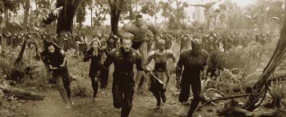
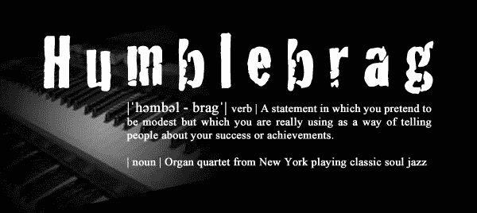
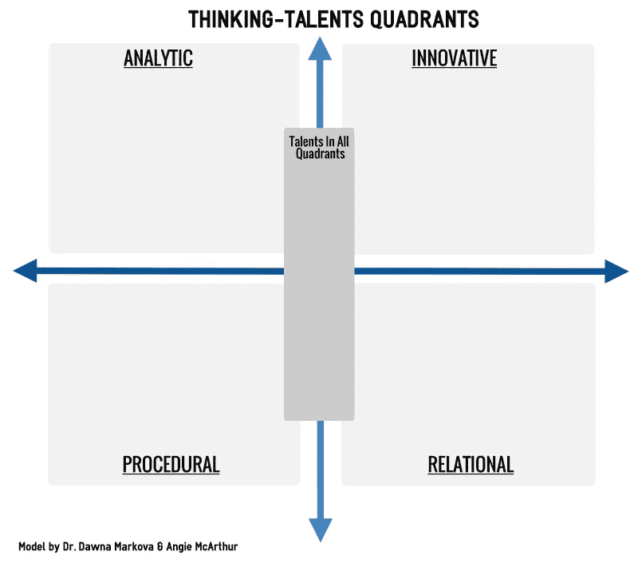
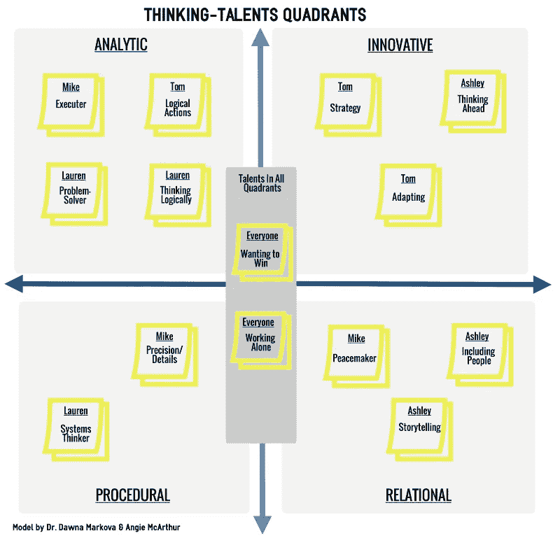

# 一个 15 分钟的黑客创造了可笑的高效团队

> 原文：<https://medium.com/swlh/a-15-minute-hack-for-creating-ridiculously-efficient-teamwork-dd22448e9a9b>

对于基于虚拟的团队，需要重新启动的长期团队，或者刚刚组建的团队，这种方法将使个人表现与团队成功挂钩。

Image Source: [Pexels](https://www.pexels.com/photo/adult-business-choices-choosing-515169/)

有高绩效团队的创业公司比没有高绩效团队的创业公司表现更好。

但是建立一个极其高效的团队是很棘手的。

自负、个性张扬、甚至沉默寡言的人会破坏高效的团队合作，尤其是当需要一起快速完成一项惊人的壮举时。

不一定非要那样。看看复仇者联盟就知道为什么了。

一个由强大的个人组成的团队，他们一起拯救世界。

有些人比其他人更有个性(*咳*托尼·斯塔克*咳*)，但他们学会了一起工作，尊重每个人对团队的独特贡献，以完成工作。

一个完美的案例研究，展示了优秀团队的组成要素:

➡每个人都意识到自己独特的贡献(即他们的超能力)

➡知道他们的超能力如何有助于实现团队目标(例如，在这种情况下，击败威胁地球的敌人)

➡:为了团队的成功，他们把自我和个人需求放在一边

对于创业团队来说，这意味着知道何时公开表示异议，给出建设性的反馈，并认识到你的个人任务如何与团队目标和公司使命保持一致。

> **团队弥补了这一差距。”**
> 
> ***—乔恩·卡曾巴赫&道格拉斯·k·史密斯*** 团队的智慧

为了实现复仇者般的团队合作，通过一个谦逊的吹牛会议来明确每个人的独特才能。

如果团队是虚拟的，在实现他们的目标上变得迟缓，需要重新启动，或者第一次开会，这是特别有用的。

# 第一步:从一次闲聊开始

指定一名团队负责人来领导这项练习。

他或她将首先给每个团队成员一分钟不受干扰的时间来谈论他们自己，列出他们所有的成就和他们给团队环境带来的积极品质。

它可以是这样的:

> “我从不错过细节。”
> 
> "我是一个优秀的调解人和人际交往者。"
> 
> “我很擅长分析数据。”

鼓励人们自吹自擂，创造一个安全的空间，让每个人都可以探索他们认为是自己最好的品质。

每个人都离开后，团队领导要求每个人在便利贴上写下对以下问题的回答:

> 1️.从你所说的来看，你觉得自己真正擅长做的是什么别人都不擅长的事情？
> 
> 2️.你如何看待这些技能对团队成功的贡献？

# 第二步:画出以下象限

这四个象限被称为人们处理信息的四种思维方式。

*   **善于分析的人使用逻辑推理**
*   **创新的人富有创造力，跳出框框思考**
*   **程序化的人使用系统来破译和分类信息**
*   **有关系的人擅长利用情绪来影响&管理关系/情况**

在中间，“所有象限的人才”，将是你拥有大多数人共有的人才的空间:

*   独立工作
*   想要赢
*   在团队环境中工作

在你画出象限后，让每个人把他们的便利贴张贴到他们发现自己技能的地方:

# 第三步:将 HUMBLEBRAG 的知识放入象限

一个基于虚拟的四人团队被组织起来处理一个国际项目。

它包括阿什莉，迈克，汤姆和劳伦。

他们以前从未一起工作过，虽然团队领导通过他们的头衔知道每个人做什么，但他/她利用这个练习来建立一个有凝聚力的团队环境，让每个人都在同一页上。

它还可以发现[团队的盲点](https://www.projectmanagement.com/blog-post/9470/Clearing-Your-Teams-Blind-Spots?blogName=Voices-on-Project-Management&posting=9470)，这在以后可能会被证明是致命的。

> “不要渴望成为团队中的佼佼者。立志成为团队中的佼佼者。”—未知

填好的象限看起来像这样:

为了让这个团队创造出高绩效、效率惊人的团队合作，职责和角色需要根据他们最大的思维天赋象限来构建，这[减少了自我对团队成功的影响](https://hbr.org/2009/02/managing-big-egos-so-the-entir)。

每个人都会做以下事情:

*   Ashley——负责管理客户的客户代表/联络员，因为她在关系象限中有两个很强的思维天赋
*   Mike——负责收集数据并生成团队进度报告，因为他在程序和分析思维方面都很强
*   汤姆和劳伦——操纵数据，考虑大局，确保团队向前发展，因为他们都有很强的创新和分析思维

这个团队开始时可能不是这样组织的，但现在每个人都清楚每个人带来了什么。

大家双赢！他们可以一起向前冲。

下次当你组建一个新团队，需要重新调整团队表现，或者需要调整个人表现时，试试这个技巧。每次都会成功的！

## 这篇文章发表在 [The Startup](https://medium.com/swlh) 上，这是 Medium 最大的创业刊物，拥有 335，210 多名读者。

## 在这里订阅接收[我们的头条新闻](http://growthsupply.com/the-startup-newsletter/)。

