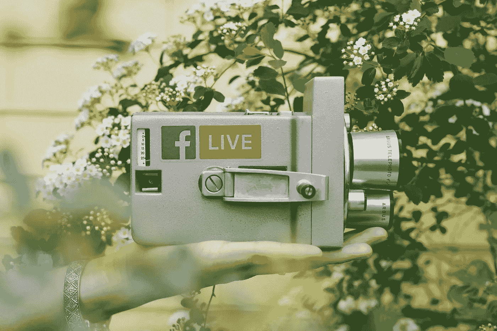
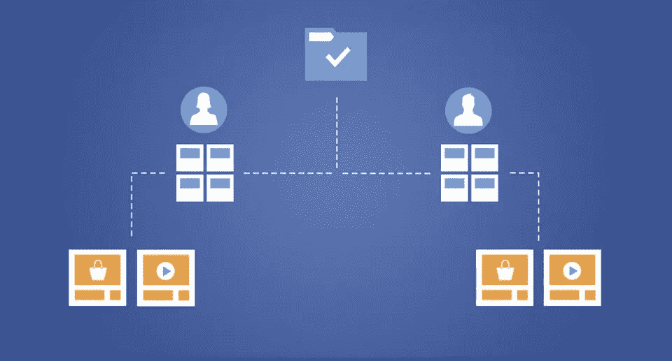
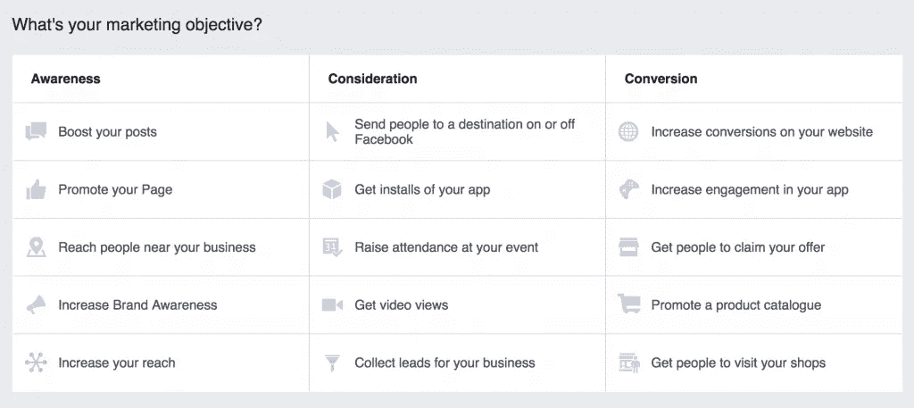
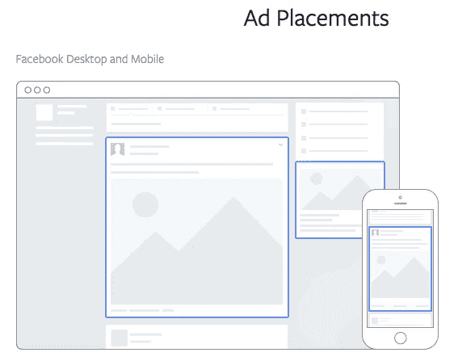
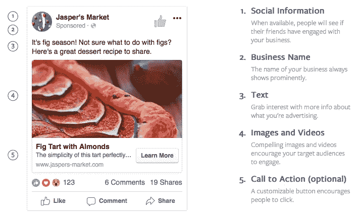
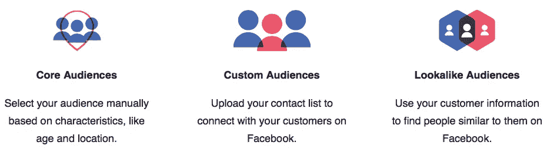
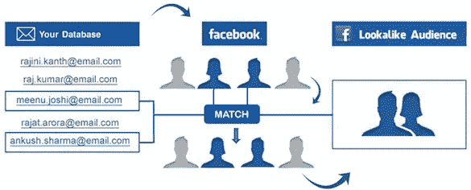
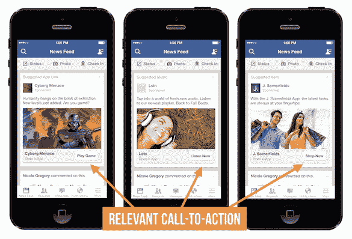

# 2017 年创业公司脸书营销入门指南

> 原文：<https://medium.com/swlh/a-2017-introductory-guide-to-facebook-marketing-for-startups-314fee314391>

Originally published at [http://www.appsterhq.com](http://www.appsterhq.com/?utm_source=CP&utm_medium=Medium)

这是显而易见的。拥有超过 20 亿月活跃用户的脸书现在是世界上最主要的社交网络。

近年来，脸书也转变成了一个蓬勃发展的在线市场，当代初创公司可以通过这个市场销售他们的产品，并招募新的付费客户。

事实上，现在有超过 500 万的 T2 商家每月使用脸书广告。

90%以上的脸书用户通过移动设备访问网络，移动应用公司尤其能够从与脸书营销相关的有利可图的机会中获益。

在这篇文章中，我将解释脸书上的广告是如何运作的，并详细介绍一些优化你的脸书广告的关键策略。

# 为什么使用付费脸书广告？

B 在讨论*如何*将脸书的广告平台用于你的创业之前，重要的是先概述一下*为什么*你应该将脸书广告纳入你公司的核心营销战略的各种原因。

以下是科技初创公司，尤其是数字应用公司应该使用脸书营销来为其产品/服务带来更多流量并促进销售的 11 个原因:

1.  **脸书是一个绝对海量的网络平台**:[13.2 亿人](https://newsroom.fb.com/company-info/)使用《脸书日报》(截至 2017 年 6 月)。
2.  **脸书的规模正在急剧增长**:这家社交媒体网络正以年复一年 17%的速度增长其用户群。
3.  **脸书用户在网络上花费的时间越来越多**:2016 年，脸书用户平均每天花费[超过 50 分钟](https://techcrunch.com/2016/04/27/facediction/)在社交网络及其姐妹网络 Instagram 上——这比不到两年前的每天 40 分钟有所增加。
4.  **脸书在移动领域占有巨大份额**:美国智能手机用户每花 5 分钟上网，[就会花 1 分钟浏览脸书](https://www.facebook.com/business/help/714656935225188/?helpref=hc_fnav)或 Instagram。
5.  **越来越多的人通过移动设备访问脸书**:截至 2016 年末，活跃移动用户[达 17.4 亿](https://zephoria.com/top-15-valuable-facebook-statistics/)，同比增长 21%。
6.  **从人口统计学角度来看，脸书用户对移动应用公司很有吸引力**:脸书最常见的人口统计数据[是 25-34 岁的人，与美国的年龄组相同。美国的成员](https://zephoria.com/top-15-valuable-facebook-statistics/)[每月使用移动应用最多](https://www.comscore.com/Insights/Data-Mine/25-34-Year-Olds-are-the-Heaviest-Mobile-App-Users-in-US)。
7.  **脸书收集了关于其用户的大量数据**:脸书正在接近跟踪和记录其用户在其平台上以及与其平台相连的网站上所做的几乎所有事情(来源: [1](https://www.inc.com/larry-kim/you-wont-believe-all-the-personal-data-facebook-has-collected-on-you.html) 、 [2](https://www.washingtonpost.com/news/the-intersect/wp/2016/08/19/98-personal-data-points-that-facebook-uses-to-target-ads-to-you/?utm_term=.0f198f1009f3) 、 [3](http://veekaybee.github.io/facebook-is-collecting-this/) )。因为脸书越来越了解用户的行为以及他们想要什么，企业可以从根据非常具体的属性锁定用户中受益，这就引出了下一点。
8.  脸书的广告可以用非常复杂的方式瞄准目标:我将在下面更详细地讨论这个问题，但我只想说，企业可以通过脸书的付费营销工具，以非常特定的方式向非常特定的受众营销非常特定的广告。
9.  **脸书继续推出新工具，旨在帮助小企业创建成功的广告活动**:尽管许多世界上最大的公司都使用脸书营销，但在脸书的 6500 万家企业中，有很大一部分是中小型企业。脸书知道这一点，这就是为什么它继续创造新的工具，旨在通过广告活动帮助新企业和初创公司成长——见[这里](https://www.facebook.com/business/news/helping-small-businesses-succeed-in-a-mobile-world)和[这里](https://www.inc.com/zoe-henry/small-businesses-get-a-boost-through-new-facebook-tools.html)。
10.  **脸书正在大力投资基于视频的内容**:视频正成为联系潜在客户以向他们介绍你的产品/服务的一种越来越普遍和高效的方式，[脸书正在采取行动](https://www.inc.com/salvador-rodriguez/facebook-earnings-video.html)明确回应这一持续发展。
11.  **脸书的有机覆盖范围实际上已经死亡**:到 2014 年 2 月，[只有 2%的脸书用户](https://social.ogilvy.com/facebook-zero-considering-life-after-the-demise-of-organic-reach/)看到了超过 50 万赞的品牌页面发布的有机内容。因此，实际上，脸书现在是一个“付费游戏”市场(见这里: [1](https://www.rocketagency.com.au/resource/facebook-pay-to-play-space/) 、 [2](http://www.harvard.co.uk/dark-social-media-pay-to-play/) 、 [3](http://santy.com/blog/Leveraging-Facebooks-Pay-to-Play-Model) )。在你的商业页面上向你的用户展示内容只会让你的参与度很低，如果有的话；如果你想充分挖掘脸书的潜力，你必须购买广告。

# 提醒一句

Appster 的许多初创公司都充分利用了脸书广告，尤其是为了获得早期关注或测试 MVP。

但是购买广告是一项昂贵的努力，特别是如果这种营销活动没有远见和智慧的话。

为了避免浪费大量宝贵的时间和金钱，你的应用程序准备好被你打算通过广告瞄准的脸书用户使用是绝对必要的。

如果你的用户下载了一个很难使用的有问题的应用程序，即使是世界上最有效的广告活动也不会给你的公司带来任何好处。

以下是在投入宝贵资源投放昂贵的脸书广告之前，你必须完成的一些最重要的任务:

*   定义并调查具体的[可货币化的客户难题](http://www.appsterhq.com/blog/early-stage-entrepreneurs-launch-profitable-startup)，您的企业将为其提供解决方案；
*   确定你的利基市场的[规模和独特需求；](http://www.appsterhq.com/blog/build-successful-mobile-app-startup)
*   测试并[验证你的产品创意](http://www.appsterhq.com/blog/test-product-idea-real-world-feedback)；
*   构建[最小可行产品](http://www.appsterhq.com/blog/mvp-app)；
*   深入了解[股权](http://www.appsterhq.com/blog/introduction-to-startup-equity)的来龙去脉，以及你必须定期衡量的关键财务[指标](http://www.appsterhq.com/blog/4-financial-metrics-startups-measure)；
*   研究并实施一个或多个主要的[货币化策略](http://www.appsterhq.com/blog/app-monetization-models)；和
*   建立稳固的[应用入职体验](http://www.appsterhq.com/blog/app-user-onboarding)，确保高[客户保持率](http://www.appsterhq.com/blog/how-to-boost-app-user-retention-rates)。

准备工作结束后，现在让我们来看看设计和实施 2017 年脸书广告的基本步骤。

# 脸书广告的关键要素

脸书用以下基本术语描述其[广告计划](https://www.facebook.com/business/help/714656935225188/?helpref=hc_fnav):

> “脸书广告是来自企业的付费信息，用他们自己的声音写出来，帮助他们接触到对他们最重要的人。
> 
> 广告商创造有特定目标的活动，我们称之为广告目标，他们在这些活动中创造广告来帮助他们达到这些目标。”

脸书的付费营销方式有三个基本组成部分，该公司称之为“[活动结构](https://www.facebook.com/business/help/613846972027099/?helpref=hc_fnav)”:

1.  **广告活动**:广告的基础，因为这是你明确定义广告目标的地方(更多信息见下文)；
2.  **广告位**:在这里你可以定义你的目标受众，为你的广告创建预算，设定广告时间表，并选择广告在脸书的实际投放位置；和
3.  **广告**:这是你的目标用户将看到的最终“产品”，即文本、图像、视频和/或行动号召(CTA)按钮的视觉组合，将出现在其他人的脸书屏幕上([来源](https://www.facebook.com/business/help/613846972027099/?helpref=hc_fnav))。

关于广告活动，脸书允许你从一长串广告目标中进行选择，包括增加你的帖子，增加你网站的转化率，将人们发送到外部网页，让用户安装你的应用程序:

(Image [source](https://bufferblog-wpengine.netdna-ssl.com/wp-content/uploads/2015/05/facebook-ads-objectives.png))

关于广告设置，脸书使得基于一个令人印象深刻的庞大且高度特定的变量集来锁定用户成为可能。

在其他属性中，[可以根据用户的以下属性有选择地定向您的广告](https://www.washingtonpost.com/news/the-intersect/wp/2016/08/19/98-personal-data-points-that-facebook-uses-to-target-ads-to-you/?utm_term=.cdbe2450b7ec):

*   位置；
*   年龄；
*   性别；
*   语言；
*   教育水平；
*   学习领域；
*   学校；
*   种族亲和力；
*   收入和净值；
*   房屋所有权和类型；
*   远离家人或家乡旅行；
*   关系状态(类型、距离、长度等。);
*   工作；和
*   政治观点。

脸书提供 3 种不同的[广告投放选项](https://www.facebook.com/business/ads-guide/?tab0=Mobile%20News%20Feed):

因此，在脸书的桌面版上，你可以把你的广告直接放在用户的主新闻提要中，或者放在靠近趋势报道的右侧。

在手机版上，你的广告会出现在用户手机或平板电脑的最前端。

脸书官方定价和选择广告的方法有点复杂，所以我建议阅读[这些](https://www.facebook.com/business/help/430291176997542?helpref=faq_content) [官方](https://www.facebook.com/business/help/214319341922580?helpref=faq_content) [帖子](https://www.facebook.com/business/help/494368557244384?helpref=faq_content)来全面了解这个话题。

就我们的目的而言，指出以下几点就足够了:

*   脸书使用拍卖系统来决定向哪些人展示哪些广告。
*   **该系统旨在公平地确定**脸书所说的“[创造最大总价值的广告](https://www.facebook.com/business/help/430291176997542?helpref=faq_content)”。
*   总价值基于 3 个因素:1) **广告商的出价**，即广告商愿意为广告支付的金额(根据每日或终身预算选择)；2) **估计行动率**，即脸书对给定个人将采取广告商希望产生的特定行动(例如，安装应用)的可能性的评估；以及 3) **广告的质量和相关性**，即“脸书认为一个人会对看到一个广告有多大兴趣”，基于诸如个人之前参与类似广告以及当前广告的(正面或负面)反馈([来源](https://www.facebook.com/business/help/430291176997542?helpref=faq_content))等因素。

脸书[明确指示](https://www.facebook.com/business/help/430291176997542?helpref=faq_content)购买广告的商家:

> *“为了从脸书的广告中获得最大收益，你应该努力最大化这三个因素——至少为你的广告集优化结果的真实价值出价，创造引人注目的广告，并把它们瞄准正确的受众。”*

最后，关于广告本身，脸书提供[不同种类的广告](https://www.facebook.com/business/learn/facebook-create-ad-basics/)，包括[照片](https://www.facebook.com/business/learn/facebook-create-ad-photo-ads)、[视频](https://www.facebook.com/business/learn/facebook-create-ad-video-ads)、[旋转木马](https://www.facebook.com/business/learn/facebook-create-ad-carousel-ads)、[幻灯片](https://www.facebook.com/business/learn/facebook-create-ad-slideshow-ads)，以及[合集](https://www.facebook.com/business/learn/facebook-create-ad-collection)。

脸书的多产品广告对于有兴趣设置应用安装和/或实施再次参与广告的电子商务广告商来说尤其有用。

例如，你也可以根据你是寻求产生潜在客户，邀请用户参加聚会，还是让人们要求一个特别的优惠，来构建你的广告类型选择。

最终，你的具体目标将决定每一种不同形式的脸书广告的适用性。

一个[完成的脸书广告](https://www.facebook.com/business/ads-guide/?tab0=Mobile%20News%20Feed)及其各种核心元素的例子:

# 制作成功脸书广告的策略

这里有 7 个关键策略，可以帮助你制作吸引人的脸书广告，将用户转化为付费客户，从而产生出色的投资回报(ROI)。

## **1。瞄准合适的受众**

至关重要的是，你在设计和实施广告时，要有明确的目标是特定类型的脸书用户。

当广告被设置为说服非常特殊的人(即最有可能购买、持续使用和帮助推广你的产品/服务的人)去做非常特殊的事情(即跟进你的 CTA)时，广告是最有效的。

*(如果你需要复习一下“总可用市场”(TAM)、“可用市场”(SAM)和“目标市场”(TM)之间的主要区别，那么请看我们最近的文章* [*这里*](http://www.appsterhq.com/blog/build-successful-mobile-app-startup) *。)*

因此，你必须问自己:“**我想把这个广告的目标锁定在谁身上，为什么？”**

帮助你回答这个问题的一个具体方法是创建用户角色。

[用户角色](https://www.usertesting.com/blog/2016/02/19/customer-personas/)是你的理想客户，即最有可能购买和使用你的应用的人。

它们旨在高度详细地描述潜在客户的需求、兴趣、体验和目标。

在构建用户角色时，要考虑的动态因素包括人口统计数据，如性别、年龄、位置、工作场所和财务收入，以及其他特征，如使用的移动设备和操作系统的类型、以前的购买历史等(来源: [1](http://www.socialmediaexaminer.com/21-ways-to-improve-your-facebook-ads-with-ad-targeting/) 、 [2](https://www.facebook.com/business/products/ads/ad-targeting#core_audiences) )。

不要羞于通过从竞争对手的客户那里获取信息来建立你的用户角色。

脸书营销系统的一个真正有用的特点是能够根据兴趣锁定用户。

例如，[脸书允许你](https://www.facebook.com/business/help/182371508761821)根据以下内容锁定用户:

*   他们在时间线上分享了什么；
*   他们使用哪些应用程序；
*   他们点击了哪些广告；
*   他们参与的脸书网页；和
*   他们的旅游偏好。

脸书使得以非常具体的方式聚焦广告成为可能，例如通过使用“和”操作符(例如，素食者*和*房主*和*父母)。

参见[此处](https://www.facebook.com/business/help/182371508761821)了解脸书“详细定位”平台的完整说明。

## **2。使用“自定义受众”和“相似受众”**

作为刚刚描述的第一个策略的延伸，你应该充分利用脸书强大的定制观众和长相相似的观众功能。

脸书的“[核心受众](https://www.facebook.com/business/products/ads/ad-targeting#core_audiences)”包括手动选择的用户，即您根据自己的偏好特征(如人口统计、兴趣和行为)单独选择的用户。

“[客户受众](https://www.facebook.com/business/learn/facebook-ads-reach-existing-customers)”是“从你手头已经有的——或者很容易就能得到的——客户数据中建立起来的，让你很容易与已经对你的业务表现出兴趣的人重新建立联系”。

具体来说，自定义受众允许您上传当前用户和潜在客户的联系信息，包括使用您的应用程序、访问您的网站或属于预先存在的联系人列表的人，然后将您的广告瞄准这些人。

然后，这个工具被设计成允许你瞄准那些你已经有点熟悉的人——通常是那些出现在你不断增长的电子邮件(和电话号码)列表上的人。

这种策略的一个用途是，如果你的所有当前用户成功说服了 *x* 个朋友或家庭成员注册你的产品/服务(或电子邮件简讯),那么他们下次购买时可以享受折扣。

最后，“[相似观众](https://www.facebook.com/business/products/ads/ad-targeting#lookalike_audiences)”帮助你“在脸书找到与你现有客户或联系人相似的人”。

具体来说，这项功能的工作原理是向脸书提供已经使用你的应用程序的相关数据(包括用户角色)，然后让脸书自动生成可能对你的业务感兴趣的类似用户的结果。

例如，如果你最受欢迎的用户类型之一是 25-34 岁的男性，他们在技术部门工作，年收入至少为 60，000 美元，住在加利福尼亚州，那么你可以使用这些数据让脸书找到具有这些相同特征的其他用户，然后你可以将他们作为广告的目标。

## **3。利用清晰和简单**

你的脸书广告必须尽可能清晰简单，同时保持对目标受众的吸引力。

混乱、复杂、晦涩和不精确:这些正是你必须不惜一切代价避免的特征。

有效的广告非常容易理解和回应:它们提供了非常清晰的价值主张和简单明了的 CTA。

[数据表明](http://www.smartinsights.com/social-media-marketing/facebook-marketing/new-research-reveals-makes-effective-facebook-ad/)短标题(4 个字左右)和简洁的链接描述(15 个字左右)是最好的。

## **4。使用社会证明**

[研究表明](https://blog.hubspot.com/marketing/social-proof-examples)人们对明确包含他人推荐/认可的广告反应非常积极，无论是直接推荐还是定量统计。

事实上，尼尔森数据显示，60 个国家中 83%的消费者更喜欢社交推荐，而不是其他形式的广告。

在你的脸书广告中加入社交证明可以通过多种方式实现，包括表明有多少人使用你的应用程序(例如，“15，000 个快乐的顾客，还在继续！”)并提供一份来自你所在领域的影响者的简短评价(例如，“Neil Patel 说这是 B2C 营销的未来！”).

## **5。富有创造力并致力于高质量**

让你的广告看起来尽可能专业:

*   使用高质量的图像和视频，没有难看的像素，过度使用的库存照片，抖动的相机，糟糕的音频等。；
*   使用明亮、高对比度、引人入胜的颜色；快乐的人(和/或动物)做着令人愉快的事情的照片；以及遵循适当构图准则的图片和视频(比如[三分法则](http://www.photographymad.com/pages/view/rule-of-thirds)技巧)。

## **6。始终包括一个 CTA**

最后一次强调这一点，你的广告包含清晰、直接、易于理解的 CTA 是绝对必要的。

请记住，制作广告的整个目的是说服那些看到它的人做某事，采取给定的行动，无论是点击按钮，下载软件，注册电子邮件简讯，还是进行购买。

不要让你的 CTA 成为事后的想法:明确地决定和计划你希望你的广告的*结果*是什么，当有人看到你的广告时会发生什么。

## **7。测试、重新测试和优化**

正如建立一个成功的创业公司的许多其他方面一样，广告不是你第一次尝试就能搞定的事情。

几乎可以肯定的是，你将需要通过几个迭代周期来创建一个具有最大投资回报率的脸书广告。

换句话说，重要的是你要设计、测试、重新测试和优化你的广告，找出什么最有效，在什么情况下对谁最有效。

脸书使同时运行多个广告迭代成为可能，从而允许您进行 [A/B 分割测试](https://blog.kissmetrics.com/ab-testing-introduction/)。

做好准备，面对可能需要多次反复试验才能创作出成功的脸书广告的现实，这将有助于你培养正确的心态、耐心和预算，从而在这个营销领域取得成功。

//

## 感谢阅读！

# 如果你喜欢这篇文章，请随意点击下面的按钮👏去帮助别人找到它！

# 对应用程序有想法吗？[我们来聊聊](http://www.appsterhq.com/?utm_source=CP&utm_medium=Medium)。

在过去的几年里，我们已经帮助建立了超过 12 个数百万美元的创业公司。[查看我们如何帮助您](http://www.appsterhq.com/?utm_source=CP&utm_medium=Medium)。

> 最初发表于 http://www.appsterhq.com

