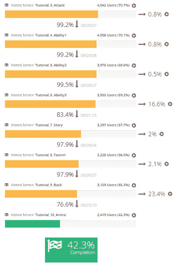
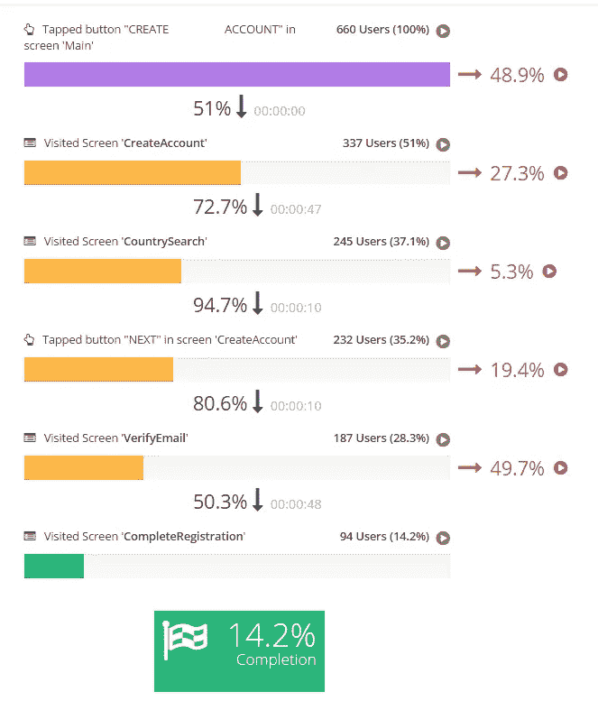
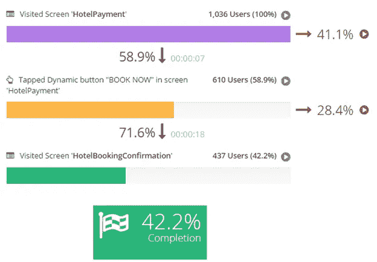
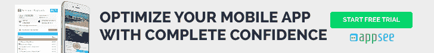

# 移动应用分析工具的基本投资回报率计算

> 原文：<https://medium.com/swlh/a-basic-roi-calculation-of-your-mobile-app-analytics-tool-bef615b1db7b>

并非每家移动应用公司都在精打细算，但感觉大多数都是如此。我不能指责他们。精益增长已经成为一种主食。成功不再仅仅是增长，而是可持续的增长。这种思维方式已经在公司之间传播开来，在公司内部也是如此。无论你在哪个部门，监管什么，你都需要注意底线。这意味着作为决策者，你必须非常小心地分配你的资源。

这可能会有问题，因为作为专业人士，我们需要东西。有些很容易证明。如果你是一个素描艺术家，你用完了铅笔，毫无疑问，你需要购买更多。但是在我们的高科技世界里，事情并不那么明确。你需要的工具并不总是被视为必需品，即使它们是必需品。对你的产品的成功有所贡献的最好方法，也是让你自己更进一步的方法，就是拥有[一套正确的工具](https://blog.appsee.com/must-have-tools-for-mobile-product-managers/?cpnid=701b0000000Wd7c&utm_source=medium&utm_medium=link&utm_campaign=basic_roi_calculation_mobile_app_analytics_tool&utm_content=must_have_tools_for_mobile_product_managers)。

所有这些都让我想起了投资回报。你知道，我们喜欢把这个小东西简称为 ROI。它是大多数决策的关键，然而当涉及到你正在使用的工具时，它似乎很难量化。然而，和其他任何东西一样，这里肯定有投资回报。这里的诀窍是清楚地看到你的移动应用分析工具在哪里帮助你识别和获得(或恢复)业务。我们将在自己的工具 [**Appsee**](https://www.appsee.com?cpnid=701b0000000Wd7c&utm_source=medium&utm_medium=link&utm_campaign=basic_roi_calculation_mobile_app_analytics_tool&utm_content=appsee_homepage) 中使用一些漏斗，作为基本计算的例子。我们将关注三个不同的垂直市场:游戏、公用事业和电子商务。

# 赌博

在上面的漏斗图中，我们可以看到游戏玩家正在学习入门教程。显然，如果一个人成功地完成了教程，并确切地知道如何玩，他就更有可能喜欢一个游戏。无论你的商业模式如何，拥有一个活跃的玩家意味着你更有可能将他们货币化。在这个漏斗图中，我们可以看到两个非常明显的落点，分别位于 Tutorial_6_Ability3 和 Tutorial_9_Back。在这两个点上，用户退出漏斗的比例分别为 16.6%和 23.4%。

这里一个简单的 ROI 计算是之前和之后。知道了你对漏斗做了什么，你就可以专注于这两点来改进你的[游戏应用的 UX](https://blog.appsee.com/mobile-gaming-ux-4-essential-tips-tricks/?cpnid=701b0000000Wd7c&utm_source=medium&utm_medium=link&utm_campaign=basic_roi_calculation_mobile_app_analytics_tool&utm_content=mobile_gaming_4_essential_tips_tricks) 、UI 或游戏性。一旦你这样做了，你就会有更多的用户通过。只需取“之前”和“之后”的用户数量之差，然后乘以每个用户的终身价值。现在你知道你获得了多少实际收入，并且可以计算你在这个工具上的投资回报率。

# 效用

在这里，我们来看看一个非常常见的实用程序注册漏斗。在这个例子中，漏斗的最后一步最为突出。这是我们看到几乎一半的用户在访问验证电子邮件屏幕后掉出漏斗的地方。也许有比屏幕允许的更好的方法来验证电子邮件，或者也许这是一个可以完全取消的步骤。在这里，您可以运行一个简单的计算，看看您失去了多少用户，至少估计一下这个工具的投资回报率。

# 旅行

使用上述旅游应用程序漏斗可能是了解和计算您的分析工具的投资回报率的最佳和最直接的方法。这是从一个提供酒店预订的应用程序中获取的，所以没有必要估计损失了什么。很明显，当 41%的用户从酒店支付屏幕上消失时，你就在赔钱。漏斗的下一部分也是如此，另外 28%的用户实际上点击了“立即预订”按钮，但没有收到预订确认。

把用户带到一个他们愿意交钱的屏幕上并不是一件容易的事情，但是在这一点上失去他们是毁灭性的。是什么导致了用户的这种行为？使用正确的移动应用程序分析工具来了解这一点并做出适当的改变，这是您如何能够弥补这些损失的销售收入。如果你每月因此损失 100 万美元，你可以购买一个价值 100 万美元和 1 美元的工具，但仍然有正的投资回报。

# 定性分析有利于投资回报

这就是大多数工具的问题所在。他们会告诉你你的用户在哪里掉队，但不会告诉你为什么。看一下上面的漏斗，你会发现每一步都有一个播放按钮。这是 Appsee 平台中的按钮，允许您在漏斗中的该阶段实际查看真实[用户会话](https://www.appsee.com/features/user-recordings?cpnid=701b0000000Wd7c&utm_source=medium&utm_medium=link&utm_campaign=basic_roi_calculation_mobile_app_analytics_tool&utm_content=user_recording_feature)的视频。你不必猜测为什么 41%的用户会从酒店支付屏幕上消失，你实际上可以**看到它**。

使用[定性分析](https://www.appsee.com/ebooks/qualitative-guide?cpnid=701b0000000Wd7c&utm_source=medium&utm_medium=link&utm_campaign=basic_roi_calculation_mobile_app_analytics_tool&utm_content=qualitative_guide)，如用户会话记录，您可以快速放大到单个用户级别。这就是你如何即时洞察你的用户行为，并发现是什么阻碍他们最终决定购买。是否有按钮位置错误或没有响应？通过观察用户遇到的这个问题，您可以清楚地看到这一点。会议记录将为你找到那些金块，而且很快。因为当每天都有人因为 UX 或 UI 问题而损失金钱时，时间就是关键。

无论你使用哪种移动应用分析工具，你都应该练习计算它的投资回报率。你想比较苹果和苹果，唯一的方法就是不仅要了解它们的价格，还要了解它们能为你节省多少钱。即使是像上面这样的基本计算，也可以对获得和保持成功所需的工具大有帮助。我们已经知道的一件事是，像 Appsee 这样的定性分析工具无论从哪个角度来看都是有投资回报的。我们只列出了三个垂直市场的例子，但是同样的规则适用于任何地方。

## 这篇文章发表在 [The Startup](https://medium.com/swlh) 上，这是 Medium 最大的创业刊物，有+ 379，306 人关注。

## 订阅接收[我们的头条新闻](http://growthsupply.com/the-startup-newsletter/)。

