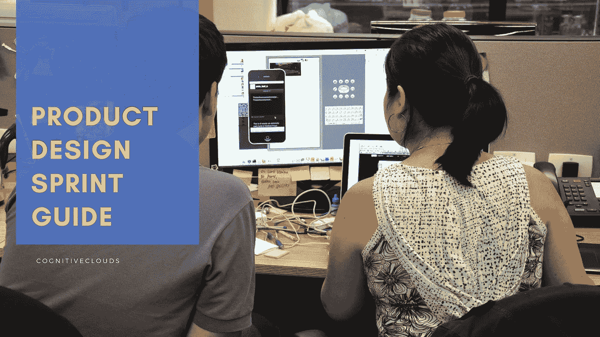
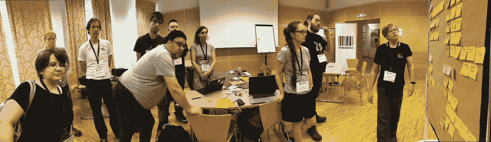

# 产品设计冲刺初学者指南

> 原文：<https://medium.com/swlh/a-beginners-guide-to-product-design-sprint-afb99fa218ee>

五年多的经验和无数的项目告诉我们，在当今世界，一个好的产品创意和执行是不够的。为了成功，你必须通过研究、设计、原型和测试，以用户为中心来回答关键的业务问题。因此，我们引进了[产品设计冲刺](https://www.cognitiveclouds.com/design-driven-development-process)，一系列基于谷歌设计冲刺的研讨会。这是一个任何团队都可以使用的经过战斗考验的过程，打包成一个为期一天的结构化头脑风暴研讨会，以回答这些关键问题。

这个产品设计冲刺是一个 5 阶段的练习，使用设计思维来降低成功将产品推向市场的内在风险。使用这种技术，你将能够快速设计、原型化和测试一个想法、产品或功能的可行性。在 sprint 中以团队的形式工作是一条通往无休止的争论循环的捷径，也是一种将几个月的工作压缩到一周的方法。设计冲刺包括 5 个阶段，通常持续 5 天，从设计思考开始，到用户测试原型结束。sprint 让你能够快进到未来，在做出任何昂贵的承诺之前，看到你的最终产品和客户的反应会是什么样的。

# 是给你的吗？

产品团队被要求像创业公司一样工作，缩短上市时间，以保持竞争力。 [UI/UX 团队](https://www.cognitiveclouds.com/custom-software-development-services/ui-ux-design-company)越来越感到压力，他们需要在改善用户体验的同时更好地与敏捷开发过程集成。如果这些能让你想起什么，产品设计冲刺可能是你所面临的挑战的解决方案。

当启动新产品、工作流程、功能和业务时，这个过程是一个有用的起点。他们还致力于解决现有产品功能或服务的问题。这五天将包括草图、合作、讨论、辩论、评论、投票、娱乐、团队合作和一些眼泪，通常是在用户测试期间。你的团队将会有一种明确的成就感和可操作的结果。

# 该过程

## 阶段 1:理解

请确保在浏览新信息和定义问题之前，您已经复习了现有知识并暴露了假设。你的第一天将收集关于业务、用户、挑战的所有现有信息，并揭示假设和知识差距。此外，优先考虑并计划填补最危险的知识空白，验证或否定最危险的假设。自始至终，在收集和回顾信息的同时，不断询问相关问题。用户可能会在什么情况下使用产品或功能？使用它的动机是什么？影响其使用的外部激励因素是什么？整个团队都应该问问自己，产品成功是什么样的，冲刺阶段的成功又是什么样的。此外，团队应该涵盖在 sprint 之前完成的现有研究，并审查竞争产品的分析。在这个冲刺阶段结束时，团队应该已经发现了关键问题。

## 第二阶段:分歧

目标是探索尽可能多的可能性，不管这些可能性有多现实、可行或不可行。让每个团队成员在 5 分钟内快速勾画出八个可能的解决方案。这项活动的目的是产生许多解决挑战的方法，不管现实与否。通常，我们最终会选择想到的第一个解决方案。当然，有时这可能是最好的解决方案，但并不总是如此。让每个团队成员在 5 分钟内快速勾画出八个可能的解决方案。这项活动的目的是产生许多解决挑战的方法，不管现实与否。这个机会将会产生深刻的见解，同时考虑到解决问题的完全不同的观点和方法的影响。这些见解成为有价值的差异化力量和独特解决方案的来源。此外，一旦你开始尽可能多地排除这些选项，你会对自己前进的可能性变得更加自信。

*Beginner’s Guide To Product Design Sprint*

## 第三阶段:决定

定在正道上。在这个阶段，考虑过去两天讨论的所有可能性，专注于明天可以构建的原型的单一版本。在整个过程中，团队应该考虑更突出的假设，最重要的是测试。这将导致一场关于什么类型的原型在验证或无效方面做得最好的讨论。像最终故事板这样的活动应该有助于团队参与这种对话。但是我们如何选择一个想法作为原型呢？使用“风险与回报”量表。选择每个流行的解决方案，并根据各种风险和价值对其进行定位。这将有助于揭示最简单的选项以及对用户来说什么是最重要的，这样你就可以决定原型是哪一个。

## 阶段 4:原型

在此阶段，您将组装一个快速原型。因为你只有一天的时间来制作原型，所以在测试的时候，尽可能地让它不失真。在这一阶段，角色将会转变。构建原型的人通常是设计师，而产品所有者最终负责获得真实的数据、信息，并复制到原型中。在阶段开始前，明确每个人的角色。

## 第五阶段:测试

在产品设计冲刺的这个阶段，你要测试假设，并考虑用户对原型的反应。在进行每项测试时，你应该对你要测试的内容有一个清晰的计划，并有一个判断测试是否成功的方法。可用性测试是最常用的测试形式。引入几个潜在用户，向他们展示你制作的原型。密切关注他们遇到的问题，并确保遵循一个脚本来涵盖您正在测试的假设。你可以在他们允许的情况下录下这些，但是最好是在发生的时候看到。

# 包扎

如果一切按计划进行，你现在有充分的证据和理由申请资金或将你的设计直接转入开发阶段。如果还有问题没有回答，迭代是关键。设计冲刺的美妙之处在于，一旦你让团队再次聚在一起，你就可以很快重新投入到冲刺中。你的团队也不用再从头开始了。根据问题的范围，你可以回到分歧、决定或原型阶段。现在，如果这个想法需要大量的重新思考或者不值得追求，那么这也是一个有价值的发现。认识到设计对用户没有用，太复杂，或者完全错误的结论是值得庆祝的。如果这个产品在开发过程中有任何进展，那么浪费的精力和金钱只会更多。

# 结论:

Sprint 设计是无需构建和发布就能获得洞察力的捷径。然而，你不能通过“设计思考”或“产品冲刺”来解决每一个问题。产品设计冲刺是为了填补空白，让客户获得可操作的结果，同时仍然在知情的直觉状态下工作。此外，如果不可能在连续五天的时间内安排好整个冲刺，那就把它分散到两到三周。但是，这样做，你可能会失去动力和注意力。在这个过程结束时，你会有一个可点击的原型，可以展示给潜在用户、投资者，并对如何推进你的想法有更强的信念。

> 一些组织认为设计冲刺的民主方法是一种威胁，但他们不应该这样。这种共同努力打破了组织的官僚作风，让每个参与者都觉得自己的意见很重要，有助于在公司中产生更好的化学反应和更大的协同作用。最重要的是，通过把用户需求放在最前面，同时把用户体验定位为问题解决者，这个过程给了我们增加创造力和产生新想法的有用技术。

*原载于* [*产品洞察博客*](https://www.cognitiveclouds.com/insights/a-beginners-guide-to-product-design-sprint/) *来自 cognitive clouds:Top*[*AngularJS 开发公司*](https://www.cognitiveclouds.com/custom-software-development-services/angularjs-development-company)

## 这个故事发表在 [The Startup](https://medium.com/swlh) 上，这是 Medium 最大的企业家出版物，拥有 291，182+人。

## 在此订阅接收[我们的头条新闻](http://growthsupply.com/the-startup-newsletter/)。

