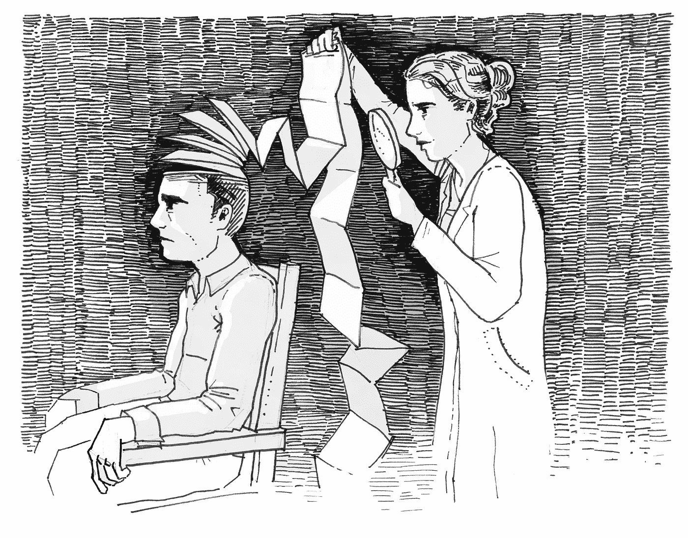
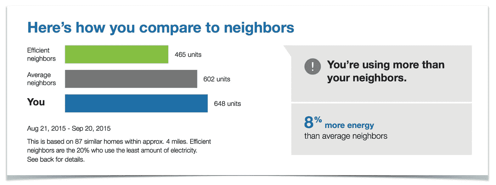
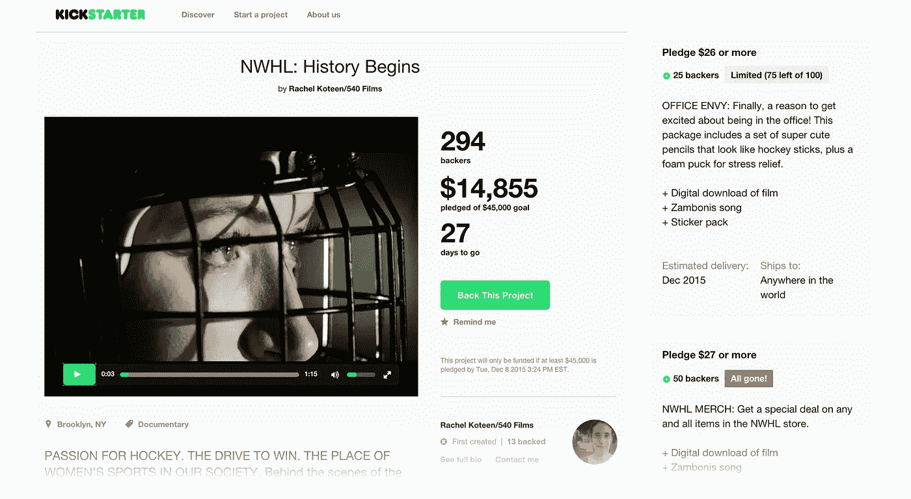
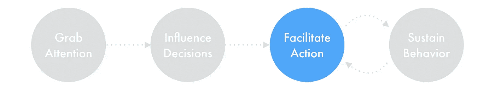
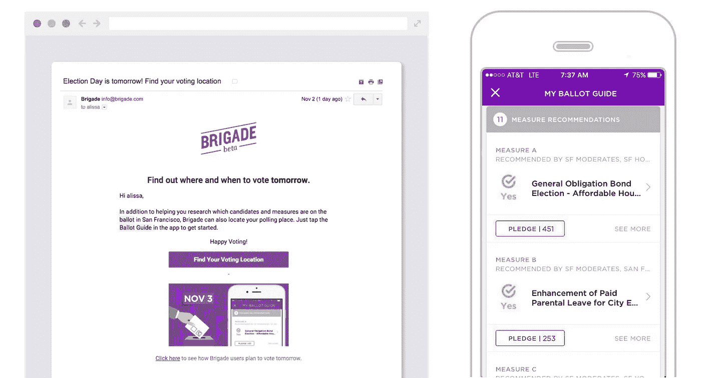
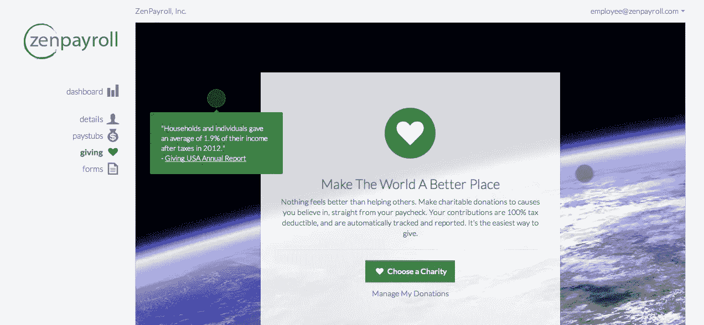
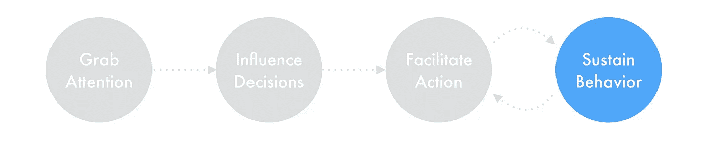
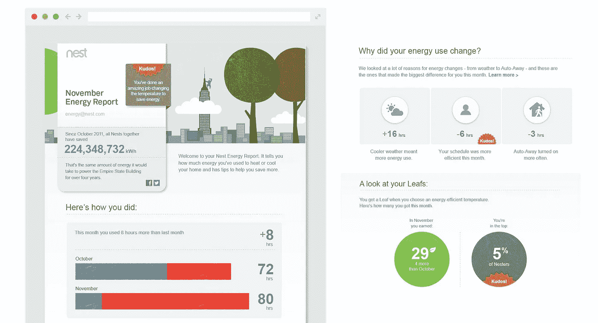
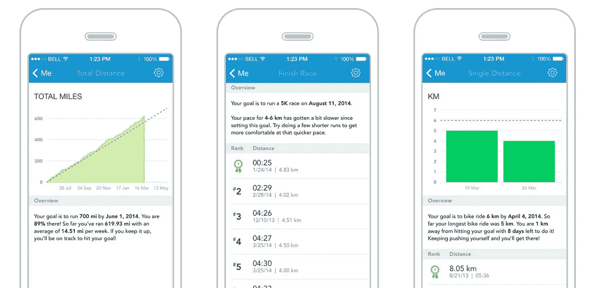

# 产品设计的行为方法

> 原文：<https://medium.com/swlh/a-behavioral-approach-to-product-design-166d22628970>

Illustration by [外在奖励](https://medium.com/u/c25d3d322cef#Extrinsic_motivation)(金钱、回扣)、生活方式的好处(舒适)，或者吸引一个人的[内在动机](https://en.wikipedia.org/wiki/Motivation#Intrinsic_motivation)和价值观。*   **重新组织信息。**利用行为科学信息改变看法并鼓励行动。[锚定](http://zurb.com/triggers/anchoring/)人们的特定选择，通过[稀缺性](http://zurb.com/triggers/scarcity/)说服他们，或者使用[社会比较](https://www.psychologytoday.com/basics/social-comparison-theory)或[社会证明](http://zurb.com/triggers/social-proof/)等社会激励手段。

## 例子

*   Opower 鼓励数百万家庭通过社会比较来减少能源使用——向他们展示与该地区类似家庭相比他们使用了多少能源。尽管人们通常不太考虑他们的能源使用，但这一信息具有强大的影响力，让人们重新考虑他们的能源习惯，并找到减少使用的方法。

Kickstarter 和其他众筹网站使用几种方法来影响我们做出承诺的决定。项目通常会提供外在的好处(例如早期接触产品)和内在的好处(例如为支持你所关心的事业而自豪)。认捐建议通过行为科学技术得到加强，如社会证明(有多少人认捐)和稀缺性(每个认捐层的有限时间和有限地点)。

# 第三阶段:促进行动

当一个人做出行动的决定后，下一步就是帮助他们坚持到底，让行动尽可能简单和无障碍。

## 技术

*   **简化动作。**将目标行动分解成可实现的小步骤。通过简化界面、[分块信息、](http://zurb.com/triggers/chunking/)或引入[渐进式披露](https://en.wikipedia.org/wiki/Progressive_disclosure)来减轻用户的认知负担。识别并解决阻碍人们采取行动的常见障碍。
*   **引导体验。以促进行动的方式塑造体验。常见的技术包括演练、标注或预先确定的[默认值](https://en.wikipedia.org/wiki/Default_effect_%28psychology%29)。**
*   **帮助用户创建计划。**鼓励人们设定目标并付诸行动。发送提醒并跟踪他们的进度。
*   **适时触发。**时机至关重要——确保在人们最有动力、最有能力采取行动的时候触发他们采取行动。

## 例子

*   鼓励人们讨论他们对新闻和政治问题的看法的初创公司 [**Brigade**](http://brigade.com) ，最近创造了几个工具来促进投票过程。就在选举日之前，该应用程序帮助人们找到当地的投票站，并根据用户对几个问题的回答提供投票建议。

*   ZenPayroll Giving 消除了摩擦，允许员工通过定期自动提款直接从工资中捐款，从而使慈善捐款变得容易。捐款会在年底自动记录在员工的 W-2 上。

# 第四阶段。持续行为

采取一次行动是不够的。为了让产品真正产生持久的影响，我们的设计需要激励人们继续他们的行为，并随着时间的推移感受到进步。

## 技术

*   庆祝进步。用积极的反馈来奖励员工，并展示随着时间的推移取得的进步。考虑一个[可变奖励计划](https://www.psychologytoday.com/blog/brain-wise/201311/use-unpredictable-rewards-keep-behavior-going)来增加参与度和强化行为改变。
*   **建立长期关系。**不要进行一次性沟通，而是要设计能随着时间推移而延续的体验，并随着我们对使用我们产品的人的了解的增加而改进。
*   **强调内在动机。**内在动机是长期行为改变的最强驱动力。研究表明，人们会被那些给他们目的感、社会关系、地位、自我表达、掌控和自主的经历所吸引。

## 例子

*   **Nest** 发送月度报告，显示一段时间内客户的能源使用模式。对于不日常管理恒温器设置的人来说，这些引人入胜的信息图表提供了一个展示 Nest 如何帮助节省能源和金钱的机会。此外，像“叶子”和“荣誉”这样的徽章吸引了我们内在的地位和竞争意识。

*   **Runkeeper** 和其他健身应用程序使用各种技术来帮助我们长期保持行为。用户可以设定活动目标并跟踪他们的进展，无论是个人还是作为社会团体的一部分。个人最佳成绩、排行榜和持续的积极反馈有助于激发我们自我控制、社会关系和地位的内在动机。

# 最后的想法

作为设计师，我们需要考虑人们在使用我们的产品时经历的各种体验——了解是什么促使他们开始关心、采取行动，并随着时间的推移保持积极性和参与度。将行为透镜应用到我们的工作中有助于识别旅程中的哪些阶段是有效的，哪些阶段可以更好，最终加强我们的设计并降低我们的产品很快被忽视或遗忘的风险。

我们希望这个框架对其他寻找将行为思维融入设计过程的设计师有用。如果您发现这很有帮助，或者有其他改进方法的想法，我们很乐意倾听！

## **想了解更多关于行为设计的知识？**

Opower 设计团队已经就将行为科学融入设计过程发表了演讲和文章:

*   IxDA’15 演讲:[行为年龄](https://vimeo.com/120403188)
*   TEDx 演讲:[不要改变产品，改变人](http://tedxtalks.ted.com/video/Energy-saving-Deena-Rosen-at-TED)
*   文章:[用设计改变观念](/@aaronotani/changing-perceptions-with-design-717c030654e#.ywnlzpqhj)
*   文章:[问的少，得到的多:限制用户行为的行为科学](http://uxpamagazine.org/ask-less-get-more/)
*   文章:[设计中的数字心理](/swlh/the-psychology-of-numbers-in-design-d6a7a011e8b1)