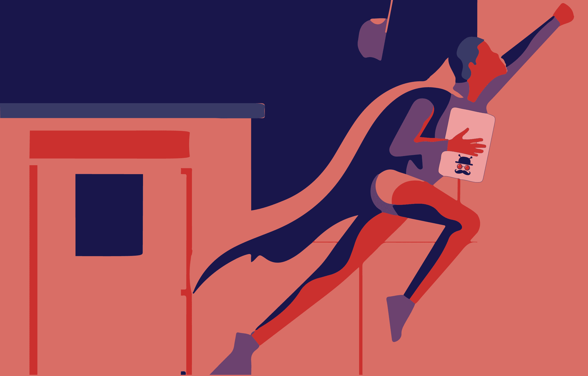
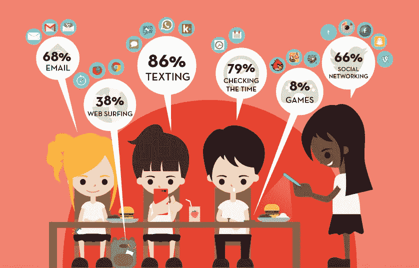
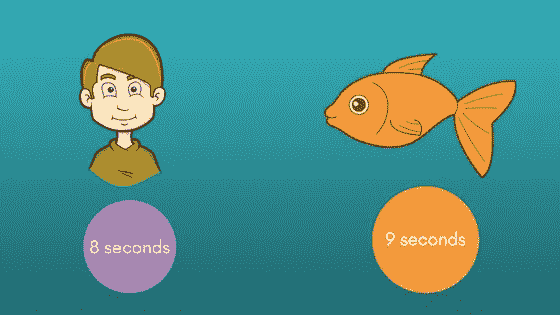
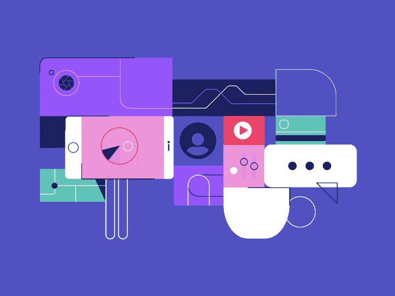
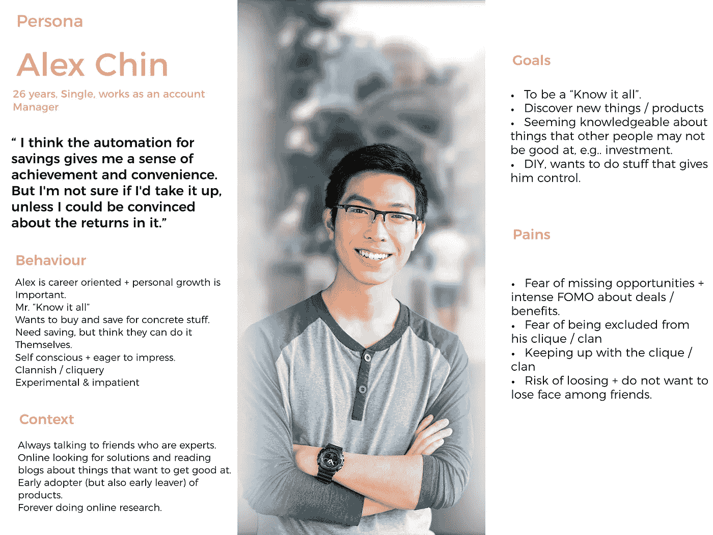
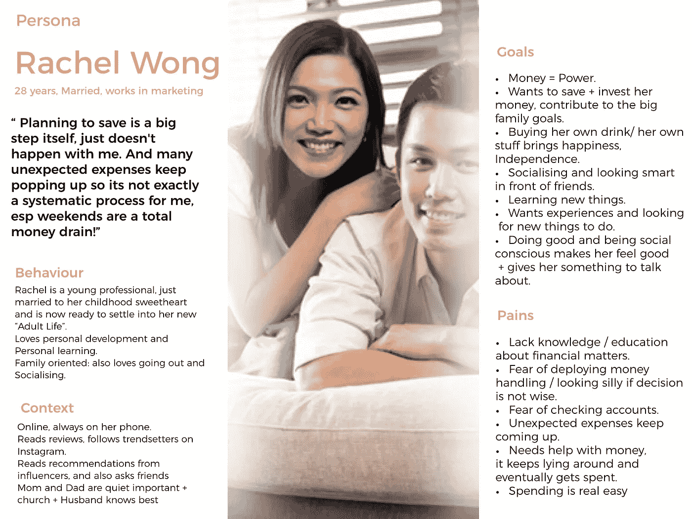
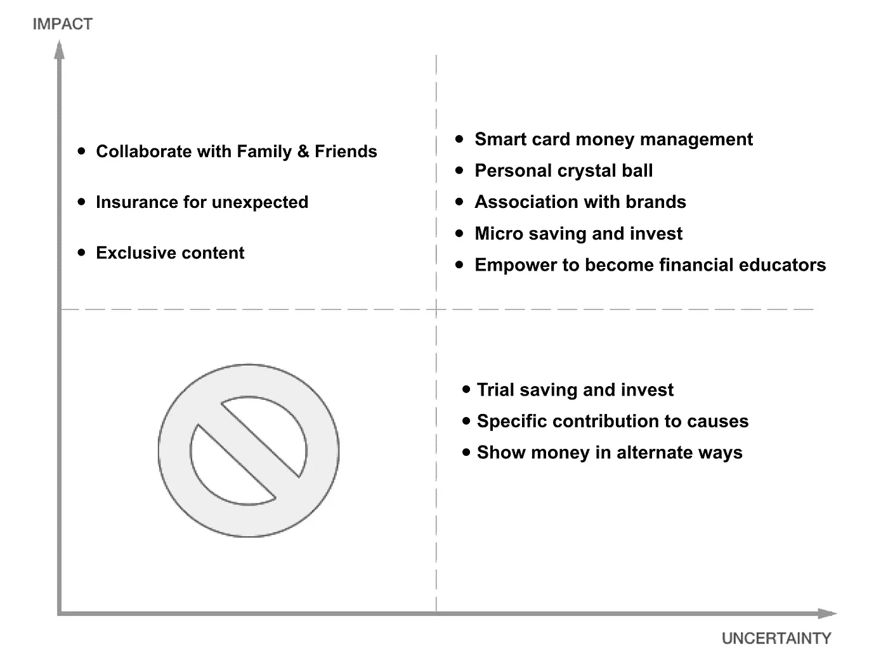
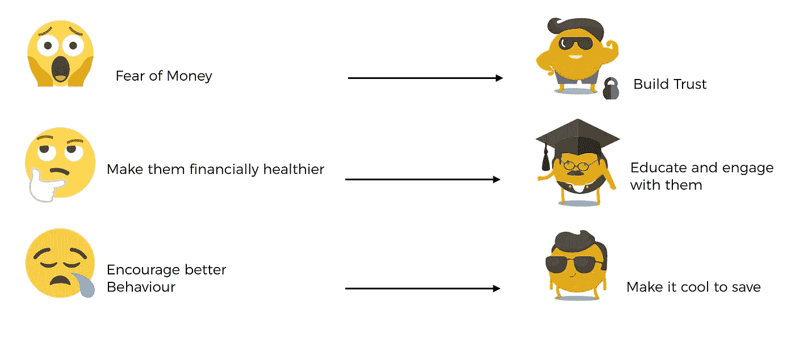

# 更好的建造方式

> 原文：<https://medium.com/swlh/a-better-way-to-build-c2325e48c489>

The user being the hero

通过让用户站在我们设计和开发的所有流程的前面和中间。

Hektor 是一家初创公司，致力于为我们的年轻客户群设计有用的解决方案，他们是:

**对技术更加了解。**

**留给试图联系他们的人的时间有限。**

Attention span of an internet user < goldfish

**希望产品对他们真正有用。它必须解决一个他们已经使用的传统品牌/服务没有解决的问题。**

Easy, useful everyday products

识别这些问题**和了解用户需求的方法有很多，比如可用性测试、采访用户、与商业利益相关者讨论、进行调查。然而，越来越受欢迎和接受的一项技术是**使用人物角色**:开发原型用户来指导解决方案的愿景和设计。**

因此，通过我们所做的所有研究来了解这个用户是谁，并感受他们的情感历程，我们需要创建这些**“角色”,他们充当真实用户的“替身”,并帮助指导关于功能和设计的决策。**

# 满足角色的

Primary Persona 1

Primary Persona 2

记住这些角色，我们开始列出所有我们能识别的关于他们的储蓄需求和他们与金融的关系的问题。

# 问题陈述

*“如果我只有一个小时来拯救世界，我会花 55 分钟来定义问题，只花 5 分钟来找到解决方案”——阿尔伯特·爱因斯坦*

●存钱很难，因为没有即时反馈；未来太遥远了。

●意外支出导致储蓄困难。

●规划过于长远；这不是头脑的前沿，所以很难规划未来。现在的自己总是战胜未来的自己

●密切关注财务状况很难。

回到白板上，我们开始更具体地确定我们发现的问题，并因此开始对它们进行优先排序。这让我们对流程有了清晰的认识和视角，突出了首先要解决的领域以及可以推迟到以后解决的问题。

The uncertainty mapping

现在我们有了一个优先计划，我们开始关注右上角象限中的最高影响/不确定性指针。我们的目标是减少不确定性，这样我们就可以将这些点移到黑板的左边。

**减少最具影响力领域的不确定性是降低项目风险和最大化成功发布产品机会的关键，而且是一个成功的产品。**

# 从而得出解决方案陈述

建立一个鼓励储蓄习惯的储蓄工具。

通过与用户的生活方式相结合，以轻松有趣的方式为真正重要的事情省钱/投资的工具。

**Hektor 需要:**

需求分析者

超支防止器

良好行为奖励者

让它变得无需动脑、有趣和自动化。

# 使命:建立一个生态系统，通过最大限度地减少对金钱的恐惧，鼓励年轻人在财务上更加健康，并教育他们建立更好的行为和做出明智的决定，来帮助年轻人开始储蓄。

Our plan to build better

有了解决方案和使命，我们现在可以全力以赴创建一个详细的价值主张并设计解决方案。

众所周知，每个品牌都有三个主要特征。

1.  **on boarding:**帮助用户理解你做的事情，并测试这个解决方案对他们是否有用
2.  **实际功能:**使解决方案尽可能易于使用，并确保流程顺畅、轻松
3.  **参与:**让解决方案变得非常有用和有趣，迫使用户继续使用它。

使用我们设计的人物角色并理解他们的旅程，引导我们开始着手解决方案和设计流程的后续步骤。这一点我会在后面的文章中详细阐述。

# **学到的东西**

研究和与实际用户的互动是一个持续的过程，每次互动都是一个新的发现和新的学习。因此，当我们成熟时，我们创造的人物角色会成长并有更多的维度。

创造用户之旅实际上是最有成效的实践，它帮助企业真正了解用户的处境，理解他们的想法和感受。这揭示了研究和分析中遗漏的任何微小细节。

要用用户真正理解的语言与他们交谈，首先需要彻底了解他们是谁以及他们喜欢如何交流。一旦一个品牌能够理解用户的痛苦，并能像他们一样说话，就可以说成功了一半。

我们希望激励我们的用户，让我们的年轻一代有能力，并确保每个人对他们的钱感到更安全和自信。这是一个巨大的责任，但也是一个令人兴奋的机会，从许多方面来说，我们才刚刚开始。

## 这篇文章发表在 [The Startup](https://medium.com/swlh) 上，这是 Medium 最大的创业刊物，拥有 275，057+人关注。

## 在此订阅接收[我们的头条新闻](http://growthsupply.com/the-startup-newsletter/)。

