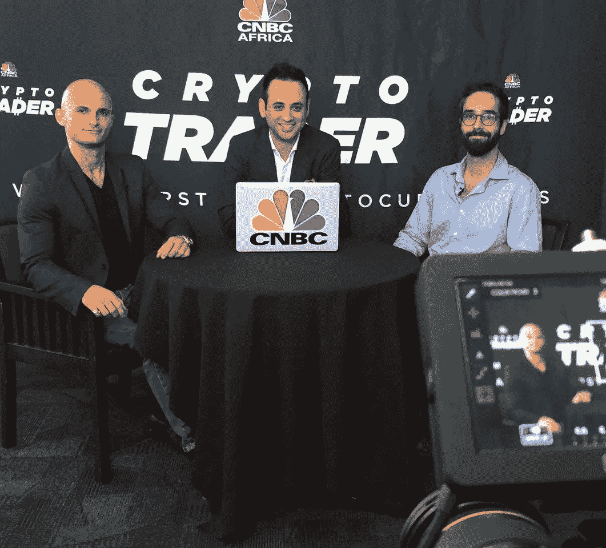

# 一笔巨大的分叉交易(ZCL+BTC=匿名比特币)

> 原文：<https://medium.com/swlh/a-big-forking-deal-zcl-btc-anonymous-bitcoin-b7f97c86a038>

每个区块链记者和企业家的梦想都是正式宣布一个你创办的项目。今天，我很自豪地宣布 ZCL 和 BTC 的分叉，创造了匿名比特币。

*(杰克·格林鲍姆又名“密码之王”，兰*纽纳 *@cryptomanran，山姆*阿巴西*首席开发人员)*

# 一个有趣的分叉项目

有时可能很难抑制住激动的情绪，但为了确保对项目的公正报道，我会尽量克制自己对项目的热情。其中一个主要原因是，美国消费者新闻与商业频道什么时候决定报道一个[分叉公告](https://www.youtube.com/watch?v=hYDJ-lDYFKw&app=desktop)(我知道非常微不足道)？

分叉(软的或硬的)在加密领域已经变得相当普遍。问题是，哪些是真实的，哪些是与骗局有关的。与选择保持匿名的团队一起，预先设定的分叉硬币总是需要关注的。匿名比特币打算对公众完全透明地实现 ZCL 和 BTC 的分叉，每周更新视频并与社区沟通。

该项目名为**匿名比特币，**匿名比特币团队打算在之前的分叉失败的地方取得成功，同时将独特的技术添加到已经尝试过的真实区块链中。共同分叉将发生在 BTC 和 ZCL，因此为了获得新的分叉硬币，匿名比特币，人们必须在分叉快照日期之前购买 BTC 或 ZCL。

匿名比特币测试网将于 8 月 10 日上线，在 2018 年 9 月 9 日快照出现之前，为交易所提供一个月的时间来测试钱包和基础设施。mainnet 将在快照发布后 48 小时内上线，以便快速集成到 exchange 平台上。交易所上市和以交易量大的交易所为目标是新硬币除了实用性和技术以外最重要的特征之一。

匿名比特币的主要特征将包括交易时的匿名性(使用 zkSNARKs 技术)，提高的交易速度(通过增加块大小)，以及通过 masternodes 下注硬币的能力。这三项技术升级将按照比特币的形象创造一种加密货币，具有赌注能力和匿名升级。

匿名比特币团队分成多层。BTCA 团队由核心开发团队、创始人、顾问、社交媒体专家、区块链记者，甚至加密合规律师组成。核心开发团队由迈阿密武士道实验室的创始人领导。最著名的顾问，[史蒂文·奈拉约夫](https://www.linkedin.com/in/nerayoff/)，曾参与以太坊、利斯克、策罗、ZClassic、AION 等项目。拥有这种水平的顾问对于确保市场采用是必不可少的——特别是对于一枚分叉的硬币。

区块链记者和金融科技分析师已经成为顾问，以确保该领域的进展，并提供有关整个分叉过程的内部新闻报道。已经组建了一个制作团队来提供每周视频更新，介绍该团队这一周在会议、网络和“工作”方面都做了些什么。这将允许真正的内在透明。加密合规律师的唯一职责是确保我们始终符合加密货币不断变化的监管结构。fork 不被视为证券产品，因为没有出售代币，但它总是有助于让律师确保在所有方面都保持合规。

有了已经构建好的路线图和不会错过的最后期限，匿名比特币已经准备好开始从概念到分叉加密货币的旅程。

请访问该项目网站[anonymous bitcoin . io](http://anonymousbitcoin.io/)——该网站将于周日上线——了解更多详情，或者直接与团队联系:

1.  推特:[@ BTCA _ 福克](https://twitter.com/BTCA_FORK)
2.  不和:[https://discord.gg/xJWCGB9](https://discord.gg/xJWCGB9)
3.  Reddit: [匿名比特币](https://www.reddit.com/r/AnonymousBitcoin/)

*直接接触加密王，可以在 Twitter (@JbtheCryptoKing)或者*[*Reddit*](https://redd.it/81hj5q)*(ICO 更新和每日报道)。阅读更多文章请查看本王已写的:*[【http://bitcoinist.com/author/cryptoking/】](http://bitcoinist.com/author/cryptoking/)

## 这个故事发表在 [The Startup](https://medium.com/swlh) 上，这是 Medium 最大的创业刊物，有 320，131+人关注。

## 在这里订阅接收[我们的头条新闻](http://growthsupply.com/the-startup-newsletter/)。

