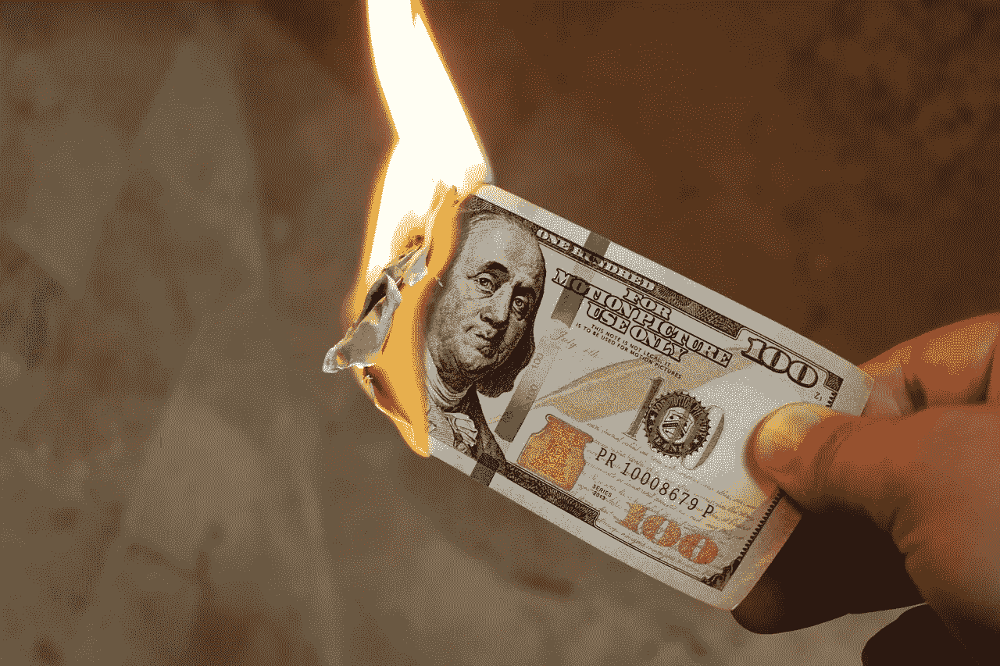

# 商业模式的十亿美元灾难

> 原文：<https://medium.com/swlh/a-billion-dollar-disaster-of-a-business-model-e998db530ef2>

人们会被付费的社交平台所吸引。这是社交媒体的未来。

[Intellectual/pixabay](https://pixabay.com/en/burning-money-dollars-cash-flame-2113914/)

上周，我在[发表了一篇对 Steemit](https://ideavisionaction.com/business/in-the-cross-section-of-social-media-and-cryptocurrencies/) 的分析，这是一个拥有自己的加密货币的社交平台。Steemit 背后的想法是向用户支付发帖、评论和投票的费用。等等，先别急着去 Steemit.com。让我先写完我的帖子。

社交平台向其用户付费的第一反应是，这很可能是一个骗局。我在之前的帖子中提出，社交媒体平台向用户付费是可行的。用户通过发帖、评论和喜欢帖子和评论来增加社交平台的价值。那么，为什么不补偿他们为系统增加的价值呢？

脸书市值 5000 亿美元，每年都有可观的利润。他们有资金补偿用户的贡献。有了斯蒂米特，秘密就泄露了。最终，人们会被付费的社交平台所吸引。

问题不在于是否可行。是可行的。问题是如何去做。不幸的是，Steemit 做错了。

**斯迪米特奖励分配方案**

Steemit 计划在第一年向用户分配其市场资本总额的 6.5%。他们的制度预计这一数额将在 20.5 年内从 6.5%逐渐减少到 0.65%

在写这篇文章的时候，他们的市值是 10 亿美元。这意味着， **Steemit 将在一年内向其用户赠送 6500 万美元，用于发帖、评论和投票**，当然，如果他们能够保持其市值的话。

是的，他们有。我没开玩笑。如果你不相信我，阅读他们的常见问题，核实他们的市值，并做数学。如果你认为我错了，把你的计算贴在评论区。

我想知道他们的团队或投资者中是否有人意识到，他们将在一年内为大多数平庸的内容烧掉 6500 万美元。

20.5 年后，赠品率将降至 0.65%，但到那时，如果他们能保持 10 亿美元的市值，他们将蒸发 50%的市值，这是一个巨大的 5 亿美元，我对此表示高度怀疑。

**系统容易被滥用**

Steemit 上分配给用户的资金数量是荒谬的。更荒谬的是他们分发的方式。他们根据这些帖子和评论获得的票数来分配这些资金。你可以想象那会导致各种各样的滥用。有些人只是通过投票给自己的帖子和评论，而不是投票给有价值的帖子和评论，来实现投资回报的最大化。

没有一家公司能在每年浪费掉很大一部分市值的情况下生存下来，因为这些东西根本没有增加任何价值。如果他们不停止这个错误，Steemit 将无法生存。最终，他们将面临代币的抛售。没有任何市场资本分配给他们的用户，他们的整个系统将会崩溃。

**披露和免责声明**

*在写这篇文章的时候，我拥有一些斯蒂姆的异能令牌。这篇文章仅供参考，无意成为商业或投资建议。*

*阅读下一篇:* [在社交媒体和加密货币的交叉版面](https://ideavisionaction.com/business/in-the-cross-section-of-social-media-and-cryptocurrencies/)或者注册[每周简讯](https://ideavisionaction.com/email-newsletter/)。

## 这篇文章发表在 [The Startup](https://medium.com/swlh) 上，这是 Medium 最大的创业刊物，拥有 299，352+人关注。

## 在此订阅接收[我们的头条新闻](http://growthsupply.com/the-startup-newsletter/)。

