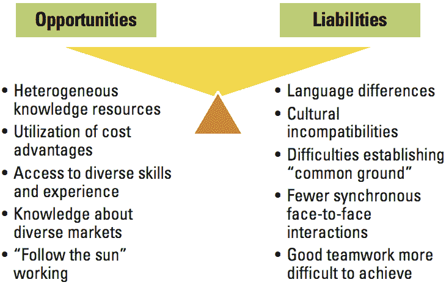

# 创建强大的虚拟团队文化的蓝图

> 原文：<https://medium.com/swlh/a-blueprint-for-creating-a-powerful-virtual-team-culture-3aa04048b29c>

强有力的虚拟团队文化是在领导者有意构建的时候产生的。

Source: [Pexels](https://www.pexels.com/photo/whiteboard-sketching-design-planning-7366/)

最近，我带来了一位战略合作伙伴，帮助我管理和扩展 CollabsHQ。

他是一个连续的企业家，也是我的好朋友，他相信创造一个协作世界的愿景，在这个世界中，每个商业领袖都体现了透明性、真实性、同理心和安全性，以实现他们的商业愿景。唯一的问题？他在阿拉斯加的朱诺，而我在加州的洛杉矶。物理隔离已经带来了一些挑战:

1.  保持我们的能量水平一致
2.  了解每个人正在做的事情
3.  管理期望和目标
4.  在会议间隙保持联系
5.  让一切变得有趣和吸引人

要成为一个高绩效、高影响力的团队，[对这些挑战的清晰认识是至关重要的](https://wavelength.asana.com/types-clarity-high-performing-teams/)。

建立适当的流程，使用 Slack、concept 和 Zoom 等平台，并有意识地将过去的混乱变得清晰，给我们的团队带来长期持续努力所需的动力。

这确实需要努力。但是，在我们扩大规模的过程中，确保我们的团队活力和文化高度协作对我们来说极其重要，尤其是在我们带来更多员工和职员的时候。

# 虚拟团队的挑战和好处

> “我喜欢和我一起工作的人。也许有一天我会见到他们。”—未知

Source: [Sloan Review](https://sloanreview.mit.edu/article/how-to-manage-virtual-teams/)

[2012 年一项名为*虚拟团队调查报告——在虚拟团队中工作的挑战*](https://www.rw-3.com/blog/2012/05/survey-reveals-global-employees-not-prepared-for-virtual-teamwork) 的研究发现，员工在虚拟团队中工作时面临以下挑战:

1.  很少面对面的互动会影响团队凝聚力和信任
2.  管理多个时区会增加压力
3.  团队优先事项和目标可能会在虚拟环境中迷失
4.  出现技术问题时，虚拟交流可能会很困难
5.  文化和/或语言问题可能会导致误解

然而[公司也报告了显著的优势](http://www.aperianglobal.com/benefits-remote-workforce-virtual-collaboration/)，包括:

1.  每个虚拟员工每年可节省 2，000 美元
2.  更高的工作效率支持更多的协作
3.  更高的员工保留率
4.  可以招募更多的员工。

这意味着当创建一个强大的虚拟团队时，你需要平衡挑战和利益，使之成为一个相互认可的团队结构。

为此，请执行以下操作:

# 创建强大的虚拟团队文化的蓝图

# 1.弄清楚为什么

你的员工所做的每一项任务都应该与公司使命和团队目标相关联。向星巴克寻求灵感。

他们的使命是，“激发和培育人类精神——一次一个人，一个杯子，一个社区。”一个咖啡师应该理解和感受为什么他们做的每一杯咖啡或者他们给的一个温暖的微笑都与那个使命有联系。如果他们不这样做，他们就不相信企业的“为什么”。如果可以，他们是有联系的。

对于虚拟环境，尤其如此。

当分歧出现时，你正在决定下一步，制定战略，甚至思考新的想法，一个清楚的原因会让混乱变得清晰。它让每个人都有了关注点，让虚拟互动变得更容易，尤其是当你无法读懂人们的肢体语言或能量的时候。结果你会知道把团队的精力放在哪里。

# 2.养成设置会议议程的习惯

无组织的会议是浪费时间。会议议程将事情集中在为什么上，让每个人都清楚他们应该做什么。

使用这个[团队议程模板](https://docs.google.com/document/d/1w--wYmXnood7Llg3imZsMHJbWXptWGVo6FhooIbbYSU/edit?usp=sharing)或者通过 Trello、opinion 或任何其他项目管理系统创建一个您自己的模板。

关键是要保持一个行动项目、会议记录和目标的连续标签，因为让我们成为真正的人忘记。

**最佳实践:**在会议召开前 24 小时发出会议议程，并给团队成员参与议程的机会。

# 3.让它变得有趣(包括刺激真实的活动)

你仍然可以让虚拟会议和团队环境变得有趣。

我的战略合作伙伴和我已经制定了许多最佳实践来保持事情的趣味性和吸引力，尽管他们不在同一个物理位置。这包括在漫长的一周后享受虚拟快乐时光和[电影夜](https://www.netflixparty.com/)，或者在会议开始前分享故事，谈论我们个人的近况。

名为“激励我吧！”黑客，在虚拟会议的前 5-10 分钟，我们每个人都说一个让我们深受启发的故事(无论是个人的还是轶事的)。我们确保将故事与我们公司的价值观、愿景和使命联系起来。故事的形式也使得倾听的人能够感受到灵感，产生一些深刻的真实感，而讲故事的人记得为什么他在做他正在做的事情。

它给我们的工作带来了一定程度的人性，对此我非常感激。我们不再只是屏幕上的一些头像，而是真实的人，在经历真实的事情。

这同样适用于你。创造刺激真实的活动，让人们彼此人性化。

# 4.不要过度使用技术/软件平台

太多的技术对虚拟团队来说可能是件坏事。

来自 Trello，Slack，Asana，incidence，Dropbox，Google Drive 等。，您可以通过各种旨在简化工作的平台轻松征服您的团队。

**最佳实践:**不要使用 3 个以上的软件平台来做项目管理或沟通。

一旦你决定了哪些平台最适合你的团队，保持一致。总是提前提醒团队成员有变化，这样就不会突然出现意外。

# 5.集中沟通和过度沟通

当团队目标因个人表现而受损时，分歧、低生产率和增加的压力会在虚拟空间中发生。

当团队成员相处不好，他们开始在彼此背后谈论时，秘密渠道的谈话会开始影响团队的凝聚力。人们觉得被冷落了。八卦。一些团队成员有信息，而其他人没有。

创建一个强大的虚拟团队的成功依赖于集中沟通:一个每个人都可以了解影响团队的一切的地方。

你如何集中沟通，透明度，以及你如何沟通将是你的虚拟团队文化的基础。这意味着如果你使用 Slack 来集中沟通，有一个专门的渠道来更新团队。有一个有趣和随机的事情。和 pin 组规范，这样当一个新的团队成员加入时，他们有一个虚拟的指导方针 pin，让每个人都知道。

**为样本群规范遵循，查看** [**本谷歌 Doc**](https://docs.google.com/document/d/1wmb7SK7n41DmMGiC7DrYIE1S2Ry3bxs1SxoxAwSay9Y/edit?usp=sharing) **。**

# 6.有意识地提供反馈

保持虚拟团队的高绩效需要反馈文化。

一个强大的虚拟团队将知道如何提供反馈，以便他们指出什么是有效的，什么是无效的，以及如何改善工作关系或条件，以便每个人都能发挥出最佳水平。

这才是一个团队立于不败之地的真正原因:能够开诚布公，不怕拒绝、嘲笑或伤害感情。

当这种程度的信任和坦诚被创造出来时，虚拟团队和面对面的团队一样好。

写出一个标准化实践的反馈流程，这样每个人都知道如何从 A 点到达 b 点。流程示例如下:

1.  提供反馈的人在谷歌文档中写下问题描述、观察结果以及此人的行为对团队的影响
2.  人员向团队成员或经理发送电子邮件，讨论反馈
3.  个人分享谷歌文档
4.  会议计划讨论谷歌文档
5.  每个人都留在会议上，直到某种决议的结果。

如果你是一家初创公司，你使用[站立模型](https://www.atlassian.com/team-playbook/plays/standups)来召开团队会议和更新，虚拟地建立这种关系。

确保除了流程之外，经理每月或每季度还会召开正式的反馈会议，这样团队成员就知道他们也可以参加工作回顾会议。

## **想学习如何给予/接受反馈:注册免费课程:**

 [## 有效反馈的艺术

### 通过这个在线课程，学习如何给予和接受反馈，让每个人都开心。

collaboration.thinkific.com](https://collaboration.thinkific.com/courses/master-the-art-of-effective-feedback) 

# 7.体贴并保持友好

最后但同样重要的是，记住保持友好。

团队成员将位于不同的时区，有个人的事情发生，或者一些其他你可能没有意识到的问题。所以要体谅。

发布网络摄像头礼仪指南。

*   团队成员需要打扮吗？
*   他们每次都要开着摄像机吗？
*   他们必须有一个没有背景噪音的办公室吗？

尽早弄清楚这些事情。因为当技术问题出现时(它们会出现的！)，这些小事情可以有办法创造故事，导致人们互相怨恨。

**一句话:**虚拟团队面临许多挑战，但创造强大的虚拟团队文化是可能的。虽然技术有助于联系，但你需要让联系*感觉真实*这样每个人都会觉得自己是某个事物的一部分。要做到这一点，就要有意识地制定最佳实践，让每个人都能展现出最好的自己。

## 这篇文章发表在 [The Startup](https://medium.com/swlh) 上，这是 Medium 最大的创业刊物，有 339，876 人关注。

## 在这里订阅接收[我们的头条新闻](http://growthsupply.com/the-startup-newsletter/)。

