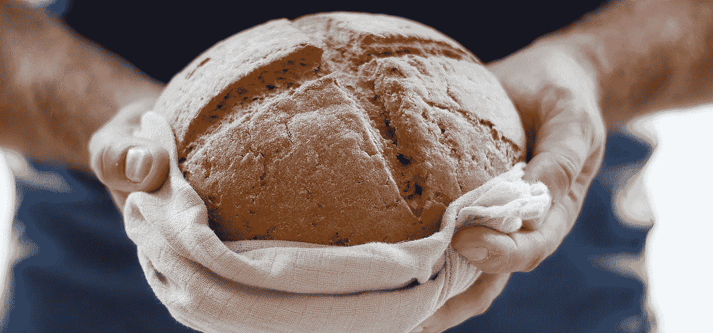
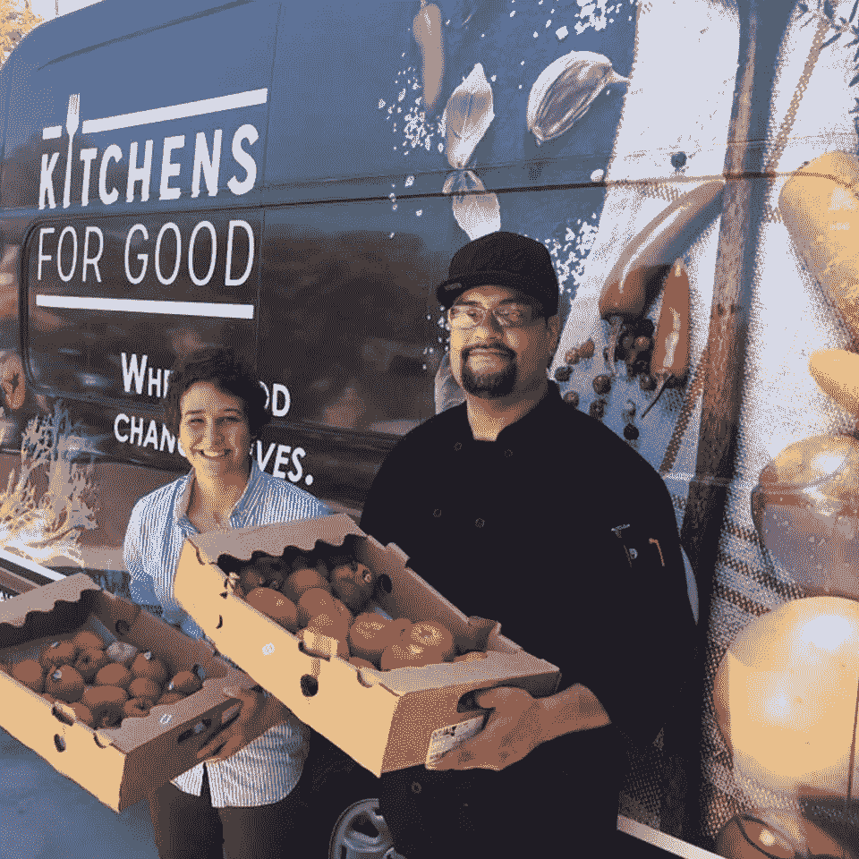
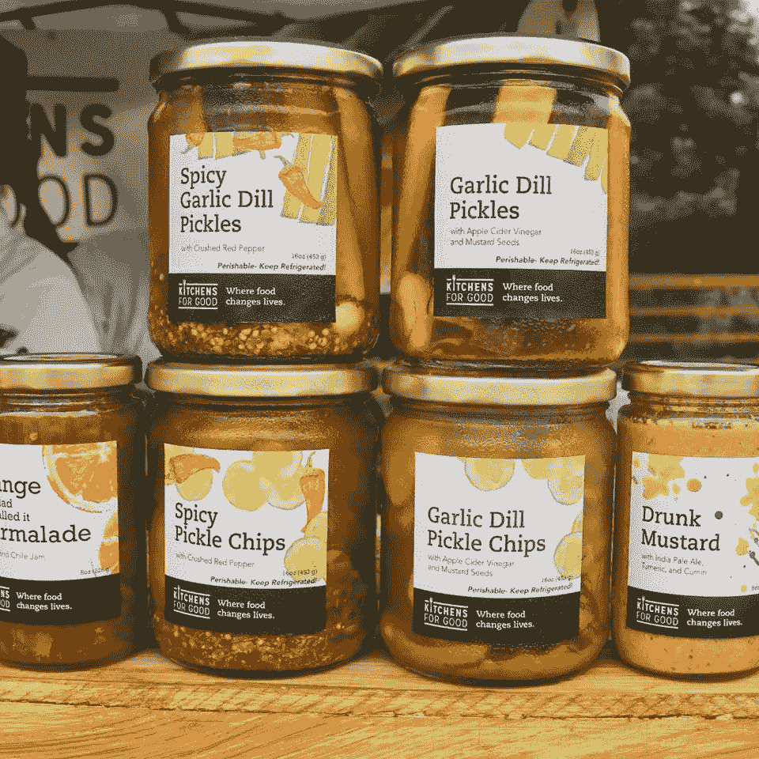
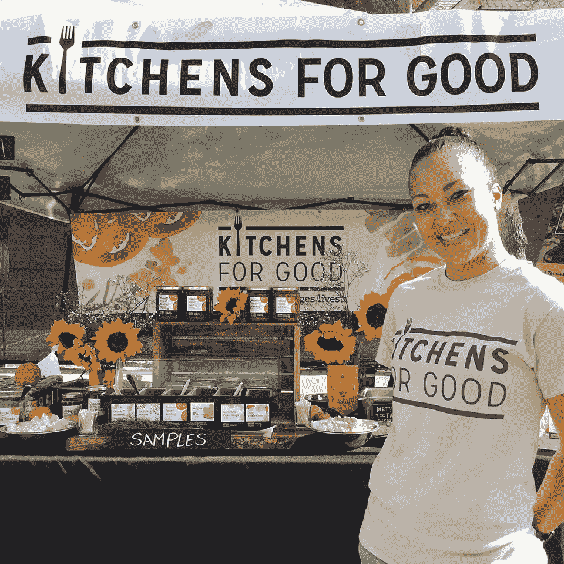
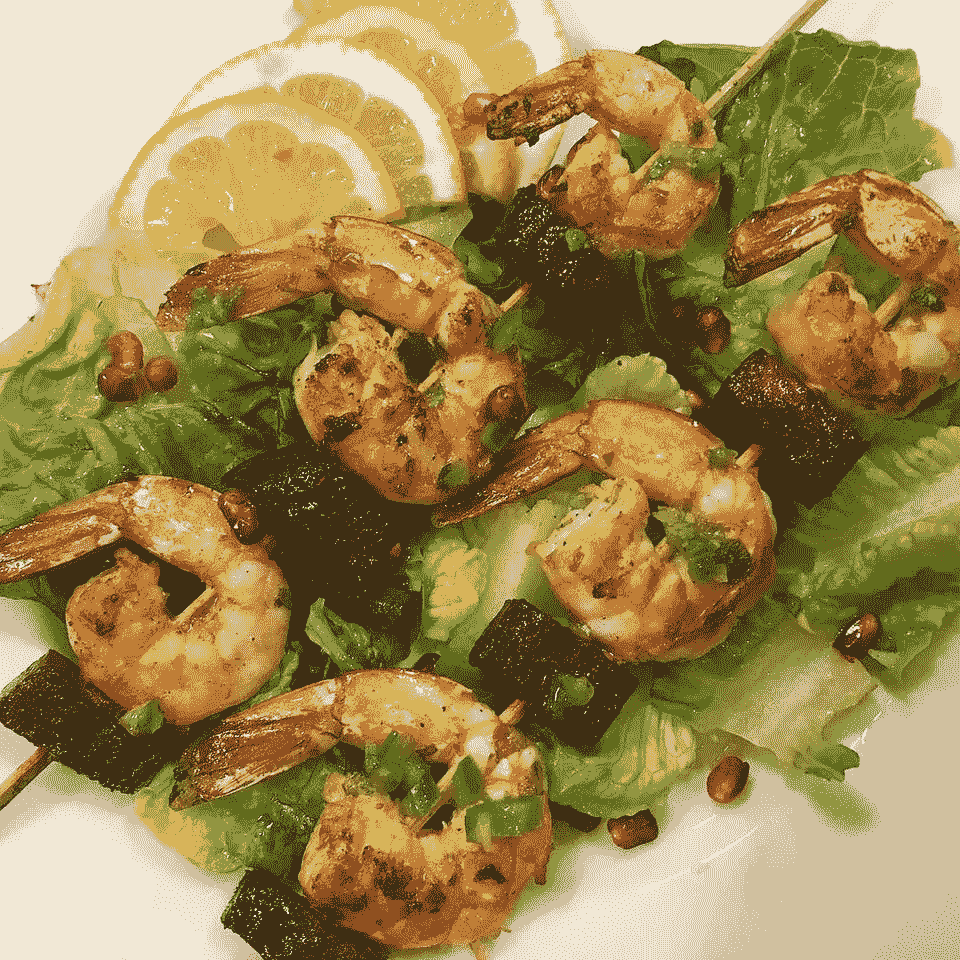
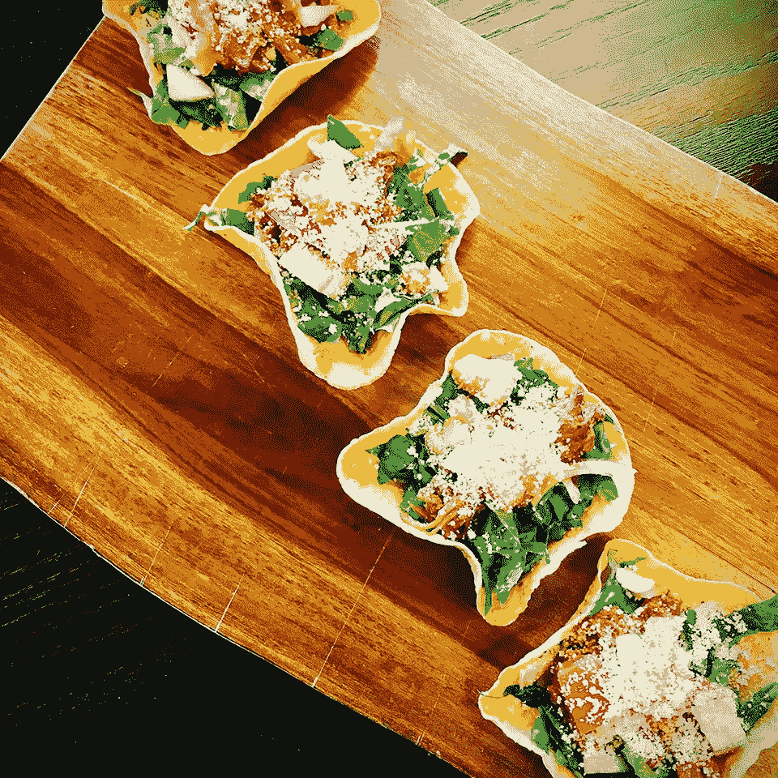
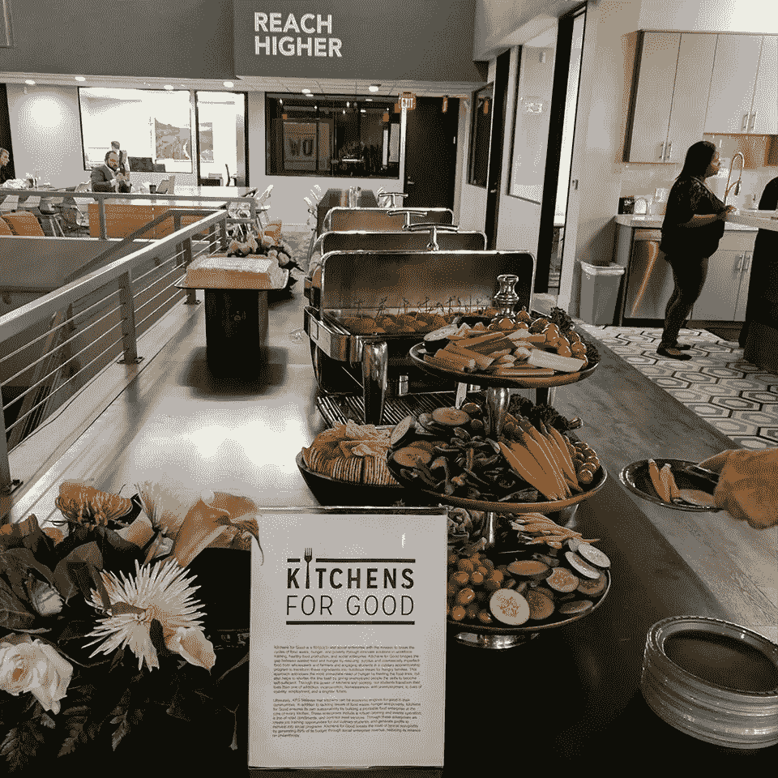
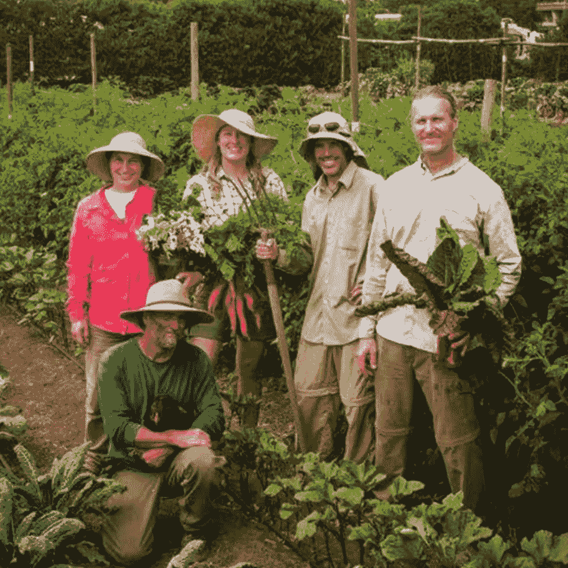
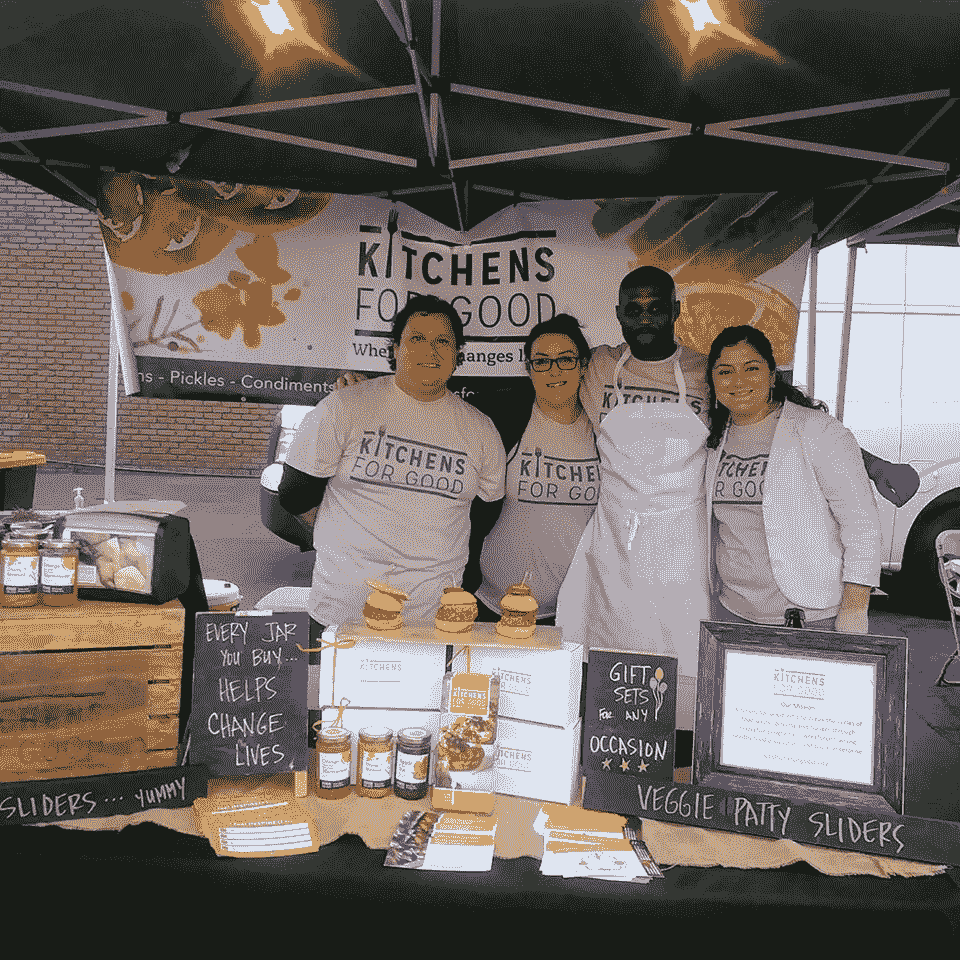

# 一个用心的品牌

> 原文：<https://medium.com/swlh/a-brand-with-a-heart-6096db223729>

厨房为好是一个社会企业，它创造就业机会，支持当地农民和当地社区。

食品领域正在发生许多创新——从像[习惯](https://www.psfk.com/2017/05/introducing-next-frontier-food-revolution.html)这样复杂的科学食品计划，到像 [3-D 打印食品](https://www.digitaltrends.com/home/nufood-3d-printed-tasting-experience-kickstarter/)这样的食品体验，到我们购买和看待[我们与食物关系的方式](http://bulldogdrummond.com/blog/constant-disruption-is-and-always-has-been-the-new-norm)。但并不是所有的食物破坏者都全心全意地喜欢厨房。

Kitchens for Good 是一个非营利组织，通过从批发商和农民那里抢救和购买剩余的食物，然后让学生参加烹饪工作培训计划，将这些食材转化为营养餐和产品，提供给饥饿的家庭，从而弥合浪费的食物和饥饿之间的差距。

***通过劳动力培训、健康食品生产和社会企业方面的创新计划，该品牌正在打破食物浪费、贫困和饥饿的循环。***

“厨房为善”组织认为，食物可以推动社区的社会和经济发展。有了不仅能养活而且能改善弱势居民健康的食物，有了雇佣被认为无法就业的男女的工作，有了支持南加州农民和社区的购买力，他们正在努力有效地、有利地关闭我们食物系统的破碎循环。

**闭环确保资源以尽可能少的浪费流向有需要的人。**

食物太好了，不能浪费。然而，在美国，超过 40%的食物被浪费了。这些垃圾中有一半是不美观或缺乏商业需求的新鲜农产品。从成熟到卖不出去的水果，到表面有瑕疵的蔬菜，或者太大或太小不符合超市标准的鸡蛋，有大量高营养的食物正在被浪费。“善行厨房”直接与农民和批发公司合作，购买和拯救那些不需要的水果和蔬菜。所有捐赠和购买的物品都集中在一个食品加工中心，员工、学生和志愿者用它为圣地亚哥的社会服务机构制作健康餐、小吃和食品。

每周，学生们为圣地亚哥县饥饿的老人和儿童准备 1500 份食物。这种方法不仅通过健康膳食解决了饥饿的最直接需求，还通过劳动力培训计划解决了饥饿的根源——贫困，该计划为那些通常被认为难以掌握技能实现自给自足的人提供了培训。

多余或无用的产品随后流向公司，这些公司可以将其转化为产品进行销售或捐赠。制造这些产品的劳动使处于风险中的个人能够学习适销对路的技能，从而能够掌握自己的经济命运。

**一种可持续的非营利商业模式** 通过他们的[创意社会企业](http://kitchensforgood.org/social-enterprise/)，厨房为善能够产生他们总预算的 75%。该公司通过在每个厨房的核心建立一个盈利的食品企业来确保自身的可持续发展，包括餐饮、代餐服务和零售食品。通过这种强大的企业模式，他们为烹饪专业的毕业生创造了适宜居住的有薪工作，并创造了可观的利润，再投资于他们的社会项目。

Chuck Samuelson 于 2013 年成立了一家名为 Kitchens for Good 的 CEO，致力于解决食物浪费和饥饿问题。他建立公司的原则是“正确的生活方式”,即要求人们谋生，对社区的贡献大于他们的所得。查克想停止谋生，开始有所作为。

查克对食物并不陌生。他的职业生涯是在餐饮服务行业度过的，当过厨师、餐馆老板和顾问。他 13 岁就开始了洗碗工的职业生涯，20 多岁时，他升到了行政总厨和总经理的位置。他拥有屡获殊荣的餐厅，并在 Stone Brewing Company 担任食品服务高级经理。作为一名行政总厨，他对浪费的大量食物感到震惊，因为他知道有一个很大的社区缺乏营养食物。查克知道他必须做些什么，所以他致力于改变现状，于是“永远的厨房”诞生了。

参与的方式有很多:

[志愿者](http://kitchensforgood.org/volunteer/)。

[分享。](https://twitter.com/kitchensforgood)

[承办活动。](http://kitchensforgood.org/)

[捐赠。](https://kitchensforgood.org/donate/)

更:[www.kitchensforgood.org](http://www.kitchensforgood.org/)

## 这篇文章发表在[《创业](https://medium.com/swlh)》上，这是 Medium 最大的创业刊物，有 289，682+人关注。

## 订阅接收[我们的头条新闻](http://growthsupply.com/the-startup-newsletter/)。

