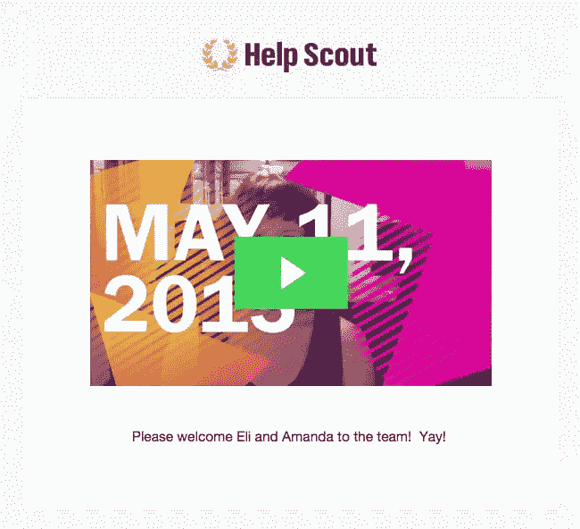

# 更好的 1:1 的简要指南——适用于制造商和经理

> 原文：<https://medium.com/swlh/a-brief-guide-to-better-1-1s-for-makers-and-managers-alike-406e492c65c6>

## 你找不到时间一对一，你就腾出时间。

沟通总是在寻找创造性的新方法来打破。

当你是一个好斗的六人小组时，有效的方法随着第二十个人的到来而土崩瓦解。这是无法避免的。在你的公司中，唯一不应该改变的做法——也是最适合解决这些问题的做法——是一对一。

“没时间”不是借口。这就相当于说其他事情永远优先于人。记住这一点，这里有一些方法来开始、维持和充分利用你的一对一。

# 安排好它们，永远不要取消

你应该战斗，竭尽全力，不要取消一对一的比赛。即使是重新安排也需要一个好的理由来证明自己。“我不认为我们有很多要讨论的”是一个最终会伤害双方的常见借口。

把一次对话放在日历上会让它发生。即兴表演是一种我很难鼓励的做法——你愿意冒险形成可怕的[门户开放政策](http://www.inc.com/magazine/201311/jason-fried/what-open-door-policies-actually-mean.html)吗？在这种政策下，你承诺一切，却什么都不兑现。

# 称它们为 1:1，别无其他

这听起来像是语义上的琐碎，但标签创造了叙事。在“登记”过程中，双方将为登记做好准备，仅此而已。

“这个问题让我这个星期非常沮丧。但我会告诉凯西，也许在我们入住后。”一厢情愿还是危险的妄想？后者:这个永远不会被提起，别自欺欺人了。

一对一传达了两个人交谈的行为，说他们需要说的任何话。“什么都行”是你想要的；让你感觉像是公开讨论的语言会帮助你达到目的。

# 默认为最个性化的频道

如果你能亲自和他们一对一，那就去做吧。[作为远程团队](https://www.helpscout.net/blog/remote-culture/)，你应该坚持大家视频通话。

看到对方是有意义的。肢体语言很有意义，即使你不想找什么，人际关系也值得有多余的*“Skype 恨我！”*每周解说一次。

# 密切关注行动/决策比率

迈克尔·洛普在《管理人类》中如是说。

很少有比把过去会议中的问题带到第二次会议中更令人恼火的情况了。或者三分之一。到了第四天，真正的怨恨出现了。

> 你经常会在激烈的谈话中离开，桌上有很多令人兴奋的东西。但是“决策”是仍然需要完成的结果。

光说不做会导致信任的流失；感觉被浪费的额外努力是不会再付出的努力。

你必须结束一对一的谈话，同意自己做决定。杰森·伊万尼什认为，如果你不坚持到底，在一对一的谈话中，什么都不重要。他建议你从问这两个问题开始:

1.  下次我们谈话时，我能让*你*对什么负责？
2.  下次我们谈话时，*我*能对你做些什么？

在下一次谈话开始时确认取得了进展——你们都做了你们说要做的事情了吗？回答“是”会给你们双方带来进步、动力和信任。

# 偶尔谈论一下职业

如果你从一开始就在一家公司工作，你就会知道这一点为什么重要。一开始，每个人都身兼数职，做需要做的事情，不管他们的角色是什么。

[但是到了某个点](https://getlighthouse.com/blog/company-growth-everything-breaks-25-employees/)，成长允许真正的部门形成。现在，人们(理所当然地)想知道公司的发展方向，以及他们在公司的发展方向。既然涉及到职称，对他们的期望是什么？

不要讨论这个问题，他们会开始担心的。即使在一个成熟的公司，一个人的职业生涯状态也是一件重要的事情。不是每个人都适合(或想要)担任领导角色——谁来提出这个问题？如果你是一对一的团队领导，那是你的工作。

# 围绕正确的事情做准备

如果还没有成形，就很难交流新的想法。对双方来说，你应该用细节来接近你的一对一，这将有助于消除抽象的建议。

上周，我在一对一面试前制作了两张快速模拟图，并通过 Slack 发给了营销副总裁。我知道这样做可以避免循环的谈话和“你必须在那里”的描述。通过一个小小的动作，我为问题创造了更多的时间，取代了 15 分钟解释模型的时间。

如果像要点清单这样简单的东西能帮你减少麻烦，那就把它当作一项值得的投资。

# 减少花费在状态更新上的时间

状态更新，或者一周/一个月发生的事情，不需要一个一个的消失，但是讨论太久就失去了意义。

在 [Help Scout](https://www.helpscout.net/) 我们的团队依靠 People Ops 在周一发布的每周视频。然后，营销部门在一天结束时有一个星期一的补课。虽然我们确实喜欢彼此见面，但这是一次“什么，什么时候，为什么”的会议，会上将所有要做的事情都摆在桌面上。

这就是状态:信息可以在小组中减少，在一对一的谈话中给你更多的时间进行个人讨论。

# 愿意进行艰难的对话

如果你没有偶尔进行一次艰难的对话，很难相信*某事*目前没有陷入困境。也许人们只是太害怕告诉你。

迈克尔·洛普将这种时刻描述为管理人类的*中的“通风口”。它们不同于“灾难”，或者完全的熔毁，但是一些摩擦已经出现，现在是时候处理它了。*

*第一步是倾听。除非发泄像滚雪球一样越滚越大，变得越来越重复——这个人因为重复自己而变得越来越激动——你应该让发泄顺其自然。当一切都公开后，快速畏缩，这样你就可以重新关注积极的结果。*

*有时候被人听到就够了。但是，当真正的不满得到承诺时，如果你不坚持到底，灾难就在眼前。现在，你们比以往任何时候都更需要对商定的决定负责。*

*最后，请记住，听到的感觉可以通过最微小的动作来传达:*

> **同样重要的是“写下来”象征着什么……这个行为意味着一种承诺，就像握手一样，表示一定会做某事。
> —英特尔前 CEO 安迪·格罗夫**

# *投资回报*

*忙碌不是推迟或拒绝一对一的借口。*

*失去一个对公司贡献巨大的人的代价是什么？花时间听别人说话是值得的。或者，你可以花时间处理后果。你的选择。*

*[**格雷戈里·奇奥蒂**](https://medium.com/u/515997e8c7e3?source=post_page-----406e492c65c6--------------------------------) *是一名作家兼内容营销经理，他在 GregoryCiotti.com*[**出版每周时事通讯。*这个帖子的早期版本最初发表在***](http://www.gregoryciotti.com/) **[**帮童军博客**](https://www.helpscout.net/blog/one-on-ones/) *上。****