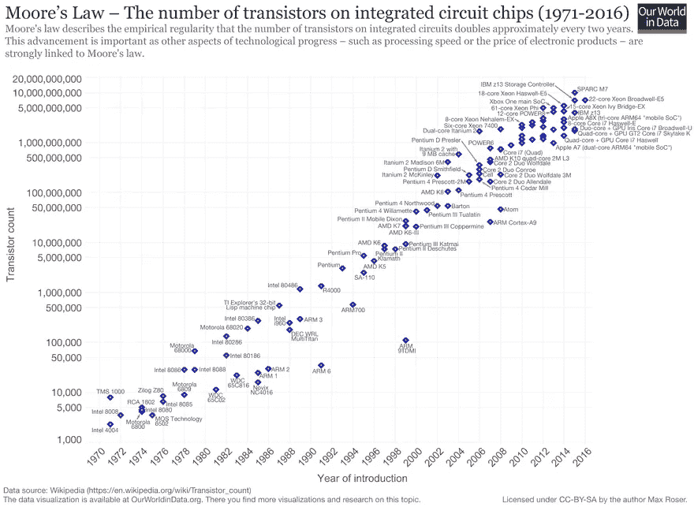

# 数字化简史

> 原文：<https://medium.com/swlh/a-brief-history-of-digitalization-70a84ef59412>

互联网化:近年来，很少有其他流行语被如此频繁地使用。和流行词一样，它们的使用和理解成反比。一切都与数字化有某种联系，但不清楚这种数字化是怎么回事。当然跟电脑和计算能力有关。然而，这不可能是唯一的，因为计算机已经存在太久了。数字化的一个决定性方面是网络化。智能手机使数字设备适合日常使用，联网成为标准。这种日益密集的日益强大且无处不在的计算机网络是平台的基石，这些平台最终将颠覆久经考验的模拟商业模式。

# 摩尔定律:计算能力的指数增长

越来越小、越来越强大的计算机是数字化的基础。早在 1965 年，戈登·摩尔就提出了计算能力每年翻一番，摩尔定律今天依然成立的论断。即使观察显示计算能力不会每年翻一番，而是每 18 个月翻一番，这显然是指数增长。这种关系可以在下图中看到(来源:[维基百科](https://en.wikipedia.org/wiki/Moore%27s_law)，其中集成电路上的晶体管数量显示在一个*对数刻度*上，即指数关系显示为一条直线。

大多数人理性地理解这一点。但是在想象未来的时候，我们通常是线性外推。例如，我们回顾过去五年发生的变化，并假设它将以类似的速度发展。但事实并非如此。

这种误解可以在思维实验中很快被发现。电影《回到未来》讲述的是 1985 年至 1955 年间的时间旅行，这部电影有趣的故事部分是基于 1955 年至 1985 年间世界在技术上的发展和变化。如果在 1985 年至 2015 年的 30 年时间里进行同样的跳跃，人们会很快认识到数字化的变化不是线性的，而是更大的。在这 30 年中，像 C64 这样的第一台计算机已经发展成为一个永久联网的智能手机，它是一个相机，导航设备，随身听，便携式电视等等。1955 年的世界和 1985 年的世界有明显的重叠，作为一个时间旅行者，你仍然可以找到你的路。从 1985 年到 2015 年，技术的飞跃要大得多，作为一个时间旅行者，你可能会完全迷失。

# 平台决定一切

数字化仅靠计算能力是不够的。它允许你以数字形式创建各种信息，将其转换成数字形式，并以数字形式进行编辑，但一切都保持在本地，并具有本地效果。音乐产业本身已经推进了数字化和 CD 形式的数字化音乐。MP3 本身对音乐产业来说也不是问题。随着计算机网络越来越好，以及随之而来的文件共享平台如 Napster 的出现，这成为了一个问题。这使得本地可用的数字信息可以被任何人和任何地方访问。音乐行业陷入了销售唱片的旧商业模式，不得不由史蒂夫·乔布斯(Steve Jobs)等远见卓识者通过 iTunes Store 和 Spotify 等流媒体服务将其从这个陷阱中解救出来。

> 如果你将一个蹩脚的流程数字化，你就有了一个蹩脚的数字化流程。
> 
> *托尔斯滕·德克，德国电信公司前首席执行官*

设备联网是基础，但平台起着重要作用。在苹果推出 iPhone 的时候，诺基亚和 RIM 都有很棒的产品。单纯从硬件及其孤立的操作系统来看，iPhone 或许设计得更好一点，也更易用一点，但这种广泛的成功不能用这种狭隘的观点来解释。一个主要的区别是，iPhone 严格聚焦于移动互联网。

以前的手机*还有*的特色是一些电子邮件和糟糕的移动互联网功能，现在变成了功能齐全的智能手机，可以永久连接互联网。但这可能还不够，因为除了电子邮件和网上冲浪，移动互联网没有足够的用例。决定性的区别是苹果的应用商店(同时也是谷歌的安卓应用商店)。苹果(和谷歌)让智能手机或多或少成为第三方应用的开放平台。除了苹果也从 App Store 中获得巨大利润之外，这个平台上的每一个新应用都导致了 iPhone 价值的增加。

从那时起，在通过智能手机无处不在的网络基础上，越来越多的新数字平台出现了，供应商和客户可以在这些平台上找到彼此。因此，数字化也进入了最初看起来并不数字化的领域和市场。优步抨击出租车公司的商业模式，他自己没有一辆出租车。多亏了全球的数字化。Airbnb 与老牌酒店集团竞争，却没有一家酒店。当然也包括全世界。这才是真正的数字化。

*原载于 2018 年 7 月 27 日*[*fuehrung-erfahren . de*](https://fuehrung-erfahren.de/en/2018/07/a-brief-history-of-digitalization/)*。*

## 这篇文章发表在《初创企业》杂志上，这是 Medium 最大的创业刊物，有 353，974 人关注。

## 订阅接收[我们的头条](http://growthsupply.com/the-startup-newsletter/)。

