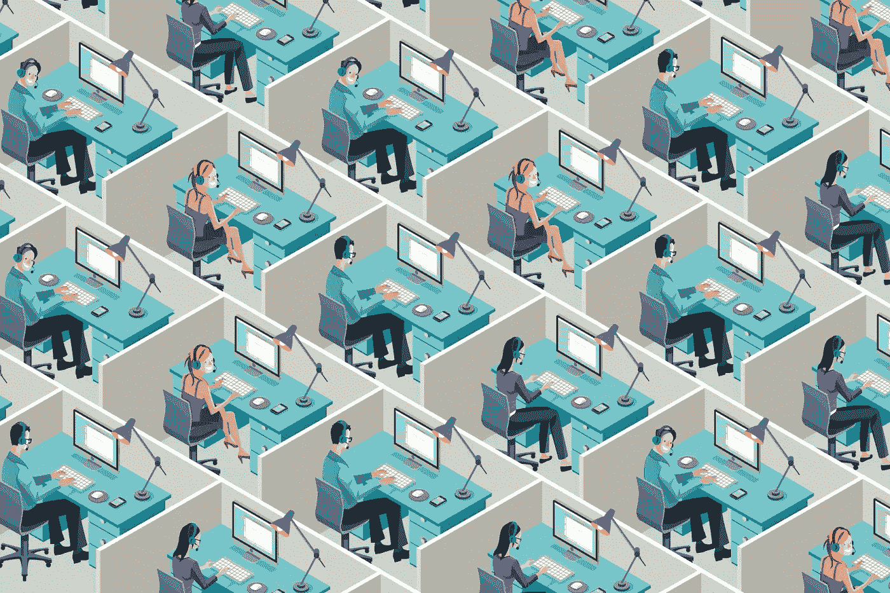

# 办公室设计简史

> 原文：<https://medium.com/swlh/a-brief-history-of-office-design-3d95485876ff>

## (以及它们如何变得如此令人分心)

这看起来很讽刺，但是办公室可能是 T2 最后一个完成真正工作的地方。相反，大多数工作场所已经沦为分散注意力和干扰的场所。

有可怕的路过干扰。笨拙的“徘徊者”。主动反馈会议。吵闹的邻居。以及无数其他人。

对我们大多数人来说，我们不得不承认这是*就是这样*，并在工作时间之外完成我们专注的工作。否则，我们将被关进耳机监狱。

但是办公室设计一直都这么差吗？如果不是，我们错在哪里？我们能修好它吗？

# 办公室的起源

如果你想追溯办公室的历史，你需要回到中世纪。

为了避免《权力的游戏》式的戏剧，支持严谨的研究，这位谦逊的僧侣需要一个复制和研究手稿的空间。

这些早期的“小隔间”提供了长时间深度专注所需的隐私和不受干扰的工作区域。然而，它们成为现代办公室的一部分需要几个世纪。

相反，直到 17 世纪，像这样的“知识工作”大多发生在家里。然而，随着专业人士意识到他们需要一个专门的工作空间，他们开始搬出去。

正如 Witold Rybczynski 在[*Home:The Short History of a Idea*](https://www.amazon.ca/Home-Short-History-Witold-Rybczynski/dp/0140102310)中解释的那样，这是办公室(工作)和家(舒适和隐私)之间第一次真正的文化差异。

良好的第一步。但是这个想法需要一段时间才能被接受。

事实上，甚至迟至 19 世纪初，罗斯柴尔德家族和巴林家族还在奢华的家庭办公室里经营着一些最强大的银行机构。

但是后来发生了一些事情…

# 技术的出现彻底改变了我们思考工作的方式(以及我们在哪里工作)

快进到二战后的德国。战争结束后，这个国家一直在寻找从文化和物质上重建自己的方法。

随着电信技术的进步——这意味着办公室可以与工厂和仓库分开——20 世纪上半叶的一切都是为了让尽可能多的工人挤在一个空间里。*(这种做法在大多数合作空间仍然很流行)。*

但在 20 世纪 50 年代的德国，专业人士正在思考合作的实际意义。

这导致 Quickborner 咨询集团开始推广“办公室景观”，一种围绕信息自然流动设计的开放式办公室。

为了促进合作和交流，工作区被弧形屏幕和盆栽植物隔开，而不是一排排的办公桌。同时还能提供足够的私密性，以便集中精力完成工作。

这个想法引起了罗伯特·普罗普斯特的共鸣，他是美国新成立的赫曼米勒研究小组的设计师。

普罗普斯特提出了“办公室景观”的想法，并将其置于显微镜下，试图了解平衡了生产力、创造力、协作和专注的办公空间在实践中会是什么样子。

> *“今天的办公室是一片荒地。它削弱活力，阻碍天赋，挫败成就。这是未实现的意图和失败的努力的日常场景。”—罗伯特·普罗普斯特*

普罗普斯特的最终设计是行动办公室。一组模块化家具和办公室隔断，为每位员工提供多个工作空间。带集成储物空间的大型多高书桌(你认为立式书桌是个新创意！).以及保持关键信息可见的垂直显示器。

目标是促进工作场所的运动和“行动”,以保持创造力和能量的流动。120 度的外壳确保您有足够的隐私来专注工作。

理论上，行动办公室是最终的工作场所。半私人的。不同的岗位做不同的工作。垂直展示，让您的重要作品清晰可见。

但实际上呢？结果并不完全是这样。

***想知道自己每天上班的时间都去哪了？*** [***今天就注册你的免费改期账号***](https://www.rescuetime.com/features?utm_source=Blog) ***，重新掌控你的一天。***

# 以人为中心的办公室的迅速衰落

不幸的是，行动办公室走在了时代的前面。

它很贵。太模块化了。并且[经理们反击](https://www.wired.com/2014/04/how-offices-accidentally-became-hellish-cubicle-farms/)实施它的价格和投资。他们不关心 Propst 的研究，只想要一个符合他们预算的空间和家具。

正如尼基尔·萨瓦尔在 [*连线*](https://www.wired.com/2014/04/how-offices-accidentally-became-hellish-cubicle-farms/) 中写道:

> 办公空间的增长速度太快，以至于任何人都不会去关注细节。需要更快的东西，更容易复制的东西。”

因此，办公室设计成了供求法则的牺牲品。

经理们想要 Propst 设计的外观和感觉，不需要成本和承诺。所以其他公司开始提供这种服务。

设备供应商开始制造迷你办公仿制品，可以零零碎碎地购买，放在任何你需要的地方。

但是，由于没有研究和设计如何优化这些办公室，大多数公司都回到了本世纪上半叶一排排的办公桌和隔断。

原本是为了解放我们的家具和设计反而变成了一座监狱。

代替精心设计的、为运动和创造性思维而设计的空间，我们最终得到了隐私的错觉和比以往更小的空间。

# 开放式办公室的兴起(以及为什么它只会变得更糟)

但是，技术再一次站在了巨大飞跃的边缘，这将会颠覆我们的工作方式。

小隔间充当了一个迷你会议室，为我们提供了放置那个时代笨重工具所需的空间。20 世纪 90 年代后期，个人电脑的持续小型化和商用笔记本电脑的兴起意味着我们不再需要封闭自己。

世界各地的公司欢欣鼓舞，拆掉了小隔间的墙壁，转而支持“现代”和“通风”的开放式办公室。

研究人员欢欣鼓舞，称这种“新”设计将有助于我们变得更有创造力和生产力。并且会创造[偶然发现的联系](http://home.isr.umich.edu/sampler/sharing-space-proximity-breeds-collaboration/)。

作为回应，国际设施管理协会估计大约 70%的美国办公室现在有一个开放的概念。

但是将我们的办公室设计推向另一个极端却产生了意想不到的副作用。

噪音水平继续攀升，2013 年的一项研究显示，⅔的美国工人对工作场所的噪音水平感到不安。工人们比以往任何时候都报告更多的干扰和分心，既来自他们的工作环境，也来自他们使用的工具。

企业似乎正在回归这样一种观念，即最好的办公空间就是能容纳最多人的地方。

2000 年代，美国私营企业的人均面积在 200 至 400 平方英尺之间，而如今，行业标准约为 190 英尺。而且萎缩得很快。

WeWork 是一家价值 10 亿美元的联合创业公司，现在为世界上一些最大的公司制造办公家具和设计空间，据 WeWork 称，5 年后，空间分配可能会达到 60 平方英尺。

空间更小。隐私更少。更多的分心。什么会出错？

# 那么，未来高效、不受干扰的工作空间是什么样的呢？

自从我们在专用空间工作以来，设计师们就一直在努力平衡私密性、可用性和可见性的需求。

但是纵观现代办公室的历史，我们似乎兜了一个大圈，又回到了起点。

从在家工作，到挤在一排排的办公桌前，到行动办公室和办公室景观，再到挤在一排排的小隔间、开放式办公室，现在在家工作([对我们中的一些人来说至少是](https://blog.rescuetime.com/remote-work-lessons/))。

所以，如果我们真的没有取得很大的进步，那么答案是什么*？*

*首先，我们需要了解我们对高效工作空间的需求。这意味着优先考虑以下事项:*

*   *人际关系和偶遇的机会*
*   *隐私和可用性之间的平衡*
*   *多个工作站促进创造性思维*
*   *某种不需要耳机流放的声音保护*
*   *显示你在埋头工作的简单方法*

*虽然这很大程度上归结于物理空间本身，但这也是你的[公司文化](https://blog.rescuetime.com/nir-eyal-workplace-tech/)的责任。*

*如果没有规则和对干扰、可用性和响应的期望，你的办公室设计得再好也没用。这仍然不是完成工作的最佳场所。*

*我们的工作环境对我们的习惯、行为和专注能力有着巨大的影响。但是如果我们能从办公室设计的历史中学到什么的话，那就是当我们只专注于填充空间时，我们的工作和快乐都会受到影响。*

# *嘿，我是乔里！*

*我帮助公司和有趣的人通过巧妙而专注的写作讲述他们的故事。想一起工作吗？在 hello@jorymackay.com 给我发邮件*

**这篇文章的一个版本最初发表在* [*改版博客*](https://blog.rescuetime.com/office-design-distractions/) *上。查看更多关于生产力、专注和动力的文章。**

**

## *这篇文章发表在 [The Startup](https://medium.com/swlh) 上，这是 Medium 最大的创业刊物，拥有 315，028 多名读者。*

## *在这里订阅接收[我们的头条新闻](http://growthsupply.com/the-startup-newsletter/)。*

**