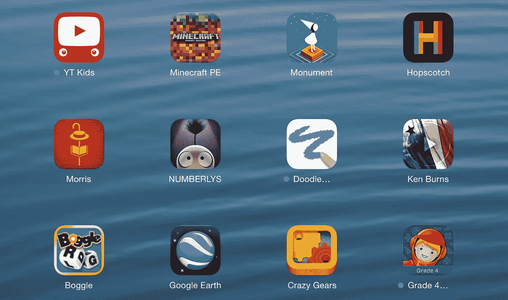

# 一堆非常棒的适合儿童的教育类 iPad 应用

> 原文：<https://medium.com/swlh/a-bunch-of-great-educational-ish-ipad-apps-for-kids-83b7e7f98230>

昨天，在这篇关于《我的世界》的文章中，我在一个脚注中写道:

> 在我的 iPad 上，我有一个满是教育应用程序的屏幕，孩子们可以随时使用这些程序，而不用问我。

我[在 Twitter 上发布了那个页面的截图](https://twitter.com/jkottke/status/720688456465321986)，我想跟进一些应用商店的链接，以及人们在 Twitter 上回复我的其他应用的链接。*(注:我的孩子分别是 6 岁和 8 岁，所以 YMMV。)*

[**《我的世界》口袋版**](https://itunes.apple.com/us/app/minecraft-pocket-edition/id479516143?mt=8&at=11l7dq&ct=blog) —咄。它没有其他平台上的完整版本做得多，但他们一直在改进和添加东西，触摸屏体验很棒。

[**tiny bop 系列**](https://itunes.apple.com/us/app-bundle/tinybop-collection-special/id1096168156?mt=8&at=11l7dq&ct=blog) —漂亮有趣的应用。孩子们最常使用的是[万能机器](https://itunes.apple.com/us/app/everything-machine-by-tinybop/id1001244846?mt=8&at=11l7dq&ct=blog)和[简单机器](https://itunes.apple.com/us/app/simple-machines-by-tinybop/id936966570?mt=8&at=11l7dq&ct=blog)。

**中的将死——一款挑战你只用一招就能找到将死的游戏。奥利每周放学后下一次国际象棋，所以我下载了这个，当他想在一周内进行一些额外的练习时。另请参见 2 中的[配合。](https://itunes.apple.com/us/app/mate-in-2-puzzles/id368403957?mt=8&at=11l7dq&ct=blog)**

**[**【纪念碑谷】**](https://itunes.apple.com/us/app/monument-valley/id728293409?mt=8&at=11l7dq&ct=blog)——这是一个简单的游戏，但它制作精良(我*喜欢* [配乐](https://itunes.apple.com/us/album/monument-valley-original-soundtrack/id887804425?mt=8&at=11l7dq&ct=blog))和逻辑谜题真正具有挑战性，我很高兴让他们与这一个合作。奥利一路过关斩将，而米娜还在 9 级。也要去被遗忘的海岸。**

****这个数字对我的孩子来说已经不再有教育意义了，但对年轻一代来说却很棒。****

****[**疯狂齿轮**](https://itunes.apple.com/us/app/crazy-gears/id967327312?mt=8&at=11l7dq&ct=blog) —涉及齿轮的 99 级机械拼图。****

****[**跳房子**](https://itunes.apple.com/us/app/hopscotch-make-games!-learn/id617098629?mt=8&at=11l7dq&ct=blog)——使用直观的拖拽界面构建游戏。它包括许多视频教程，学习一切是如何工作的。****

****下面是一些我渴望尝试的来自其他人的建议:****

****[**快速数学包**](https://itunes.apple.com/us/app-bundle/quick-math-pack/id917525613?mt=8&at=11l7dq&ct=blog) —四款数学应用，包括乘法、分数、看时间。参见[神童数学游戏](https://itunes.apple.com/us/app/prodigy-math-game/id950795722?mt=8&at=11l7dq&ct=blog)、[计数王国](https://itunes.apple.com/us/app/the-counting-kingdom/id925814105?mt=8&at=11l7dq&ct=blog)、[龙盒应用](https://itunes.apple.com/us/app-bundle/dragonbox-family-pack/id928410442?mt=8&at=11l7dq&ct=blog)。****

****[**《赤脚世界地图集》**](https://itunes.apple.com/us/app/barefoot-world-atlas/id489221652?mt=8&at=11l7dq&ct=blog)——一部带注释的世界地图集。这看起来很棒…现在下载。****

****[**史诗！**](https://itunes.apple.com/us/app/epic!-unlimited-books-for/id719219382?mt=8&at=11l7dq&ct=blog)—12 岁及以下儿童的电子书图书馆，拥有 10，000 种图书。人们对此有一些强烈的建议。****

****[**在**](https://itunes.apple.com/us/app/brain-it-on!-physics-puzzles/id985367692?mt=8&at=11l7dq&ct=blog) 上动脑——画出形状来解决具有挑战性的物理难题。另请参见[液体草图](https://itunes.apple.com/us/app/liquidsketch/id544717096?mt=8&at=11l7dq&ct=blog)。****

****[**无尽的读者**](https://itunes.apple.com/us/app/endless-reader/id722910739?mt=8&at=11l7dq&ct=blog)——给初读的读者。同一家公司 Originator Inc .[也有许多其他应用](https://itunes.apple.com/us/developer/originator-inc./id693294917?mt=8&at=11l7dq&ct=blog)。****

****[**阿童木猫教授的太阳系**](https://itunes.apple.com/us/app/professor-astro-cats-solar/id994133779?mt=8&at=11l7dq&ct=blog) —以一只猫和老鼠为导游了解太阳系。****

****[**深绿色**](https://itunes.apple.com/us/app/deep-green-chess/id299471086?mt=8&at=11l7dq&ct=blog)——顶级棋局。****

****那里有很多好东西…我已经下载了一些。我真的很希望 App Store 有一个先试后买的政策。我不知道孩子们会喜欢/玩这些应用程序中的哪一个，如果不用花 50 美元就能发现就好了。无论如何，感谢每一个分享他们最爱的人。如果我错过了什么好东西，请告诉我！****

*****原载于*[*kottke.org*](http://kottke.org/16/04/a-bunch-of-great-educational-ish-ipad-apps-for-kids)*。*****