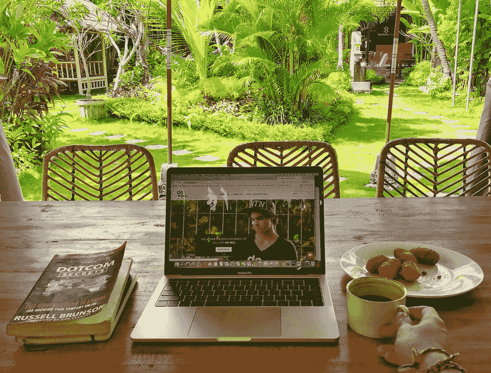
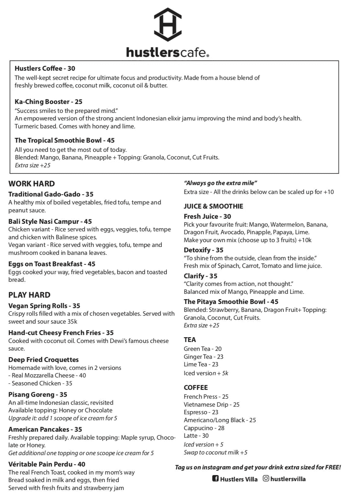

# 为皮条客别墅工作的同事

> 原文：<https://medium.com/swlh/a-co-working-for-the-hustlers-villa-857215f9dd37>

Shot from [Hustlers Villa](http://www.hustlersvilla.com)

去年 2 月，当我在巴厘岛开设 Hustlers Villa 时，我并没有预料到自开业以来这个地方 90%的时间都是客满的。

但它还是发生了，然后我们用我们宽阔的花园组织了与巴厘岛在线企业家社区的商务早餐会。

在过去 4 个月的每个星期天，大约有 15-30 人出现在别墅华丽的花园里，与志同道合的人分享美食和网络。

—

下一步做什么？

开一家咖啡馆&共同工作空间，这样人们可以每天从这里来工作，吃东西，并与类似行业的人联系。

当我创建了别墅作为我理想的居住地时，我创建了好色客咖啡馆作为我理想的工作场所。

我不在乎制造一个大肆宣传的、大规模的、没有人情味的共同工作空间，因为它们今天几乎在任何地方都突然出现。

我想让它独一无二，鼓舞人心，温暖人心。

—

我以前从未开过咖啡馆，从我有这个想法的那天到今天，我们花了 1 个月的时间。

我们必须在花园里建造一些空间，一张可以直接看到泳池的高桌子，一个铺着瓷砖地板的帐篷下的花园共同工作区，供客人使用的厕所，厨房设备等。

我们还不得不多招两个员工来轮班。

因为我对做这些一无所知，所以我走了一条捷径，雇了一个以前成功做过的人。

这就是一切如何在 4 周多一点的时间里完成的。

—

这个过程中最有趣的部分是为咖啡馆创建菜单。

在做了一些研究后，我了解到这背后有实际的科学，都是关于品牌，食品成本，突出，文案等。

感觉就像建立一个 ecom 商店，但在纸上。

开幕:10 月 21 日。

## 这篇文章发表在 [The Startup](https://medium.com/swlh) 上，这是 Medium 最大的创业刊物，拥有+ 375，985 读者。

## 在这里订阅接收[我们的头条新闻](http://growthsupply.com/the-startup-newsletter/)。

