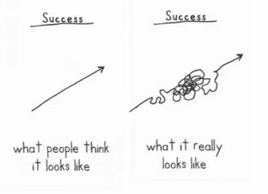

# 这位企业家生活中糟糕的一周

> 原文：<https://medium.com/swlh/a-crappy-week-in-the-life-of-this-entrepreneur-72cd9fd99045>

企业家的生活。没有老板、金钱从天而降、被每个人尊敬——更不用说汽车、假期，还有生活，这些事情是如此的迷人！

好吧，如果你是一个企业家，读到这里，你可能已经笑了。你知道这句话有多讽刺。任何人卖上面的故事都只是在卖一个谎言。至少——如果这是他们讲述的故事的唯一部分。

创业不全是浮华和魅力。这不仅仅是成功的一生。这里有一个很棒的图片可以让你明白这一点:

Demetri Martin, [This Is a Book](https://www.amazon.com/This-Book-Demetri-Martin-April/dp/B00D81VAVQ/ref=sr_1_3?ie=UTF8&qid=1532712269&sr=8-3&pldnSite=1)

这个例子有各种各样的形式。下面我在另一个语境下再分享一个。但是你明白了。我们知道通往成功的道路可能是什么样子，但这在现实中与*非常*不同。这就是生活。

这就是创业。我们不会一开始就制定一个努力创收的计划。我们不打算在团队内部发生冲突。我们不打算解雇人或裁员。我们不打算被起诉，或不得不关闭业务。这些都是商业中经常发生的真实事件的例子。但是我注意到很多企业家不喜欢谈论这些事情。也许是出于一种自豪感；或许是出于他们本该更了解并感到羞耻的假设。不管是什么，总有一些事情阻碍人们讨论这些斗争。

带给我深深满足感的事情之一是与经历艰难时期的企业家进行坦率的交谈，并简单地支持他们度过难关。我和我的数字代理公司 Focus Lab 一起度过了几个精疲力尽、情绪低落的季节。因此，我很容易与经历类似季节的人产生共鸣。事实上，我已经分享了一些关于我这些年奋斗的非常原始的细节。我在会议的一个舞台上分享了一些。但大部分是以一对一的对话形式出现的。

我最近就有过这样的对话，它让我和某人分享了一篇日志。我倾向于写我的经历，作为帮助我处理正在发生的事情的一种形式。当我最近分享这篇文章时，我想如果我只是公开分享它，它可能会有所帮助——至少对一个人。

所以，长话短说，我摘录了 2014 年在焦点实验室的 4 天时间。我花了几天时间在日记中记录了这件事，之后又重温了几次。这是我们销售和收入放缓的时期，我们面临着无法支付工资的问题。显然，宇宙认为在同一周向我扔一堆其他东西是合适的。不管怎样，我已经编辑了一些小的信息，但是保留了大部分，就像最初写的那样。

我希望这只是提醒或启示其他企业家，当你经历这些糟糕的事情时，你并不孤单。我们都经历过艰难的事情。有些比其他人多。所以——这是账户。

# 星期一

这一周开始时，我知道我必须就潜在的薪资变动做出决定。我们不能再削减任何其他领域的开支了。我们的工资和其他费用比率是 9:1。我早上 4:30 起床，6 点左右在办公室。我花了大约 6 个小时工作。我知道我需要与工作想法保持一定的距离，所以我中午离开了办公室，在镇对面的一家影院看了《银河护卫队》(好电影)。在去电影院的路上，我花了一些时间在车上听了一个非商业播客。电影结束后，我回到办公室又工作了几个小时，主要是销售。

在处理一些销售项目时，我收到了一个多年前认识的人的语音邮件。他正在寻找一名开发人员——特别是一名 ExpressionEngine 开发人员——加入他的员工队伍，并接替最近离职的人。这个角色和薪水非常适合我们的一个团队成员。这有点奇怪。上帝？是你吗？

周一我们取得了很多不错的小胜利。对新项目的多次口头承诺。我们知道本周晚些时候会有几份签约。任何有用的东西。

我 5 点左右回家，和家人一起吃晚饭。哄孩子们上床后，我又继续工作了几个小时。周三我有一个会议报告，我需要结束我的准备工作。我有大量的笔记，需要把它整理到一个合适的时间框架。然后我和比尔聊了一会儿，我们决定给过去 12-18 个月里我们喜欢的客户发电子邮件。我们的计划是让他们知道，我们正处于一个比正常季节更慢的季节，并可以为他们提供任何他们想放在桌面上的作品的折扣率。我写了几个电子邮件选项，比尔和我讨论了每种方法的优点。我们决定了我们最喜欢的，并给 9 个人发了邮件。我在午夜时分用经文和日记结束了这个夜晚。

# 星期二

星期二是我女儿上一年级的第一天，所以我和妻子都带她去了学校，并参加了这一年的开学典礼。我早上 5 点左右醒来，大部分时间都在做准备，让孩子们准备好离开。仪式结束后，大约上午 10 点左右，我赶到了办公室。我做了一些其他的销售项目，然后和比尔聊了聊现金更新的事。我们基本上不得不最终讨论如果我们在接下来的几天里没有筹到足够的钱，谁的工作会有危险。这是一个令人难以置信的蹩脚的讨论。这是富有成效和深刻的。但是很难。那天剩下的时间，我更多的是在准备会议演示。

那天上午和下午，我们开始收到前一天晚上发邮件的客户的回复。我们得到了一些小利益，对此我们很高兴。现金。挺好的。

下午 5 点左右，我离开去参加当地的一个活动，我们支持的一个非营利组织正在推出新的办公空间。我根本不想去，但我已经向几个人保证我会去。最终，我想支持他们，所以我遵守了我的承诺。我筋疲力尽，根本没有社交的心情。我没有呆太久。

我在 6:30 左右回家。然后是通常的晚餐、淋浴和孩子们的就寝时间。他们出去后，我花时间准备我们整个团队的会议，也就是第二天早上的“圆桌会议”。我必须想出如何最好地向我们的团队更新我们所处的事实。糟透了。很难。你如何告诉十几个人你不知道还能付他们多久？

我写了些日记结束了这个夜晚，大约在晚上 11 点左右上床睡觉。

# 星期三

我早上 5 点左右起床，又看了一遍我的会议报告。然后，我再次为圆桌讨论做准备。我绝对不期待那样。最糟糕的部分——至少对我来说——是我必须陈述公司的现状，然后在团队不在场或不在场的情况下立即进入我的会议。糟透了。圆桌会议结束时，我分享了两张图片。第一个是我和比尔在 HipChat 中的头像，我们改变了它们，以提醒我们的团队，我们正以一种战士的心态来应对我们面临的挑战。

比尔告诉我，我非常善于与团队沟通。我当然感觉不太好，但是肯定真的很有帮助。

圆桌会议后，我搬进了我们的电话室参加数字会议。我的演讲安排在中午 12 点。我对此非常兴奋，准备好了，充满活力。中午来了，轮到我打开我的麦克风和网络摄像头，开始了。我准备好了所有的设置，去启动我的麦克风，Flash 不让我“允许”它访问我的麦克风。就这么僵住了。我在一周前的技术检查中使用了完全相同的设置。我不知道为什么会这样。

我打电话给一个会议组织者，告诉她正在发生的事情。我尝试了一个单独的浏览器，但没有骰子。谢天谢地，我附近有第二台电脑；一个典型的呆在那个房间的人。在我的主计算机上多次尝试失败后，我启动了那台计算机。我在第二台电脑上输入网址，它说 Flash 已经过时了(想象一下)。所以我更新了 Flash，花了大约 4 分多钟。与此同时，一名观众在另一端等我开始演讲。我终于让麦克风和网络摄像头晚了 10 分钟。

About two minutes in — while I’m going through some fun, ice-breaker style slides — the video and audio start breaking up and getting delayed. The software has a chat room where the organizers can tell me when something’s wrong. I saw their note so I paused a minute to let everything catch up. Then I continued. After a few instances of smooth video followed by chopped up audio and video the software completely froze up on me. So I called the organizer back and just asked her if I could bail on it completely. I had lost all interest in even presenting at that point. I had no “flow” to it due to the technical issues. Who could get anything out of an experience like that? So I proposed that I record a screencast of the talk while the other presenters were “on stage” that day. The goal would be for me to record, edit, and share the video by the end of the event, a few hours later. She liked the idea so I moved forward with that.

I didn’t want to record the talk in a single shot/take because the file would be too big to comfortably edit. So I hit record and started talking and switching slides etc. About 20 minutes in I stopped it so I could get some water and do the second half in a separate file. When I opened the recording I’d just made I realized that I recorded the video on the wrong screen. Not a single slide had been recorded in the entire 20 minutes. 100% waste / loss in terms of the recording. So I said, “Screw it. I’m going to lunch.”

So I went ahead and grabbed some lunch to clear my brain. A quick sub from Jimmy John’s did the trick. After a walk to and back from lunch I was re-energized and ready to rock. I filled up a glass of water, setup the recording stuff, and got ready. This time I decided to record in shorter segments; 10 minutes max each. I got through the first one and it was exactly what I wanted — so I was on a good path.

Then I reached for my water and knocked the whole glass over on the desk. In doing so I got water on 4 electronic devices, my laptop, phone, airport express, and an external HD, and also down the wall and into the power outlet. Oh — and into the power strip nearby as well. So I ran to get paper towels from our kitchenette nearby and got everything cleaned up. I sat down for about 10 minutes just to get over it all mentally. Then I dove straight back into recording the rest of the talk in small segments.

Now — I think — I can finally enjoy some of the talks. I had finally finished the video and uploaded it to our company Vimeo account.

About 10 minutes into the talk I’d joined, a team member knocks on my HipChat door and asks if we can chat about a specific project. He said a significant issue came up that afternoon. So we talked for about 30 minutes to hash out the issue and possible solutions. Then I got back into the event.

大约 15 分钟后，我收到了一封来自支持客户的电子邮件，该客户的网站在过去几天中出现了重大性能问题。他们的网站甚至无法加载，这取决于我们来解决它。问题出在我们推荐并为他们设置的托管环境中(很少)。他们没有暴跳如雷，但肯定希望迅速解决，因为他们应该能够期待。我在上面挖了一点，然后传给了另一个团队成员。

最后，回到会议。我完整地听完了最后两次演讲。谢天谢地。

我周三晚上没有工作。不过，我确实花了些时间告诉比尔我一天的恶作剧。

# 星期四

我一直睡到周四早上 6 点。你知道，我需要休息，所以我睡了一会儿。我送女儿去学校，然后在早上 8 点去见我们的注册会计师。我们看着数字，设计了一个计划来决定哪些团队成员必须被裁掉，如果有的话，以及何时被裁掉。那次谈话糟透了。但这非常有帮助，我终于觉得我将做出一个明智的决定，而不是凭直觉。

我从那直接进入内部销售聊天，讨论各种正在进行的事情。本周我们已经完成了几笔小买卖，所以情况看起来稍微好一点。我们也从周一晚上发邮件的客户那里得到了一些不错的回复。大约 25000 美元的潜在直接工作只是从这些电子邮件。我通常不会对此感到兴奋，但在这一点上，这对我们来说是一个巨大的进步。

在这一点上，我会尽我所能保持整个团队尽可能高的士气。本周，每当我们签订合同时，我都会请我们的一名团队成员分享我们的“水冷却器”聊天室。这增加了一些刺激，这很好。至少——看起来很兴奋。这可能只是每个人每天都可以抓住的一线希望。

周四下午，我和一个人通了电话，我们希望他能成为一家新企业的战略合作伙伴。这通电话不会立即带来收入，但有很大的长期潜力。我离开电话时非常兴奋，对我们可以与这个合作伙伴一起做什么感到非常激动。

在工作日的晚些时候，我和一位业内同行通了电话。我们原本打算讨论如何合作为福克斯的一个客户解决一个问题。不过，这个话题在开始的几分钟内就变了。事实证明，他的公司正在经历与分众几乎完全相同的情况。说到疯狂。很高兴知道我们在这场战斗中并不孤独。我们花了一些时间互相鼓励和支持。然后挂了。

我打电话给比尔，让他了解一下那个电话。我希望比尔听到并感受到同样的鼓励。当我和比尔通电话时，我收到了一封电子邮件。这是来自[知名公司名称]的一位创意总监的销售线索。他说，他已经仰慕我们的工作有一段时间了，刚刚意识到我经历了(他公司举办的一次活动)。他们希望我们能帮助他们完成即将到来的 iOS 设计项目。房屋李。废话。很自然，我回复了，并安排了第二天的通话。

周四晚上，我们在女儿的学校举行了一次家庭招待会。我们去了一会儿，然后回家了。我妻子和我讨论了我们的家庭预算，尽可能削减一切开支，这样我们可以用应急基金维持几个月，直到公司的现金状况变得更好。我们已经正式决定几个月内不从公司拿任何钱回家。谢天谢地，我们没有债务，并且用现金存了 6 个月的家庭开支。我们会成功的。只会很紧。我们想尽一切努力尽可能长时间地留住团队。

我用圣经中的时间、更长的日志和听一点崇拜音乐来结束这个夜晚。终于在 12:30 左右上床睡觉了。

上面的日志条目可能没有什么革命性的东西。我只是想分享一下作为一名企业家糟糕的一周。而且这肯定不是我唯一糟糕的一周。这只是我最近和一些人谈论的一个。

从这篇日志开始，我们最终解雇了一些团队成员。再快进一点，我们就恢复了。我从这次以及类似的经历中学到了一些东西。我可能最终会写得更深入，但是有一件特别重要的事情你应该记住。

**你并不孤单。**

企业家会感到孤独和孤立——尤其是在真正艰难的时期。但是重要的是要知道并记住你并不孤单。如果你认为你的其他企业家朋友和同行无法理解你的经历，你可能会对你敞开心扉时的发现感到惊讶。

> 成功不是最终的，失败也不是致命的:重要的是继续下去的勇气。
> 
> ——温斯顿·丘吉尔

如果你现在在一个糟糕的地方创业，振作起来！你会以某种形式或方式度过难关的。如果你同时需要找人聊天，就打电话到 erik@focuslabllc.com 找我。

*你可以在推特上抓我***如果那是你的事。我不时为我的时事通讯* *写这样的东西。**

**

## *这个故事发表在 [The Startup](https://medium.com/swlh) 上，这是 Medium 最大的企业家出版物，拥有 353，974+人。*

## *在这里订阅接收[我们的头条新闻](http://growthsupply.com/the-startup-newsletter/)。*

**