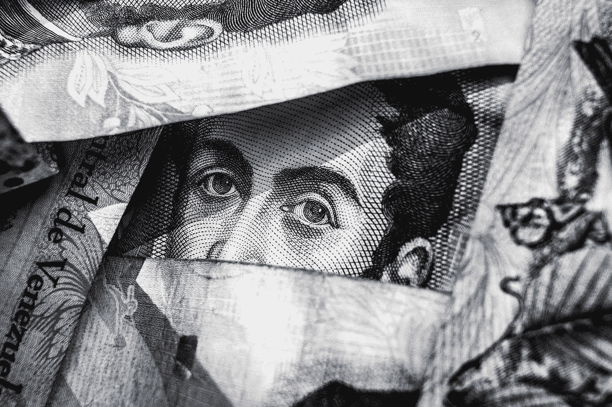
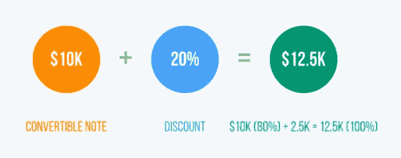
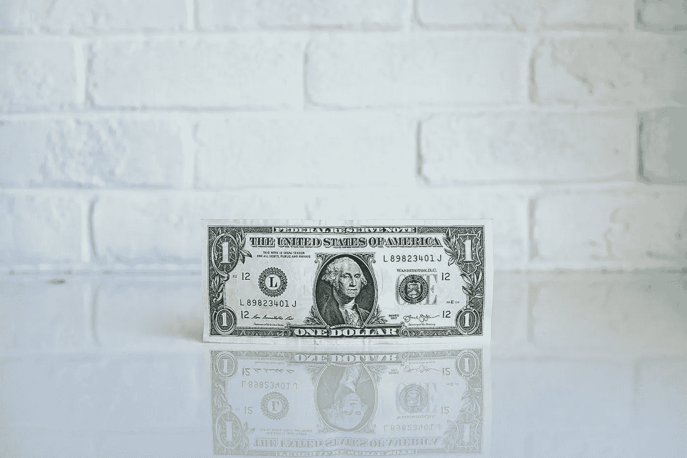
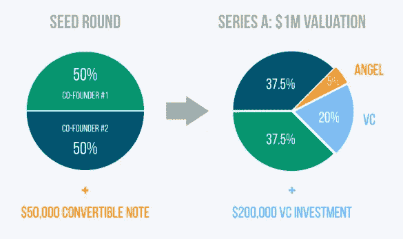
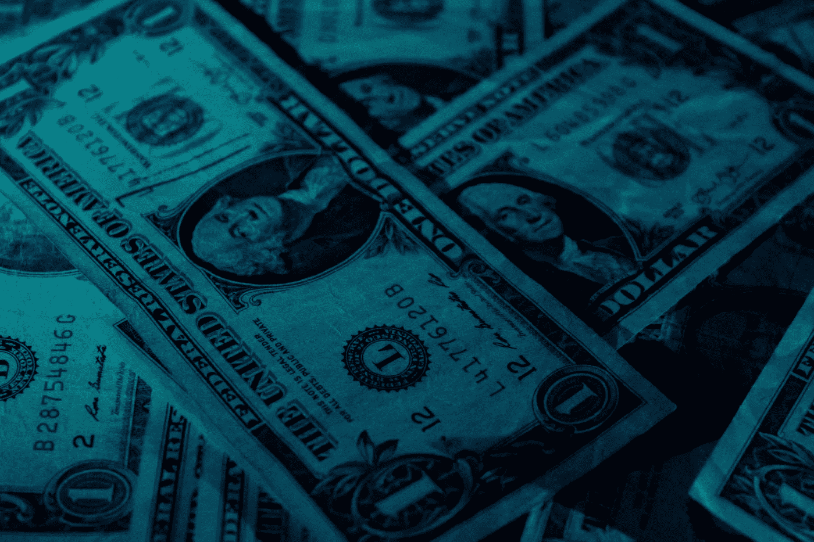

# 用可转换债券为你的创业融资速成班

> 原文：<https://medium.com/swlh/a-crash-course-on-funding-your-startup-with-convertible-notes-8429ba553627>

Originally published at [http://www.appsterhq.com](http://www.appsterhq.com/?utm_source=CP&utm_medium=Medium)

尽管如今越来越多的创始人开始自己创业，但许多 21 世纪的创业公司仍然需要一轮或多轮外部融资。

对于早期企业来说，在融资的第一阶段成功筹集资金——被称为[“种子”轮](https://wefunder.com/post/17-how-convertible-notes-work)——可能相当困难。

创业公司和早期投资者越来越多地使用“可转换票据”，反映出他们努力减少种子期融资的繁琐。

本文将介绍可转换票据的目的、价值和效用的“速成课程”，我将分享一些真实世界的例子，展示我们在 Appster 最成功的创业公司[如何利用它们。](http://www.appsterhq.com/?utm_source=CP&utm_medium=Medium)

在开始今天的可转换票据考试之前，一定要先熟悉我们在 [8 分钟创业公司股权介绍](http://www.appsterhq.com/blog/introduction-to-startup-equity)和 [4 个所有创业公司都应该衡量的财务指标](http://www.appsterhq.com/blog/4-financial-metrics-startups-measure)中提供的关键信息。

这两篇文章概述了许多重要的经济概念和实践的基础，创业者必须了解这些概念和实践，也是本文的基础。

你可能还想重温我们的[5 21 世纪创业企业的定义特征](http://www.appsterhq.com/blog/realities-21st-century-start-ups)，它列出了当代[创业企业为了生存和繁荣必须实现增长](http://www.appsterhq.com/blog/vertical-horizontal-business-growth)(并因此产生大量收入)的一些关键原因。

# 什么是可转换票据？

为了准确地解释什么是可转换票据，我们必须首先解决首先引起其需求的基本情况。

初创公司在第一轮融资(即“种子”轮)期间，往往很难从投资者那里筹集到足够的资金。

这里有各种各样的原因，但对我们的目的来说最重要的是，对于一家初创公司和潜在投资者来说，准确设计一个有意义的“[估值](http://www.investopedia.com/terms/v/valuation.asp)”——即对公司价值的估计——通常是相当具有挑战性的。

事实上，如果一家初创公司由两名创始人和一个可靠的原型组成，而不是由三名创始人和一套令人信服的推介材料或一名创始人和数百份即将推出的产品的预订单组成，我们如何合理地决定估值？

显然，在一家初创公司尚未收集足够的指标时，没有客观的方法来执行这些计算。

**可转换票据的作用是让**早期创业公司和种子轮投资者“回避”确定公司估值的需要，直到稍后公司积累更多运营经验，从而提供更多数据用于分析([来源](https://www.seedinvest.com/blog/startup-investing/how-convertible-notes-work))。

可转换债券是如何做到这一点的？

WeFunder 的迈克·诺曼给出了一个有用的解释:

> *“当投资者通过可转换票据进行投资时，初创公司会立即收到资金，但他/她有权获得的股份数量将在初创公司的下一轮融资或 a 轮融资中确定。*
> 
> 到那时，公司将获得一些运营历史，更有经验的天使投资者或风险资本家可以审查这些历史，以确定一个公平的价格。
> 
> *一旦 A 轮投资者确定了一个价格，种子期投资者的贷款就会以低于 A 轮价格的折扣转换成股票，以奖励他/她因早期投资而承担的额外风险。”*

让我们把这个描述分解开来，更详细地解释一下。

可兑换票据:

*   **用于回避(或暂时推迟)这样一个事实**早期创始人通常没有足够的牵引力和收入来有效地确定他们公司的价值；
*   **允许一家初创公司立即接受(并花掉)投资者的钱**，而不必相应地用公司价值来表示投资的价值；
*   **创造一种情况，提供资金的投资者**在下一轮融资(即“[A 轮](http://www.investopedia.com/terms/s/seriesa.asp)”)完成之前，不知道他/她将获得多少股份；和
*   **的工作方式是**不是初创公司偿还投资者的贷款和利息，而是为投资者提供一个以折扣价购买公司股票的有利可图的机会，这意味着补偿投资者早期的风险投资。

这里有一个例子说明这在实践中是如何工作的:

*   **在种子阶段**，你决定需要筹集 50，000 美元，以便将你的想法从概念发展到[最小可行产品(MVP)](http://www.appsterhq.com/blog/mvp-app)；
*   **你找到一个投资者**，他提供了那笔钱，但没有任何股权回报；
*   **相反，投资者获得权利**在你的首轮投资中，也就是说，一旦你现在的有形产品开始产生收入，就可以将 5 万美元转换成股权；
*   **如果在你的首轮融资中，你从风险投资家(VC)那里筹集了**20 万美元，以 100 万美元的估值获得 20%的股权，那么你的种子期投资者将获得价值 5 万美元的股份，即公司 5%的股份:

可转换票据协议通常包括以下部分或全部参数:

*   **金额**:你为你的创业公司筹集了多少资金？
*   **证券类型**:票据可以转换成哪种股票(例如优先股还是普通股)？与每一项相关的各种权利和特权是什么？(见斯科特·爱德华·沃克的这篇文章，更详细地讨论了通常与可转换票据相关的特定种类的股票)。
*   **利率**:可转换票据贷款的利率是多少？
*   **兑换价格**:票据兑换的金额是多少？获得贷款的公司必须确定其下一轮融资，并规定一个折扣率，如果这是交易的一部分(更多折扣见下文)。
*   **兑换上限**:票据可以兑换的最高估价是多少？(下面有更多转换上限)。
*   **流动性事件**:如果创业公司被收购，种子期投资人会得到多少钱？通常同意 2 倍或 3 倍的价值。
*   **担保**:票据会被[担保](http://www.investopedia.com/terms/s/securednote.asp)？如果是，那么将使用哪种抵押品？
*   **到期**:票据的到期日(即“票据到期日，此时公司需要偿还”([来源](https://www.seedinvest.com/blog/startup-investing/how-convertible-notes-work)))是什么时候？通常情况下，期限为 1-2 年，并可选择延长 6 个月。如果在公司开始下一轮融资之前到期，会发生什么？

# 有折扣的可兑换票据

使用可转换票据投资早期初创企业的种子投资者通常比在融资后期投资的风险资本家获得更大的回报，

为什么？

因为一家公司越“环保”，也就是说，就其吸引力和成长性而言，它越不成熟，就越不确定该公司有朝一日会成功，也越不清楚该公司在最初投资时的实际价值。

更多的不确定性意味着更多的风险，当风险得到回报时，这本身就意味着投资者将获得更多的回报。

这是在可转换票据中使用折扣的基本原理。

[FundersClub](https://fundersclub.com/learn/convertible-notes/convertible-notes-overview/discount/) 以如下方式描述贴现可转换票据:

> *“票据中的折扣设定了可转换票据相对于下一轮合格定价的转换的减少百分比。*
> 
> *这实际上允许投资者将其贷款的本金金额(加上任何应计利息)转换为股票，其价格低于该轮投资者支付的购买价格。*
> 
> *折扣从 0%到高达 35%不等，20%是常见的。”*

换句话说，折扣允许种子期投资者在下一轮融资中以低于风投在同一融资阶段支付的价格购买该公司的股票。

例如:如果你为早期投资者的 10，000 美元可转换债券贷款提供 20%的折扣，那么他/她将在你的首轮融资期间获得价值 12，500 美元的股票(即，如果 10，000 美元= 80%，那么 100% = 12，500 美元):

# 带帽子的可兑换纸币

转换上限代表了另一种机制，种子阶段的投资者可以通过这种机制从他们的高风险投资中受益。

本质上，转换上限旨在为票据的转换价格设定一个上限。

为什么投资者想要这样的上限？

因为他/她可能会担心，如果首轮融资导致的估值远高于最初预期，从而稀释了投资者的股份，他/她将无法获得足够的回报。

we under 解释了这个概念，展示了早期投资者如何能够获得两倍于风投的股份:

> *“估值上限设定了贷款转换为股权的最高价格。*
> 
> *要将其转化为股价，你需要用估值上限除以首轮融资估值。*
> 
> *假设你用一张 300 万美元上限的票据投资了一家初创公司。如果首轮投资者认为该公司价值 600 万美元，并支付 1 美元/股，你的票据将转换为股权，就好像价格实际上是 300 万美元一样。*
> 
> 用 600 万美元除以 300 万美元，我们得到每股 0.50 美元的有效价格。这意味着你将以同样的价格获得两倍于 A 轮投资者的股份。”

在使用可转换票据折扣和上限时，需要记住的一个关键点是，不是同时应用两种奖励，而是始终使用为投资者带来最大利益的特定奖励([来源](https://wefunder.com/post/17-how-convertible-notes-work))。

例如，如果种子阶段投资者被允许根据他/她的票据的折扣率以每股 0.75 美元购买股票，但必须根据他/她的估值上限支付每股 0.90 美元，则前者将适用，而不是后者。

//

## 感谢阅读！

# 如果你喜欢这篇文章，请随意点击下面的按钮👏去帮助别人找到它！

# 对应用程序有想法吗？[我们来聊聊](http://www.appsterhq.com/?utm_source=CP&utm_medium=Medium)。

在过去的几年里，我们已经帮助建立了超过 12 个数百万美元的创业公司。[查看我们如何帮助您](http://www.appsterhq.com/?utm_source=CP&utm_medium=Medium)。

> 最初发表于[http://www.appsterhq.com](http://www.appsterhq.com/?utm_source=CP&utm_medium=Medium)

