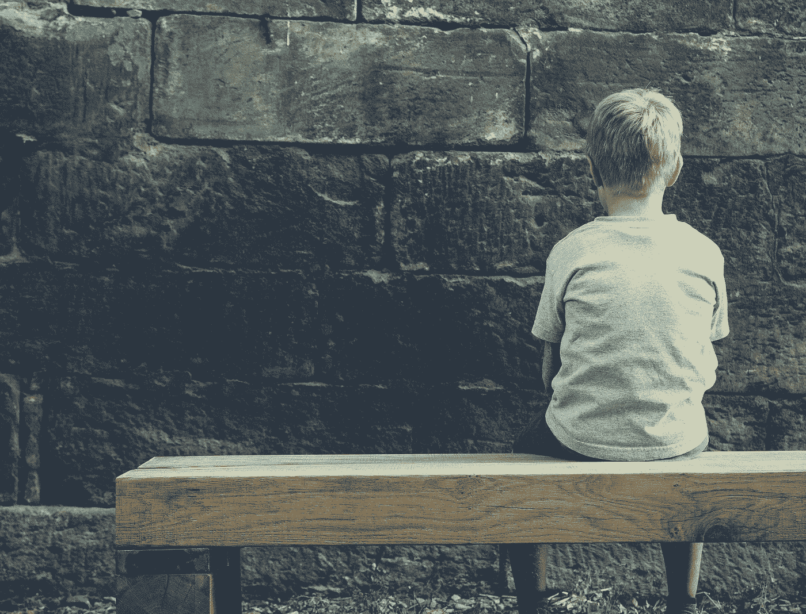

# 创造力的危机

> 原文：<https://medium.com/swlh/a-crisis-of-creativity-408d84724179>

## 我从来不认为自己有创造力。

我一直认为创造力和艺术性是紧密相连的——而我总是你能遇到的最没有艺术性的人。

在成长过程中，你永远不会发现我在玩颜料，或者在笔记本的空白处涂鸦。相反，我把时间花在把东西拆开再组装上，试图找出让它们更好工作的方法。我总是在发明、改进和制造——但我从未认为创造力是我核心的一大部分。

所以，现在我对我最近的倦怠**有了一点看法，意识到创造性工作——或者更准确地说，缺乏创造性工作——是导致我问题的原因，这感觉很奇怪。过去十年，我一直在爬公司的阶梯，遵循所有的规则，检查所有的方框——但我从未给自己机会思考什么对我来说真正重要。**

**我从未试图突破自己的界限，因为我从未意识到创造性的工作需要优先考虑。经历了精疲力尽和沮丧之后，我才明白什么才是真正重要的。我写的每一篇文章和我设计的网站都让我意识到制作东西对我来说有多重要，而且一直如此。**

**我仍然不认为自己是一个有创造力的人，但是我不能忽视摆在我面前的事实。我一直在经历一场创造力危机——试图理解自己的优先事项和价值观。*我真的是这些所谓的创意者之一吗？是不是我一直都是，只是现在之前没意识到而已？作为一个有创造力的人到底意味着什么？***

## **有创造力的人创造东西。**

**很多事情。无论是艺术、设计、音乐、视频还是写作，创意者都会花所有空闲的时间去做这件事——创作。**

**她创作的大部分作品可能永远不会被其他人看到或阅读——但这没关系。她制造一些不引人注意的东西，或者为了赚钱(尽管这通常是一个好的副作用)。她创作是因为她必须——她无法想象一个没有她作品的世界。**

## **一个有创造力的人会挑起事端。**

**她不只是跳出框框思考——她甚至可能没有意识到框框*的存在。她炫耀自己的个性和价值观——即使别人觉得不舒服。***

**创意者对一切都很好奇，不断地问“为什么？”她的思维不断旋转，寻找解决问题的新思路和新方法，并与像她一样的人分享她所学到的东西。**

## **创意不断寻求改进。**

**不仅是为了她的工作，也是为了她自己。她从不满足于现状——即使现状很好。她在不断地前进， [**推动她天赋的极限**](https://kierantie.com/articles/great-expectations/) 并开发新的和不同的方式来表达她的作品并接触她的观众。**

**也就是说，她也知道什么时候该出货——而这个时候总会在她准备好之前到来。她从经验中知道微小的改进不会增加她作品的影响力，所以她展示她的作品——即使她不满意。**

## **一个有创造力的人关注的是工作而不是结果。**

**她知道她无法控制自己作品的结果——无论她之前的作品有多成功或多受欢迎，都不能保证她的下一篇文章会火起来，或者她的下一件艺术品会卖出去。她的 [**成败不取决于她工作的结果**](https://kierantie.com/articles/no-better-time/)——只取决于她的手艺的不断练习和提高。**

**创意者不怕尝试和失败，因为她知道她会从经验中学习。她明白专注于结果只会导致恐惧——害怕失败，害怕被视为骗子，甚至害怕成功。她拥抱失败，知道这是过程中必不可少的一部分。**

## **有创造力的人从大处着眼，从小处着手。**

**她充满了伟大的想法和更大的计划，但她明白需要验证她的工作。**

**她知道没有什么比现实世界的反馈更能改进她的工作了。她以最快的速度发布她能从中学习的最小增量——无论是一条微博，一个快速的草图，还是一篇文章。**

## **有创造力的人知道什么是重要的。**

**她毫不留情地划分优先级，每天在全职工作、孩子和其他个人责任之间挤出时间做兼职项目。她知道，对自己的创造力说“是”就意味着对其他东西说“不”。**

**当时间紧迫时，创造性工作是最先被搁置的事情之一，这是一个巨大的耻辱。当你的“真正”工作变得更重要时。当你宁愿狂看网飞而不是在角落里掸掉吉他上的灰尘。**

> **简单的事实是，这个世界总是需要更多的人来制造东西。**

**有用的事情——有助于改变世界的有意义的事情，即使只是以很小的方式。**

**没有人生来就有创造力——这是每个人都应该学会识别和培养的技能。如果你像我一样，不认为自己有创造力，或者因为对自己的能力没有信心而害怕开始——要明白*每个人在开始的时候都有这种感觉*。**

**从小处着手——发表一篇文章，为你的信仰表明立场，弹弹吉他，或者每天花几分钟画画。寻找对你有意义的工作。不管你创造了什么，或者其他人怎么想，但是一旦你开始了，我猜你会想要继续下去。**

**这肯定不是我所期望的，但我发现创造的行为——每周坐下来写一篇文章，或者设计组成网站的所有小互动——是真正让我快乐的事情。我可以在里面迷失几个小时。知道我的工作和写作可能有一天会激励其他人走上同样的道路，这只是最大的收获。**

**米哈里·契克森米哈在 [**今日心理学**](https://www.psychologytoday.com/articles/199607/the-creative-personality) 中讲述了作为一名创意者的感受:**

> **当我们有创造力的时候，我们会觉得自己活得比其他时候更充实。画架上的艺术家或实验室里的科学家的兴奋接近于我们都希望从生活中得到的理想满足，但很少能做到。**

**所以我希望你现在花一点时间，想想你最后一次在工作中迷失自己的时候。上一次你如此创造性地专注于你正在做的事情，以至于忘记了时间，只是在创造。**

**这难道不说明你很有创造力吗？**

****

# **嗨，我是 Kieran —我想帮助您建立一个值得您骄傲的在线业务。**

## **这篇文章最初出现在我的每周时事通讯上，我每周四早上发出。如果你喜欢它，你可以每周第一个阅读我最好的作品——只需点击下面的按钮注册。**

****