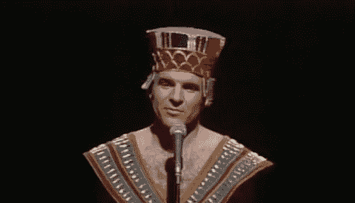
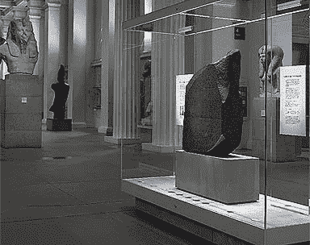
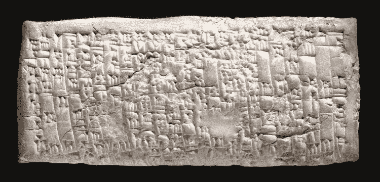

# 一个 4000 年前的客户投诉还在继续

> 原文：<https://medium.com/swlh/a-customer-complaint-4-000-years-old-lives-on-c14fca971639>

当考虑客户服务时，明智的做法是记住威廉·莎士比亚，

> “人们所做的坏事在他们死后还会继续存在；好的东西经常和他们的骨头一起埋葬。”

伦敦大英博物馆的入口位于罗素广场和布卢姆斯伯里花园之间；这座建筑的历史可以追溯到 17 世纪。它的收藏品中包括一块古老的花岗岩和一块更古老的泥板。这两件文物都刻有具有历史意义的信息，表明多少年来发生了多少变化。

阿道夫·利奥·奥本海姆被认为是当代阅读和翻译楔形文字最多的人，他于 1974 年去世。他被认为是他那一代最杰出的亚述学家之一。奥本海姆先生收到了一块公元前 1750 年的古巴比伦泥板，1953 年由大英博物馆获得，神秘地无法翻译。

揭示石碑信息的秘密需要使用更近的物体，可以追溯到公元前 196 年，这是一种花岗岩，今天被称为“罗塞塔石”

*The Rosetta Stone — The British Museum*

Oppenheim 先生翻译的近 4000 年前用楔形文字写在伊拉克南部粘土上的是一个商人 Nanni 对一个商人 Ea-Nasir 的客户投诉:

> “你来的时候说:”我会提供优质的铜锭。“你离开了，但你没有做你答应我的事。你把不好的元宝放在我的使者面前说:“你要拿就拿吧；如果你不想带走他们，走开！"
> 
> 你把我当成什么了，你这样蔑视像我这样的人？我派了像我们这样的绅士作为信使来收集我存放在你那里的钱，但你蔑视我，几次空手送他们回来给我，而且是通过敌人的领土。"

石碑接着抱怨说，经过艰苦的海湾航行后，交付了一种不适当等级的铜矿石，并暗示故意歪曲事实和进一步的交货延误。

*南尼泥板顾客投诉—大英博物馆*

今天，顾客的不满不需要用削尖的芦苇手工雕刻粘土，也不需要让信息在阳光下晒干。出版物不再由一个信使向一个接收者展示平板电脑。

**大约在公元 2015 年，社交媒体可以在几天内提供数百万的浏览量，花费数百万美元。**

**帕特里克·斯图尔特**，最出名的是联邦星舰企业号的船长，希望建立一个新的时代华纳有线电视账户，遇到了长时间的等待，断线，转发，回拨等等。他发了这条微博，

> “我只想在@TWCable_NYC 上开一个新账户，但 36 个小时后，我失去了活下去的意愿。”

众所周知，乘客戴夫·卡罗尔从他的飞机窗口看着联合航空公司的行李搬运工损坏了他定制的吉他；他用手机拍了下来。他打电话和发电子邮件给联合航空公司都没有用。他的乐队写了一首关于这一事件的四分钟歌曲，并发布在 YouTube 上(见下图)。该视频的浏览量超过 1400 万。据报道，该投诉使联合航空公司损失了 10%的市值，即 1.8 亿美元。

美国服装公司霍克公司直面以下这场风暴:

克里斯蒂安·孔蒂:

> “从@hawkeandco 订购，但我的订单被取消了，他们不接受其他产品的折扣。大胖“不推荐！"

霍克公司回应道:

> “@cconti 我们相信你的 320 个粉丝会理解的。”

痛苦的，病毒式的。

回到伦敦，根据英国通讯机构 Fishburn Hedges 和 Echo Research 的一项民意调查， [36%的人使用社交媒体平台](http://www.bbc.co.uk/news/uk-18081651)联系大公司，65%的人表示这是比呼叫中心更好的联系公司的方式。“目前我们中的许多人不一定会通过 Twitter 抱怨，但随着我们的进步，它肯定是一种选择，组织需要能够做出适当的回应，”

好的客户服务是无价的，问问 Zappos 就知道了。糟糕的客服是永恒的，问问 Ea-Nasir 就知道了。

*大卫·j·卡茨，纽约市*

— — — — — — — — — — — — — — — — — — — -

David J. Katz 是 [Randa Accessories](http://www.randa.net) 的首席营销官，这是一家行业领先的跨国消费品公司，也是世界上最大的男士配饰公司。

他的专长是与零售商、品牌和供应商合作，在不断发展的市场中创新并取得成功。

大卫被领英选为 2017 年“[顶级声音。](https://www.linkedin.com/pulse/linkedin-top-voices-2017-must-know-people-inspiring-todays-roth)“他被*女装日报*评为[时尚行业领军人物](https://www.google.com/url?sa=i&rct=j&q=&esrc=s&source=images&cd=&ved=0ahUKEwjO-M2y7ITYAhUHKiYKHcheAlkQjRwIBw&url=http%3A%2F%2Fwwd.com%2Fwwd-publications%2Fdigital-daily%2Fmondays-digital-daily-april-3-2017%2F&psig=AOvVaw1UUxt9X_VP2djw_y76zFzB&ust=1513180933315355)，被*先生杂志*评为[男装推动者](http://www.mr-mag.com/menswear-movers-of-2016/)。

他是一名公共演说家，也是畅销书《设计应对:有效的创意直接营销》的合著者。《纽约时报》、《华尔街日报》、《纽约杂志》、《赫芬顿邮报》、《先生杂志》、《T1》和《T2》、《WWD》。

大卫毕业于 T4 塔夫斯大学和哈佛商学院。

他是神经生物学、消费者行为和“刺激与反应”的学生巴甫洛夫这个名字听起来很耳熟。

— — — — — — — — — — — -

## 这个故事发表在 [The Startup](https://medium.com/swlh) 上，这是 Medium 最大的企业家出版物，拥有 295，232+人。

## 在这里订阅接收[我们的头条新闻](http://growthsupply.com/the-startup-newsletter/)。

