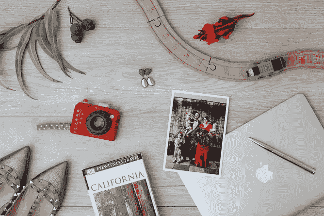

# (硅谷)生活的一天

> 原文：<https://medium.com/swlh/a-day-in-the-silicon-valley-life-7f725ff3c7ba>

陈旧的房子、城市扩张、价值数十亿美元的初创企业和全球最高净值的个人。我在哪里？是的，你猜对了。来尝尝硅谷馅饼吧。

***

就在这里。现在是早上。

我睁开眼睛。接下来我所知道的是，我的专用闹钟爬上我的第二代卡斯帕床垫把我摇醒。

“妈咪！快起来！”。

*如果我们像其他热爱 AR/VR、有孩子的同事一样，叫你 Siri、Alexa 或 Bixby，会怎么样？公平地说，如果克拉拉以虚拟助理的名字命名，我相信她会印象深刻。也许，几年后，她甚至会申请自己的专利？没有什么是不可能的。我的意思是没有什么是不可能的*这里*。*

我爬起来，把 Cam 的谷歌 Pixel 扔在柜台上，这是我偷来的，因为我意识到我的 iPhone 6 对于硅谷就像 CD 对于音乐产业一样:存在，但只是因为它们可以用作循环过山车。

当凯姆开始为孩子们准备早餐时，我在淋浴间进进出出。我们把父母的接力棒交给他，他也很快洗了澡。我可以听到他在厨房的每一个动作，因为我四处搜寻，试图让足够的自然光进入房间，让我正常醒来。这个矮胖的小棚屋对硅谷来说可能很正常，但对我来说肯定不正常。还没有。

嘿，谷歌。

“早上好，克莱尔”。我漂亮、清晰、智能的谷歌主页继续预报天气，给我一个漂亮、简洁的每日新闻摘要。老一套:特朗普这个，特朗普那个，一个关于某人误判了两辆停着的奥迪 e-trons 之间的空间，突然转向，驾驶他们的特斯拉撞上了一辆路过的脸书穿梭巴士的故事。

克拉拉和可可打断了谷歌主页，令人作呕地要求她播放笑翠鸟发出的声音。Google Home 比我更有耐心；尽管我发誓她的回答越来越简短，越来越不自然。

但是没时间玩游戏了:我需要变得有条理。当我们刚到帕洛阿尔托时，我把孩子们扔在我从 Craigslist 上买来的 12.9 英寸 512GB iPad Pros 面前。它们实际上是新的，由一个名叫伊森的家伙出售，他决定改用三星 Galaxy Note 10.1。为什么？因为他在那里工作。但即使如此…他怎么能这样呢？我知道你在想什么……光滑的哑光金上的仿皮革涂层？你会害死我们的，伊森。说真的。

好的，Siri。她回复了一封电子邮件。我意识到我真的需要跟上年轻人的步伐。

我都无法形容找到我们的保姆 J 有多棒。多棒的一招。我发誓她比我更受女孩们的欢迎。

这是一个很好的安排:我们的第一份收入可以支付我们的房租，然后我们的第二份收入可以支付我们全职工作时雇佣的保姆的租金。很整洁，是吧？不过，我想知道我们什么时候能有机会以便捷的一次性费用购买一个机器人保姆？

*机器人，还是 J？哦，上帝…绝对是 j。她是多么的冠军啊。*

当 J 到达并让女孩们准备好去当地公园的旅行时，我跳进了我租来的野马车……当我在天黑后触动中央门锁时，它会把马(好吧… *野马*)的发光图像投射到地面上。很经典，对吧？交通瘫痪了，真没想到。瞥见路过的装饰艺术风格的单层美景(我最喜欢的)，我陷入了建筑白日梦…

但毫无疑问，排屋过去了，我们看到了更熟悉的一排排破旧的 90 年代办公楼，还有一些建于更早的办公楼。这些乏味的建筑中有许多都佩戴着湾区最大公司的徽章——苹果、谷歌、网飞和亚马逊，仅举几个例子——在我看来，这似乎是一种奇怪的、完全令人困惑的并列关系，与其中蕴含的推动边界的技术并列。我经过桑尼维尔…库比蒂诺… *乌尔赫*。这里的建筑都是垃圾。

ooooh！诺曼·福斯特设计的杰作！

但就这样，我们又回到了米色棚屋。

*只剩 30 分钟，交通依赖*。我盯着拼车车道。视线里没有一辆自动驾驶汽车。*我真的需要整理一下我的车的情况*，我提醒自己*。也许我们应该买我们前几天看到的那个电动的。或者特斯拉 Model X，除了我希望我们比那个在两辆奥迪 e-tron 之间开车的家伙更灵巧一点。或者也许泰坦计划可以快点，这样我就可以成为自己车里的乘客了。极乐世界。*

***

在车站呆了一个半小时后，我开始工作。每个人都穿着超级休闲的便衣。但不是我。这位自称的时尚爱好者还没有完全适应硅谷的着装规范。

我还没来得及爬上楼梯，我的新同事咪咪在拐角处探出头来。

我们*终于*拿到 VR 了，克莱尔！Oculus Rift！黑仔。你想下来吃午饭吗？“来一轮厚颜无耻的总部琐事怎么样？”。至少她没有提到每个人似乎都在玩的可怕的堡垒之夜。

我说，当然是。到那时，我应该已经完成了主题演讲(喝了一百万杯咖啡)。

我们聊了一会儿。我承认我已经通过 Cam 尝试过 Oculus Go 了。我想这个想法让他很兴奋，但事实上，每次班车转弯时，他都要重新调整中心线，这让他很不爽。

讨论进行到了周末，我和 Mim 决定听听她的前同事在 TED 的演讲，他以前在这栋大楼里工作，后来以 4 . 5 亿美元卖掉了自己三个月大的初创公司，现在在非洲的某个地方经营一家孤儿院，因为他相信“要想成就大事，我们必须先成就好事”。

听起来不错，对吧？也许吧。太可疑了。无论如何，我确信 Mim 只是为了她正在创建的新应用的联网可能性，所以我同意。

我在回办公桌的路上，我的灵魂感受到了明显的咖啡因摄入不足的剧痛。作为一名 n00b 级学生，我避开了餐车和最新的弹出式商店，直奔最近的菲尔茨，然后被引诱到了李丁丁，避开了 MacBooks 的海洋，然后决定一切都太多了，像以前一样回到了蓝色瓶子。

感觉有点不知所措，我决定在去参加我的下一次会议之前，先做一些杂务。不过，没必要偷偷溜出办公室去完成这里的工作(不像我在澳大利亚的时候)。我可以买一辆校园共享自行车，放下我的干洗店，学习银行业务，做个美甲/足浴，去健身房，给我的电动汽车充电(今天不行，伙计们……我在我的车里！)，拿起冰淇淋喝下午茶，冷冻我的鸡蛋…

……不，我不是在开玩笑。权利，多少？

我停下车来，检查我的第一次亚马逊钥匙送货成功到达我的汽车行李箱(行李箱！).是的。我的新飞机来了！

好吧，好吧。回到办公室。现在……那次会议是在哪个房间举行的？是帕克曼吗？弗罗格。或者也许在《太空入侵者》中，走廊尽头那个温馨的、充满 Xbox 的小房间？

当我走在总部的大厅里时，同事们穿着 t 恤和毛衣(大多是免费的——到处都是)和运动鞋从我身边走过，兴奋地谈论着他们最新的科技采购。然而，眼前却没有一件连帽衫。我记得原因:扎克伯格几个月前就不再戴它们了。我想技术领导者终于长大了。然而，果不其然，我路过一个穿着鲜绿色 t 恤的家伙，上面写着“我知道 HTML:如何认识女士”。我半傻笑，半翻白眼。他抓住我，看着我死去的眼睛说“嗨！我是埃里克”。

达奇。

我决定带些午餐去参加会议。虽然卡姆的工作午餐是免费的，但我绝对不会。不过，这里的食物质量非常好。所有合乎伦理的种植和有机的，昆诺阿藜从南美洲植物的精品作物手工剥离滴喂每天由一个处女狐狸的眼泪…

哈。

但说真的，这里的美食真是令人难以置信。性别多样性也是如此。SV 是一个地方，在那里你可以体验一个人口的大熔炉，然后晚上去一个餐馆，那里全是白人男性风投。我是说，我的同事中只有五分之一是女性。这只是一家公司。*啊。*

接下来的一天过得相当顺利，尽管在回家的路上，我确实对司机表现出了轻微的路怒(？)的自动驾驶汽车。选择一条车道，Waymo！这提醒了我，我想我需要腾出一些时间来使用我的 Headspace 应用程序。冷静下来使用焦虑诱导技术，你知道。

小卡比我早回家。当我疲惫不堪地蹒跚进门时，他从 Gizmodo 上抬起头来。他今天过得很好。“今天我参加了机器学习培训，我们开始使用梯度增强决策树向自己推荐个性化的喜剧页面，”。*嗯，那好吧。*我给他一个拥抱，拿出我的蓝色围裙，准备吃饭。

老实说，睡觉是一场梦。也许这是我们一整天要做的最简单的事情。女孩们和 J 一起度过的时光让她们筋疲力尽，而我们美丽、清晰、智能的 Google Home 正在帮助我们调暗灯光和温暖地板。要是她能读睡前故事就好了。商业理念？

我检查了我们的共享日历(在我的外围视觉中有真实的 Cam ),并击中了最终的头奖:Cam 今晚在家，所以我决定和女孩们一起出去。但是怎么办呢？

我们考虑从当地的送货机器人那里获得外卖，但我们选择了外出就餐。*好久不见了。孩子们在睡觉。为什么不呢？*我收起蓝色围裙，拿起 Lyft(绝对不是优步！)进城，去我们最喜欢的帕洛阿尔托(Palo Alto)聚集地(PS:等不及 Google Duplex 帮我处理电话预订了——前提是整件事不是一个巨大的骗局)。这里舒适安逸，但今晚这里摆满了……你猜对了:长长的、装饰复杂的风投桌。100%男性。100%白色。

叹气。

我们觉得可以喝多少就喝多少(每人三杯——见:学校之夜),然后决定是时候回家了。我们抓起另一辆 Lyft，挤进去，开始和我们斯坦福毕业的司机交谈。

‘硅谷和酸奶有什么区别？’他打趣道。

我不知道？

酸奶有文化。

我想你说到点子上了，安德烈。

当安德烈把车停在我们疲惫的小屋的车道上时，我带着一半的悲伤和一半的幽默意识到，文化现在绝对是我纯粹从我的酸奶桶里获取的东西。

*吃光*，我猜。

## 这篇文章发表在 [The Startup](https://medium.com/swlh) 上，这是 Medium 最大的创业刊物，有 332，253+人关注。

## 在此订阅接收[我们的头条新闻](http://growthsupply.com/the-startup-newsletter/)。

