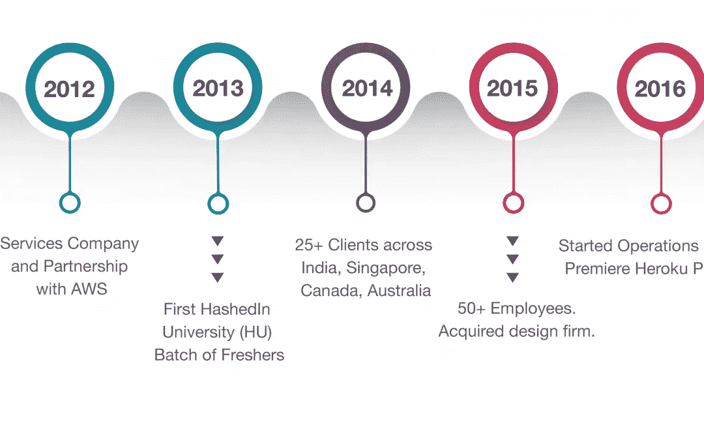
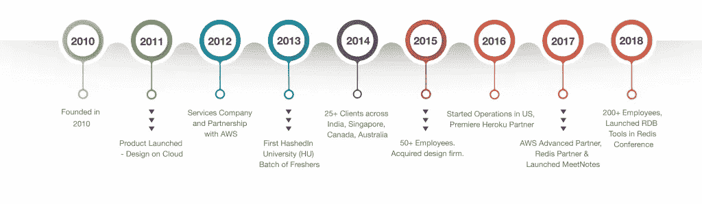

# 数字化转型的十年

> 原文：<https://medium.com/swlh/a-decade-of-digital-transformation-738168b1dc35>

A Decade in Digital Transformation

在数字时代，变化不可避免。随着客户需求和业务需求的发展，变革对于个人和组织来说变得至关重要。蓬勃发展的数字经济带来了多个垂直行业的增长机会。为了取得成功，企业需要拥抱数字革命，并调整其运营模式，以应对当今数字世界的挑战。数字化转型涉及使用数字技术来解决业务挑战。成功实施后，数字解决方案可以帮助公司转变业务，并为客户提供更多价值。此外，通过整合数字技术来优化所有业务领域，这种转型有助于公司释放新的增长机会并增加收入。

数字转换可以是线性的或指数的。线性转型的重点是改善业务运营，而指数转型则涉及改变整个业务模式。为了保持竞争力，公司需要投资于线性和指数转型。

# 数字化转型的需求

[90%的首席执行官](http://www.cdoconclave.com/me/10-amazing-statistics-about-digital-transformation/)认为数字经济将对他们的行业产生重大影响。大大小小的公司都在改造他们的组织流程和技术，以适应新的数字商业模式的需求。[根据 IDG 的一项研究](http://resources.idg.com/download/white-paper/2018-digital-business)，全球 89%的组织已经采用或计划采用数字优先的业务战略。企业面临的真正挑战在于管理新技术、流程和业务模式，以成功实现转型。为了取得成功，决策者需要了解构成数字生态系统的各种元素。

# 企业数字解决方案的制胜属性

现代企业应用程序的开发目标是提高效率、可扩展性和最终用户体验。因此，公司正在重新思考应用程序的概念化和开发方式。

以下是数字应用取得成功的一些独特特征:

**1)现代 UI/UX**

数字应用旨在为客户提供更加个性化的体验。更加注重吸引用户和建立品牌忠诚度。因此，现代数字解决方案有助于公司提供全渠道客户体验。

**2)物联网设备**

由于具有增强整体应用能力和用户体验的潜力，基于物联网的解决方案在过去十年里越来越受欢迎。[根据 IDC 预测](https://whatsthebigdata.com/2016/03/07/amount-of-data-created-annually-to-reach-180-zettabytes-in-2025/)，到 2025 年，物联网设备的数量预计将增长到 800 亿。未来几年，企业将加大投资，开发基于颠覆性物联网的解决方案，以提高收入。

**3)人工智能**

企业正在使用人工智能来支持他们的物联网应用，并获得可操作的数据洞察。人工智能的集成也将使公司能够提高生产力和发展业务。

**4)机器人**

通过实现个性化响应、自动化服务和工作流，机器人提高了大型企业的效率和敏捷性。企业机器人还将帮助公司加强治理和合规性。

**5)构建数字生态系统**

通过数字平台连接人、数据和流程，数字生态系统将帮助企业建立新的商业模式、发现机会和推动创新。

# 推动大型企业的数字化转型

利用现有的业务流程和软件资产创建数字化转型的路径并不容易。企业面临的最大挑战之一是昂贵、行动缓慢的传统企业。数字解决方案的成功取决于在正确的时间实施正确的技术来满足特定的业务需求。为了跟上业务的动态需求，开发团队因此需要一个适应性强、敏捷的平台。一个可靠、安全且可扩展的数字平台可以加速创新并支持数字应用的开发。基于 SaaS 的解决方案还可以让企业轻松访问按需使用的平台。传统应用的一些必备功能包括现代用户界面、单点登录、审计日志、基于角色的访问控制、集成、分析和功能门。

# 哈希丁的数字化转型之旅

客户体验、人员、创新、领导力和文化在技术驱动的转型中发挥着至关重要的作用。哈希丁通过专注于数字化转型的以下关键支柱，在数字化转型方面取得了成功:

*HashedIn’s milestones*

**1)客户体验**

了解客户的旅程和期望对于实施正确的数字解决方案至关重要。通过使用数字技术，公司可以更好地了解他们的客户，并提供卓越的数字体验。因此，公司可以向客户交付更多价值，并提高转化率。客户体验是哈希丁数字化转型战略的核心关注领域之一，也是其成功的关键原因。

**2)员工**

就像客户体验一样，员工体验在推动数字化转型方面也发挥着重要作用。要在任何技术驱动的转型中取得成功，您的团队中需要合适的人。此外，你必须投资培训你的团队。通过像[哈希丁大学](https://hashedin.com/about-us/hashedin-university/)这样的项目，哈希丁投资于培训和培养人才。哈希丁大学成立于 2013 年，是一个为应届毕业生提供从头开始构建产品的实践经验的训练营。“以人为本”的文化无疑为哈希丁的成功做出了贡献。

**3)创新**

创新不是偶然发生的。本组织需要培养创新文化。因此，HashedIn 有一个开放的工作文化，鼓励员工合作并实现他们的想法。团队可以自由地获得所有权，并构建能够产生影响的解决方案。哈希丁在创新方面的成功是因为公司的协作工作文化。此外，开展内部[黑客马拉松](https://hashedin.com/blog/boost-innovation-6-trump-cards-to-conduct-an-internal-hackathon/)鼓励员工将他们的想法付诸实践。自然，创新驱动的文化使哈希丁推出了许多成功的软件产品，如 [Meet Notes](https://meetnotes.co/) 、 [Anvaa](https://anvaa.in/#Home) 和 [RDB 工具](https://rdbtools.com/about-us/)。HashedIn 也是 Redis 开放源码自成立以来最大的贡献者之一。从长远来看，创新文化有助于公司获得竞争优势。

**4)领导力**

领导团队的积极参与对于任何技术计划的成功都至关重要。毫无疑问，[哈希丁的领导团队](https://hashedin.com/about-us/)在数字化转型中发挥了至关重要的作用，他们积极主动，在正确的时间发现机遇。无论是推动创新还是建立战略合作伙伴关系，哈希丁的领导团队在启动数字化转型工作中发挥了积极作用。哈希丁是印度为数不多的 AWS 60+认证公司之一。此外，与 SalesForce 的合作使 HashedIn 能够利用 [Heroku](https://hashedin.com/partnerships-heroku/) 平台来创建新的数字解决方案，如聊天机器人、分析和忠诚度应用。就 Redis 实验室的咨询、支持和来自 APAC 地区的专业研讨会而言，HashedIn 也是唯一的合作伙伴和能力中心。像 [AWS](https://hashedin.com/partnerships-aws/) 、 [Redis](https://hashedin.com/partnerships-redis/) 和 Salesforce 这样的战略合作伙伴关系，极大地增强了哈希丁团队的开发能力。

**5)哈希丁文化**

文化在数字化转型中扮演着重要角色。协作和创新驱动的文化尤其让哈希丁的数字化转型取得了成功，并在全球推出了 100 多种软件产品。

# 数字化转型的未来

数字颠覆已经影响了世界上的每一个工业部门。获胜的软件产品将是集成的、注重客户体验的、分析驱动的和人工智能主导的。SAAS 转型和数字化转型可以帮助企业交付成功的数字化体验。最终，越早开始数字化转型之旅的企业将越快取得成功。

**了解更多关于哈希丁数字战略的信息**

*HashedIn 帮助企业构建深度技术-SAAS 产品和平台。在 HashedIn，我们不断努力构建强大的解决方案，为我们的客户和合作伙伴提供更加无缝的运营任务。通过使用最新的数字技术和我们通过推出 100 多种软件产品获得的专业知识，我们已经为全球客户提供了最先进的数字解决方案。要了解更多信息，请发送电子邮件至 contact@hashedin.com*

*原载于 2018 年 8 月 3 日*[*hashedin.com*](https://hashedin.com/blog/a-decade-of-digital-transformation-hashedin/)*。*

## 这篇文章发表在《初创企业》杂志上，这是 Medium 最大的创业刊物，拥有 358，974 名读者。

## 订阅接收[我们的头条新闻](http://growthsupply.com/the-startup-newsletter/)。

