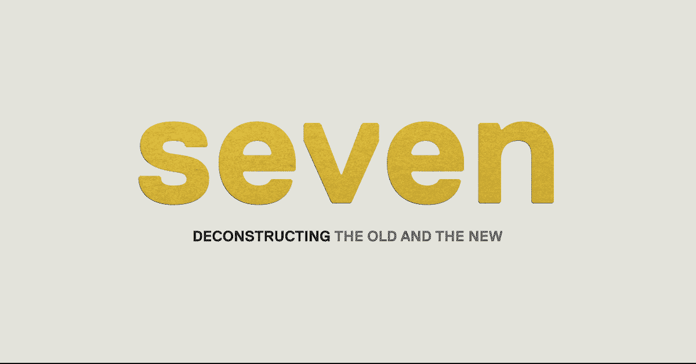
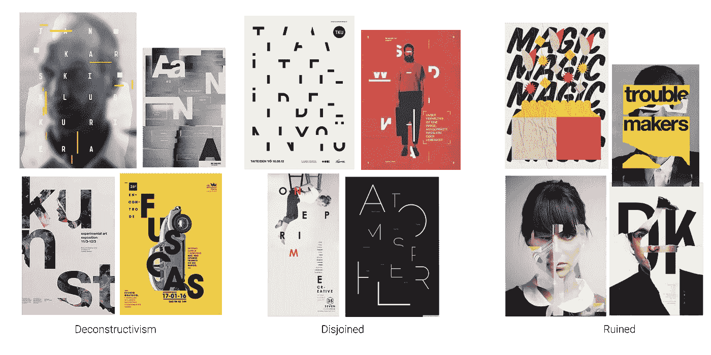
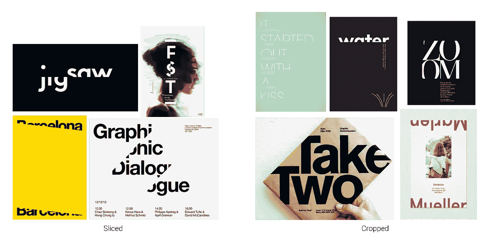
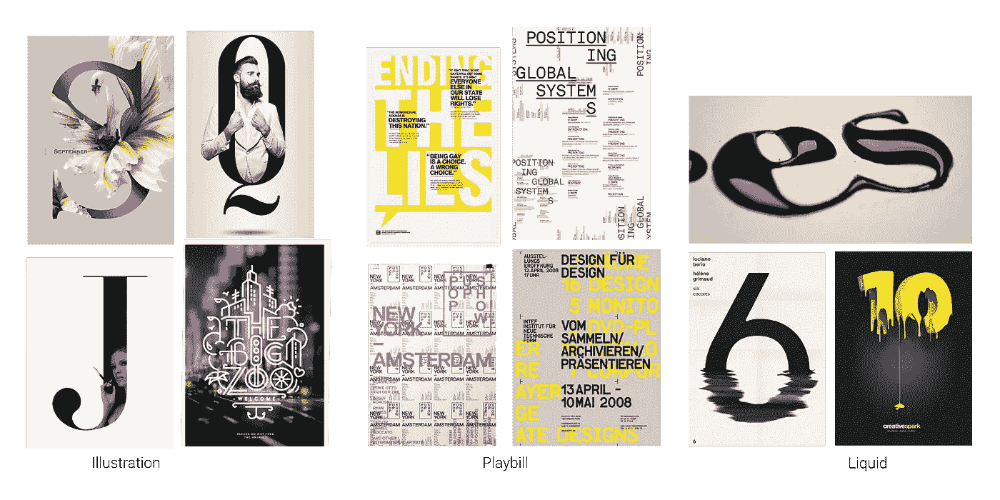
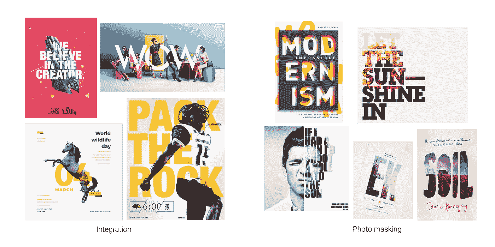
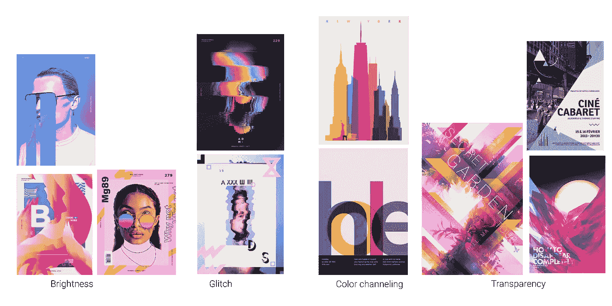
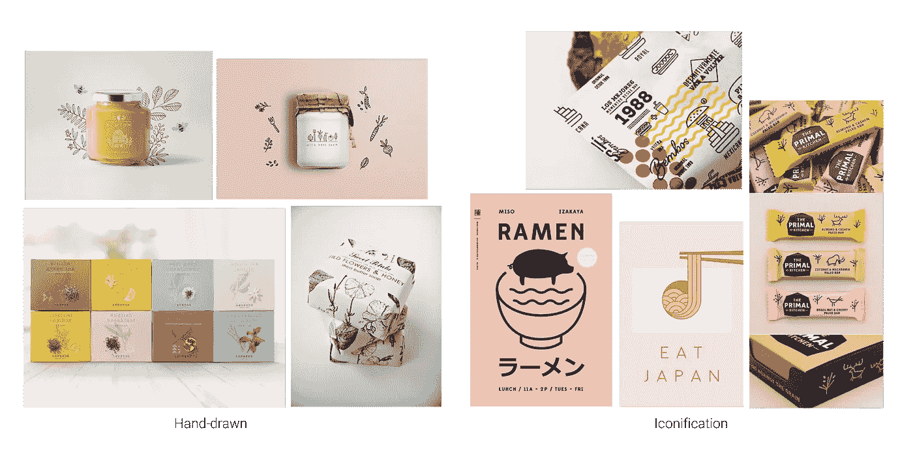

# 旧与新的解构

> 原文：<https://medium.com/swlh/a-deconstruction-of-the-old-the-new-5313ab7a5102>

第四次工业革命汇聚了创意人员、技术人员、科学家、物流人员等等，带来了新的挑战和机遇。导致解构一切的设计，一个现代社会的清晰反映。

毫无疑问，今年的创意是利用设计来留下自己的印记，没有柔软的中间地带，而是清晰的融合了新旧。疯狂的设计、实验和天马行空的想象力，设计师们尽情发挥他们的创造力，并加入额外的个性元素，创造出引人注目、更聪明的设计。

**1:分手**

从脱节的文本到解构主义的回归；平面设计师正在采用一种更具实验性的方法来设计和排版。使用他们的字体选择作为一种工具来传达他们的想法和唤起情感。打破它的趋势是分裂和扭曲。破坏了作品的美感，以受控的混乱创造出强烈的视觉外观。它非常有趣，因为它挑战了我们看待事物的方式，并迫使我们思考新的交流方式。

在这种趋势下，所有先进的艺术和设计运动都被探索和结合起来。把旧的带到未来。随着印刷术的扭曲，我们可以确定三个趋势:解构主义，脱节的文本和“毁坏”的效果。

**解构主义的特点是缺乏和谐、连续性或对称性。设计师们正在扭曲和错位元素，用颜色、破碎的字母形式和切碎的设计元素注入黑白效果，以提供一种不可预测的视觉外观。带回了俄罗斯构成主义和射线枪杂志的怀旧情怀。它表现出对主流的明确排斥，几乎迫使接受者成为作品的积极观看者。**

而**的不连贯文本**则是对排版的一种更具解构性的诠释。它突破了界限，探索了拆分字母和单词的效果。信息是存在的，但有趣的字母形式和分离创造了抽象有趣的视觉效果。它提倡抽象，回归形式和色彩的本质。即使信息难以理解，解构也能强化其意义。

**“毁坏”效果**更进一步，通过破坏构图的美感来创造迷人的视觉效果。它包括飞溅、刮擦、撕扯、破裂或对现有作品的任何其他形式的损坏。它想象着从追求完美的绝望中解脱出来。反映了现代社会对不完美的赞美。

**2:切碎的排版**

切碎的排版是打破它的不那么混乱的姐妹，它是非传统的但整洁的。这种效果使普通的文本变得令人困惑和着迷。在这种趋势下，排版占据了设计的中心舞台，它几乎迫使你停下来看看。

**切片文**的走势再次暴露怀旧情怀。通过带回 20 世纪的艺术运动，如包豪斯，身份得到了一个特定的当代感觉。这看起来就像用 exacto 刀将整个单词切开，给文本增加了一点维度和多样性。这个故事采用字母的形状来形成另一个信息，这使它成为一个创造有优势的设计的优秀工具。

另一个关于裁剪排版的例子是**裁剪排版**，这一趋势已经在趋势板上出现了一段时间，而且似乎不会很快消失。虽然看起来很简单，但是将裁剪排版与其他设计元素整合起来需要很多思考，但是这种效果可以创造出令人难以置信的效果。这是一个伟大的技术为设计师喜欢有一些乐趣的排版，但希望保持整洁。它也形成了创造文字游戏的机会，为机智或故意制造混乱打开了大门。

**3:创意字体**

印刷术绝对是 2018 年的王道，设计师们正在使用创意字体将字母和文本变成创意艺术品。数字化开启了一个可以玩转图层、纹理、形状和颜色的可能性世界。创意字体的有趣之处在于它允许设计师混合所有的流。字母成为一种机智的工具，可以指其意义的根源或加强主题。

一张图胜过千言万语；**字体作为插图**是把文字变成图像的艺术。字体或字母形状成为插图元素。它可以作为构图的主题，也可以与摄影结合使用。它为探索不同的组合、缩放、重叠和裁剪留出了空间，以提供一个有趣的、原创的视觉效果。这是一个利用数字化的趋势。它玩弄人类的视觉和视错觉，清楚地揭示了事物并不总是像它们看起来那样…

很明显，设计师们似乎永远不会老去挑战排版和布局的沉闷传统。从 20 和 30 年代以及 70 和 80 年代的设计中出现的**海报**是另一种似乎总能找到回归之路的趋势。在一个人们内容超载的时代，playbill 实际上把信息变成了一次发现之旅。此外，讲故事变得越来越重要，但海报和包装往往空间有限。创造性地使用不同形状和方向的分层文本提供了一个很好的解决方案。

经典字体的另一个巧妙之处是液体字体。液体的有机运动打破了僵硬的结构，给了一个独特的，手工制作的吸引力，否则一般的排版。它给数字和文字增加了活力，并提供了很多自由去发挥。从 2D 到 3D，从液滴到绘画特质，这种趋势可以通过很多方式来解决。

**4:与构图元素的交互**

如果排版是国王，那么摄影就是女王。这种趋势让元素以一种清新、有趣的方式互动。无论是字体与摄影的融合，还是摄影与其他摄影的融合，每一个元素都是相辅相成的。由于层与层之间的动态相互作用，图像变得栩栩如生。维度也反映了我们的生活是如何与我们周围的事物交织在一起的。

随着每年超过 5.3 万亿的展示广告在网上展示，**整合**是一种独特的方式，让原本枯燥的主题变得突出。文字和照片被融合在一起，将信件变成现实生活中的物体，数字工具被用来打破过去僵硬的指导方针。

**照片蒙版**类似于整合，但在这种情况下，通过用文本元素、彩条或其他照片形状“蒙版”照片来创建视觉错觉。它让照片不言自明。

**5:颜色的游戏**

有什么比使用有趣的色彩更好的方法来突出噪音呢？非传统的、冒险的颜色将原本主流的图像变成了酷炫的作品。这似乎是对近年来极简主义的一种反叛。

有什么比使用一些亮度来增加经典摄影的趣味更好的方法来突出噪音呢？然而，少即是多！设计师确实限制自己使用 3 种以上令人瞠目的色调，这样颜色才不会失去效果。因此，富于表现力的图像会立即抓住我们的注意力，而不会让人感到不知所措。

**毛刺**是另一种形式的图形“失真”,通过添加一点颜色来实现。它指的是似乎被某种干扰打破的意象。损坏的图像是对我们对完美主义和不断回收内容的痴迷的一种反应。它是诚实的、原始的，并形象地展现了一个欣赏不完美的社会的崛起。

我们对 80 年代和 90 年代的怀旧之情显然依然存在，而**色彩搭配**为 2018 年的设计带来了一些复古的酷感。这是一种很棒的技术，通过将一幅图像加倍或使用单色的不同重叠图像来创造一种扭曲的真实感。结果是一个带有复古感觉的错觉效果。

**透明**可以被视为一种趋势，利用颜色来创造一种更简约的失真。透明的几何形状的色块用来突出构图的某些区域，形成鲜明对比的设计元素。一般是复古色块和黑&白摄影的设置。这一趋势显然带回来复古元素，使其声明。

**6:手工插画**

由于品牌似乎缺乏某种真实性，插图在我们周围不断涌现。手绘设计元素被用来作为对所有主流图像的一种反作用。从精美的手工标识到独一无二的包装，这种趋势与 3D 结构、摄影和排版同时使用，创造出一种独特的氛围。

它特别受食品饮料和护肤品行业品牌的欢迎。细节元素为工匠、有机或天然产品增添了怀旧的质感。

我们还可以看到**图标化**的兴起。这种趋势不会“破坏”现有的作品，而是通过添加简单的线性形式和手绘元素来开发一个图标。产生一个简单的，机智的插图，清楚地传达了信息。

**7: Cinemagraphs**

Cinemagraph 是受欢迎程度正在上升的流行内容。事实上，很可能是一个 REGGS cinemagraph 激发了你点击这篇文章。这是一个介于 GIF 和视频之间的美丽转折，没有视频那么令人尖叫，但比摄影更引人注目。它显示了创意者如何寻找一个平衡两个世界的中间地带。对感觉更自然、更少侵扰的东西的追求。它激发你更仔细地观察，但没有视频泛滥时那种直面现实的心态。重复的动作是经常发生的，但是尽管变化看起来不多，但这种动态增加了一种引人注目的感觉。

不断有数百种“趋势”在发生，很难准确指出每一种。然而，比趋势本身更重要的是它们出现的原因。在所有行业中，你都可以看到对常见的僵硬指导方针的明确拒绝。为了创造一个更有活力的空间，创意者和聪明的思考者正在突破界限。拆除旧标准，以便他们能够为当前发展新的方向…

*本文是“* [*【华丽七部】*](/@reggs/) *”系列文章的一部分，该系列文章探讨了设计的影响和作用，是必须知道的健康剂量。如果你有任何关于* [*设计*](http://reggs.com) *的问题，给 hello@reggs.com 发消息，我们会写下来。*

## 这篇文章发表在《创业公司》杂志上，这是 Medium 最大的创业刊物，有 316，028 人关注。

## 订阅接收[我们的头条新闻](http://growthsupply.com/the-startup-newsletter/)。

