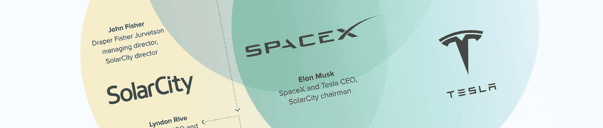
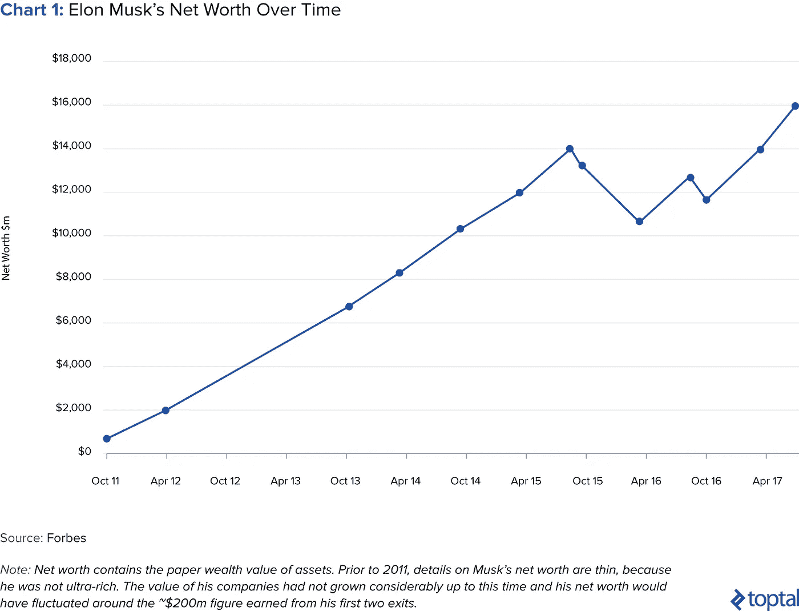
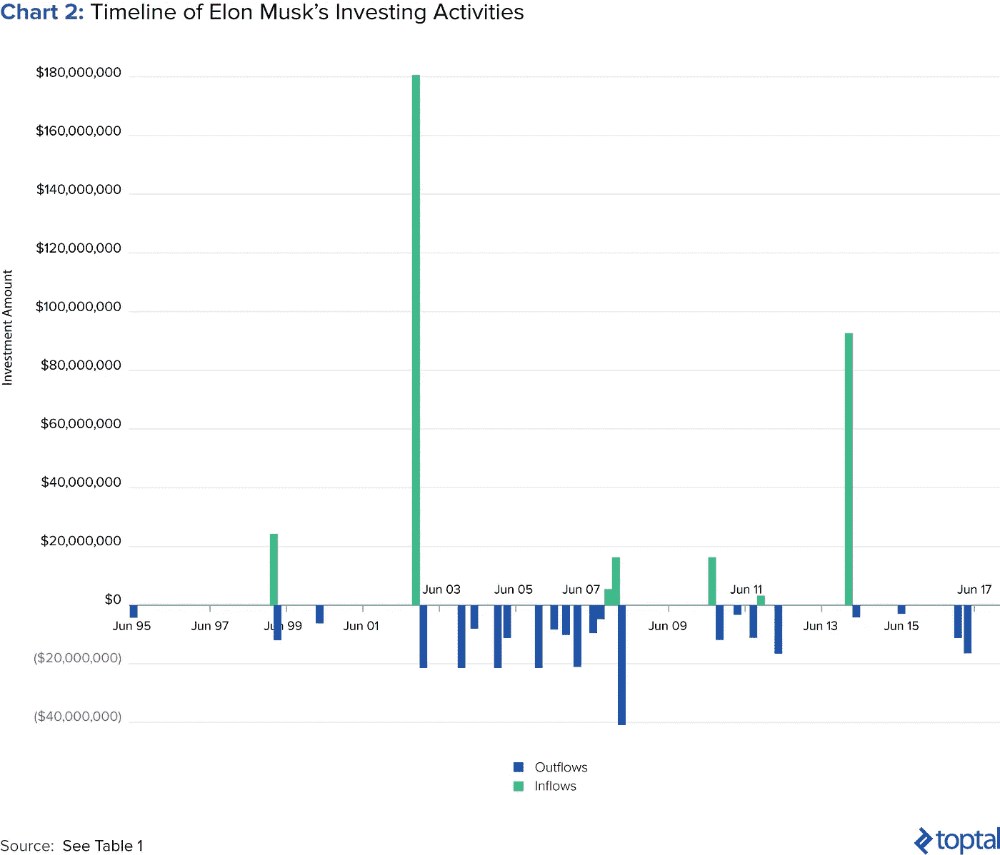
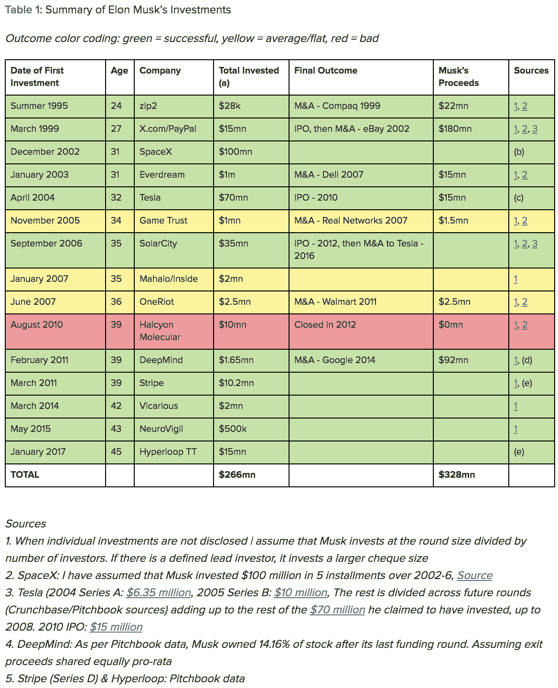
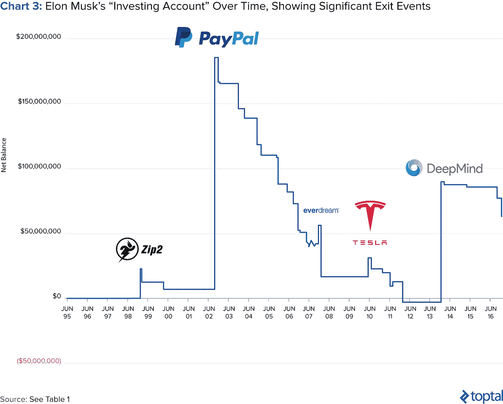
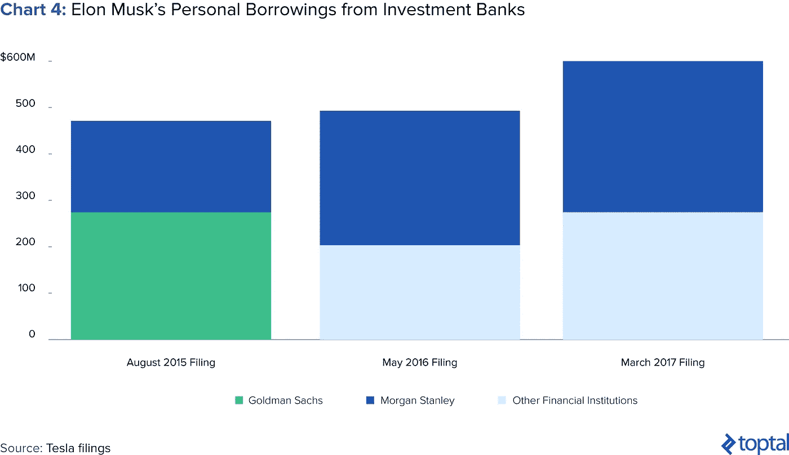
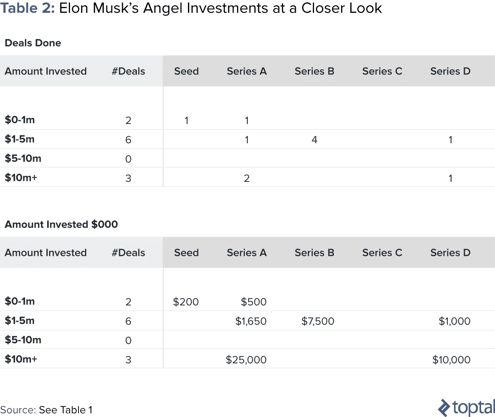
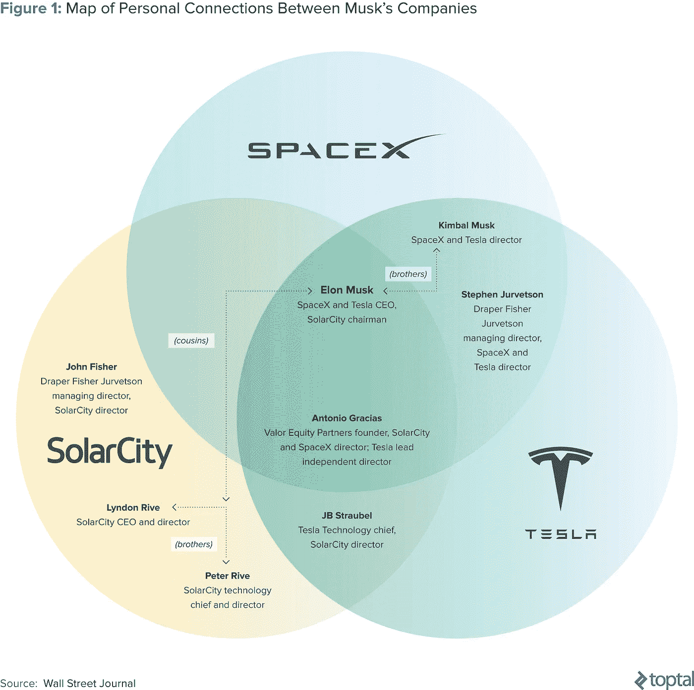
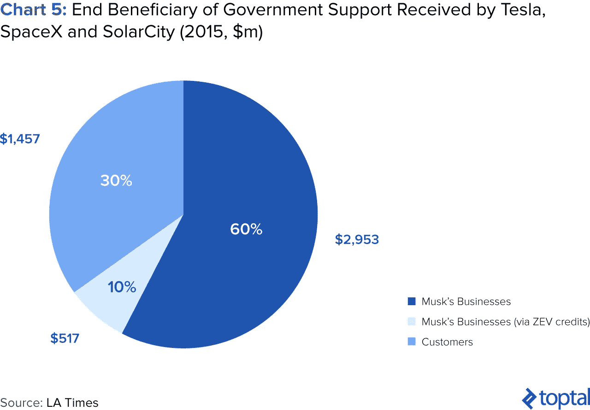

# 对埃隆·马斯克投资的深入探究

> 原文：<https://medium.com/swlh/a-deep-dive-into-elon-musks-investments-8c0f18c3f05>

*他如何为自己的企业和天使投资组合融资的数字和趋势*

自 22 年前创建 Zip2 以来，埃隆·马斯克已经开始了另外两项业务，并投资了无数其他业务。

他的努力自然受到了很多媒体的关注，无数纸上谈兵的分析师在研究[的可行性、无人驾驶汽车](https://www.toptal.com/insights/innovation/how-software-will-dominate-the-automotive-industry)或者人类是否可以殖民火星。在这篇文章中，我将抛开这些偏见，纯粹专注于投资者马斯克。他在为自己的公司——或者说，其他人的公司——提供资金时遵循的策略和游戏计划是什么？从他的投资记录和成功中我们可以学到什么？如果你有兴趣深入了解他的背景和他参与的公司，[我推荐蒂姆·厄本关于马斯克和他的企业的文章](https://waitbutwhy.com/2015/05/elon-musk-the-worlds-raddest-man.html)。

为了做到这一点，我将**首先**从高层次的角度展示埃隆马斯克的投资和创业活动的职业生涯，**然后**回顾他遵循的趋势和策略。在研究这一点时，我发现马斯克显然从他的错误和经历中吸取了教训，并在此后调整了他未来的行动。

# 马斯克投资生涯的简明时间表

## 第一阶段。早期企业家马斯克

1995 年从斯坦福退学后，马斯克和他的兄弟金巴尔用从他们父亲那里借来的 28000 美元创建了 Zip2。它原本是一个在线消费者版的黄页，链接到地图视觉效果。在风投 Mohr Davidow 后来投资 300 万美元后，Musk 被降为 CTO，业务转向面向报纸的 B2B 服务。随着他的股权被稀释到 7%，他对公司发展方向的影响力逐渐减弱，最终在 1999 年以 3 . 07 亿美元的价格卖给了康柏；马斯克从这笔交易中赚了 2200 万美元。

同年 11 月，马斯克从他的 Zip2 收益中投资 1000 万美元成立了 X.com，这是网上银行的首批尝试之一。2000 年 3 月，它与当时的主要竞争对手彼得·泰尔的 Confinity 平台合并。当年晚些时候，马斯克再次被罢免首席执行官一职，这一次是由泰尔(但他仍留在董事会)担任，并于 2001 年将业务更名为如今无处不在的 [PayPal](https://www.paypal.com/) 。到 2002 年 2 月，该公司首次公开募股，但 8 个月后，它被易贝[以 15 亿美元收购，马斯克从出售中获得 1 . 8 亿美元。](http://www.huffingtonpost.com/avijeet-sachdev/elon-musk-a-selfmade-entr_b_2214268.html)

## 第二阶段。多重任务者马斯克

成功创业公司的平均打击率为 1.000，你可能会认为马斯克在出售 PayPal 后可能会后退一步。相反，他进入了职业生涯中的一个紧张阶段，这一阶段的特点是同时经营一系列企业。

和 X.com 一样，在出售 PayPal 后，他没有浪费任何时间，并在同年成立了 SpaceX 公司。2004 年 4 月，他第一次涉足特斯拉的世界，在首轮融资中获得了 635 万美元的投资。在这个时间点上，他还在继续投资 SpaceX 的成立，并在特斯拉的未来几轮融资中不断慷慨解囊，投资频率也越来越高。尽管没有“创立”特斯拉，但他的影响力不断上升，这源于他宝贵的运营和财务投入。

2006 年，在马斯克的建议和鼓励下，他的表兄彼得和林登·里夫建立了太阳能城。马斯克向该公司投入了种子资金，并担任了董事长一职。2007 年至 2012 年间，他又进行了三轮后续投资。

2008 年是马斯克的低谷，也可能是他职业生涯中最关键的一年。他在三条战线上战斗，以建立具有巨大规模和雄心的公司。从流动性的角度来看，他的情况达到了爆发点，看似无限的 PayPal 资金现在达到了尽头。那一年，他与第一任妻子的离婚也增加了 2000 万美元的账单。通过朋友的贷款，马斯克设法继续他的课程，并通过他的天使投资组合( [Everdream](https://books.google.com.mx/books?id=r9PGDAAAQBAJ&pg=PT112&lpg=PT112&dq=elon+musk+everdream+investment&source=bl&ots=ljcHZKkkGI&sig=WD150-WJyppF-cvzhSvaPhbcJ7o&hl=en&sa=X&ved=0ahUKEwi1pe3j16TVAhUMzoMKHe9VDDsQ6AEIQTAE#v=onepage&q=elon%20musk%20everdream%20investment&f=false) 和 [Game Trust](http://www.escapistmagazine.com/news/view/77420-RealNetworks-Acquires-Game-Trust) )的第一笔收益获得了一些意想不到的礼物。

特斯拉在 2010 年的首次公开募股标志着这个时代的结束，并允许马斯克巩固财务，继续推进他不断发展的战略。

## 第三阶段。马斯克集团

随着特斯拉开始转危为安，现在轮到了 SpaceX，它开始通过成功的试验和合同获得积极的牵引力。他的三家公司的领域开始慢慢交织在一起，就它们之间的交易以及它们为人类打造可持续未来的共同叙事而言。事实上，尽管 2012 年首次公开募股，四年后 SolarCity 与特斯拉合并，明显的协同效应和垂直整合机会得到了 85%股东的支持。

在这一时期，马斯克的天使投资转向了人工智能和生物技术领域的初创公司。从 2010 年至今，他通过投资 [DeepMind](https://deepmind.com/) (被谷歌收购)获得了 9200 万美元的可观回报，并通过 Halcyon Molecular、 [Vicarious](https://www.vicarious.com/) 和 [NeuroVigil](http://www.neurovigil.com/) 对这些行业进行了其他投资。

他在此期间的[净资产](http://www.investopedia.com/terms/n/networth.asp)大幅增长，从 2012 年的 20 亿美元增长到 2017 年的 160 亿美元([《福布斯》](https://www.forbes.com/profile/elon-musk/))。在 Model 3 的推出为大众市场消费电动汽车的开始铺平了道路后，特斯拉的股价也飙升。SpaceX 虽然仍然是私有的，但在 2017 年 7 月以 212 亿美元的估值筹集了资金。他的净资产在过去六年中的快速增长如下所示:

## 马斯克的投资数字

下面是马斯克投资活动的时间表，显示了资金流入和流出。数据来源于对 [Crunchbase](https://www.crunchbase.com/#/home/index) 、 [Pitchbook](https://pitchbook.com/) 和新闻文章来源的三角测量:

下表显示了他投资或创建的每家公司的详细信息。马斯克投资彻底熄火的唯一证据是 Halcyon Molecular，它耗尽了投资者的现金，并在两年内关闭。在他的退出中，有两个获得了巨大成功(Everdream 和 DeepMind)，两个返还了资本(Game Trust 和 OneRiot)。在他目前的“实时”投资组合中，他将从对 Stripe 的投资中获得一些可观的账面收益。另一方面，现在以[Inside.com](https://inside.com/)身份存在的 Mahalo 已经是马斯克超过 10 年的投资，尽管有各种支点，但不太可能在短期内提供成功的结果(财务上)。

# 经验教训

# 1.他全力以赴

## 不会放弃控制权

我认为 Zip2 和 PayPal 是马斯克管理和控制方法中至关重要的一课，他从中学到了这些，并将其应用到了未来的风险投资中。引入外部风险资本和稀释自己的股份意味着马斯克无力抵抗被驱逐出 Zip2 首席执行官的命运。尽管通过成功的出售成为了一名富翁，但其结果令马斯克失望，因为他无法将公司融入他的愿景。同样，在 PayPal，他从自己的股份和 from 创始人的身份中获得了丰厚的回报，但他又一次被赶下了首席执行官的宝座。这件事发生在他在澳大利亚度假的时候，争论的焦点是平台应该使用微软还是 Unix 技术。

他对结果的失望体现在他对自己早期经历的一些评论中。在评论 Zip2 时，马斯克[表示](https://www.inc.com/magazine/20071201/entrepreneur-of-the-year-elon-musk_pagen_4.html):

> “他们应该让我负责，”他说。“没关系，但伟大的事情永远不会发生在风投或职业经理人身上。他们有很高的动力，但他们没有创造力或洞察力。有些人会，但大多数人不会。”

在他职业生涯的下一阶段，马斯克牢牢掌控了他的投资和影响力。他继续参与特斯拉的融资，以维持他的股权比例。此外，在与特斯拉的争执中，当他[将 800 万美元的优先股转换为普通股](https://venturebeat.com/2010/05/27/elon-musk-personal-finances/)以驱逐首席执行官马丁·艾伯哈德时，他并不害怕为了控制权而牺牲经济学。尽管从技术上讲，马斯克并没有创立特斯拉，但他亲力亲为的方式和影响力意味着他最终在 2008 年担任了首席执行官的角色。

## 现金不多，但资产丰富

马斯克不断将自己的净资产重新投入创业投资。[投资组合分析师](https://www.toptal.com/finance/equity-research-analysts)会拒绝这样的策略(在正常的投资组合分配中，风险投资的建议比例为[2%](https://www.forbes.com/sites/phildemuth/2013/08/13/how-to-invest-your-200000000-portfolio/#7bd750823040)),但这一直是马斯克的口头禅。这就好像他认为，创业销售产生的任何净值都要从他的其他资产中分摊出去，重新分配给风险/创业投资。紧接着 Zip2 和 PayPal 之后，他已经开始创建和投资他的下一个项目。

这是一个自信投资者的标志，也是一个让马斯克认为他作为天使投资自己或他人有优势的观点。他可能觉得自己对交易的结果有一定的控制权，但对于投资于公共股票或房地产的被动策略来说，这是不正确的。从他的两个首次创业中获得两个成功的结果将给马斯克带来对他投资和运营能力的无与伦比的信心，这对他来说是正确的。

下图显示了追踪马斯克的“投资账户”的尝试。它显示了他多年来的投资和收益(纯粹是退出事件的资本收益——不是补偿)。在 PayPal 之后，你可以看到他在接下来的十年里是如何花掉所有收益的。同样值得注意的是，他还没有从 SpaceX、SolarCity 或特斯拉获得显著的退出回报。SpaceX 仍然是一家私营公司；在 SolarCity 的 IPO 中，马斯克没有出售任何股票，在特斯拉的 IPO 中，他的收益达到了 1500 万美元。即使到今天(2017 年)，他也从未减持过他在特斯拉的净股票头寸。

当 2010 年马斯克离婚的消息从法庭文件中泄露出来时，今年早些时候马斯克[已经没有现金了。他继续投资企业的贪婪欲望导致，尽管账面财富巨大，他的流动资产却很少。早在 2008 年特斯拉的艰难时期，他甚至通过将出售 Everdream](https://dealbook.nytimes.com/2010/06/22/sorkin-elon-musk-of-paypal-and-tesla-fame-is-broke/) (他的天使投资之一)的收益[直接投入特斯拉的下一轮融资，拼凑出了他的下一笔融资。](https://books.google.com.mx/books?id=r9PGDAAAQBAJ&pg=PT112&lpg=PT112&dq=elon+musk+everdream+investment&source=bl&ots=ljcHZKkkGI&sig=WD150-WJyppF-cvzhSvaPhbcJ7o&hl=en&sa=X&ved=0ahUKEwi1pe3j16TVAhUMzoMKHe9VDDsQ6AEIQTAE#v=onepage&q=elon%20musk%20everdream%20investment&f=false)

他将自己的哲学总结为[跟随](https://www.wsj.com/articles/elon-musk-supports-his-business-empire-with-unusual-financial-moves-1461781962):

> “如果我要求投资者投入资金，那么我觉得在道义上我也应该投入资金……如果我自己不愿意吃水果盘里的东西，我就不应该要求人们吃水果盘里的东西。”

## 他承担极端的、通常是个人的金融风险

截至 2017 年 3 月，马斯克的个人借款总额为[6.24 亿美元](https://www.bloomberg.com/news/articles/2017-03-16/musk-borrows-more-from-tesla-underwriters-as-company-adds-debt)，用于资助他对特斯拉的投资。他的借款以自己在特斯拉的股份作为抵押。高盛(Goldman Sachs)和摩根士丹利(Morgan Stanley)一直是马斯克的重要个人贷款人，顺便提一下，两家公司都在资本市场承销了特斯拉的许多交易。下面的信息图显示了马斯克的个人影响力近年来是如何上升的:

2013 年的一个例子显示了个人借款如何为马斯克提供了强大的融资机制。随着政府贷款到期日的临近，特斯拉开始在资本市场筹集新的股权，为偿还本金提供资金。马斯克从高盛获得了[1.5 亿美元的个人贷款，用于全面购买新股。以一种抽象的方式，他将特斯拉贷款的一部分计入了个人资产负债表。](http://www.businessinsider.com/elon-musk-borrows-150-million-to-buy-tesla-2013-5)

因此，除了将自己的大部分净资产投资于自己的企业，马斯克还会借钱来增加曝光率。因为他拿着[公司微不足道的薪水](https://www.wsj.com/articles/tesla-ceo-elon-musks-37-584-salary-reflects-california-minimum-wage-1460759161)，他的目标完全是为了增加股东价值。作为他业务中的关键人力支柱，投资者看到他不断投资也感到欣慰。他由此面临的风险是，如果特斯拉股票开始表现不佳，他可能需要抵押更多和/或不同类型的抵押品。

# 他在自己周围创造生态系统

看看马斯克的天使投资组合也很有趣，因为他的成功率、进入模式和行业战略。在他的天使投资中，他似乎是阶段(以及一度是部门)不可知论者，从深度 D 轮投资到种子轮投资。虽然首轮投资似乎是他最喜欢的一轮。

仔细阅读他的天使投资时间表，很明显他的早期投资是通过与想法和创始人的联系来驱动的。我总共看到了马斯克进行的 10 项不同的天使投资，以及他与这些企业的个人联系，如下所示:

2003 年— **Everdream** —由马斯克的堂兄林登·里夫创立。他后来共同创立了 SolarCity。
2005 — **游戏信托** —由 Adeo Ressi、 [Musk 在宾夕法尼亚大学的室友](https://nextshark.com/elon-musk-college-nightclub/)创立。
2007 — **Mahalo** —创始人杰森·卡拉卡尼斯[通过共同的朋友](https://www.reddit.com/r/elonmusk/comments/3pnlx7/jason_calacanis_talks_about_his_friendship_with/)、阿德奥·雷西(UPenn 和 Game Trust)和大卫·萨克斯(PayPal)认识了马斯克。
2007 年— **OneRiot** —金巴尔·马斯克兄弟是其首席执行官。
2010 — **宁静分子** — [与彼得·泰尔](https://pando.com/2012/02/22/new-competitive-threat-forces-halcyon-molecular-to-accelerate-its-game-plan/) (PayPal)共同投资。
2011 — **条纹** [—与彼得·泰尔以及后来的麦克斯·拉夫琴](https://www.quora.com/How-did-Stripe-get-funding-from-PayPals-founders) (PayPal)共同投资。
2014 — **Deepmind** 和 **Vicarious** —有各种三级连接，但马斯克投资 AI 是为了“[盯紧](https://www.theguardian.com/technology/2014/jun/18/elon-musk-deepmind-ai-tesla-motors)发生的事情”。
2015 — **神经守夜** —无明显联系。
2017—**Hyperloop Transportation Systems**—马斯克通过发布关于该主题的著名白皮书，激发了这场运动。

马斯克投资于他所知道的，以及他认识和信任的人。这样做的效果是，通过这种自然的融洽关系，他可以对自己的投资产生更大的影响，超越传统的董事会和提供给投资者的控制机制。互惠是双向的，因为他的网络已经团结起来支持他，要么是通过投资马斯克的公司，要么是在 2010 年，当时他靠从他富有的朋友那里每月贷款 20 万美元生活。

## 总和大于部分

SpaceX、特斯拉和 SolarCity 的轨道定期交叉，马斯克是这个“[马斯克经济](https://valeriosoldout.com/2016/05/09/muskonomics-strong-ties-between-tesla-spacex-and-solar-city-a-smart-business-model-or-a-dangerous-bet/)的中心太阳。三者之间的互动以共享人员、投资者、共同目标或实际业务往来的形式出现。下图总结了人员和投资者层面的一些交叉关系:

马斯克通过推动特斯拉和 SolarCity 的合并，将这些关系向前推进了一步。协同效应和规模经济的好处被吹捧为合并的原因，预计第一年[将节省 1.5 亿美元的成本](http://www.marketwatch.com/story/tesla-solarcity-tout-150-million-in-cost-synergies-within-first-year-2016-08-01?mg=prod/accounts-mw)。然而，这个想法的起源是更大的画面，旨在垂直整合他们的过程，分享想法和交叉销售给他们的客户。

特斯拉董事会将其观点总结为[跟随](https://www.tesla.com/blog/tesla-makes-offer-to-acquire-solarcity):

> “我们将是世界上唯一一家向客户提供端到端清洁能源产品的垂直整合能源公司。这将从你驾驶的汽车和你用来充电的能源开始，并延伸到你家中或企业中的其他一切是如何供电的”

在新千年的大部分时间里，马斯克直接或间接在三个不同的业务部门工作，将其中两个部门合并在一起将使马斯克的标准运营程序正式化。考虑到两家公司都在新兴市场中运营，合并对马斯克这个永远的赌徒来说，风险和潜在回报都加倍了。丹尼尔·格罗斯将他的控制机制描述为日本的 keiretsu:

> “马斯克的公司在某些方面就像日本的经连集团，一群有着连锁商业关系的联合公司”

SpaceX 已经购买了超过 2 . 55 亿美元的 SolarCity 发行的太阳能债券作为公司投资。SolarCity 的商业模式要求预付现金为其活动提供资金，而 SpaceX 在很大程度上拥有来自其融资轮或预付合同的大量现金余额。在这种安排下，SpaceX 已经能够[获得有吸引力的收益](https://www.fool.com/investing/2016/08/22/solarcity-has-a-big-problem-on-its-hands.aspx)，SolarCity 也获得了重要的融资现金流。马斯克本人也[个人投资了 6500 万美元](http://www.reuters.com/article/us-solarcity-debt-idUSKCN10Y2G6)到同样的债券中。还应注意的是，该计划本身就是一个创新的融资解决方案。SolarCity 于 2014 年 1 月收购了金融科技公司 Common Assets，以建立一个在线平台[，允许散户投资者购买太阳能债券](https://www.greentechmedia.com/articles/read/solarcity-innovates-again-with-a-public-offering-of-solar-bonds)。

钻探公司是马斯克最近的一个新项目，他将隧道挖掘描述为一种“爱好”然而，这是一个理论上可以为马斯克现有业务和独立隧道项目带来好处的项目。这也与他的 Hyperloop 想法有关，2017 年，马斯克在推特上说，他已经得到了[口头批准](https://techcrunch.com/2017/07/20/elon-musk-says-he-has-verbal-okay-to-build-multi-state-underground-hyperloop/)为 Hyperloop 项目挖掘隧道。

# 3:他使用创造性的融资方法

## 政府支持

截至 2015 年夏天，洛杉矶时报计算出特斯拉、SpaceX 和 SolarCity 已经获得了 49 亿美元的政府支持。同年收到的捐款最多。仅在 2015 年，内华达州政府[承诺通过减税 13 亿美元](https://www.theverge.com/2016/2/8/10937076/tesla-gigafactory-battery-factory-nevada-tax-deal-elon-musk)支持该州的特斯拉超级工厂。纽约州政府也参与了类似的支持[7.5 亿美元用于布法罗的太阳能工厂](https://www.manufacturing.net/news/2015/11/nys-750m-investment-solarcity-jobs-not-without-risks)。

虽然这些头条数字表明马斯克已经得到了政府的大力支持，但细读这些数字会发现一个更加微妙的故事。随着 SpaceX 和 SolarCity 成为可再生能源领域的重要参与者，预计政府将提供援助。Electrek 对《洛杉矶时报》数据的深入研究也表明，这绝不是免费的钱，内华达州和纽约的工厂与重要的绩效目标和支出承诺挂钩，它们包含惩罚性的追回。

下面的图表显示了《洛杉矶时报》的 49 亿美元的数字，由这一所谓的政府支持的最终受益人分摊。这个报价的细目显示，消费者实际上是这些补贴的 30%的受益者，这些补贴通过税收减免和退税来鼓励可再生能源的采用。当然，马斯克的公司也从这些举措中受益，因为他们以对消费者更具成本吸引力的方式定位自己的产品，但这绝不是免费的。

在特斯拉竞争对手的帮助下，这些补贴中的 10%也以零排放车辆信用[的形式在加州到位。根据《洛杉矶时报》的数据，在撰写本文时，特斯拉通过出售自己的 ZEV 配额获得了 5.172 亿美元。由于整个车队都是电动的，这对特斯拉来说是一个明智而显而易见的战略，在战略层面上，他们也可以通过销售直接从竞争对手的口袋里拿钱。](http://www.ucsusa.org/clean-vehicles/california-and-western-states/what-is-zev)

特斯拉遵循的模式是积累 ZEV 信用额度，然后集体出售。其效果使其能够在特定的有利时期(T1)提高收入(和现金流),并通过无成本基础提高利润。下面的图表显示了四年期间 ZEV(和其他较小的)信用对特斯拉收入和收益的影响:

与 SolarCity 和特斯拉相比，SpaceX 获得的援助很少，但它最大的客户是政府。2008 年，美国国家航空航天局(NASA)一份价值 16 亿美元的合同[基本上拯救了太空探索技术公司(SpaceX)。维持与联邦机构的关系对 SpaceX 的增长至关重要，因为这些不稳定的合同为运营提供了资金支持。](https://arstechnica.com/science/2016/04/without-nasa-there-would-be-no-spacex-and-its-brilliant-boat-landing/)

## 外包投资

近年来，马斯克一直遵循开源政策。由于马斯克受到了广泛的关注和倾听，我认为这是他放下方向盘，以更便宜、可能更快的方式外包 R&D 的一种聪明方式。

2013 年 8 月，特斯拉发布了一份名为 [Hyperloop Alpha](http://www.spacex.com/sites/spacex/files/hyperloop_alpha-20130812.pdf) 的白皮书，详细介绍了一种潜在的革命性交通方式的初步研究和概念。这是一个不带任何附加条件的邀请，邀请其他企业家离开，并试图建立在这个想法上。这种善意的姿态抓住了公众的想象力，许多新兴的 Hyperloop 创业公司随之出现。特斯拉支持这项倡议的一种方式是通过其 [Hyperloop Pod 竞赛](http://www.spacex.com/hyperloop)。

对于已经捉襟见肘的马斯克来说，外包 Hyperloop 生态系统的初始形成是一种聪明的方式。一种清洁的交通方式，可以想象在运行时利用特斯拉和/或 SolarCity 服务。同样在 2017 年 1 月，马斯克投资了[Hyperloop Transportation Technologies](http://hyperloop.global/)(pitch book)，这让他现在可以在没有完成最初的繁重工作的情况下接触到这家企业。等待暴发户的出现也给了他观望投资对象的选择权。

继 Hyperloop 的姿态之后，2014 年特斯拉[开源了](https://www.tesla.com/blog/all-our-patent-are-belong-you)其所有专利。这也是间接邀请其他人进行研发，最终通过长期改善其生态系统来帮助特斯拉并为其省钱。2014 年的宣布是在[丰田宣布氢燃料电池汽车](http://time.com/2921499/toyota-tesla/)计划的几周之后，这一运动可能引发一场[格式的战争](https://en.wikipedia.org/wiki/Format_war)。马斯克开源他的专利可以被视为一种方式来加速他选择的锂离子技术的发展，并为特斯拉新的价值 50 亿美元的电池“gigafactory”找到客户

# 外行，还是勇敢的特立独行者？

马斯克的高压策略和态度多年来一直受到批评。公司治理和利益冲突是马斯克走钢丝的两个问题。马斯克的业绩记录和对他的尊重让他获得了股东的尊重。2017 年 4 月，特斯拉的公众投资者写信给马斯克[，提出了他们对特斯拉公司治理](http://www.telegraph.co.uk/business/2017/04/13/elon-musk-tells-unhappy-tesla-investors-buy-ford/)的担忧。特斯拉的董事每三年才选举一次，与上市前相比基本没有变化，而且与马斯克的其他公司有很多联系。也有人认为，他为自己和 SpaceX 与 SolarCity 债券的交易有点两面派的味道。

SpaceX 与 SolarCity 的交易也引起了国会山的关注，立法者们担心 SpaceX 服务的联邦合同可能暗中支持 SolarCity。

其他各种评论员，显然有他们自己的议程，已经把马斯克贴上了外行的标签，把他的相关业务贴上了 T2 炒作机器和 T4 庞氏骗局的标签。作为一个被描述为最好的[“社交媒体首席执行官”](http://money.cnn.com/gallery/investing/2015/12/23/best-ceos-2015/4.html)的人，他公开而坦诚的形象让他深受追随者的喜爱。他对特斯拉股价的评论被称为[出奇的准确](http://fortune.com/2017/07/17/elon-musk-tesla-stock-price/)，这再次引发了对不当影响的担忧。他关于 Boring Company 被委托挖掘 Hyperloop 隧道的评论可能不像他暗示的那样真实。

在我看来，马斯克是经营一家上市公司的受害者。特斯拉是一家汽车公司，其定价和待遇都被视为一家高增长的技术公司。马斯克的策略指向了一家私人公司首席执行官的行动，他将竭尽全力确保其业务的财务生存。他计划只在有定期飞往火星的航班时才首次公开募股 SpaceX，这一点很能说明问题，因为他不想让公众 CEO 分心，他只想发展自己的业务。

*原载于*[*www.toptal.com*](https://www.toptal.com/finance/venture-capital-consultants/elon-musks-investments?utm_source=Medium&utm_content=musk)*。*

## 这个故事发表在 [The Startup](https://medium.com/swlh) 上，这是 Medium 最大的企业家出版物，拥有 285，454+人。

## 在这里订阅接收[我们的头条新闻](http://growthsupply.com/the-startup-newsletter/)。

