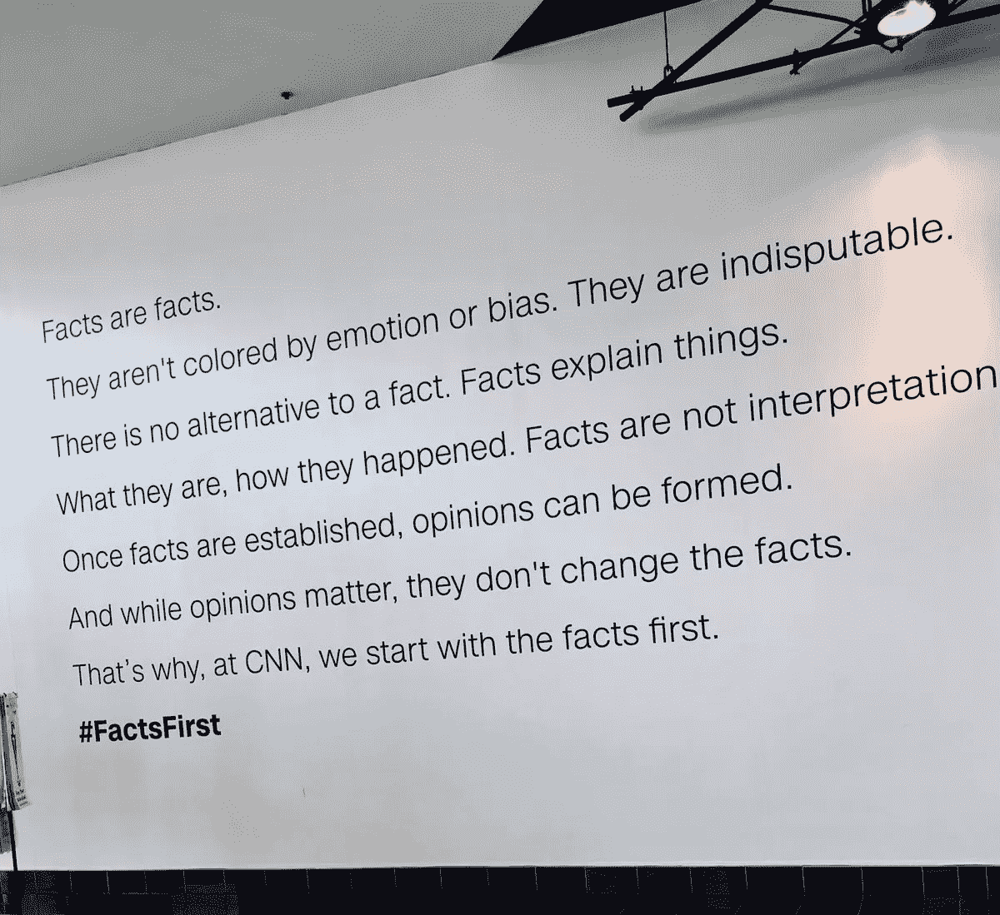

# 用事实的方式思考你的生意

> 原文：<https://medium.com/swlh/a-factual-way-to-think-about-your-business-b4a3a8cede21>

沃尔特·莫斯伯格蒙了(*还蒙了？*)科技很久很久了。他对技术总体上的平衡观点和对趋势的快速解读赢得了许多人的信任。所以，当他发微博的时候，人们会关注。

这是他最近的一条推文

Courtesy — [Walt Mossberg](https://medium.com/u/e89b145794b8?source=post_page-----b4a3a8cede21--------------------------------)

它引用了这张图片

Courtesy — [Walt Mossberg](https://medium.com/u/e89b145794b8?source=post_page-----b4a3a8cede21--------------------------------)

从表面上看，这条推文似乎无关痛痒。关于事实相对于虚构的神圣性，有什么好争论的？然后我开始思考。事实真的是事实吗？以我们都同意的最简单的事实为例，不管地球是不是平的。

> 太阳从东方升起。

如果约翰·奥利弗是可信的，我们不需要民意测验来确定这是真的，对吗？

Courtesy [Tenor](https://tenor.com/view/john-oliver-opinions-fact-gif-7702490)

没那么快！

太阳从东方升起是一个*事实*，只有在民意调查中才是真实的。

**怎么会这样？在时间的迷雾中，某个不知名的家伙提议我们称太阳从“东方”升起的方向，没有人反驳说**

> “见鬼，不，尼安诺(*尼安德特人会给自己取的那种名字！*)，我们准备把它叫做' ***屁股*** '”。

感谢你的幸运星，你不必到处说“我的主，太阳实际上是从屁股升起，在西边落下。

有趣的是，我们已经建立了整个人类——从它的航道，它描述生活方式的语言(例如，东方和西方文明)，十亿多穆斯林当他们想祈祷时转向哪个方向，到像东恩德斯这样的电视节目——基于许多人的共同观点。

这里唯一的事实是，当两个物体围绕彼此旋转时，它们看起来会上升和下沉；即对于静态观察者来说，它们似乎进入视野，然后从视野中消失。如果你走得足够快，你永远不会意识到事物会上升和下降。事物上升和下降的事实反映了我们相对于地球自转速度的移动速度有多慢。

还有一个事实:

> 上升的必然下降。

更普遍地说，这个*事实*可以归结为——“*嗯，你无法抗拒重力*”。

嘿，我们在特朗普时代，所以所有的事实都是可替换的，对吗？

改变一点视角，调整一点你的参照系，突然之间，地球就对你欲罢不能了！就像一个过于急切的前任，即使你已经明确表示你想离开，她还是会找上你。

## 结果是

所有这些都是为了说明很多事实都是事实(又是那个词！)全体采纳的意见。

如果你还在努力创业，重新审视你认为的“事实”是释放你创造力的一个很好的练习。

建立邮件列表真的是发展业务的最佳方式之一吗？在你花几个月的时间一次一个电子邮件地址地给你的邮件列表播种之前，考虑一下这个——Medium 有如此如此多的出版物迎合各种各样的利基兴趣。你能为一两个专注于你所在领域的出版物撰稿，从而以一个值得信赖的朋友而不是一个增长黑客/小贩的身份接触到他们的读者吗？

**精益创业/MVP 运动是快速行动和学习的唯一途径吗？** [很多](/@naveen_mandava/the-evolution-of-xamcheck-d482976942e0)[创始人](/tales-of-tier-2-cities/wazzeer-a-legal-eagle-in-your-corner-a39022fdf8f)都是从咨询顾问做起，让客户付钱让他们在工作中学习。在发布会上，他们在一个相对于一般 MVP 助手的强势位置上工作。他们在编写一小段代码之前就知道哪些可行，哪些不可行。

人们真的会为设计精良、包装精美的商品支付额外费用吗？乘坐火车穿越印度的任何地方。火车上的茶的顶峰实际上叫做茶。一天，一个卖茶的人决定尝试一种新的营销策略。他到处宣称他的茶很糟糕，很可怕，非常非常糟糕，但随后又用实际上的好让他的顾客吃惊。他在那段火车路线上出了名。很快，这个国家的其他地方也开始流行起来。如果你在火车上没有看到卖柴火的小贩，你可能是在飞机上。重新检查你的运输方式！

网络上充斥着如何改变世界的自助指南。这些都是用漂亮的字体写的，漂亮的人看起来好像过得很开心。

问题是每个人都遵循着相同的成功之路规则。我的朋友，这是事实。

所以，明智的做法是看看支撑你企业的*事实*，然后决定你是否可以调整它们，让自己脱颖而出。

## 这篇文章发表在 [The Startup](https://medium.com/swlh) 上，这是 Medium 最大的创业刊物，有 323，238+人关注。

## 在这里订阅接收[我们的头条新闻](http://growthsupply.com/the-startup-newsletter/)。

